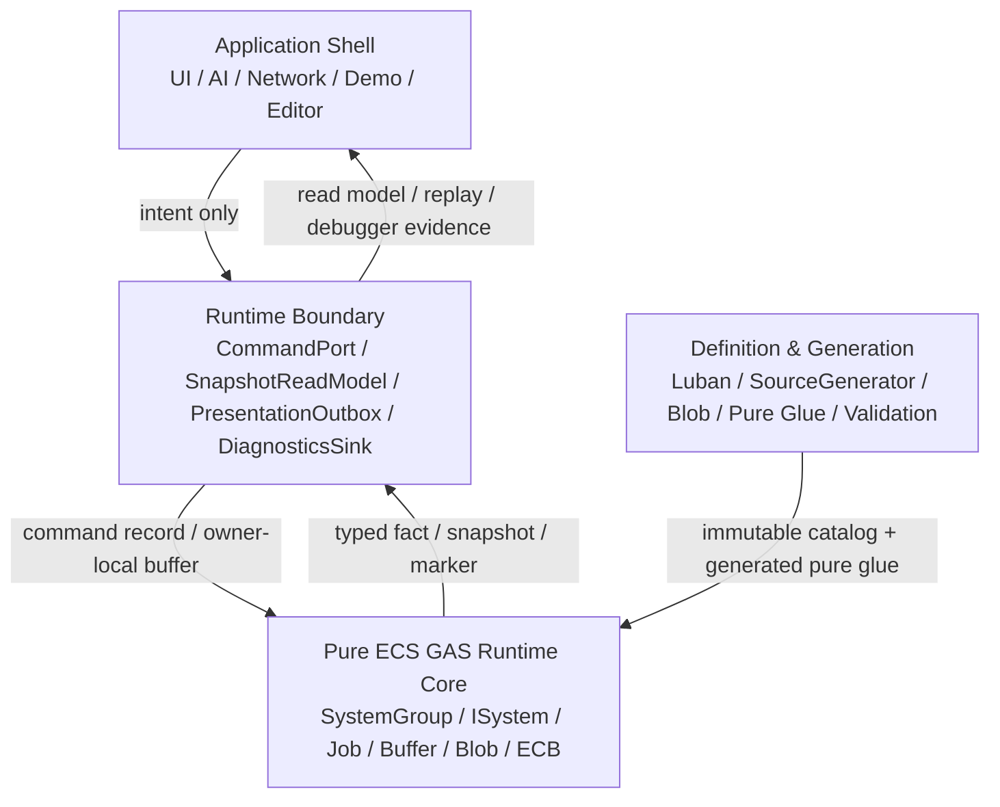

# 16-01：目标分层、官方依据与不变量

> Owner：`01-目标态架构共识/16-纯ECS内核与边界重划分` | 状态：目标态 Spec 子页 | 最近拆分：2026-06-07

本文件只描述纯 ECS 内核与边界重划分的目标分层、官方依据和分层不变量，不记录当前代码事实或执行进度。

## 目的

定义 EX-GAS 2.0 的理想目标态：Gameplay 权威状态和热路径计算必须落在纯 ECS Runtime Core；OOP 只作为 Application Shell 和 Runtime Boundary 的外壳；Debugger / 日志是证据系统；Luban + SourceGenerator 只生成不可变定义、静态 lookup、pure glue 和 validation artifact。

本 Spec 是对 `00-总览Spec.md`、`02-四层架构Spec.md`、`03-RuntimeCore管线Spec.md`、`07-RuntimeCoreDebuggerSpec.md` 和 `08-Luban-SourceGenerator配置生成链路Spec.md` 的一次收口，不替代它们的细节。官方 DOTS 复核门槛以 `18-DOTS官方规范复核与性能红线Spec.md` 为准；本文件中的代码骨架必须能通过该门槛。

## 官方依据

| 规则 | 本 Spec 采用结论 |
|---|---|
| `SYS-01`、`SYS-02`、`SYS-05` | Core 权威计算落在 ECS System / Job；SystemGroup 是 phase owner；Debugger / Demo / Presentation 只能通过 Boundary 观察 Core |
| `SEL-01`、`SEL-02`、`SEL-04` | 先按数据性质选 API；proof-only carrier 不能固化为 scale-ready；每个选择必须有重选型触发条件 |
| `QRY-01`、`QRY-04`、`JOB-01` | hot path 默认 job 化，避免高频 random lookup；主线程 query 仅限 debug / low-scale / boundary |
| `SC-01`、`ECB-03`、`PRF-04` | hot path 结构变化集中到明确 `GASStructuralCommitSystemGroup` playback |
| `BUF-02`、`NAT-03`、`MAT-05` | singleton DynamicBuffer 只能 proof；并行 fan-in 必须 deterministic merge |
| `DBG-01..05` | Debugger 是 counter / official diff / evidence owner，不是 runtime 控制层 |
| `BLOB-01`、`BLOB-02`、`BUR-01` | 静态定义进入 Blob / generated lookup；SourceGenerator 不生成 runtime lifecycle owner |

## 目标分层



### 分层不变量

1. Application Shell 不持有 `EntityManager`、`EntityQuery` 或可写 `DynamicBuffer`。
2. Runtime Boundary 可以是 OOP，但只能翻译 command、导出 snapshot、转发 presentation / diagnostics；不做 damage、cooldown、tag requirement、stack、period 等 gameplay 计算。
3. Runtime Core 不调用 `GameObject`、`MonoBehaviour`、UI、VFX、SFX、日志字符串或 managed config registry。
4. Debugger 只读 Core facts / counters，不反向驱动 simulation。
5. SourceGenerator 只生成数据和纯函数，不生成 gameplay lifecycle system、hidden query、hidden ECB 或 hidden `EntityManager` write。

## 架构重划分判定准则

目标态评审不以“是否用了 ECS API”作为合格标准，而以 owner、数据局部性、接口深度和证据可归因为准。任一设计必须同时满足下列判定：

| 领域 | 合格形态 | 不合格形态 |
|---|---|---|
| Shell / Adapter | public seam 只暴露业务 intent、opaque handle、snapshot、diagnostics evidence 和 session/tick result | public API 返回 `World`、`EntityManager`、runtime singleton、raw `Entity`、`EntityQuery` 或 live buffer |
| Runtime Boundary | implementation 可以短暂解析 ECS identity，但每个 resolver 只服务单一 capability owner | 一个 internal access layer 同时服务 command、snapshot、diagnostics、bootstrap、definition 和 dependency drain |
| Runtime Core | SystemGroup 表达物理 phase；lane system / job 拥有 query、lookup、allocator、carrier、dependency 和 structural policy | OOP manager、generated lifecycle 或 singleton facade 隐藏 query、ECB、NativeContainer owner 或 scheduling |
| Frame-local data | command、target、spec、delta、fact 按数据性质选择 `NativeStream`、owner-local range、bounded buffer 或 chunk-local scratch | 全局 singleton DynamicBuffer 被当成默认 scale-ready fan-in 或跨语义总线 |
| Cross-owner access | 先按 target / owner 分组，再 deterministic merge 或 chunk-local apply | 在 hot path 中用 wide `ComponentLookup` / `BufferLookup` 任意写其他 owner，且无 alias / ordering 证明 |
| Debugger / 日志 | evidence 是机器可读结构，导出日志和图表从 evidence 派生 | hot path 直接拼接字符串，或用字符串 summary / Mermaid 图替代 runtime counter 与官方工具状态 |
| SourceGenerator | 生成 immutable catalog、static lookup、pure glue、validation、Baker / Bootstrap glue | 生成 `ISystem`、`OnUpdate`、runtime lifecycle、hidden query、hidden ECB、system registration 或 NativeContainer owner |

## 目标态模块 Owner Map

目标态不是在 Runtime 外再包一层更大的 OOP facade，而是把每个 capability、lane、store 和 evidence owner 切成独立 Module。每个 Module 的 Interface 必须足够深：调用方只理解业务意图、record、snapshot 或 evidence，不理解 query、lookup、allocator、dependency、capacity、merge 和 structural playback 的实现细节。

| Owner Module | Interface | Implementation ownership | 禁止泄露 |
|---|---|---|---|
| `RuntimeSession` | install / dispose / fixed tick result | World、SystemGroup、catalog lifetime、tick source、dependency drain evidence | `World`、`EntityManager`、live system group |
| `CommandPort` | ability / GE / destroy request id | owner-local command buffer、sequence、pending marker、request validation | raw `Entity`、writable buffer、同步 gameplay 结果 |
| `SnapshotReadModel` | immutable ASC / battle / presentation snapshot | BoundaryProjection、snapshot ring、cursor、version、compaction | live `DynamicBuffer`、`EntityQuery`、runtime singleton |
| `GASFrameKernel` | frame-local command / target / spec / delta / fact records | lane system、query owner、lookup refresh、job chain、frame allocator | OOP manager、global facade、hidden query |
| `EffectFanInStore` | deterministic command/spec merge result | `NativeStream` segment、sort key、merge cost、owner range | singleton DynamicBuffer as scale-ready default |
| `ActiveEffectStore` | owner-local slot / lifecycle record | slot capacity、period/stack/state flags、cleanup intent、skip evidence | static helper lifecycle、generated lifecycle owner |
| `StructuralCommit` | structural intent / playback evidence | ECB owner、bulk query、sort key、Journaling / Profiler route | scattered create / destroy / add / remove |
| `DiagnosticsSink` | evidence snapshot / official capture state | counters、TopN、buffer pressure、API health、derived export source | gameplay decision、hot path string log |
| `GeneratedDefinitionGlue` | code -> index -> immutable definition -> pure record | Blob schema、static lookup、unmanaged resolver、validation artifact | `ISystem`、`OnUpdate`、ECB、query、NativeContainer owner |
| `PresentationBridge` | presentation outbox / cue marker / replay marker | Boundary fact projection、resource binding key、headless marker | Core gameplay write、resource dependency inside Core |

### Owner Map 不变量

1. `RuntimeSession` 可以拥有 ECS runtime implementation，但 public seam 只能输出 session id、tick result、timing split 和 evidence。
2. `CommandPort` 与 `SnapshotReadModel` 不共享同一个 public ECS handle；写能力和读能力必须可独立授权、独立计时、独立验证。
3. `GASFrameKernel` 不调用 Shell / Adapter。它只消费 ECS data、Blob、frame-local record 和 owner-local store。
4. `EffectFanInStore` 与 `ActiveEffectStore` 是不同 Module：前者解决本帧确定性 fan-in，后者解决跨帧 GE 生命周期状态。
5. `DiagnosticsSink` 只能从 facts / counters / official capture 派生输出；Mermaid、字符串日志、战报和 UI 都是 derived export。
6. `GeneratedDefinitionGlue` 不能成为 runtime lifecycle owner。需要扩展语义时，先扩 hand-written Core lane，再让 generator 输出 pure record / lookup。
7. `PresentationBridge` 可以是 managed / OOP / GameObject 边界，但它只能消费 Boundary outbox，不回写 gameplay state。

## 目标态最小完整代码骨架

以下代码只表达目标态职责划分和调用方向。它不是实现完成证明；它用于说明为什么 Module 重划分后更深：业务层只接触 session、request、snapshot 和 evidence；Core 只接触 ECS record、Blob、store 和 Job。

```csharp
using Unity.Burst;
using Unity.Burst.Intrinsics;
using Unity.Collections;
using Unity.Entities;

namespace GAS.Runtime.TargetSpec
{
    public readonly struct GASRuntimeSessionId
    {
        public readonly int Value;
        public readonly int Version;
    }

    public readonly struct ASCTargetRef
    {
        public readonly int Value;
        public readonly int Version;
    }

    public readonly struct GASRequestId
    {
        public readonly int Frame;
        public readonly int Sequence;
    }

    public readonly struct GASSnapshotVersion
    {
        public readonly int Frame;
        public readonly int Sequence;
    }

    public readonly struct GASFixedTickResult
    {
        public readonly GASSnapshotVersion Version;
        public readonly long CommandTicks;
        public readonly long CoreTicks;
        public readonly long StructuralTicks;
        public readonly long BoundaryTicks;
        public readonly long DiagnosticsTicks;
        public readonly long RunnerTicks;
    }

    public readonly struct GASAscSnapshot
    {
        public readonly ASCTargetRef Target;
        public readonly GASSnapshotVersion Version;
        public readonly float Health;
        public readonly float Energy;
        public readonly int TagMaskLow;
    }

    public readonly struct GASRuntimeEvidenceSnapshot
    {
        public readonly GASSnapshotVersion Version;
        public readonly int CommandCount;
        public readonly int SpecCount;
        public readonly int DeltaCount;
        public readonly int FactCount;
        public readonly int StructuralPlaybackCount;
        public readonly int RandomLookupCount;
        public readonly int ProofOnlyApiMask;
        public readonly bool OfficialCaptureAvailable;
    }

    public interface IGASRuntimeSession
    {
        GASRuntimeSessionId Install();
        GASFixedTickResult RunFixedTick(GASRuntimeSessionId session, int tickCount);
        void Dispose(GASRuntimeSessionId session);
    }

    public interface IGASCommandPort
    {
        GASRequestId RequestActivateAbility(
            GASRuntimeSessionId session,
            ASCTargetRef source,
            int abilityCode,
            ASCTargetRef target);

        GASRequestId RequestApplyGameplayEffect(
            GASRuntimeSessionId session,
            ASCTargetRef source,
            ASCTargetRef target,
            int gameplayEffectCode,
            float setByCallerMagnitude);
    }

    public interface IGASSnapshotReadModel
    {
        bool TryReadAsc(
            GASRuntimeSessionId session,
            ASCTargetRef target,
            GASSnapshotVersion minVersion,
            out GASAscSnapshot snapshot);
    }

    public interface IGASDiagnosticsSink
    {
        GASRuntimeEvidenceSnapshot Capture(GASRuntimeSessionId session);
    }

    internal struct GASBoundaryCommandPending : IComponentData, IEnableableComponent
    {
    }

    internal struct GASBoundaryCommand : IBufferElementData
    {
        public Entity SourceAsc;
        public Entity TargetAsc;
        public int AbilityCode;
        public int GameplayEffectCode;
        public float SetByCallerMagnitude;
        public int Sequence;
    }

    internal struct GASEffectCommandRecord
    {
        public Entity SourceAsc;
        public Entity TargetAsc;
        public int GameplayEffectCode;
        public float SetByCallerMagnitude;
        public int Sequence;
        public int ProducerIndex;
    }

    internal struct GASEffectCommandSortKey : System.IComparable<GASEffectCommandSortKey>
    {
        public int TargetIndex;
        public int TargetVersion;
        public int Sequence;
        public int ProducerIndex;
        public int LocalIndex;

        public int CompareTo(GASEffectCommandSortKey other)
        {
            var result = TargetIndex.CompareTo(other.TargetIndex);
            if (result != 0) return result;
            result = TargetVersion.CompareTo(other.TargetVersion);
            if (result != 0) return result;
            result = Sequence.CompareTo(other.Sequence);
            if (result != 0) return result;
            result = ProducerIndex.CompareTo(other.ProducerIndex);
            if (result != 0) return result;
            return LocalIndex.CompareTo(other.LocalIndex);
        }
    }

    internal struct GASSortedEffectCommand
    {
        public GASEffectCommandSortKey SortKey;
        public GASEffectCommandRecord Command;
    }

    [BurstCompile]
    [UpdateInGroup(typeof(GASCommandResolveSystemGroup))]
    public partial struct GASBoundaryCommandResolveSystem : ISystem
    {
        private EntityQuery _query;

        public void OnCreate(ref SystemState state)
        {
            _query = state.GetEntityQuery(new EntityQueryDesc
            {
                All = new[]
                {
                    ComponentType.ReadOnly<GASBoundaryCommandPending>(),
                    ComponentType.ReadWrite<GASBoundaryCommand>(),
                },
            });
            state.RequireForUpdate(_query);
        }

        [BurstCompile]
        public void OnUpdate(ref SystemState state)
        {
            state.Dependency = new ResolveJob
            {
                EntityType = SystemAPI.GetEntityTypeHandle(),
                CommandType = SystemAPI.GetBufferTypeHandle<GASBoundaryCommand>(isReadOnly: false),
                PendingType = SystemAPI.GetComponentTypeHandle<GASBoundaryCommandPending>(isReadOnly: false),
            }.ScheduleParallel(_query, state.Dependency);
        }

        [BurstCompile]
        private struct ResolveJob : IJobChunk
        {
            [ReadOnly] public EntityTypeHandle EntityType;
            public BufferTypeHandle<GASBoundaryCommand> CommandType;
            public ComponentTypeHandle<GASBoundaryCommandPending> PendingType;

            public void Execute(
                in ArchetypeChunk chunk,
                int unfilteredChunkIndex,
                bool useEnabledMask,
                in v128 chunkEnabledMask)
            {
                var entities = chunk.GetNativeArray(EntityType);
                var commands = chunk.GetBufferAccessor(ref CommandType);
                var pending = chunk.GetEnabledMask(ref PendingType);
                var enumerator = new ChunkEntityEnumerator(useEnabledMask, chunkEnabledMask, chunk.Count);

                while (enumerator.NextEntityIndex(out var i))
                {
                    var owner = entities[i];
                    var ownerCommands = commands[i];
                    for (var commandIndex = 0; commandIndex < ownerCommands.Length; commandIndex++)
                    {
                        var command = ownerCommands[commandIndex];
                        _ = new GASEffectCommandRecord
                        {
                            SourceAsc = owner,
                            TargetAsc = command.TargetAsc,
                            GameplayEffectCode = command.GameplayEffectCode,
                            SetByCallerMagnitude = command.SetByCallerMagnitude,
                            Sequence = command.Sequence,
                            ProducerIndex = unfilteredChunkIndex,
                        };
                    }

                    ownerCommands.Clear();
                    pending[i] = false;
                }
            }
        }
    }

    [BurstCompile]
    public struct GASEffectCommandMergeJob : IJob
    {
        public NativeStream.Reader Reader;
        public NativeList<GASSortedEffectCommand> SortedCommands;

        public void Execute()
        {
            SortedCommands.Clear();
            for (var streamIndex = 0; streamIndex < Reader.ForEachCount; streamIndex++)
            {
                Reader.BeginForEachIndex(streamIndex);
                var localIndex = 0;
                while (Reader.RemainingItemCount > 0)
                {
                    var command = Reader.Read<GASEffectCommandRecord>();
                    SortedCommands.Add(new GASSortedEffectCommand
                    {
                        SortKey = new GASEffectCommandSortKey
                        {
                            TargetIndex = command.TargetAsc.Index,
                            TargetVersion = command.TargetAsc.Version,
                            Sequence = command.Sequence,
                            ProducerIndex = command.ProducerIndex,
                            LocalIndex = localIndex++,
                        },
                        Command = command,
                    });
                }
                Reader.EndForEachIndex();
            }

            SortedCommands.Sort(new Comparer());
        }

        private struct Comparer : IComparer<GASSortedEffectCommand>
        {
            public int Compare(GASSortedEffectCommand x, GASSortedEffectCommand y)
            {
                return x.SortKey.CompareTo(y.SortKey);
            }
        }
    }

    public static class GASGeneratedDefinitionGlue
    {
        public static bool TryBuildEffectRecord(
            ref GASDefinitionCatalogBlob catalog,
            int gameplayEffectCode,
            out GASEffectCommandRecord record)
        {
            record = default;
            if (!GASGeneratedDefinitionCatalogLookup.TryGetGameplayEffectIndex(
                    ref catalog,
                    gameplayEffectCode,
                    out var effectIndex))
            {
                return false;
            }

            ref readonly var effect = ref GASGeneratedDefinitionCatalogLookup.GetGameplayEffect(
                ref catalog,
                effectIndex);

            record.GameplayEffectCode = effect.GameplayEffectCode;
            return true;
        }
    }

    public struct GASStructuralIntent : IBufferElementData
    {
        public Entity Owner;
        public Entity Target;
        public int Kind;
        public int Sequence;
    }

    [BurstCompile]
    [UpdateInGroup(typeof(GASStructuralCommitSystemGroup))]
    public partial struct GASStructuralCommitSystem : ISystem
    {
        public void OnUpdate(ref SystemState state)
        {
            var ecb = SystemAPI.GetSingleton<EndGASStructuralCommitECBSystem.Singleton>()
                .CreateCommandBuffer(state.WorldUnmanaged);
            _ = ecb;
        }
    }
}
```

代码解读：

| 代码段 | 为什么合理 |
|---|---|
| `IGASRuntimeSession` / `IGASCommandPort` / `IGASSnapshotReadModel` / `IGASDiagnosticsSink` | Shell interface 只暴露 session、request、snapshot、evidence；业务层无需知道 ECS 句柄 |
| `GASBoundaryCommandResolveSystem` | Boundary command 进入 ECS 后由 `IJobChunk` 批处理，query owner 明确，enableable mask 显式处理 |
| `GASEffectCommandMergeJob` | fan-in 用 `NativeStream` 支持多 producer，再用 sort key 决定确定性顺序；不会依赖 worker 写入顺序 |
| `GASGeneratedDefinitionGlue` | generator 只把 immutable Blob definition 转成 unmanaged record；没有 lifecycle、query、ECB 或 hidden owner |
| `GASStructuralCommitSystem` | 结构变化只在 StructuralCommit phase 通过明确 ECB owner 发生；其他 Core lane 只能写 structural intent |

### 完整代码骨架阅读顺序

本组 Spec 的代码骨架应按一条完整业务链阅读，而不是拆成互不相关的示例：

```text
16-04 Shell capability public seam
  -> 16-02 Boundary command record
  -> 16-02 Core command resolve IJobChunk
  -> 16-03 NativeStream deterministic fan-in
  -> 16-03 Debugger evidence projection
  -> 16-03 SourceGenerator pure glue
  -> 16-05 Snapshot / Identity / API Health validation
```

这条链路表达的设计意图是：OOP Shell 只负责把业务意图交给 Boundary；Boundary 只写 command record 或导出 snapshot；Runtime Core 只处理 ECS 数据流；Debugger 只消费 facts / counters；SourceGenerator 只提供不可变定义和纯解析函数。代码骨架中的 `EntityManager` 只能出现在 Boundary implementation 或 bootstrap owner 内，不能被提升为外部业务 interface，也不能被 SourceGenerator 封装成新的 runtime 中间层。
