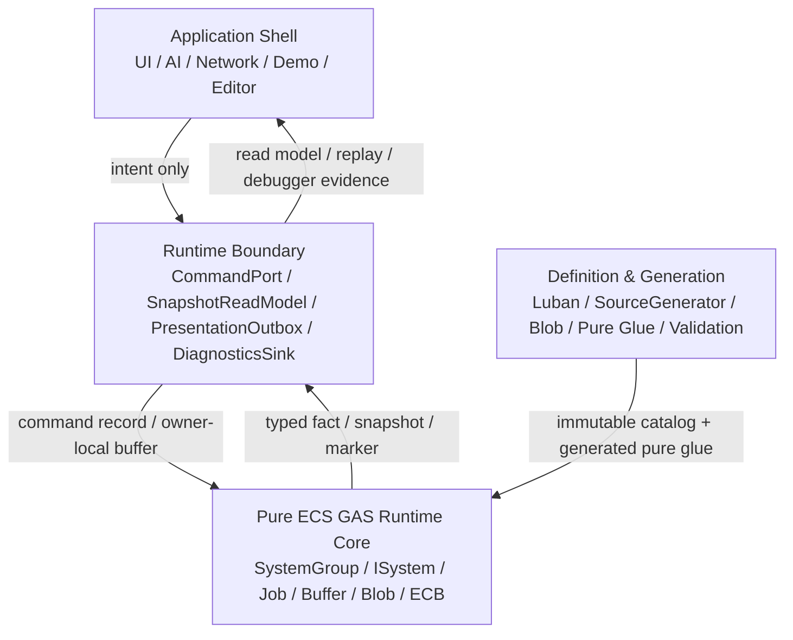

# 16-01：目标分层、官方依据与不变量

> Owner：`01-目标态架构共识/16-纯ECS内核与边界重划分` | 状态：目标态 Spec 子页 | 最近拆分：2026-06-07

本文件只描述纯 ECS 内核与边界重划分的目标分层、官方依据和分层不变量，不记录当前代码事实或执行进度。

## 目的

定义 EX-GAS 2.0 的理想目标态：Gameplay 权威状态和热路径计算必须落在纯 ECS Runtime Core；OOP 只作为 Application Shell 和 Runtime Boundary 的外壳；Debugger / 日志是证据系统；Luban + SourceGenerator 只生成不可变定义、静态 lookup、pure glue 和 validation artifact。

本 Spec 是对 `00-总览Spec.md`、`02-四层架构Spec.md`、`03-RuntimeCore管线Spec.md`、`07-RuntimeCoreDebuggerSpec.md` 和 `08-Luban-SourceGenerator配置生成链路Spec.md` 的一次收口，不替代它们的细节。官方 DOTS 复核门槛以 `18-DOTS官方规范复核与性能红线Spec.md` 为准；本文件中的代码骨架必须能通过该门槛。

## 官方依据

| 规则 | 本 Spec 采用结论 |
|---|---|
| `SYS-01`、`SYS-02`、`SYS-05` | Core 权威计算落在 ECS System / Job；SystemGroup 是 phase owner；Debugger / Demo / Presentation 只能通过 Boundary 观察 Core |
| `SEL-01`、`SEL-02`、`SEL-04` | 先按数据性质选 API；proof-only carrier 不能固化为 scale-ready；每个选择必须有重选型触发条件 |
| `QRY-01`、`QRY-04`、`JOB-01` | hot path 默认 job 化，避免高频 random lookup；主线程 query 仅限 debug / low-scale / boundary |
| `SC-01`、`ECB-03`、`PRF-04` | hot path 结构变化集中到明确 `GASStructuralCommitSystemGroup` playback |
| `BUF-02`、`NAT-03`、`MAT-05` | singleton DynamicBuffer 只能 proof；并行 fan-in 必须 deterministic merge |
| `DBG-01..05` | Debugger 是 counter / official diff / evidence owner，不是 runtime 控制层 |
| `BLOB-01`、`BLOB-02`、`BUR-01` | 静态定义进入 Blob / generated lookup；SourceGenerator 不生成 runtime lifecycle owner |

## 目标分层



### 分层不变量

1. Application Shell 不持有 `EntityManager`、`EntityQuery` 或可写 `DynamicBuffer`。
2. Runtime Boundary 可以是 OOP，但只能翻译 command、导出 snapshot、转发 presentation / diagnostics；不做 damage、cooldown、tag requirement、stack、period 等 gameplay 计算。
3. Runtime Core 不调用 `GameObject`、`MonoBehaviour`、UI、VFX、SFX、日志字符串或 managed config registry。
4. Debugger 只读 Core facts / counters，不反向驱动 simulation。
5. SourceGenerator 只生成数据和纯函数，不生成 gameplay lifecycle system、hidden query、hidden ECB 或 hidden `EntityManager` write。

## 架构重划分判定准则

目标态评审不以“是否用了 ECS API”作为合格标准，而以 owner、数据局部性、接口深度和证据可归因为准。任一设计必须同时满足下列判定：

| 领域 | 合格形态 | 不合格形态 |
|---|---|---|
| Shell / Adapter | public seam 只暴露业务 intent、opaque handle、snapshot、diagnostics evidence 和 session/tick result | public API 返回 `World`、`EntityManager`、runtime singleton、raw `Entity`、`EntityQuery` 或 live buffer |
| Runtime Boundary | implementation 可以短暂解析 ECS identity，但每个 resolver 只服务单一 capability owner | 一个 internal access layer 同时服务 command、snapshot、diagnostics、bootstrap、definition 和 dependency drain |
| Runtime Core | SystemGroup 表达物理 phase；lane system / job 拥有 query、lookup、allocator、carrier、dependency 和 structural policy | OOP manager、generated lifecycle 或 singleton facade 隐藏 query、ECB、NativeContainer owner 或 scheduling |
| Frame-local data | command、target、spec、delta、fact 按数据性质选择 `NativeStream`、owner-local range、bounded buffer 或 chunk-local scratch | 全局 singleton DynamicBuffer 被当成默认 scale-ready fan-in 或跨语义总线 |
| Cross-owner access | 先按 target / owner 分组，再 deterministic merge 或 chunk-local apply | 在 hot path 中用 wide `ComponentLookup` / `BufferLookup` 任意写其他 owner，且无 alias / ordering 证明 |
| Debugger / 日志 | evidence 是机器可读结构，导出日志和图表从 evidence 派生 | hot path 直接拼接字符串，或用字符串 summary / Mermaid 图替代 runtime counter 与官方工具状态 |
| SourceGenerator | 生成 immutable catalog、static lookup、pure glue、validation、Baker / Bootstrap glue | 生成 `ISystem`、`OnUpdate`、runtime lifecycle、hidden query、hidden ECB、system registration 或 NativeContainer owner |

### 完整代码骨架阅读顺序

本组 Spec 的代码骨架应按一条完整业务链阅读，而不是拆成互不相关的示例：

```text
16-04 Shell capability public seam
  -> 16-02 Boundary command record
  -> 16-02 Core command resolve IJobChunk
  -> 16-03 NativeStream deterministic fan-in
  -> 16-03 Debugger evidence projection
  -> 16-03 SourceGenerator pure glue
  -> 16-05 Snapshot / Identity / API Health validation
```

这条链路表达的设计意图是：OOP Shell 只负责把业务意图交给 Boundary；Boundary 只写 command record 或导出 snapshot；Runtime Core 只处理 ECS 数据流；Debugger 只消费 facts / counters；SourceGenerator 只提供不可变定义和纯解析函数。代码骨架中的 `EntityManager` 只能出现在 Boundary implementation 或 bootstrap owner 内，不能被提升为外部业务 interface，也不能被 SourceGenerator 封装成新的 runtime 中间层。
