# GAS 业务链路破坏性重划分 Spec

## 目的

本 Spec 把 GAS Runtime 概念设计审查收束为目标态约束：EX-GAS 2.0 的业务链路必须从 OOP facade、托管 TargetCatcher、singleton stream、legacy EventBus 和 generated lifecycle 中退出，改为以纯 ECS Runtime Core 为唯一 gameplay 权威的破坏性重划分。

这里不记录当前实现事实和迁移流水。现实命中、文件证据和短期任务应归入 `../00-当前架构事实/` 与 `../02-主线任务树/`。本文件只回答：

1. GAS 业务链路应该如何重新划分。
2. 为什么必须这样设计。
3. 哪些旧链路必须退出，不能兼容保留。
4. 怎样验收目标态是否成立。

业务链路重划分的 DOTS 复核口径以 `18-DOTS官方规范复核与性能红线Spec.md` 为准；任何旧链路兼容诉求若命中其中的性能红线，默认不得保留到目标态。

## 官方依据

| 规则 | 本 Spec 采用结论 | 设计理由 |
|---|---|---|
| `SYS-01`、`SYS-05` | gameplay 权威只在 Runtime Core System / Job；Shell、Demo、Debugger、Presentation 只能通过 Boundary 观察或写 command | 如果 Shell 能拿 `EntityManager` 或 raw `Entity`，业务代码就能绕过 cost、cooldown、target、effect、fact 的时序链，目标态无法证明 gameplay 结果由 ECS 数据流唯一决定 |
| `SYS-02` | SystemGroup 是 phase owner，禁止业务手写 tick 顺序 | GAS 的时序不是普通方法调用顺序，而是 Command Ingest、Target Resolve、Effect Fan-In、Attribute Apply、Fact、Structural Commit、Projection 的物理执行顺序 |
| `SEL-01`、`STORE-03` | Gameplay、Transient、Telemetry、Presentation 先按数据性质选承载 | 同一个 EventBus 或 adapter 混合 gameplay reaction、UI marker、debug log 会破坏归因，让 Debugger 无法定位性能热点 |
| `BUF-02`、`NAT-03`、`MAT-05` | singleton DynamicBuffer 只能 proof；并行 fan-in 必须 NativeStream / per-owner range + deterministic merge | Effect/spec/delta/fact 是同帧多来源 fan-in，单一全局 buffer 会把并行写竞争、排序和容量压力集中到一个热点 |
| `QRY-04`、`PRF-06` | hot path 避免跨 entity random `ComponentLookup` / `BufferLookup` | Attribute apply 和 execution output 应按 target 分组顺序写，否则规模扩大后每个 spec 都会变成随机目标写 |
| `SC-01`、`ECB-03`、`PRF-04` | `GASStructuralCommitSystemGroup` 是唯一 hot path 结构变化点 | 如果 BoundaryProjection 也能 record structural ECB，Projection 就不再是只读输出，结构变化也会跨帧泄漏 |
| `DBG-01` 至 `DBG-05` | Debugger 是 evidence owner，不是 runtime 控制层 | Debugger 的价值是提供 counters、timing、stream pressure、ECB 来源和 official diff，而不是反向参与 gameplay |
| `BLOB-01`、`BLOB-02`、`BUR-01` | Luban + SourceGenerator 只生成 Blob、lookup、pure glue 和 validation artifact | 生成器生成 `ISystem`、query、ECB 或 NativeContainer owner 后，Runtime Core 的调度 owner 会变成隐藏生成物，无法人工审查时序与性能 |

## 目标业务链路

目标态业务链路必须固定为下面的单向数据流：

```mermaid
flowchart LR
    Shell["Application Shell\nUI / AI / Network / Demo / Battle Runner"]
    Boundary["Runtime Boundary\nCapability API / CommandPort / Snapshot / Diagnostics"]
    Ingest["Command Ingest\nowner-local command record"]
    Ability["Ability State Evaluate\ncost / cooldown / requirement"]
    Target["Target Resolve\nAbilityTargetRecord + sort key"]
    FanIn["Effect Fan-In\nNativeStream / command seed"]
    Spec["Spec + Magnitude Resolve\nBlob + generated pure glue"]
    Apply["Attribute Reduce / Apply\ntarget-grouped lane"]
    Fact["Gameplay Fact\nCoreReactionFact"]
    Commit["Structural Commit\nsingle ECB playback"]
    Projection["Boundary Projection\nObservationFact / Cue / Replay / Debugger"]

    Shell --> Boundary
    Boundary --> Ingest
    Ingest --> Ability
    Ability --> Target
    Target --> FanIn
    FanIn --> Spec
    Spec --> Apply
    Apply --> Fact
    Fact --> Commit
    Fact --> Projection
    Projection --> Shell
```



这条链路的关键是“没有回边”。Shell 不回读 live ECS buffer 再做 gameplay 决策；Projection 不创建或销毁 Core entity；Debugger 不写 simulation；generated glue 不拥有 lifecycle。

## 破坏性设计决策

### 1. Shell 只暴露 capability，不暴露 ECS identity

目标态的 OOP Shell 只向外暴露业务 capability：

```csharp
public readonly struct GASRuntimeCapabilities
{
    public readonly GASCommandPort Command;
    public readonly GASSnapshotReadModel Snapshot;
    public readonly GASPresentationOutbox Presentation;
    public readonly GASDiagnosticsSink Diagnostics;
}
```

禁止对业务层公开 `World`、`EntityManager`、`EntityQuery`、runtime singleton、raw `Entity` 或可写 `DynamicBuffer`。

为什么这样设计：

1. `Entity` 是 Runtime Core 内部地址，不是业务稳定 identity；跨 World、headless battle、replay 和 network 场景下 raw `Entity` 不能作为业务 key。
2. 外部如果能拿 `EntityManager`，就能直接写 Attribute、AbilitySlot、GlobalTimer 或 EventBus，CommandPort 的 cost/cooldown/requirement/target 时序约束会失效。
3. capability API 可以按 bootstrap、command、snapshot、diagnostics 分 owner 统计成本，Debugger 能区分 Core、Boundary、Presentation、Runner 的时间和错误。

必须退出的旧链路：

1. public `TryGetRuntimeWorld` / `TryGetRuntimeEntityManager`。
2. public `TryGetRuntimeSingleton` 类方法。
3. public `TryGetEntityForRuntimeAdapter`。
4. Demo / business adapter 直接 `SetComponentData`、`GetBuffer`、`SystemGroup.Update()`。

### 2. Target Resolve 必须成为 ECS lane

目标态不再让 `TargetCatcherBase` 托管类参与 Runtime Core。配置只能描述 target policy，运行时由 Target Resolve lane 输出 `AbilityTargetRecord`：

```csharp
public struct AbilityTargetRecord
{
    public Entity SourceAsc;
    public Entity TargetAsc;
    public int AbilityCode;
    public int TargetPolicyCode;
    public int ContextId;
    public ulong DeterministicSortKey;
}
```

为什么这样设计：

1. 目标选择是 gameplay 规则的一部分，不是 Presentation GameObject 查询的副作用。
2. Physics 可以提供 candidate input，但不能替代 GAS 规则裁决；最终目标必须经过 tag requirement、team/faction、alive/dead、range、visibility 等 ECS 数据过滤。
3. `AbilityTargetRecord` 让 Effect Fan-In 可以按 target/context 排序，后续 Attribute Apply 才能 target-grouped。

必须退出的旧链路：

1. Runtime 托管 `TargetCatcherBase` / `CatchAreaBox3D` 主链。
2. `Physics.Overlap*` 结果直接转 `AbilitySystemBinding` raw `Entity`。
3. ability activation 只取 requested target 或 owner fallback 的兜底逻辑。

### 3. Frame Kernel 取代 singleton stream 总线

目标态将 command、target、spec、delta、fact 统一纳入 frame kernel，但不再用一个 singleton entity 上的多个 DynamicBuffer 表达主链。

```csharp
public struct GASFrameKernelCounters
{
    public int CommandCount;
    public int TargetRecordCount;
    public int SpecCount;
    public int AttributeDeltaCount;
    public int CoreFactCount;
    public int NativeStreamSegmentCount;
    public int DeterministicMergeCostTicks;
}
```

默认承载：

| 数据 | 主承载 | 理由 |
---|---|---|
| Boundary command | owner-local command buffer | 低频外部意图，按 ASC owner 清理 |
| Target record | request-owned result buffer 或 NativeStream | 可按 context / target 排序 |
| Effect command/spec | NativeStream + deterministic merge | 多 producer fan-in，避免全局写热点 |
| Attribute delta | target-grouped range / per-target buffer | Reduce / apply 顺序访问 |
| CoreReactionFact | NativeStream / compact typed stream | reaction 输入需可复现 |
| BoundaryObservationFact | projection outbox / diagnostics sink | 只读派生，可采样和截断 |

为什么这样设计：

1. GAS 一帧内可能由主动技能、被动触发、period tick、stack overflow、death reaction 同时产生 effect；singleton buffer 会把所有 producer 串行化。
2. NativeStream 解决并行写竞争，但必须配 deterministic merge，否则 battle hash 不稳定。
3. target-grouped delta 是 Attribute Apply 性能优化的前提，不能在最后一刻再通过 random lookup 写目标。

必须退出的旧链路：

1. 把 `GEEffectCommandStreamComponent` 当作 scale-ready backbone。
2. command/spec/delta/fact 全挂单一 stream entity。
3. 托管 `List<>` merge 作为 Runtime Core 高并发主路径。

### 4. Attribute Apply 只允许 target-grouped 权威写

目标态中 Attribute 写入集中在 Attribute Reduce / Apply lane。Effect spec 只能生成 modifier/delta record，不直接随机写目标 ASC 的 Attribute buffer。

为什么这样设计：

1. Attribute 是高频 gameplay 权威状态，写入必须可排序、可归因、可批量。
2. random `BufferLookup<AttributeValueBuffer>[TargetAsc]` 在低量 proof 中可用，但规模放大后会破坏 chunk locality。
3. target-grouped apply 可以让 Debugger 输出 target group count、random lookup count、delta reduce cost 和 dirty owner count。

必须退出的旧链路：

1. instant GE 在 spec loop 内直接写 `AttributeValueBuffer`。
2. execution output 只排序 modifier record，但仍逐 record random 写 target。
3. Attribute delta 与 fact 投影共用同一个 singleton cursor。

### 5. Cue 是 Boundary request，不是 Core entity 引用

目标态 Cue fact 只表达表现请求：

```csharp
public struct CuePresentationRequest
{
    public int CueCode;
    public Entity TargetAsc;
    public Entity SourceAsc;
    public int ContextId;
    public EGameplayCueEvent Event;
}
```

Boundary resolver 负责把 `CueCode` 映射到 managed cue pool、resource handle 或 presentation entity。Core fact 不提供 `CueEntity`，也不依赖表现对象存在。

为什么这样设计：

1. Cue/UI/VFX/SFX 是 Presentation，不应让 Core 等待资源加载或表现对象生命周期。
2. `CueEntity` 是表现层 identity，不是 gameplay fact identity；Core fact 应使用 `CueCode + ContextId + TargetAsc`。
3. Headless validation 可以完全跳过表现资源，只验证 cue request counter、sequence 和 replay text。

必须退出的旧链路：

1. Core fact 创建 `CueRequestBuffer` 时要求已有 `CueEntity`。
2. Boundary bridge 因 `CueEntity.Null` 丢弃表现请求。
3. Runtime Core 直接创建 cue entity 或托管 cue instance。

### 6. Structural Commit 是唯一结构变化点

目标态只有 `GASStructuralCommitSystemGroup` 可以提交 Core 结构变化。BoundaryProjection 只能读 fact、写 outbox、写 diagnostics / replay sink，不 record Core structural ECB。

为什么这样设计：

1. 结构变化是 sync point 主来源；分散到 Projection 会让性能热点归因失败。
2. Projection 若能 destroy/spawn Core entity，就不再是只读边界，Replay 和 Debugger 也会变成 runtime 行为的一部分。
3. 单一 Structural Commit 允许 Debugger 输出每帧 ECB command 数量、来源 lane、playback cost 和 structural hash。

必须退出的旧链路：

1. `CueRequestBridgeSystem`、`CueManagedLifecycleSystem`、`ASCDestroyFinalizeSystem` 在 BoundaryProjection 内创建 structural ECB。
2. 表现 outbox 创建 Core entity。
3. finalize / cleanup / destroy 跨过 StructuralCommit 延迟到下一帧隐式播放。

### 7. Fact 拆成 CoreReactionFact 与 BoundaryObservationFact

目标态不再用单一 EventBus enum 同时承载 gameplay、AutoChess 业务、Presentation marker、Replay 和 Debugger。

```csharp
public struct CoreReactionFact
{
    public int Sequence;
    public int ContextId;
    public ECoreFactKind Kind;
    public Entity SourceAsc;
    public Entity TargetAsc;
    public int Code;
}

public struct BoundaryObservationFact
{
    public int Sequence;
    public int ContextId;
    public EObservationFactKind Kind;
    public int PresentationCode;
    public int ReplayCode;
}
```

为什么这样设计：

1. Core reaction 是 simulation input，必须 deterministic；Boundary observation 是输出，可采样、截断、降频。
2. AutoChess 业务事件不应污染 GAS framework event taxonomy；业务 marker 应从 Boundary adapter 投影。
3. Debugger 要区分 reaction count、projection count、presentation outbox count、replay count，不能只看一个 global event length。

必须退出的旧链路：

1. `GameplayEventBusComponent` 同时塞 framework fact、AutoChess fact 和 Presentation marker。
2. PresentationOutbox / Replay / Cue bridge 直接消费同一 raw fact buffer 且共享 cursor 语义。
3. legacy EventBus 作为 simulation 主路由。

### 8. SourceGenerator 只能生成 pure glue

目标态 SourceGenerator 输出只能包括：

1. Blob schema / catalog / index。
2. static lookup。
3. pure evaluator / pure record builder。
4. baker / bootstrap glue。
5. validation report。

禁止输出：

1. `ISystem`、`OnUpdate`、SystemGroup registration。
2. `EntityManager` write。
3. hidden query / hidden ECB。
4. NativeContainer owner。
5. gameplay lifecycle owner。

为什么这样设计：

1. 生成器适合扩大配置覆盖面，不适合隐藏 runtime 时序 owner。
2. 纯函数生成物可被 Burst、unit test、static validation 和 code review 复核。
3. lifecycle system 由手写 Runtime Core 拥有，才能稳定维护依赖、query、job、ECB、Debugger counter 和 profiling label。

必须退出的旧链路：

1. generated `AbilityCatalogCommitSystem`。
2. generated `GEEffectSpecBuildSystem`。
3. generated `GASAttributeSetReduceApplySystem`。
4. generated `GASActiveEffectMutationApplySystem`。

### 9. Debugger 是证据系统

目标态 Debugger 必须输出证据，而不是参与 runtime 控制：

| 证据 | 必须回答的问题 |
---|---|
| capability counter | Shell / Boundary 是否越权 |
| stream pressure | 哪个 frame-local carrier 退化 |
| random lookup counter | 哪个 lane 仍未 owner-local / chunk-local |
| structural counter | 哪个 lane 产生结构变化 |
| timing split | Core / Boundary / Presentation / Runner 热点 |
| official diff | DOTS Profiler / Entities Journaling / Burst / PackageCache 依据是否覆盖 |

为什么这样设计：

1. GAS 的复杂性来自多阶段数据流，普通日志无法证明性能热点。
2. Debugger 若和 Core 写路径混在一起，会污染性能归因。
3. 结构化 evidence 可以驱动验收和任务拆分，而不是靠主观判断“跑通了”。

## 破坏性迭代门槛

这些门槛按顺序成立，才认为旧链路真正退出。

| 顺序 | 门槛 | 通过条件 | 为什么排在这里 |
---|---|---|---|
| 1 | Shell 收权 | 外部业务无法取得 `World`、`EntityManager`、raw `Entity`、runtime singleton、可写 buffer | 不先收权，后续任何 Core 规则都可能被业务层绕过 |
| 2 | CommandPort 统一入口 | Ability / GE / Destroy / Debug toggle 等外部意图都写 command record 或 capability request | 统一入口后才能统计输入规模和 blocking reason |
| 3 | Target Resolve lane | ability activation 输出 `AbilityTargetRecord`，不再使用托管 TargetCatcher 主链 | 没有 target record，就无法实现 target-grouped effect/apply |
| 4 | Frame Kernel carrier 替换 | Effect command/spec/delta/fact 主链从 singleton DynamicBuffer 迁到 NativeStream / target-grouped range | 解决 fan-in 热点和确定性 merge |
| 5 | Attribute Apply 重构 | hot path 不再逐 spec random 写 target attribute buffer | 这是主要性能收益点，也是业务数值权威点 |
| 6 | Cue / Presentation 分离 | Core fact 只输出 cue code / marker；Boundary resolver 负责 managed cue | Headless、Replay、Presentation 解耦 |
| 7 | StructuralCommit 唯一化 | BoundaryProjection 不再创建 structural ECB | 消除 Projection 写 Core 和跨帧 playback 泄漏 |
| 8 | Fact 分流 | CoreReactionFact 与 BoundaryObservationFact 拆分 | 防止 UI / replay / demo marker 进入 simulation 输入 |
| 9 | SourceGenerator 收权 | generated runtime 不含 `ISystem` / query / ECB / lifecycle owner | 保证 runtime schedule owner 可审查 |
| 10 | Debugger evidence gate | 每个 lane 有 counter / timing / carrier pressure / structural source | 用证据驱动后续优化，而不是靠功能跑通判断 |

## 验收口径

目标态验收时，以下任一命中都视为失败：

1. Application Shell / Demo / UI / AI / Network 可取得 `EntityManager`、`World`、raw `Entity` 或可写 `DynamicBuffer`。
2. Target Resolve 仍依赖托管 `TargetCatcherBase` 或 `GameObject` 直接裁决 GAS 目标。
3. Effect/spec/delta/fact 主链仍以 singleton DynamicBuffer 作为 scale-ready backbone。
4. Attribute Apply hot path 仍逐 record 使用 random `BufferLookup` 写 target。
5. BoundaryProjection 内 record Core structural ECB。
6. Cue request 依赖 Core 提供表现层 `CueEntity`。
7. CoreReactionFact、BoundaryObservationFact、Presentation marker 和 Replay log 仍共用一个业务 enum / global EventBus。
8. SourceGenerator 输出 runtime lifecycle system、hidden query、hidden ECB、NativeContainer owner 或 `EntityManager` write。
9. Debugger 无法按 Core / Boundary / Presentation / Runner 拆分 timing 和 counters。

## 历史方案定位

本 Spec 吸收“业务层（OOP Shell）/ 适配层（Thin Adapter）/ Debugger 日志系统 / ECS GamePlay 核心层 / Luban + SourceGenerator 数据配置层”的方向，但对其进行收权：

1. Thin Adapter 不再是万能 ECS facade，只能是 capability implementation。
2. Debugger 不只是日志系统，而是 evidence owner。
3. ECS GamePlay 核心层不接受 OOP 中间层和 generated lifecycle owner。
4. Luban + SourceGenerator 的性能价值体现在 immutable catalog、static lookup、pure glue 和 validation artifact，而不是批量生成 Runtime System。
