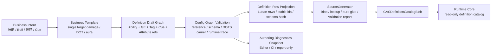

# GAS 业务编辑路径与配置链职责 Spec

## 目的

本 Spec 用真实 GAS 业务视角重新审查配置编辑链：目标不是让 Editor 页更像表格，而是让使用者用更短路径表达“一个可运行的 GAS 业务能力”，再由 Luban / SourceGenerator 折叠为 Runtime Core 可消费的 definition catalog 和 pure glue。

本文件只定义目标态业务编辑路径、Luban 配置链职责、Editor 配置链职责和验收口径。现实编辑链事实 owner 为 `../00-当前架构事实/Authoring编辑链事实.md`。

## 核心结论

目标态必须承认一件事：GAS 的业务编辑对象不是单张 Ability 表，也不是单张 GameplayEffect 表，而是一个**业务能力包**。

业务能力包是 Editor / Authoring 概念，不是 Runtime 概念。它聚合：

1. Ability definition：激活策略、目标规则、cost、cooldown、requirement。
2. GameplayEffect definition：instant / duration / period / stack、modifier、granted tag / ability。
3. Attribute / Tag / Cue reference：业务语义引用和表现请求。
4. Validation profile：引用完整性、DOTS 承载选择、buffer capacity hint、生成链 gate。
5. Runtime trace preview：Ability intent -> command -> target -> GE seed -> modifier -> fact -> cue 的预览。
6. Official GAS concept contracts：Ability lifecycle、GE spec shape、Tag taxonomy、Cue parameters、ASC binding。

目标态编辑路径必须从“编辑表行”变为“编辑业务能力包”；Excel / Luban row 是权威数据源和生成输入，但不是默认业务编辑界面。

## 真实业务场景复核

### 场景 1：火球术

业务意图：单位释放火球，选择一个敌方目标，造成伤害，播放命中 Cue，进入冷却。

目标态编辑路径：

1. 新建 `SingleTargetDamageAbility` 模板。
2. 填写 `AbilityCode / Name / TargetRule / Cost / Cooldown / DamageFormula / CueOnApply`。
3. Editor 自动生成或更新 Ability row、Damage GE row、Cooldown GE row、Cue reference、TagRequirement row projection。
4. 保存时执行 config graph validation，并展示 Runtime trace：`AbilityActivationPlanRecord -> GECommandSeedRecord -> ResolvedModifierRecord -> BoundaryObservationFact`。

被拒绝的长路径：手动先建 Ability ID，再跳到 Effect 表建 Damage GE，再建 Cooldown GE，再回填 `CdEffect`，再手写 `Modifiers` 协议，再找 Cue ID，再导出 JSON。

### 场景 2：中毒 DOT

业务意图：攻击施加中毒，持续 5 秒，每 30 帧结算一次伤害，可叠加 3 层，目标有免疫 Tag 时不生效。

目标态编辑路径：

1. 新建 `PeriodicStackingEffect` 模板。
2. 填写 Duration、Period、StackLimit、OverflowPolicy、ApplicationBlockedTags、DamageFormula、TickCue。
3. Editor 把这组输入投影为 Duration / Period / Stacking / TagRequirement / Modifier / Cue rows。
4. Validation 同时检查：周期效果是否有 active store 承载、stack overflow 是否有明确策略、period cue 是否只进入 Boundary outbox。

被拒绝的长路径：在 Effect 页展开多个 foldout，手写 `Duration` offset、`Period.Effects`、`Stacking` offset、`ImmunityTags` 三段协议，再靠导出后错误定位。

### 场景 3：被动光环

业务意图：单位拥有被动光环，给范围内友方加攻击力，离开范围移除。

目标态编辑路径：

1. 新建 `AuraGrantedEffect` 模板。
2. 填写 Aura source、target filter、granted effect、ongoing requirement、remove policy。
3. Editor 生成 Ability / Effect / TagRequirement / OngoingRequirement / GrantedTag 或 GrantedAbility row projection。
4. Validation 明确它属于 Duration/Granted state，不是 instant GE，不允许默认每帧创建/销毁 GE entity。

被拒绝的长路径：把光环拆成多个孤立 Effect / Tag / Ability 行，由使用者手工记忆哪一行是 grant、哪一行是 remove、哪一行是 ongoing requirement。

## 目标业务编辑链

## 更短路径的设计原则

| 原则 | 设计含义 | 为什么这样设计 |
|---|---|---|
| 业务聚合优先 | 默认编辑 `AbilityPackage`，不是单表 row | 使用者想表达“火球术”，不是先学习十张表的协议 |
| Luban 仍是权威 | Editor 只生成 / 修改 Luban row projection | 避免 Editor draft 和 Excel/Luban 双源事实 |
| Graph validation 前置 | 保存业务包前检查引用、schema、DOTS carrier、Runtime trace | 把错误留在编辑期，而不是生成后或运行时 |
| Raw table 退为高级模式 | Excel/raw protocol 可打开，但不是默认路径 | 框架作者仍可修底层，业务使用者走短路径 |
| Runtime trace 可视化 | Editor 展示 command/spec/delta/fact/cue 链 | 让配置者看到业务是否会进入正确 GAS lane |
| SourceGenerator 不扩权 | 生成 Blob / lookup / pure glue / report，不生成 lifecycle | 保持 Runtime Core owner 清晰，符合 `15-SourceGenerator职责边界Spec.md` |

## Luban 配置链职责

| 职责 | 目标态要求 | 禁止 |
|---|---|---|
| Schema owner | 维护 Ability / GE / Attribute / Tag / Cue / Scenario 的字段、类型、默认值和多态结构 | 让 Editor 私自定义不可生成的字段 |
| Stable id owner | 管理 code/id、命名、去重、引用命名空间和迁移映射 | 在 Editor draft 中生成不可追踪临时 ID 并进入 Runtime |
| Row source owner | 保存业务包最终投影后的 rows，作为 SourceGenerator 输入 | 把 ScriptableObject / Editor window state 当长期权威 |
| Reference graph owner | 表达 Ability -> GE -> Modifier / Cue / Tag / GrantedAbility 的跨表关系 | 只保留裸 int ID，缺少引用类型和诊断上下文 |
| Data version owner | 输出 schema hash、content hash、row revision、manifest input hash | 生成链无法解释本次改动来自哪组业务包 |
| Validation input owner | 提供可被 Editor / CI / SourceGenerator 共享的 normalized rows | Runtime Core hot path 读取 `cfg.*`、JSON 或 managed row |

## Editor 配置链职责

| 职责 | 目标态要求 | 禁止 |
|---|---|---|
| Business Authoring Session | 编辑业务能力包、模板参数、引用选择、批量新增/修改 rows | 只提供 Excel 行编辑和协议字符串输入 |
| Draft Graph Builder | 在内存中构建 Ability / GE / Tag / Cue / Attribute 引用图 | 把 Draft Graph 保存为 Runtime 可写状态 |
| Row Projection | 将业务包投影为 Luban rows，并输出变更 diff | 绕过 Luban 直接生成 Runtime catalog |
| Config Graph Validation | 保存前检查缺失引用、循环、互斥策略、DOTS carrier、capacity hint、Runtime trace | 只在导出 JSON 后才发现错误 |
| Diagnostics Presenter | 展示 validation snapshot、生成报告、official DOTS coverage、Runtime trace preview | 让 Debugger / Editor 诊断反向控制 gameplay |
| Raw Table Advanced Mode | 提供 Excel/raw protocol 维护入口 | 作为默认业务编辑路径 |

## SourceGenerator 配置链职责

| 职责 | 目标态要求 |
|---|---|
| Normalize | 从 Luban rows 构建统一 `RowMetadata`、领域分组和 stable range |
| Generate Catalog | 输出 `GASDefinitionCatalogBlob`、sorted code lookup、range-based child arrays |
| Generate Pure Glue | 输出 ability plan、GE seed、requirement evaluator、magnitude evaluator、target rule params 等静态纯函数 |
| Generate Validation | 输出 missing reference、orphan definition、DOTS carrier、buffer capacity、Burst target、ownership gate |
| Generate Editor Binding | 输出 Editor 可读 schema metadata、template field metadata、choice source，而不是 Runtime lifecycle |

## Ability Package 到 Runtime 的目标映射

| 业务包字段 | Luban row projection | Generated artifact | Runtime Core 消费 |
|---|---|---|---|
| Activation policy | Ability row | Ability definition blob | Ability State Evaluate |
| Target rule | Ability / TargetRule row | target rule index / static switch | Target Resolve |
| Cost | Cost GE row / Ability cost ref | GE seed / requirement glue | State Evaluate / Effect Fan-In |
| Cooldown | Cooldown GE row / cooldown frames | GE seed / active mutation flag | State Evaluate / ActiveEffectStore |
| Damage formula | GE modifier row | magnitude evaluator / modifier range | Spec / Attribute Apply |
| Buff duration / stack | GE duration / stacking row | active mutation seed / stack policy | ActiveEffectStore |
| Cue markers | Cue row / GE cue refs | boundary observation mapping | Boundary Projection |
| Requirements | TagRequirement rows | tag mask / requirement evaluator | Ability / GE requirement lane |
| Ability lifecycle | Ability row + requirement / cost / cooldown refs | `AbilityLifecycleContract` | Ability State Evaluate / activation plan |
| GE runtime spec shape | GE row + modifier / duration / stack / context refs | `GameplayEffectSpecShape` | Effect Fan-In / ActiveEffectStore |
| Tag taxonomy | Tag / TagRequirement rows | dense tag taxonomy / query evaluator | Requirement / State Evaluate |
| Cue parameters | Cue row / GE cue refs | `CueParameterContract` | Boundary Projection |
| ASC binding | Unit / Scenario / Grant rows | `ASCBindingContract` | Bootstrap / Structural Commit |

## 策划配置能力验收矩阵

| 能力 | 目标态验收 | 为什么必须这样设计 |
|---|---|---|
| 5 分钟创建可运行伤害技能 | 使用 `SingleTargetDamageAbility` 模板，单页填写目标规则、消耗、冷却、伤害公式和 Cue，保存后生成 Ability row、Damage GE row、Cooldown GE row、Cue reference | 真实策划任务是“创建技能”，不是学习 Ability / Effect / Cue 多表协议；短路径能降低内容创建错误率 |
| 单页维护 Ability + GE + Cooldown + Cue | 业务能力包界面聚合相关 rows，并展示 row diff | 冷却、伤害和表现是同一业务能力的组成部分，拆散会让引用完整性靠人工记忆 |
| 保存前发现缺失引用 | Config Graph Validation 在写回前检查 missing Ability / GE / Cue / Tag / Attribute、孤儿 row、循环引用和互斥策略 | 错误必须停在编辑期；导出后或运行时发现会放大测试成本 |
| 影响分析 | 修改任意 GE / Tag / Cue / Attribute 时展示受影响的 Ability Package、Unit、Scenario、Scale profile 和 validation expectation | 平衡调参最怕隐藏复用；影响范围必须成为配置工具的一等能力 |
| Runtime trace preview | Editor 生成 `Business Intent -> AbilityActivationPlanRecord -> GECommandSeedRecord -> ResolvedModifierRecord -> GameplayFact -> Boundary Cue` 预览 | Runtime Debugger 只能事后证明，配置工具要在保存前证明将进入正确 Runtime lane |
| 平衡预览 | 展示等级、消耗、冷却、伤害公式、DOT tick、stack limit、overflow policy 的聚合计算结果和异常标记 | 调参是高频业务动作；公式与周期/堆叠分散会让内容质量依赖人工心算 |
| Draft / Publish 分离 | Draft 只在 Editor session 内存在；Publish 输出 row diff、schema hash、content hash、validation snapshot 和 trace preview id | Editor 状态不能成为 Runtime source；发布单元必须可审计、可回滚、可复现 |
| Raw Table Advanced Mode | raw protocol / Excel 表格仍可维护，但默认入口隐藏在高级模式 | 框架维护需要底层入口；策划默认路径不应要求手写 serialization 协议 |
| SourceGenerator Editor Binding | SourceGenerator 输出 template field metadata、choice source、reference type、diagnostics code 和 display hint | 让 Luban schema / generated metadata 成为 UI 绑定事实源，避免 Editor 复制协议 |
| CI / Headless 配置验收 | Publish snapshot 可被 CI 读取，并驱动最小 scenario / scale validation | 配置变更必须能自动证明至少一条 Runtime 消费链，而不是只生成文件 |

## 验收

1. 创建一个 `SingleTargetDamageAbility` 业务包时，不需要打开原始 Excel，就能生成 Ability row、Damage GE row、Cooldown GE row、Cue reference 和 validation snapshot。
2. 保存业务包必须输出 row diff、schema/content hash、reference graph validation 和 Runtime trace preview。
3. Editor 默认界面不得要求使用者手写 `Modifiers`、`GrantedAbility`、`Duration` offset、`Stacking` offset、TagRequirement 三段协议；这些只能作为 Raw Table Advanced Mode。
4. Luban rows 仍是长期权威；Editor draft、窗口状态、ScriptableObject authoring asset 不能成为 Runtime Core source。
5. SourceGenerator 只消费 Luban / normalized rows，输出 Blob / lookup / pure glue / validation；不得因为业务模板而生成 lifecycle system。
6. Runtime Core 只能通过 `GASDefinitionCatalogBlob`、generated lookup 和 pure glue 消费配置；不得读取 Editor draft、Luban managed row、JSON 或 business package object。
7. Validation report 必须能按业务包聚合错误，例如“火球术缺少 Cue”、“中毒 DOT 的 Period 引用不存在”、“光环使用了 instant carrier 但配置为 ongoing requirement”。
8. 业务包发布必须能对照 `24-GAS官方概念对照复核Spec.md` 输出官方概念契约；缺少 Ability lifecycle、GE spec、Tag taxonomy、Cue parameters 或 ASC binding 时不得视为可发布。

## 禁止方向

1. 不把“编辑路径短”实现为绕过 Luban / SourceGenerator 的快速 Runtime 注入。
2. 不把 Editor 业务包对象当作 Runtime definition。
3. 不把表格高级编辑入口删除；它应保留给框架维护，但不能作为默认业务路径。
4. 不把 CodeGen validation report 当成 Editor 体验本身；Editor 必须把报告转成业务包级诊断。
5. 不把配置模板写成 Runtime System 模板；模板只产出 rows、schema metadata 和 generated pure glue 输入。
