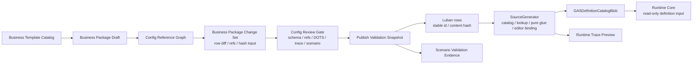

# 策划配置能力交叉审查 Spec

## 目的

本 Spec 从多个业务视角交叉审查 GAS 配置能力，补充 `19-GAS业务编辑路径与配置链职责Spec.md`。`19` 定义“更短业务编辑路径”，本文件定义这条路径必须同时满足哪些横切能力：引用图、影响分析、发布门禁、平衡调参、场景验证、协作变更、表现绑定、SourceGenerator Editor Binding 和 DOTS 规则证据。

本文件只定义目标态能力和验收口径。现实配置能力事实 owner 为 `../00-当前架构事实/ISSUE-012-策划配置能力缺失.md`。

## 核心结论

策划配置能力不是 Editor UI 功能集合，而是一条从业务意图到 Runtime Core definition catalog 的配置闭环：

```text
Business Template
  -> Business Package Draft
  -> Config Reference Graph
  -> Business Package Change Set
  -> Config Review Gate
  -> Publish Validation Snapshot
  -> SourceGenerator normalized rows / catalog / pure glue
  -> Runtime trace preview / scenario validation evidence
```

这条链路的关键约束是：**Editor 可以帮助策划更快表达业务，但不能成为 Runtime source；Luban rows / schema / stable id 仍是长期权威；SourceGenerator 只生成 immutable catalog、lookup、pure glue、validation 和 Editor Binding metadata。**

## 交叉审查矩阵

| 视角 | 目标态要求 | 为什么必须这样设计 | 禁止方向 |
|---|---|---|---|
| 内容创建路径 | 通过 Business Template 创建 Ability Package / Effect Package，并一次生成相关 rows | 策划以“技能 / Buff / 光环”思考，不以表行和 offset column 思考 | 把模板写成绕过 Luban 的 Runtime 快捷注入 |
| 引用图 | Config Reference Graph 必须表达 Ability -> GE -> Modifier / Requirement / Cue / GrantedAbility / Unit / Scenario，并补充 Ability lifecycle、GE spec context、Tag taxonomy、Cue parameters、ASC grant 边 | GAS 配置错误大多是跨表引用错误；官方 GAS 语义还依赖 lifecycle、spec、tag query、cue route 和 ASC owner，必须在保存前发现 | 只保存裸 int ID，靠导出或运行时发现缺失引用 |
| 影响分析 | 每个变更必须能反查受影响的业务包、单位、场景、规模配置、validation expectation 和 generated artifact | 平衡调参和复用 GE 会产生隐藏影响面；没有影响图就无法评审变更 | 只展示“本行被修改”，不展示业务影响范围 |
| Schema 与 stable id | Luban schema 输出字段类型、引用类型、默认值、id namespace、迁移映射和 content hash 输入 | 业务包可以短路径编辑，但长期权威必须仍是可生成、可 diff、可迁移的 row | Editor 私有字段、临时 ID 或窗口状态进入发布链 |
| 发布门禁 | Business Package Change Set 必须经过 Config Review Gate，输出 Publish Validation Snapshot | 配置发布需要可审计、可回滚、可复现；不能只看“保存成功” | 保存 Excel 就视为发布，缺少 row diff / hash / validation |
| 平衡调参 | Balance Preview 聚合展示冷却、消耗、等级、公式、DOT tick、stack、overflow 和异常曲线 | GAS 内容高频调参，公式和周期/堆叠分散会让错误进入运行时 | 策划跨表心算，或在 Runtime Debugger 里事后确认数值 |
| Runtime 轨迹 | Runtime Trace Preview 必须从 row projection + generated metadata + pure glue 推导 plan / seed / modifier / fact / cue | 策划需要保存前知道配置会进入哪条 Runtime lane；Debugger 只能事后验证 | 从 live Runtime state 反推配置正确性，或让预览反向驱动 gameplay |
| 场景验证 | Scenario Validation Binding 把业务包关联到 Unit / Scenario / Scale profile / validation expectation | 配置变更必须能触发最小可跑业务证据，尤其是 AutoChess x1 / x50 / x100 / x1000 | Demo runner 常量、serialized fields 或手写测试替代长期配置源 |
| 协作变更 | Business Package Change Set 是 review 单元，包含 row diff、引用影响、hash、诊断和 trace id | 多人配置时只看 Excel diff 不足以解释业务变更 | 以整张 Excel 文件冲突作为主要协作模型 |
| 表现绑定 | Cue / UI / VFX / SFX 只进入 Boundary binding plan；无头模式生成 log marker 也必须保留表现链路 | 表现是业务体验的一部分，但不能反向影响 Core gameplay | 无头验收删除 Cue / UI / VFX / SFX 链路，或让资源加载状态参与 Core 决策 |
| DOTS 承载证据 | 业务包 validation 必须携带 DOTS carrier hint、buffer capacity hint、Burst evaluator coverage 和 generated ownership gate | 配置不是运行时 API 选型，但会决定 Runtime lane 消费方式和规模压力 | 配置工具只校验字段合法，不校验 DOTS 承载风险 |
| SourceGenerator 绑定 | Generated Editor Binding 输出模板字段、choice source、引用类型、诊断码、显示 hint、raw protocol 映射和官方 GAS 概念契约 metadata | Editor 不应复制 Luban / SourceGenerator 协议；生成链才是 schema 与官方概念映射的事实源 | UI 硬编码表头、协议 offset、引用列表和诊断文本 |

## 目标数据对象

| 对象 | 所属层 | 职责 | 禁止 |
|---|---|---|---|
| Business Template Catalog | Definition & Generation / Editor Binding | 描述可创建的业务模板、字段、默认值、引用选择源和生成 row projection 规则 | 在 Runtime Core 中实例化模板对象 |
| Business Package Draft | Editor-only | 承载一次未发布编辑会话的模板参数和引用选择 | 作为 Runtime definition 或跨帧 gameplay state |
| Config Reference Graph | Editor / CI diagnostics | 根据 normalized rows 构建跨表引用和反向影响关系 | 从 live Runtime World 扫描 active state 反推引用 |
| Business Package Change Set | Editor / CI | 表达一次业务变更的 row diff、引用变更、影响范围、hash 输入和 review metadata | 只保存 Excel 文件变化，不表达业务语义 |
| Config Review Gate | Editor / CI | 对 change set 执行 schema、引用、DOTS carrier、SourceGenerator ownership、Runtime trace 和 scenario expectation 校验 | 只调用 CodeGen report，然后把裸错误抛给策划 |
| Publish Validation Snapshot | Editor / CI | 发布产物，记录 row diff、schema/content hash、impact id、trace id、scenario evidence id | 作为 Runtime Core 输入 |
| Scenario Validation Binding | Definition & Generation / CI | 把业务包与 Unit / Scenario / Scale profile / validation expectation 关联 | 用 runner 常量替代长期权威配置 |
| Generated Editor Binding | SourceGenerator output | 把 Luban schema / generated metadata 变成 Editor 可读字段、选项、引用、诊断和 raw protocol 映射 | 生成 Runtime lifecycle、query、ECB 或 NativeContainer owner |

## 目标工作流



## 配置能力分层职责

| 层 | 允许职责 | 禁止 |
|---|---|---|
| Luban schema / rows | 字段、引用类型、stable id、默认值、迁移映射、content hash 输入、长期 row source | 持有 runtime state 或根据 Runtime World 生成配置 |
| SourceGenerator | normalized rows、reference graph metadata、Editor Binding、Blob、lookup、pure glue、validation report、Baker / Bootstrap glue | generated lifecycle system、hidden query、hidden ECB、Runtime managed config lookup |
| Editor Shell | Draft 编辑、模板选择、row diff、impact 展示、trace preview 展示、review gate 触发 | 直接写 Runtime catalog、保存 Runtime state、私自定义不可生成字段 |
| Runtime Boundary / Debugger | 导出 trace 结构、validation evidence、diagnostics schema、Boundary outbox 观察 | 接收 Editor draft 作为 gameplay 输入，或让 diagnostics 反向控制 Core |
| CI / Headless validation | 消费 Publish Validation Snapshot，执行 scenario / scale / Debugger evidence 验收 | 只比较字符串日志，或用 demo 常量替代配置源 |

## 业务模板分类

| 模板族 | 典型模板 | 必须生成或校验 |
|---|---|---|
| Ability 模板 | SingleTargetDamageAbility、AreaDamageAbility、ProjectileAbility、SummonAbility | target rule、cost、cooldown、primary / secondary GE、Cue、activation requirement |
| Instant Effect 模板 | DamageEffect、HealEffect、CleanseEffect、CueOnlyEffect | modifier range、magnitude evaluator、target attribute、Boundary cue |
| Duration Effect 模板 | PeriodicStackingEffect、ShieldBuff、SlowDebuff、AuraGrantedEffect | active store carrier、duration / period / stack policy、grant / revoke、ongoing requirement |
| Requirement 模板 | TagRequirement、AttributeThresholdRequirement、CostRequirement | generated evaluator coverage、failure reason、preview input |
| Cue / Presentation 模板 | ApplyCue、TickCue、RemoveCue、FloatingTextCue | Boundary binding plan、resource/log marker fallback、headless evidence |
| Scenario 模板 | AutoChessUnitScenario、ScaleProfileScenario、RegressionExpectationScenario | unit setup、ability package refs、scale profile、validation expectation |

## 发布门禁

发布一个业务包前，必须形成机器可读的 `PublishValidationSnapshot`：

| 字段 | 目的 |
|---|---|
| `BusinessPackageId / Version` | review 和回滚定位 |
| `ChangedRows` | 明确 Luban row diff，不让 Editor draft 成为权威 |
| `ReferenceGraphHash` | 证明跨表引用关系已重新计算 |
| `ImpactAnalysisId` | 解释受影响的业务包、Unit、Scenario、Scale profile 和 generated artifact |
| `OfficialConceptCoverage` | 证明 Ability lifecycle、GE spec、Tag taxonomy、Cue parameters、AbilityTask mapping 和 ASC binding 已覆盖或给出拒绝理由 |
| `SchemaHash / ContentHash` | 对齐 Definition Catalog 的版本和缓存失效 |
| `RuntimeTracePreviewId` | 证明配置将进入正确 Runtime record / lane |
| `ScenarioValidationEvidenceId` | 证明最小业务场景和规模验收可执行 |
| `SourceGeneratorGateSummary` | 证明 generated artifact 没有 lifecycle / ownership 越权 |
| `DotsCoverageSummary` | 证明采用或拒绝的 DOTS 官方规则已记录 |

## 官方规则对照

| 官方规则 | 对策划配置能力的约束 |
|---|---|
| `BAKE-01`~`BAKE-03`、`CASE-39`~`CASE-41` | Draft / Template / Editor Binding 只能是 Authoring / Baking 输入面，不能进入 Runtime Core |
| `BLOB-01`、`BLOB-02`、`CASE-07`、`CASE-24` | 发布后的配置必须能折叠为 immutable Blob / catalog；Trace Preview 应展示 Blob / range / index 消费链 |
| `BUR-01`、`CASE-11` | 公式、requirement、magnitude 和 target rule 的可运行形态应是 generated static switch / evaluator，不是托管 delegate |
| `SYS-05`、`DBG-01`~`DBG-05` | trace preview、validation snapshot、impact analysis 是诊断证据，不参与 gameplay routing |
| `SEL-01`、`STORE-03` | 每个配置对象必须先归类为 Definition 输入、Runtime record、Boundary 投影或 diagnostics；业务包本身不得进 hot path |
| `BUF-01`~`BUF-04`、`NAT-01`~`NAT-05` | 配置验证要输出 buffer capacity / NativeContainer budget hint，帮助 Runtime lane 提前暴露 scale 风险 |
| `CONTENT-01`~`CONTENT-02`、`CASE-43` | Cue / UI / VFX / SFX 引用只属于 Boundary / Presentation binding plan；无头可替换最终 side effect，但不能删除链路 |
| `ODF-01`~`ODF-18` | 发布快照必须记录官方 DOTS 覆盖、采用 / 拒绝理由和后续反哺项 |

## 验收

1. 任意新模板进入 Business Template Catalog 前，必须声明 row projection、reference graph edges、Runtime trace preview shape、validation rules 和 raw advanced fallback。
2. 任意业务包保存前，必须能生成 Business Package Change Set。
3. 任意业务包发布前，必须能生成 Publish Validation Snapshot。
4. 任意 GE / Tag / Cue / Attribute 修改前，必须能输出 Impact Analysis。
5. Runtime Trace Preview 必须只读 generated catalog metadata 和 pure glue，不读取 Runtime World active state。
6. SourceGenerator 必须输出 Editor Binding metadata，Editor 不得硬编码 raw protocol 作为默认路径。
7. 至少一条 Ability Package 必须能绑定到 AutoChess 或等价 headless scenario，并输出 scenario validation evidence。
8. Raw Table Advanced Mode 可存在，但所有默认策划路径必须通过 Business Template / Package / Change Set / Review Gate。
9. Config Review Gate 必须执行 `24-GAS官方概念对照复核Spec.md` 的 concept coverage 检查；只通过 DOTS 规则或 schema 校验不等于 GAS 业务语义完整。

## 禁止方向

1. 不把策划配置能力降级为“做几个更漂亮的 Excel 编辑控件”。
2. 不把业务模板对象、Editor draft、ScriptableObject 或窗口状态作为 Runtime definition。
3. 不让 Runtime Debugger 反向成为配置权威；Debugger 只提供 evidence schema 和运行后诊断。
4. 不在 Editor 中复制 SourceGenerator 的协议推断；协议、字段、choice source 和诊断码由 Generated Editor Binding 提供。
5. 不用 runner 常量、serialized fields 或手写测试替代 Scenario Validation Binding。
6. 不把发布门禁做成只跑 CodeGen；CodeGen report 必须被转译成业务包级诊断。
7. 不允许“为了短路径”绕过 Luban rows、schema hash、content hash 和 SourceGenerator validation。
