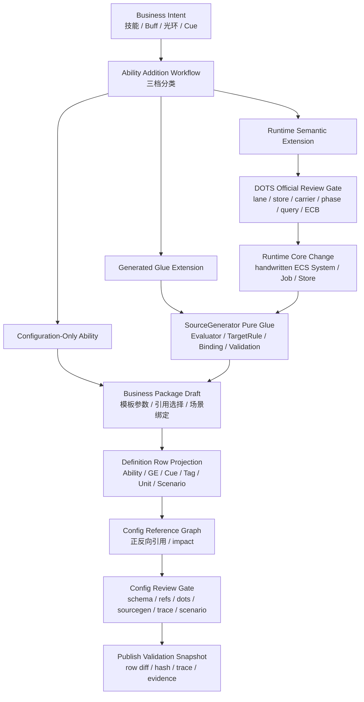

# 新增能力业务推进流程 Spec

## 目的

本 Spec 从策划和程序的真实协作视角定义目标态新增 GAS 能力的最短路径。它回答三个问题：

1. 新增一个能力时，策划必须做哪些动作。
2. 程序什么时候必须介入，什么时候不应介入。
3. 哪些链路是发布正确性和 DOTS 性能必须保留的，哪些应由 Luban / SourceGenerator / Editor Binding 自动化。

本文件只定义目标态流程和验收口径。当前缺陷见 `../00-当前架构事实/ISSUE-013-新增能力业务推进链路过长.md`。

## 核心结论

目标态新增能力的第一步不是新建 Ability row，也不是新建 Effect row，而是做 **Ability Addition Workflow** 分类。

新增能力必须被分成三档：

| 分类 | 触发条件 | 策划动作 | 程序动作 | Runtime Core 影响 |
|---|---|---|---|---|
| Configuration-Only Ability | 已有 Business Template、target rule、requirement、magnitude evaluator、Runtime lane 和 carrier | 选择模板、填参数、绑定 Unit / Scenario / ValidationExpectation、发布 change set | 0 代码 | 无 |
| Generated Glue Extension | Runtime 语义和 carrier 已存在，但缺少模板字段、target rule、requirement、magnitude evaluator、Editor Binding 或 validation rule | 提供业务意图和样例 | 补 schema metadata、SourceGenerator pure glue、Generated Editor Binding、validation rules | 无 lifecycle 变更 |
| Runtime Semantic Extension | 需要新增 Runtime lane、store、carrier、structural policy、phase 或高规模数据选型 | 提供业务需求、验收场景和规模目标 | 走 DOTS Official Review Gate，再改 Runtime Core / SourceGenerator / validation evidence | 必须审查 |

配置型能力必须是默认目标：只要已有模板和 generated glue 能表达业务，程序不应参与。程序介入不是“新能力默认需要程序支持”，而是分类门禁明确证明现有模板或 Runtime 语义无法表达。

## 为什么必须这样设计

真实业务中，新增能力的成本应该取决于语义新颖度，而不是取决于表行数量。

1. 策划新增“普攻伤害、盾击眩晕、毒刃 DOT、冰霜新星 AoE、圣光治疗”这类常规能力时，变化大多是 Definition 输入，不是 Runtime Core 语义。
2. 程序维护的高价值接口应是深模块：Business Template Catalog、Generated Runtime Glue、Runtime lane、store 和 validation evidence。接口越深，策划看到的动作越少，程序改动的 locality 越高。
3. Luban / SourceGenerator 与 DOTS 的相性来自批量生成 immutable catalog、lookup、static pure glue、Editor Binding 和 validation，而不是让生成器拥有 Runtime lifecycle。
4. DOTS 性能风险只在 Runtime 语义扩展时才应进入程序主线。纯配置变化不应该触发 SystemGroup、query、ECB、allocator 或 store 讨论。

## 问题来源模型

新增能力链路过长的根因不是“策划多点了几次按钮”，而是系统把四种不同问题混成了一个接口：

| 被混淆的问题 | 本质 | 错误表现 | 目标态 owner |
|---|---|---|---|
| 业务表达问题 | 策划要表达一个技能 / Buff / 光环 / Cue | 新建多张 row 和裸 ID | Business Template Catalog / Business Package Draft |
| 配置投影问题 | 业务包要落成 Luban rows / stable ids / normalized records | 手动维护 row、offset、raw protocol | Definition Row Projection / Generated Editor Binding |
| 生成胶水问题 | Runtime 已有语义，但缺 evaluator / requirement / target rule | 程序直接写 runtime helper 或 demo formula | SourceGenerator pure glue / validation |
| Runtime 语义问题 | 现有 Runtime lane / store / carrier 无法表达新 gameplay | 从需求直接改 hot path 或生成 lifecycle | DOTS Official Review Gate / handwritten Runtime Core |

目标态必须把这四类问题重新拆开。新增能力的入口负责分类，不负责把所有问题都塞进一个万能编辑器或一个万能程序任务。

## 解决方案总图

```mermaid
flowchart LR
    Intent["Business Intent"] --> Template["Business Template Catalog"]
    Template --> Draft["Business Package Draft"]
    Draft --> Projection["Definition Row Projection"]
    Projection --> Rows["Luban Normalized Rows"]
    Rows --> SourceGen["SourceGenerator\nmetadata / binding / lookup / pure glue"]
    SourceGen --> Preview["Runtime Trace Preview"]
    SourceGen --> Graph["Config Reference Graph"]
    Graph --> Impact["Impact-Scoped Validation"]
    Preview --> Gate["Config Review Gate"]
    Impact --> Gate
    Gate --> Snapshot["Publish Validation Snapshot"]

    SourceGen -. "缺 evaluator / target / requirement" .-> Glue["Generated Glue Extension"]
    Gate -. "缺 runtime carrier / store / lane" .-> Dots["DOTS Official Review Gate"]
```

解决方案的关键不是增加一个 OOP 中间层，而是建立一个 **Authoring / Generation Control Plane**。它只存在于 Editor / CI / Definition & Generation 侧，用来管理业务表达、row projection、生成元数据、影响分析和发布证据；它不进入 Runtime Core，也不成为 gameplay state owner。

## 解决方案矩阵

| 根因 | 解决方案 | 为什么能缩短真实业务路径 | DOTS 边界 |
|---|---|---|---|
| 存储 schema 驱动业务流程 | 默认入口改为 Business Template -> Business Package Draft | 策划以“能力”而不是“表行”创建内容 | Draft 不进入 Runtime，必须投影为 Luban rows |
| 手动 ID / raw protocol / offset columns | Stable ID Allocator + Generated Editor Binding | 技术字段由生成链维护，策划只填业务参数 | Editor Binding 只描述 schema，不生成 Runtime lifecycle |
| 缺少引用图 | Config Reference Graph 从 normalized rows / metadata 构建 | 保存前发现漏配、循环引用、公共 GE 影响面 | 引用图是 Editor / CI diagnostics，不读取 live Runtime |
| CodeGen report 和业务错误脱节 | Config Review Gate 将 schema / sourcegen / trace / scenario 聚合回 Business Package | 程序不再从裸 report 反查 row；策划能看字段级诊断 | Gate 只阻断发布，不参与 gameplay routing |
| 不知道是否需要程序 | Ability Addition Workflow 三档分类 | 配置型能力程序 0 代码，胶水扩展和 Runtime 扩展分离 | Runtime Semantic Extension 才进入 DOTS gate |
| Runtime 不透明 | Runtime Trace Preview 从 generated metadata + pure glue 推导 record 链 | 保存前知道能力进入哪些 plan / seed / modifier / fact / cue | Trace Preview 不读取 active World，不驱动 gameplay |
| 回归范围靠人工 | Impact-Scoped Validation | 只跑受影响 Unit / Scenario / Scale / Expectation | Validation evidence 按 Core / Boundary / Demo / Observation 分类 |

## 目标态接口深度

新增能力流程要变短，靠的不是删掉必要校验，而是把接口做深：

| 接口 | 调用者需要知道 | 实现隐藏的复杂度 |
|---|---|---|
| Business Template | 这是单体伤害、DOT、光环、治疗、控制还是 Cue | 需要生成哪些 Ability / GE / Cue / Tag rows，默认值是什么 |
| Business Package Draft | 当前能力的业务参数和引用选择 | row diff、stable id、raw protocol mapping、引用边 |
| Config Review Gate | 能否保存 / 发布，失败原因是什么 | schema validation、SourceGenerator gate、DOTS carrier hint、trace preview、scenario binding |
| Generated Glue Extension | 缺哪个 evaluator / target rule / requirement | 具体 generated switch、lookup、diagnostics code、Editor Binding |
| DOTS Official Review Gate | Runtime 语义是否真的不存在 | lane / store / carrier / query / phase / allocator / structural policy 选型 |

这样设计后，策划面对的是高深度业务接口；程序面对的是高 locality 的扩展点；Runtime Core 面对的仍是纯 ECS 数据流。

## 目标工作流

## 策划必要动作

| 动作 | 目标态说明 | 是否可省略 |
|---|---|---|
| 明确 Business Intent | 用自然业务语言说明目标、效果、表现、限制和期望场景 | 不可省略 |
| 选择 Business Template | 从模板目录选择单体伤害、周期 DOT、光环、治疗、控制、Cue 等模板 | 不可省略，但工具应推荐 |
| 填业务参数 | 伤害公式、冷却、消耗、持续、period、stack、target、tag requirement、Cue | 不可省略 |
| 绑定 Unit / Scenario / ValidationExpectation | 明确这次能力至少在哪个最小场景中可验证 | 不可省略 |
| 查看 Balance Preview | 比较公式、等级、冷却、DOT tick、stack overflow、异常曲线 | 不可省略，可由工具自动生成 |
| 查看 Runtime Trace Preview | 确认能力将进入 plan / seed / modifier / fact / cue 链 | 不可省略 |
| 通过 Config Review Gate | 保存前检查 schema、引用图、DOTS carrier、SourceGenerator gate、scenario | 不可省略 |
| 发布 Business Package Change Set | 形成可审计 row diff、hash、impact、trace 和 evidence | 不可省略 |

策划不应执行的默认动作：

1. 手动分配裸 ID。
2. 手动新建 Damage GE / Cooldown GE / Cue row / Period child GE。
3. 手写 `Modifiers`、`GrantedAbility`、TagRequirement 分隔协议。
4. 手动维护 offset raw columns。
5. 手动选择全量回归范围。
6. 为纯配置变化请求程序排查 Runtime。

## 程序必要动作

程序介入只能由分类门禁触发。

| 触发条件 | 程序应做 | 程序不应做 |
|---|---|---|
| 新模板缺失，但 Runtime 语义已存在 | 增加 Business Template metadata、row projection rule、Editor Binding、validation rule | 写 Runtime lifecycle system |
| 新 target rule 缺失 | 增加 generated target rule table / static switch / trace shape | 在 Editor 中硬编码 target 列表，或在 Runtime 用托管反射 |
| 新 formula / magnitude evaluator 缺失 | 增加 generated evaluator / Burst-friendly static glue / diagnostics code | 为单个能力写 demo ECS 公式或托管 delegate |
| 新 requirement 缺失 | 增加 generated requirement evaluator 和 reference graph edges | 用 raw tag protocol 绕过 validation |
| DOTS carrier / store 无法承载 | 走 Runtime Semantic Extension，审查 lane、store、capacity、query 和 evidence | 把 singleton buffer / request entity proof 固化为目标态 |
| 新结构变化语义 | 走 Structural Commit / ECB phase 设计和 Journaling evidence | 在 ability / effect hot path 直接 `EntityManager` 写 |

程序的默认优先级是：

1. 先扩展 SourceGenerator metadata / pure glue / Editor Binding。
2. 再扩展 validation / trace preview / impact analysis。
3. 只有 Runtime 语义确实不存在时，才修改 Runtime Core。

## 程序介入判定表

| 变化 | 分类 | 程序代码 |
|---|---|---|
| 伤害数值、冷却、消耗、持续、period、stack limit 调整 | Configuration-Only Ability | 0 |
| 使用已有单体 / AoE / 自身 / 最低血量友方 target rule | Configuration-Only Ability | 0 |
| 绑定已有 Cue / UI marker / VFX / SFX | Configuration-Only Ability | 0 |
| 新增 Unit 默认持有某能力 | Configuration-Only Ability | 0 |
| 新增 Scenario / Scale profile / ValidationExpectation | Configuration-Only Ability | 0 |
| 新增一个公式 token，如 `SynergyMultiplier` | Generated Glue Extension | SourceGenerator pure glue |
| 新增一个 target rule，如 `LowestThreatEnemy` | Generated Glue Extension | SourceGenerator target evaluator |
| 新增一个 requirement，如“目标正在引导技能” | Generated Glue Extension 或 Runtime Semantic Extension | 取决于 Runtime 是否已有 state/fact |
| 新增 AbilityTask-like 语义，如等待目标数据、等待事件、持续引导、表现完成后提交 | Generated Glue Extension 或 Runtime Semantic Extension | 取决于现有 ECS async / target / fact / Boundary lane 是否可表达 |
| 新增一个 active state store，如“链接多个目标并共享伤害” | Runtime Semantic Extension | Runtime Core + SourceGenerator |
| 新增跨帧结构变化语义，如持续召唤实体并跟随 Buff 生命周期 | Runtime Semantic Extension | Runtime Core + Structural Commit gate |

## 可精简动作

| 当前动作 | 目标替代 | 设计理由 |
|---|---|---|
| 手建 ID | Stable ID Allocator + namespace rule | ID 是配置稳定键，不是策划输入 |
| 手建 GE / Cooldown / Cue | Business Template row projection | 同一业务能力的 rows 应由模板聚合生成 |
| 手写 raw protocol | Generated Editor Binding 结构化字段 | 协议事实属于生成链，不属于默认编辑界面 |
| 手动导出 JSON / CodeGen | Business Package publish / CI trigger | 保存、生成、验证必须形成同一发布证据 |
| 人工找影响面 | Config Reference Graph + Impact Analysis | 平衡回归范围应由引用图决定 |
| 每次跑全量场景 | Impact-Scoped Validation | 只运行受影响的最小 scenario / scale profile |
| 程序人工读 Runtime log 反查配置 | Runtime Trace Preview + Publish Validation Snapshot | 错误应回到业务包字段和 generated artifact |

## 不可省略动作

| 动作 | 不能省略的原因 |
|---|---|
| Business Intent 明确化 | 模板选择、row projection 和验收样例都依赖业务意图 |
| Ability Addition Workflow 分类 | 它决定程序是否介入，以及介入哪一层 |
| Definition Row Projection | Luban rows / schema / stable id 是长期权威 |
| Config Reference Graph | 引用完整性、影响分析和最小回归范围都依赖它 |
| SourceGenerator validation | generated glue、catalog、Blob、Editor Binding 必须同源校验 |
| Runtime Trace Preview | 保存前必须证明配置会进入正确 Runtime record / lane |
| GAS Official Concept Mapping | 必须证明 Ability lifecycle、GE spec、Tag taxonomy、Cue parameters、AbilityTask mapping 和 ASC binding 没有被短路径删除 |
| Scenario Validation Binding | 新能力必须绑定至少一条可跑业务验收 |
| Publish Validation Snapshot | 发布必须可审计、可回滚、可复现 |
| DOTS Official Review Gate | 只对 Runtime Semantic Extension 必须执行，防止破坏 DOTS 性能边界 |

## DOTS Official Review Gate

Runtime Semantic Extension 触发时，程序必须先输出审查结论，再写代码。审查字段至少包含：

| 字段 | 要求 |
|---|---|
| Runtime Lane | 新语义进入 Ability、EffectCommand、ActiveEffect、Attribute、Tag、Fact、Boundary 哪条 lane |
| Store / Carrier | 选择 owner-local buffer、NativeStream、Blob lookup、chunk component、cleanup component 或 ECB 的理由 |
| Query Contract | All / Any / None / Disabled / ChangeFilter / enableable mask 处理方式 |
| Phase Ownership | 属于 5 段 physical group 中哪一段，是否需要 StructuralCommit |
| Burst / Managed Boundary | hot path 是否 `[BurstCompile]`，是否引入托管依赖 |
| Allocator / Capacity | NativeContainer / DynamicBuffer 的 owner、生命周期、capacity hint 和重选型阈值 |
| Determinism | merge 顺序、battle hash 输入、random state 归属 |
| Evidence | Debugger / Profiler / Journaling / headless runner 输出哪些字段 |

## 官方规则对照

| 规则 | 对本 Spec 的约束 |
|---|---|
| `SYS-01`、`SYS-02`、`SYS-03`、`SYS-05` | Runtime 语义扩展必须落在手写 ECS System / Job 数据流和既定 SystemGroup phase；配置型能力不得引入 OOP manager 或 generated lifecycle |
| `QRY-01`、`QRY-04`、`JOB-01`、`PRF-05`、`PRF-06` | 新 Runtime lane 必须说明 job / chunk / lookup 选型；高频 random lookup 不能用配置需求掩盖 |
| `SC-01`、`SC-03`、`ECB-03`、`PRF-02`、`PRF-04` | 新结构变化语义必须进入明确 StructuralCommit / ECB playback phase |
| `EN-03`、`CASE-20`、`PRF-22` | 新 enableable 状态必须说明 random access 与 chunk mask 的取舍 |
| `BUF-01`~`BUF-04`、`STORE-03`、`NAT-01`~`NAT-05` | 新 carrier / store 必须按数据性质、容量、allocator owner 和 deterministic merge 选型 |
| `BAKE-01`~`BAKE-03`、`BLOB-01`、`BLOB-02`、`CASE-07`、`CASE-24` | 新能力发布后必须进入 Luban row / generated catalog / Blob / lookup，不允许 Runtime 反查 Editor draft |
| `BUR-01`、`CASE-11` | 新 evaluator / requirement / target rule 的默认扩展方式是 Burst-friendly generated static glue |
| `DBG-01`~`DBG-05`、`SYS-04` | Runtime Trace Preview、Profiler、Journaling 和 Debugger evidence 必须按 Core / Boundary / Demo / Observation 分类 |
| `ODF-01`~`ODF-18` | 能力新增流程必须记录官方规则采用 / 拒绝理由，并把未覆盖主题反哺到文档或任务树 |

## AutoChess 示例判定

| 新增需求 | 目标分类 | 最短动作 |
|---|---|---|
| 新增“盾击”：单体伤害 + 眩晕 + Cue + 冷却 | Configuration-Only Ability | 选择 `SingleTargetDamageWithState` 模板，填伤害 / duration / tag / cue，绑定 ShieldBash scenario，发布 snapshot |
| 新增“毒刃”：周期 DOT + 3 层 stack + 毒伤公式 | Configuration-Only Ability 或 Generated Glue Extension | 若 `ATK * factor * StackCount` 已有则 0 代码；若缺少 formula token，则补 generated evaluator |
| 新增“圣光治疗”：最低血量友方治疗 + 职业加成 | Generated Glue Extension | 若 `LowestHPAlly` 或 `SynergyMultiplier` 缺失，补 target / evaluator glue，不改 Runtime lifecycle |
| 新增“连锁闪电”：按距离跳转多个目标并记录跳转链 | Runtime Semantic Extension 候选 | 如果现有 target record 无法表达跳转链和 deterministic merge，先走 DOTS Official Review Gate |
| 新增“蓄力重击”：按住蓄力，松开后按蓄力时长提交伤害和 Cue | Runtime Semantic Extension 候选 | 先判断是否已有 wait input / async slot / commit fact；缺失时不能当作配置型能力 |

## 验收

1. 新增配置型能力时，仓库代码 diff 不应出现 Runtime Core / SourceGenerator 代码变化；只允许配置 rows、Business Package Change Set 和 validation snapshot 变化。
2. 新增胶水扩展型能力时，Runtime-visible generated artifact 不得包含 `ISystem`、`OnUpdate`、system registration、hidden query、hidden ECB、`EntityManager` write 或 NativeContainer owner。
3. 新增 Runtime 语义型能力前，必须有 DOTS Official Review Gate 文档，且引用 `90-规则编号索引.md` 中的具体规则。
4. 任意新增能力发布前必须输出 Impact Analysis、Runtime Trace Preview、Scenario Validation Evidence 和 Publish Validation Snapshot。
5. 配置型能力的默认策划路径不得要求手写 raw protocol、offset raw columns、裸 ID 列表或手动导出 JSON / CodeGen。
6. 新增能力的最小验收样例必须能接入 AutoChess 或等价 headless scenario；不能只依赖 demo runner 常量或人工日志。
7. 新增能力发布前必须通过 `24-GAS官方概念对照复核Spec.md` 的官方概念覆盖检查；发现 AbilityTask-like、prediction-like 或 ASC grant 缺口时必须重新分类。

## 禁止方向

1. 不把“新能力”默认解释为“程序写新 C# ability class”。
2. 不让 SourceGenerator 生成 Runtime lifecycle system、query owner、ECB owner 或 NativeContainer owner。
3. 不把 Business Package Draft 当 Runtime definition source；进入 Runtime 前必须投影到 Luban rows 并生成 catalog / Blob / lookup。
4. 不用 Raw Table Advanced Mode 代替默认策划路径。
5. 不把 Runtime Trace Preview 变成 gameplay 决策输入。
6. 不把全量 runner 成功当作影响分析完成；必须能说明为什么这些 scenario 被选中。
