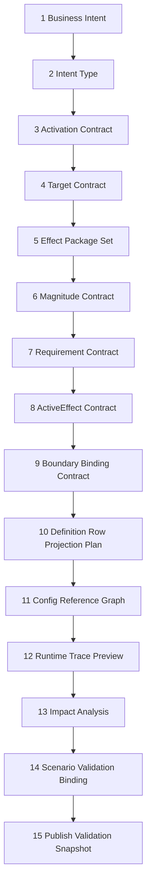

# 能力配置链条与分析步骤 Spec

## 目的

本 Spec 细化目标态 Editor / Authoring 配置链：当策划提出一个新能力或修改一个既有能力时，系统应该如何分析、拆解、投影、校验、预览和发布。

它补充三份上游 Spec：

1. `19-GAS业务编辑路径与配置链职责Spec.md`：定义业务能力包是默认编辑对象。
2. `20-策划配置能力交叉审查Spec.md`：定义引用图、影响分析、发布门禁、场景验证等横切能力。
3. `22-新增能力业务推进流程Spec.md`：定义新增能力三档分类和程序介入门槛。

本文件不讨论具体 Editor UI 控件，不讨论窗口布局，也不让 Editor 成为 Runtime source。它只定义能力配置链条、分析步骤、输入输出和验收口径。

## 核心结论

目标态 Editor 配置链不是“表格编辑器”，而是一个配置期分析编译器：

```text
Business Intent
  -> Ability Configuration Analysis Protocol
  -> Business Package Draft
  -> Definition Row Projection Plan
  -> Config Reference Graph
  -> Runtime Trace Preview
  -> Impact Analysis
  -> Scenario Validation Binding
  -> Publish Validation Snapshot
```

这条链路的关键原则是：策划只表达业务意图和参数；Editor / SourceGenerator 负责把意图编译成 row projection、引用图、trace 和发布证据；Runtime Core 只消费 generated catalog / Blob / pure glue，不知道 Business Package Draft 存在。

## Editor 配置链职责拆分

| 职责模块 | 输入 | 输出 | 禁止方向 |
|---|---|---|---|
| Template Resolver | Business Intent、Ability Addition Workflow 分类 | 选中的 Business Template、缺失项诊断 | 让策划从空 Ability / Effect row 开始 |
| Draft Graph Builder | 模板字段、引用选择、默认值 | Business Package Draft / Definition Draft Graph | Draft 直接作为 Runtime source |
| Row Projection Planner | Draft Graph、Generated Editor Binding | Definition Row Projection Plan | 手写 raw protocol 或 offset columns |
| Stable ID Allocator | package namespace、模板 row kind | Ability / GE / Cue / Tag stable ids | 策划手填裸 ID |
| Reference Graph Builder | normalized rows、generated metadata | Config Reference Graph | 从 live Runtime World 反推静态引用 |
| Static Validation Router | draft、projection plan、reference graph | schema / refs / DOTS carrier / SourceGenerator diagnostics | 只转发 CodeGen 裸错误 |
| Trace Preview Builder | generated catalog metadata、pure glue、projection plan | Runtime Trace Preview | 读取 active Runtime World 或驱动 gameplay |
| Impact Analyzer | old / new reference graph、row diff | 受影响 Ability Package、Unit、Scenario、Scale profile、generated artifact | 只显示本行被修改 |
| Scenario Binding Resolver | impact result、business template、validation expectation | Impact-Scoped Validation set | 每次默认全量 runner |
| Snapshot Builder | row diff、hash、gate summary、trace、impact、scenario evidence | Publish Validation Snapshot | 保存 Excel 即视为发布 |

## 能力配置分析协议

每个能力进入配置链前，都必须执行 Ability Configuration Analysis Protocol。该协议不是人工 checklist，而是 Editor / CI 可复用的分析顺序。

| 步骤 | 分析问题 | 产物 | 失败归因 |
|---|---|---|---|
| 1. 业务意图归类 | 这是主动技能、被动、Buff、Debuff、光环、Cue、召唤、反应能力还是组合能力 | Ability Intent Type | intent 不完整，退回策划补信息 |
| 2. 激活语义分析 | 由谁触发，何时触发，是否需要 cooldown / cost / activation requirement | Activation Contract | 缺 activation 模板则 Generated Glue Extension |
| 3. 目标语义分析 | 目标是 self、single target、AoE、ally、enemy、lowest HP、chain、random 还是 event source | Target Contract | 缺 target rule 先判断 generated glue；需要新 carrier 则 Runtime Semantic Extension |
| 4. 效果拆解 | 能力产生哪些 instant GE、duration GE、periodic GE、stacking GE、granted ability、tag grant、cue | Effect Package Set | 缺业务模板或 row projection rule |
| 5. 数值与公式分析 | modifier、magnitude、curve、level scaling、stack multiplier、synergy multiplier 如何计算 | Magnitude Contract | 缺 evaluator 则 Generated Glue Extension |
| 6. Requirement / Immunity 分析 | activation、application、ongoing、remove、immunity、block tag 是否明确 | Requirement Contract | 缺 requirement evaluator 或 tag taxonomy |
| 7. Duration / Period / Stack 分析 | 是否跨帧，是否 tick，是否堆叠，overflow 如何处理 | ActiveEffect Contract | 现有 store 无法表达则 Runtime Semantic Extension |
| 8. 表现绑定分析 | Cue、UI、VFX、SFX、无头 marker 如何从 Boundary outbox 派生 | Boundary Binding Contract | 表现缺失不阻断 Runtime Core，但阻断完整业务发布 |
| 9. Row Projection 分析 | 需要生成哪些 Ability / GE / Cue / Tag / Unit / Scenario rows | Definition Row Projection Plan | 无法投影则模板不完整 |
| 10. Runtime Trace 分析 | 该配置会进入哪些 plan / seed / modifier / active mutation / fact / cue record | Runtime Trace Preview | trace 断裂说明 generated metadata 或 pure glue 缺失 |
| 11. 影响面分析 | 修改会影响哪些包、单位、场景、规模配置、期望和 generated artifact | Impact Analysis | graph 不完整则不得发布 |
| 12. 发布门禁分析 | 是否具备 row diff、hash、validation summary、trace、impact、scenario evidence | Publish Validation Snapshot | 任何证据缺失都阻断发布 |

## 能力配置链条



编号不是 UI 步骤，而是配置分析顺序。Editor 可以把多个步骤合并展示，但保存 / 发布 gate 必须能输出这些分析结果。

## Definition Row Projection Plan

Definition Row Projection Plan 是业务包到 Luban rows 的中间产物。它必须是机器可读的，不是隐藏在 Editor 状态里的临时对象。

最小字段：

| 字段 | 说明 |
|---|---|
| `PackageId` | 业务包稳定 id |
| `TemplateId` | 使用的 Business Template |
| `IntentType` | 主动 / 被动 / Buff / 光环 / Cue / 组合 |
| `RowsToCreate` | Ability / GE / Cue / Tag / Unit / Scenario 等新增 row |
| `RowsToUpdate` | 被修改 row 和字段 diff |
| `GeneratedIds` | Stable ID allocator 输出 |
| `RawProtocolMapping` | 结构化字段到 raw protocol / offset columns 的映射，仅供 projection 使用 |
| `ReferenceEdges` | Ability -> GE -> Modifier / Cue / Tag / Unit / Scenario 边 |
| `TraceShape` | 预期 Runtime record 链形状 |
| `ValidationRules` | schema、引用、DOTS carrier、SourceGenerator gate、scenario expectation |
| `OfficialConceptContracts` | Ability lifecycle、GE spec shape、Tag taxonomy、Cue parameters、AbilityTask semantic mapping、ASC binding |

该计划解决当前最痛的断点：策划不再手写 raw protocol，程序也不再从 Excel diff 反推业务变更。

## GAS 官方概念覆盖字段

`Ability Configuration Analysis Report` 不能只证明 row projection 成功，还必须证明官方 GAS 概念没有在短路径中丢失。

| 覆盖字段 | 必须回答的问题 | 缺失处理 |
|---|---|---|
| `AbilityLifecycleContract` | grant、can activate、activate、commit、cancel、block、end 和 failure reason 是否明确 | 阻断发布；若缺 lifecycle 模板则 Generated Glue Extension 或 Runtime Semantic Extension |
| `GameplayEffectSpecShape` | GE definition 与 runtime spec context、duration、period、stack、requirement、cue 是否分离 | 阻断发布；不得把 GE row 直接当 runtime spec |
| `GameplayTagTaxonomy` | Tag 属于 owned、asset、activation、application、ongoing、remove、immunity、cue 还是 event | 阻断发布；不得保存裸 tag 列表 |
| `CueParameterContract` | Cue event、source / target、effect context、magnitude snapshot、presentation binding 是否完整 | 可阻断完整业务发布；不阻断无表现的 Core proof |
| `AbilityTaskSemanticMapping` | 是否存在等待、异步、目标数据、事件流控制或表现完成驱动 gameplay | 无 ECS lane / store / fact 承载时升级 Runtime Semantic Extension |
| `ASCBindingContract` | Unit / Scenario / GE grant 到 ASC 的 AttributeSet、tag、ability、active effect 关系是否可追踪 | 阻断发布；不得由 demo 常量隐式决定 |

## Editor 配置链解决方案

目标态 Editor 配置链至少包含以下能力，不要求它们是独立窗口或独立类，但职责必须独立：

| 能力 | 解决的问题 | 输出 |
|---|---|---|
| Template-driven create | 从业务意图开始，而不是从 row 开始 | Business Package Draft |
| Generated field binding | 字段、choice source、引用类型、默认值、诊断码由 SourceGenerator 输出 | Generated Editor Binding |
| Projection preview | 保存前展示将创建 / 修改哪些 rows | Definition Row Projection Plan |
| Reference graph preview | 保存前展示正反向引用和孤儿风险 | Config Reference Graph |
| Trace preview | 保存前展示 Runtime record 链 | Runtime Trace Preview |
| Balance preview | 展示公式、等级、冷却、period、stack、overflow 曲线 | Balance Preview |
| Impact preview | 展示受影响业务包、Unit、Scenario、Scale profile 和 generated artifact | Impact Analysis |
| Publish gate | 聚合 schema、sourcegen、trace、impact、scenario 结果 | Publish Validation Snapshot |
| Raw advanced bridge | 框架维护者可查看 raw row 和 protocol | Raw Table Advanced Mode |

这里的“完善 Editor 配置链”不是增加更多手工字段，而是让 Editor 消费 SourceGenerator metadata，把业务包变成可分析、可投影、可校验、可发布的结构化对象。

## 分析失败到解决方案映射

| 失败点 | 判定 | 解决方案 |
|---|---|---|
| 没有匹配模板 | Business Template 缺失 | 新增模板 metadata、row projection rule 和 validation rule |
| 字段没有 choice source | Generated Editor Binding 缺失 | SourceGenerator 输出 choice source / reference type |
| target rule 无法表达 | 先判定是否只缺 generated evaluator | 能用现有 carrier 表达则 Generated Glue Extension，否则 Runtime Semantic Extension |
| formula token 缺失 | Generated Glue Extension | 新增 magnitude evaluator / static switch / diagnostics code |
| requirement 缺失 | Generated Glue Extension 或 Runtime Semantic Extension | 若只缺 evaluator 补 glue；若缺 Runtime fact/state，走 DOTS gate |
| duration / stack / granted state 无法表达 | Runtime Semantic Extension 候选 | 审查 ActiveEffect store、slot、cleanup、structural policy |
| trace preview 断裂 | SourceGenerator metadata 或 pure glue 缺口 | 补 Generated Runtime Glue / trace shape |
| impact graph 不完整 | Reference Graph 缺口 | 补 normalized row edges / generated artifact edges |
| scenario 无法绑定 | 验收配置缺口 | 补 Scenario / Scale profile / ValidationExpectation rows |

## AutoChess 能力分析样例

| 能力 | 分析结论 | 配置链输出 |
|---|---|---|
| 盾击 | 主动单体伤害 + 眩晕 duration GE + cue + cooldown；已有 target / duration / tag carrier 可表达 | Ability row、Damage GE、Stun GE、Cooldown GE、Cue reference、ShieldBash scenario binding、trace preview |
| 毒刃 | 主动攻击附加 periodic stacking DOT；重点校验 period、stack limit、overflow、active store pressure | Ability row、Poison DOT GE、period tick modifier、stack validation、x50 scale impact |
| 冰霜新星 | AoE target + 多目标 damage / slow；重点校验 target capacity 和 per-target command fan-out | Ability row、AoE target rule binding、Damage GE、Slow GE、target resolve capacity hint |
| 圣光治疗 | ally target + heal formula + synergy multiplier；若 multiplier 缺失则胶水扩展 | Ability row、Heal GE、LowestHPAlly target binding、Synergy evaluator 或 glue extension |
| 连锁闪电 | chain target + deterministic merge；如果现有 target record 无法表达链路，就是 Runtime Semantic Extension | DOTS gate 输出 lane / store / merge / trace 设计后才允许配置发布 |

## 官方规则对照

| 规则 | 对本 Spec 的约束 |
|---|---|
| `BAKE-01`~`BAKE-03`、`BLOB-01`、`BLOB-02`、`CASE-07`、`CASE-24` | Editor draft 必须投影为 Luban rows / Blob / catalog，不能成为 Runtime source |
| `BUR-01`、`CASE-11` | formula、requirement、target rule 的可执行形态优先 generated static glue |
| `SYS-01`、`SYS-03`、`QRY-04`、`SC-01`、`ECB-03` | 能力分析发现 Runtime 语义缺口时，必须走 DOTS gate，不允许从 Editor 直接生成 lifecycle |
| `SEL-01`、`STORE-03` | 每个分析产物必须归类为 Definition 输入、Runtime record、Boundary 投影或 diagnostics |
| `DBG-01`~`DBG-05`、`SYS-05` | trace、impact、publish snapshot 是诊断和发布证据，不参与 gameplay routing |
| `ODF-01`~`ODF-18` | 分析协议和发布快照必须记录官方规则覆盖、采用 / 拒绝理由和反哺项 |

## 验收

1. 任意新增能力必须输出 Ability Configuration Analysis Report，包含 12 个分析步骤的结果或失败归因。
2. 任意 Business Package 保存前必须输出 Definition Row Projection Plan。
3. 任意 Publish Validation Snapshot 必须能追溯到 row diff、Config Reference Graph、Runtime Trace Preview、Impact Analysis 和 Scenario Validation Binding。
4. Configuration-Only Ability 的完整配置链不得产生 Runtime Core / SourceGenerator 代码 diff。
5. Generated Glue Extension 必须能说明缺哪个 evaluator / target rule / requirement / Editor Binding，并通过 SourceGenerator Ownership Gate。
6. Runtime Semantic Extension 必须在配置发布前通过 DOTS Official Review Gate。
7. 任意能力配置报告必须通过 `24-GAS官方概念对照复核Spec.md` 的官方概念覆盖检查；row projection、trace preview 或 DOTS gate 任一单项通过都不能单独证明 GAS 语义完整。

## 禁止方向

1. 不把能力配置链降级成“更详细的 Excel 表单”。
2. 不让 Editor 复制 SourceGenerator 的字段协议和引用推断。
3. 不让 Draft Graph、Projection Plan、Trace Preview 或 Impact Analysis 进入 Runtime Core。
4. 不把 demo runner 常量当 Unit / Scenario / Scale / ValidationExpectation 的长期权威。
5. 不用全量测试替代 Impact-Scoped Validation。
