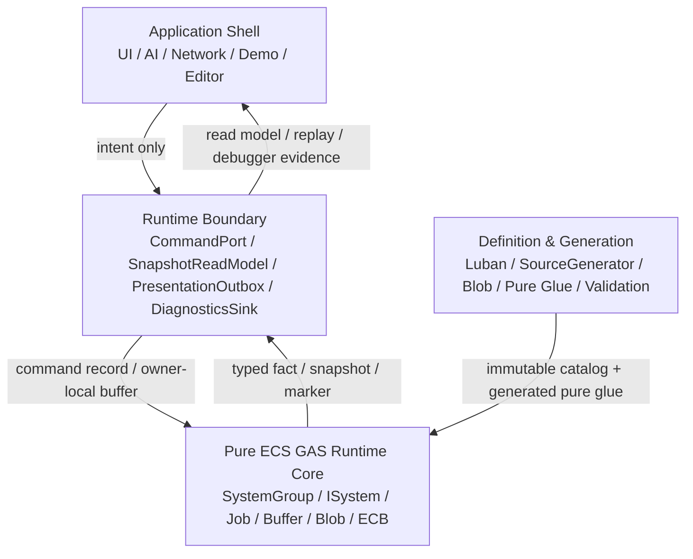

# 纯 ECS 内核与边界重划分 Spec

## 目的

定义 EX-GAS 2.0 的理想目标态：Gameplay 权威状态和热路径计算必须落在纯 ECS Runtime Core；OOP 只作为 Application Shell 和 Runtime Boundary 的外壳；Debugger / 日志是证据系统；Luban + SourceGenerator 只生成不可变定义、静态 lookup、pure glue 和 validation artifact。

本 Spec 是对 `00-总览Spec.md`、`02-四层架构Spec.md`、`03-RuntimeCore管线Spec.md`、`07-RuntimeCoreDebuggerSpec.md` 和 `08-Luban-SourceGenerator配置生成链路Spec.md` 的一次收口，不替代它们的细节。官方 DOTS 复核门槛以 `18-DOTS官方规范复核与性能红线Spec.md` 为准；本文件中的代码骨架必须能通过该门槛。

## 官方依据

| 规则 | 本 Spec 采用结论 |
|---|---|
| `SYS-01`、`SYS-02`、`SYS-05` | Core 权威计算落在 ECS System / Job；SystemGroup 是 phase owner；Debugger / Demo / Presentation 只能通过 Boundary 观察 Core |
| `SEL-01`、`SEL-02`、`SEL-04` | 先按数据性质选 API；proof-only carrier 不能固化为 scale-ready；每个选择必须有重选型触发条件 |
| `QRY-01`、`QRY-04`、`JOB-01` | hot path 默认 job 化，避免高频 random lookup；主线程 query 仅限 debug / low-scale / boundary |
| `SC-01`、`ECB-03`、`PRF-04` | hot path 结构变化集中到明确 `GASStructuralCommitSystemGroup` playback |
| `BUF-02`、`NAT-03`、`MAT-05` | singleton DynamicBuffer 只能 proof；并行 fan-in 必须 deterministic merge |
| `DBG-01..05` | Debugger 是 counter / official diff / evidence owner，不是 runtime 控制层 |
| `BLOB-01`、`BLOB-02`、`BUR-01` | 静态定义进入 Blob / generated lookup；SourceGenerator 不生成 runtime lifecycle owner |

## 目标分层



### 分层不变量

1. Application Shell 不持有 `EntityManager`、`EntityQuery` 或可写 `DynamicBuffer`。
2. Runtime Boundary 可以是 OOP，但只能翻译 command、导出 snapshot、转发 presentation / diagnostics；不做 damage、cooldown、tag requirement、stack、period 等 gameplay 计算。
3. Runtime Core 不调用 `GameObject`、`MonoBehaviour`、UI、VFX、SFX、日志字符串或 managed config registry。
4. Debugger 只读 Core facts / counters，不反向驱动 simulation。
5. SourceGenerator 只生成数据和纯函数，不生成 gameplay lifecycle system、hidden query、hidden ECB 或 hidden `EntityManager` write。

## 目标代码骨架

以下代码是目标态结构骨架，用于说明接口深度、owner、读写方向和 DOTS API 选型。本节只定义可作为框架设计参考的代码形态。

### 1. Boundary 只写 command record

```csharp
using Unity.Collections;
using Unity.Entities;

namespace GAS.Runtime
{
    internal struct GASBoundaryCommandPending : IComponentData, IEnableableComponent
    {
    }

    internal struct GASBoundaryCommand : IBufferElementData
    {
        public Entity SourceAsc;
        public Entity TargetAsc;
        public int AbilityCode;
        public int GameplayEffectCode;
        public int Level;
        public GASBoundaryCommandKind Kind;
        public int Sequence;
    }

    internal enum GASBoundaryCommandKind : byte
    {
        ActivateAbility = 1,
        ApplyGameplayEffect = 2,
        RemoveGameplayEffect = 3,
        DestroyAsc = 4,
    }

    public readonly struct ASCTargetRef
    {
        internal readonly Entity RuntimeEntity;

        internal ASCTargetRef(Entity runtimeEntity)
        {
            RuntimeEntity = runtimeEntity;
        }
    }

    internal readonly struct GASBoundaryCommandWriter
    {
        private readonly EntityManager _entityManager;
        private readonly Entity _ownerAsc;

        internal GASBoundaryCommandWriter(EntityManager entityManager, Entity ownerAsc)
        {
            _entityManager = entityManager;
            _ownerAsc = ownerAsc;
        }

        public bool RequestAbility(int abilityCode, ASCTargetRef target, int sequence)
        {
            if (!IsValid() || !_entityManager.HasBuffer<GASBoundaryCommand>(_ownerAsc))
                return false;

            var commands = _entityManager.GetBuffer<GASBoundaryCommand>(_ownerAsc);
            commands.Add(new GASBoundaryCommand
            {
                SourceAsc = _ownerAsc,
                TargetAsc = target.RuntimeEntity,
                AbilityCode = abilityCode,
                Kind = GASBoundaryCommandKind.ActivateAbility,
                Sequence = sequence,
            });

            if (_entityManager.HasComponent<GASBoundaryCommandPending>(_ownerAsc))
                _entityManager.SetComponentEnabled<GASBoundaryCommandPending>(_ownerAsc, true);

            return true;
        }

        private bool IsValid()
        {
            return _ownerAsc != Entity.Null && _entityManager.Exists(_ownerAsc);
        }
    }
}
```

解释：这段代码把 `EntityManager` 限定在 Runtime Boundary implementation 内。它的职责是把 Shell 意图压成 owner-local command record，不直接执行 GameplayEffect、不写 Attribute、不读 Debugger、不创建 transient request entity。Shell 侧只能看到业务请求接口，不能看到 ECS 写句柄。

### 2. Core 以 IJobChunk 消费 command

```csharp
using Unity.Burst;
using Unity.Collections;
using Unity.Entities;

namespace GAS.Runtime
{
    public struct GASEffectCommandRecord
    {
        public Entity SourceAsc;
        public Entity TargetAsc;
        public int GameplayEffectCode;
        public int Level;
        public int Sequence;
        public int ProducerIndex;
    }

    [BurstCompile]
    [UpdateInGroup(typeof(GASCommandResolveSystemGroup))]
    public partial struct GASBoundaryCommandResolveSystem : ISystem
    {
        private EntityQuery _query;

        public void OnCreate(ref SystemState state)
        {
            _query = state.GetEntityQuery(new EntityQueryDesc
            {
                All = new[]
                {
                    ComponentType.ReadOnly<GASBoundaryCommandPending>(),
                    ComponentType.ReadWrite<GASBoundaryCommand>(),
                },
            });
            state.RequireForUpdate(_query);
        }

        [BurstCompile]
        public void OnUpdate(ref SystemState state)
        {
            var commandType = SystemAPI.GetBufferTypeHandle<GASBoundaryCommand>(isReadOnly: false);
            var pendingType = SystemAPI.GetComponentTypeHandle<GASBoundaryCommandPending>(isReadOnly: false);
            var entityType = SystemAPI.GetEntityTypeHandle();

            state.Dependency = new ResolveBoundaryCommandsJob
            {
                EntityType = entityType,
                CommandType = commandType,
                PendingType = pendingType,
            }.ScheduleParallel(_query, state.Dependency);
        }

        [BurstCompile]
        private struct ResolveBoundaryCommandsJob : IJobChunk
        {
            [ReadOnly] public EntityTypeHandle EntityType;
            public BufferTypeHandle<GASBoundaryCommand> CommandType;
            public ComponentTypeHandle<GASBoundaryCommandPending> PendingType;

            public void Execute(
                in ArchetypeChunk chunk,
                int unfilteredChunkIndex,
                bool useEnabledMask,
                in Unity.Burst.Intrinsics.v128 chunkEnabledMask)
            {
                var commands = chunk.GetBufferAccessor(ref CommandType);
                var pendingMask = chunk.GetEnabledMask(ref PendingType);
                var enumerator = new ChunkEntityEnumerator(useEnabledMask, chunkEnabledMask, chunk.Count);

                while (enumerator.NextEntityIndex(out var i))
                {
                    var ownerCommands = commands[i];
                    for (var commandIndex = 0; commandIndex < ownerCommands.Length; commandIndex++)
                    {
                        var command = ownerCommands[commandIndex];
                        // Target resolve / ability validation / GE seed 只写 frame-local record。
                        // 不在这里创建 runtime GE entity，不写 Attribute，不写 Presentation。
                    }

                    ownerCommands.Clear();
                    pendingMask[i] = false;
                }
            }
        }
    }
}
```

解释：Core 的接口是 command buffer 和 job query，不是 OOP 方法调用。`SystemState.GetEntityQuery` 让 query owner 可追踪；`ChunkEntityEnumerator` 让 enableable 语义显式；job 内不执行结构变化。

### 3. Fan-in 默认 NativeStream + deterministic merge

```csharp
using Unity.Burst;
using Unity.Collections;
using Unity.Entities;
using Unity.Jobs;

namespace GAS.Runtime
{
    public struct GASEffectCommandSortKey : System.IComparable<GASEffectCommandSortKey>
    {
        public int TargetSortKey;
        public int Sequence;
        public int ProducerIndex;
        public int LocalIndex;

        public int CompareTo(GASEffectCommandSortKey other)
        {
            var target = TargetSortKey.CompareTo(other.TargetSortKey);
            if (target != 0) return target;
            var sequence = Sequence.CompareTo(other.Sequence);
            if (sequence != 0) return sequence;
            var producer = ProducerIndex.CompareTo(other.ProducerIndex);
            if (producer != 0) return producer;
            return LocalIndex.CompareTo(other.LocalIndex);
        }
    }

    public struct GASSortedEffectCommand
    {
        public GASEffectCommandSortKey SortKey;
        public GASEffectCommandRecord Command;
    }

    [BurstCompile]
    public struct GASEffectCommandMergeJob : IJob
    {
        public NativeStream.Reader Reader;
        public NativeList<GASSortedEffectCommand> SortedCommands;

        public void Execute()
        {
            SortedCommands.Clear();

            for (var streamIndex = 0; streamIndex < Reader.ForEachCount; streamIndex++)
            {
                Reader.BeginForEachIndex(streamIndex);
                var localIndex = 0;
                while (Reader.RemainingItemCount > 0)
                {
                    var command = Reader.Read<GASEffectCommandRecord>();
                    SortedCommands.Add(new GASSortedEffectCommand
                    {
                        SortKey = new GASEffectCommandSortKey
                        {
                            TargetSortKey = command.TargetAsc.Index,
                            Sequence = command.Sequence,
                            ProducerIndex = command.ProducerIndex,
                            LocalIndex = localIndex++,
                        },
                        Command = command,
                    });
                }
                Reader.EndForEachIndex();
            }

            SortedCommands.Sort(new SortComparer());
        }

        private struct SortComparer : IComparer<GASSortedEffectCommand>
        {
            public int Compare(GASSortedEffectCommand x, GASSortedEffectCommand y)
            {
                return x.SortKey.CompareTo(y.SortKey);
            }
        }
    }
}
```

解释：影响 battle hash 的 fan-in 不能依赖 worker 写入顺序。`NativeStream` 只解决并行写入，deterministic merge 才解决 GAS 时序和 replay。singleton DynamicBuffer 可以作为 proof，但目标态必须给出 sort key、merge cost、allocator owner 和 reselect trigger。

### 4. Debugger 只消费 counters / facts

```csharp
using Unity.Entities;

namespace GAS.Runtime
{
    public struct GASRuntimeEvidenceCounters : IComponentData
    {
        public int CommandCount;
        public int SpecCount;
        public int DeltaCount;
        public int FactCount;
        public int StructuralPlaybackCount;
        public int RandomLookupCount;
        public int GlobalBufferPressure;
        public int ProofOnlyApiMask;
        public int ReselectTriggerMask;
    }

    [UpdateInGroup(typeof(GASBoundaryProjectionSystemGroup))]
    public partial struct GASRuntimeEvidenceProjectionSystem : ISystem
    {
        public void OnCreate(ref SystemState state)
        {
            state.RequireForUpdate<GASRuntimeEvidenceCounters>();
        }

        public void OnUpdate(ref SystemState state)
        {
            // 只读 Core counters / facts，写 Boundary snapshot。
            // 不修改 Attribute / Ability / ActiveEffect / Command buffer。
        }
    }
}
```

解释：Debugger 位于 BoundaryProjection。它的输出是 evidence，不是 runtime 控制输入。日志字符串、Mermaid 图和战报都应从 snapshot 派生，而不是热路径直接拼接。

### 5. SourceGenerator 只生成 pure glue

```csharp
using Unity.Entities;

namespace GAS.Runtime.Generated
{
    public readonly struct GASGeneratedAbilityPlan
    {
        public readonly int AbilityIndex;
        public readonly int CostEffectCode;
        public readonly int CooldownEffectCode;
        public readonly int TargetRuleCode;

        public GASGeneratedAbilityPlan(
            int abilityIndex,
            int costEffectCode,
            int cooldownEffectCode,
            int targetRuleCode)
        {
            AbilityIndex = abilityIndex;
            CostEffectCode = costEffectCode;
            CooldownEffectCode = cooldownEffectCode;
            TargetRuleCode = targetRuleCode;
        }
    }

    public static class GASGeneratedDefinitionGlue
    {
        public static bool TryResolveAbilityPlan(
            ref GASDefinitionCatalogBlob catalog,
            int abilityCode,
            out GASGeneratedAbilityPlan plan)
        {
            plan = default;
            if (!GASGeneratedDefinitionCatalogLookup.TryGetAbilityIndex(
                    ref catalog,
                    abilityCode,
                    out var abilityIndex))
            {
                return false;
            }

            ref readonly var ability = ref GASGeneratedDefinitionCatalogLookup.GetAbility(
                ref catalog,
                abilityIndex);

            plan = new GASGeneratedAbilityPlan(
                abilityIndex,
                ability.CostGameplayEffectCode,
                ability.CooldownGameplayEffectCode,
                ability.TargetRuleCode);
            return true;
        }
    }
}
```

解释：generated glue 只做 code -> index -> immutable definition -> frame-local record。它不拥有 `ISystem`、query、ECB、NativeContainer、`EntityManager` 或生命周期。

## 重新划分后的主接口

| Module | Interface | Implementation 可复杂化的部分 | 不允许泄露 |
|---|---|---|---|
| `CommandPort` | `Request*` command intent | direct buffer write、sequence、pending marker、validation reason | `EntityManager`、runtime buffer、立即执行语义 |
| `SnapshotReadModel` | immutable snapshot / copy API | Boundary projection、cursor、ring buffer、event compaction | live `DynamicBuffer` / `EntityQuery` |
| `GASFrameKernel` | command / target / effect / modifier / fact records | `NativeStream`、sort、owner-local range、chunk applicator | singleton stream owner、global EventBus |
| `StructuralCommit` | structural intent / ECB phase | custom ECB、bulk query、sort key | scattered create/destroy |
| `DiagnosticsSink` | evidence snapshot | counters、official diff、Profiler metadata | gameplay decision |
| `GeneratedDefinitionGlue` | static pure function | Blob schema、lookup strategy、switch / function pointer candidate | lifecycle system、hidden query |

## Shell Capability Contract

目标态 Shell 不能是一个可取出 ECS 句柄的万能 facade。Shell / Adapter 面向外部业务时必须按 capability 分级，每个 capability 只暴露它自身的业务意图或只读证据，不把 Runtime Core 的 `World`、`EntityManager`、`EntityQuery`、runtime singleton、可写 `DynamicBuffer` 或 raw `Entity` 交给调用方。

| Capability | 对外 Interface | Boundary implementation 可拥有 | 禁止 |
|---|---|---|---|
| Command capability | ability activate / GE apply / ASC destroy / target intent | owner-local command write、sequence、validation reason | 返回 runtime `Entity`、暴露 buffer、同步执行 gameplay |
| Snapshot capability | immutable ASC / battle / presentation snapshot | BoundaryProjection cursor、ring buffer copy、snapshot version | getter 回读 live ECS、把 snapshot key 写成 raw `Entity` |
| Diagnostics capability | structured evidence / counter / official diff snapshot | Debugger gather、Profiler / Journaling state、derived export | 反向写 simulation、与 command port 共用可写 handle |
| Bootstrap capability | runtime session install / dispose / fixed tick owner | World / SystemGroup / catalog session implementation | 让 UI / Battle report / AI / Network 持有 World 或 `EntityManager` |
| Definition capability | definition catalog install / validation artifact | Blob build、generated lookup、lifecycle owner evidence | managed config registry 进入 Core hot path |

Shell capability 的验收原则：

1. 一个 public Shell / Adapter API 不能同时返回 command port 与 `EntityManager`。
2. Diagnostics / Editor watcher 只能消费 snapshot 或 evidence，不复用 command capability 的可写句柄。
3. Bootstrap capability 可以在实现内部拥有 World / SystemGroup，但只能输出 session state、validation evidence 或 timing snapshot。
4. runtime singleton 只能作为 Boundary implementation 的内部 owner；外部业务不得通过 Shell 取得 singleton `Entity`。
5. proof-only compatibility 若必须暴露 ECS identity，必须标注 owner category、禁用业务持久化，并绑定退出条件。
6. Runtime access implementation 可以在内部组合多个 capability，但 public seam、validation evidence 和性能归因必须按 capability 拆开；一个聚合 access API 不能同时作为 bootstrap、command、snapshot、diagnostics、definition 和 job-drain 的验收接口。
7. Runner / validation 可以拥有 fixed tick driver，但 tick driver 只输出 timing snapshot 和 evidence，不得复用 command capability 的可写句柄，也不得把 dependency drain 成本并入 CoreSimulation 热路径结论。
8. Adapter topology 必须可追踪：每个 runtime-facing adapter type 要么是被 public boundary 聚合引用的 capability owner，要么是显式归档 / legacy 文件；未被消费的 shadow host、shadow gateway 或 shadow facade 不能作为目标态分层证明。
9. Opaque handle 不得提供 public raw ECS identity 导出口。若 Boundary implementation 需要解析 `Entity`，只能通过 internal resolver 完成；Shell / Demo / UI / AI / Network 不能调用 `TryGetEntity*` 之类方法取得 raw `Entity`。
10. Internal resolver 不是共享 access layer。它只能服务单一 capability owner 的实现细节，不能同时被 command、snapshot、diagnostics、bootstrap、report projection 复用成万能实体查询口；如果多个 capability 都需要同一 runtime identity，必须通过 opaque handle / report key / snapshot key 建立各自的稳定映射。

### 目标态 Shell / Adapter Capability 代码骨架

下面代码只描述目标态 public seam，不作为实现完成证明。设计目的：让 OOP Shell 只看见业务意图、opaque handle、snapshot 和 evidence；Runtime Boundary implementation 可以在内部解析 ECS identity，但不能把 `World`、`EntityManager`、`EntityQuery`、可写 `DynamicBuffer` 或 raw `Entity` 暴露给业务层。

```csharp
using Unity.Entities;

namespace GAS.Runtime.Boundary
{
    public readonly struct GASRuntimeSessionId
    {
        public readonly int Value;
        public readonly int Version;
    }

    public readonly struct ASCTargetRef
    {
        public readonly int Value;
        public readonly int Version;
    }

    public readonly struct GASRequestId
    {
        public readonly int Value;
        public readonly int Frame;
    }

    public readonly struct GASSnapshotVersion
    {
        public readonly int Frame;
        public readonly int Sequence;
    }

    public readonly struct GASDefinitionCatalogHandle
    {
        public readonly int Value;
        public readonly int Version;
    }

    public readonly struct GASTargetSetRef
    {
        public readonly int Value;
        public readonly int Count;
    }

    public readonly struct GASSetByCallerSet
    {
        public readonly int Value;
        public readonly int Count;
    }

    public readonly struct GASAscSnapshot
    {
        public readonly ASCTargetRef Target;
        public readonly GASSnapshotVersion Version;
        public readonly int Health;
        public readonly int Energy;
    }

    public readonly struct GASBattleSnapshot
    {
        public readonly GASSnapshotVersion Version;
        public readonly int AliveUnitCount;
        public readonly int FactCount;
    }

    public readonly struct GASDiagnosticsCaptureOptions
    {
        public readonly bool IncludeOfficialDiff;
        public readonly bool IncludeDerivedExports;
    }

    public readonly struct GASRuntimeEvidenceSnapshot
    {
        public readonly GASSnapshotVersion Version;
        public readonly long CoreTicks;
        public readonly long BoundaryTicks;
        public readonly long DiagnosticsTicks;
        public readonly bool OfficialCaptureAvailable;
    }

    public readonly struct GASRuntimeInstallOptions
    {
        public readonly bool AttachToPlayerLoop;
        public readonly bool EnableDiagnostics;
    }

    public readonly struct GASFixedTickOptions
    {
        public readonly int TickCount;
        public readonly bool CaptureDiagnostics;
    }

    public readonly struct GASFixedTickResult
    {
        public readonly int Frame;
        public readonly long CoreTicks;
        public readonly long BoundaryTicks;
        public readonly long DiagnosticsTicks;
        public readonly long RunnerTicks;
        public readonly bool DependencyDrainObserved;
    }

    public interface IGASCommandCapability
    {
        GASRequestId RequestActivateAbility(
            GASRuntimeSessionId session,
            ASCTargetRef source,
            int abilityCode,
            in GASTargetSetRef targets);

        GASRequestId RequestApplyGameplayEffect(
            GASRuntimeSessionId session,
            ASCTargetRef source,
            ASCTargetRef target,
            int gameplayEffectCode,
            in GASSetByCallerSet setByCallers);

        GASRequestId RequestDestroyAsc(
            GASRuntimeSessionId session,
            ASCTargetRef target);
    }

    public interface IGASSnapshotCapability
    {
        bool TryReadAscSnapshot(
            GASRuntimeSessionId session,
            ASCTargetRef target,
            GASSnapshotVersion minimumVersion,
            out GASAscSnapshot snapshot);

        bool TryReadBattleSnapshot(
            GASRuntimeSessionId session,
            GASSnapshotVersion minimumVersion,
            out GASBattleSnapshot snapshot);
    }

    public interface IGASDiagnosticsCapability
    {
        GASRuntimeEvidenceSnapshot CaptureEvidence(
            GASRuntimeSessionId session,
            GASDiagnosticsCaptureOptions options);
    }

    public interface IGASBootstrapCapability
    {
        GASRuntimeSessionId InstallRuntime(in GASRuntimeInstallOptions options);
        void DisposeRuntime(GASRuntimeSessionId session);
        GASFixedTickResult RunFixedTick(GASRuntimeSessionId session, in GASFixedTickOptions options);
    }

    public interface IGASDefinitionCapability
    {
        GASDefinitionCatalogHandle InstallCatalog(
            GASRuntimeSessionId session,
            BlobAssetReference<GASDefinitionCatalogBlob> catalog);

        void ReleaseCatalog(
            GASRuntimeSessionId session,
            GASDefinitionCatalogHandle catalog);
    }

    public sealed class GASRuntimeBoundary
    {
        public GASRuntimeBoundary(
            IGASCommandCapability commands,
            IGASSnapshotCapability snapshots,
            IGASDiagnosticsCapability diagnostics,
            IGASBootstrapCapability bootstrap,
            IGASDefinitionCapability definitions)
        {
            Commands = commands;
            Snapshots = snapshots;
            Diagnostics = diagnostics;
            Bootstrap = bootstrap;
            Definitions = definitions;
        }

        public IGASCommandCapability Commands { get; }
        public IGASSnapshotCapability Snapshots { get; }
        public IGASDiagnosticsCapability Diagnostics { get; }
        public IGASBootstrapCapability Bootstrap { get; }
        public IGASDefinitionCapability Definitions { get; }
    }

    internal readonly struct RuntimeResolvedAsc
    {
        internal readonly Entity Entity;
    }

    internal interface IGASRuntimeEntityResolver
    {
        bool TryResolve(GASRuntimeSessionId session, ASCTargetRef target, out RuntimeResolvedAsc asc);
    }
}
```

约束解释：

| 代码面 | 目标态含义 | 官方规则依据 |
|---|---|---|
| `IGASCommandCapability` | 只接收 command intent，返回 request id；写入 owner-local command record 或 Boundary queue，不同步执行 gameplay | `SYS-01`、`QRY-01`、`SC-01` |
| `IGASSnapshotCapability` | 只读取 BoundaryProjection 产生的 snapshot；不得 live 读 `DynamicBuffer` 或查询 Runtime Core | `SYS-05`、`SEL-05`、`ODF-09` |
| `IGASDiagnosticsCapability` | 只导出 structured evidence、Profiler / Journaling 状态和 derived export source；不得驱动 simulation | `DBG-01..05`、`SYS-05` |
| `IGASBootstrapCapability` | 可以内部拥有 World / SystemGroup / fixed tick driver，但只能输出 session、tick result 和 dependency drain evidence | `SYS-02`、`JOB-02`、`ODF-09` |
| `IGASDefinitionCapability` | 只安装 immutable catalog / Blob handle；Runtime Core hot path 只读 catalog，不重新构建 managed config | `BLOB-01`、`BLOB-02`、`ODF-13` |
| `IGASRuntimeEntityResolver` | raw `Entity` 只能停留在 internal implementation，用于 command write 或 snapshot source resolve | `SYS-05`、`QRY-04` |

验收时，如果某个 adapter implementation 为方便实现把上述 capability 聚合在同一个类中，也必须在 public API、evidence 字段、timing split 和交还报告中分开证明。聚合 implementation 不能作为完成证明；只有 capability seam、owner 分类和成本归因都分开时，才算符合 Thin Adapter 目标态。

## Snapshot Capture Contract

目标态的 read model 必须是 Runtime Boundary 的 snapshot 产物，不是 Shell 按需 live capture。Snapshot 由 BoundaryProjection、presentation outbox 或同等级只读投影阶段生产，并以 snapshot version、opaque target key 和数据副本对外发布。

约束：

1. Shell 只能请求 snapshot by key / version，不能持有 `EntityManager`、`EntityQuery`、runtime singleton 或 live `DynamicBuffer`。
2. Boundary implementation 可以在投影阶段短暂解析 runtime identity，但 public snapshot 类型只能包含值类型字段、稳定 key、显示数据和版本号。
3. Snapshot capability 与 diagnostics capability 必须分离。Diagnostics 可以 live gather 或导出 raw ECS identity，但字段必须标记 diagnostic-only，不能被业务 UI、AI、战报、回放或网络同步当成权威状态。
4. 按需 live capture 只能作为测试夹具或 proof-only compatibility，不能作为目标态 SnapshotReadModel 的主路径；保留时必须有独立 capability、独立成本归因和退出门。
5. Snapshot 生产必须有 owner、phase、version、capacity、copy cost 和 stale policy；缺少这些字段时，read model 只能算临时观察面，不能进入目标态验收。

验收时，任何 read model 都必须能回答：它由哪个投影 phase 生产、版本如何推进、数据是否是 copy、是否允许跨帧缓存、是否包含 diagnostic-only 字段、以及 Shell 是否无法反向取得 live ECS 句柄。

## Identity Exposure Contract

目标态必须把 ECS runtime identity 和业务 identity 分开。`Entity` 可以作为 Runtime Core 内部状态地址，也可以在 Runtime Boundary implementation 内短暂用于写 command、抓 snapshot 或执行 bootstrap；但它不能成为 Application Shell、Demo session、业务 report、UI、AI 或网络层的稳定 key。

| 场景 | 对外 identity | Boundary 内部可用 identity | 禁止 |
|---|---|---|---|
| Shell command | `ASCHandle` / `ASCTargetRef` / 业务 unit ref | owner ASC `Entity`、target ASC `Entity` | Shell 持有 `EntityManager` 或 raw `Entity` |
| Read model / snapshot | snapshot version + opaque ASC key | projection source `Entity` | getter 回读 live `DynamicBuffer` |
| Demo report | battle unit id / report key / structured log key | structured fact 中的 source / target ASC `Entity` | `Dictionary<Entity, ...>` 作为业务报告长期索引 |
| Network / save / replay | deterministic gameplay id / frame-local event id | Runtime projection 阶段的 transient `Entity` | 把 `Entity.Index/Version` 序列化为业务权威 |
| Debugger evidence | owner category + system / lane / component key | query gathered `Entity` | 将 Debugger gather key 反向喂给 simulation |

验收时，任何 raw ECS identity 泄露都必须被 owner 分类：Core internal、Boundary implementation、Debugger gather、Demo Adapter proof-only compatibility。未分类的 raw `Entity`、`EntityManager` 或 `EntityQuery` 出现在 Shell / Demo business / report 模型中，视为 Thin Adapter 失败。

Opaque handle 的验收门更严格：handle 可以保存 internal ECS identity，但 public API 只能用于 equality、validity、display-safe debug text 或 request/snapshot lookup。任何 public 方法返回 `Entity`、`EntityManager`、`EntityQuery`、runtime singleton entity 或 live buffer，都不再是 opaque handle，而是 Boundary implementation 细节泄露。

### Report Projection Identity Contract

业务战报、Replay 导出、UI 日志和网络同步不能直接消费 raw ECS identity。Runtime Core 可以在 typed fact 中保留 source / target runtime identity 供 Boundary implementation 内部解析，但对 Shell / Demo / UI / Network 暴露的报告数据必须先投影为稳定的 report key、battle unit id、snapshot key 或 event id。

目标态投影顺序如下：

```text
Core typed fact
  -> Boundary report fact projector
  -> stable report fact / battle event
  -> business report / UI log / replay export
```

约束：

1. Business report builder 只能消费 stable report facts、unit snapshots、event ids 或 display data，不接收 `Entity`、`EntityManager`、`EntityQuery` 或 live buffer。
2. Boundary report fact projector 可以在内部解析 runtime `Entity`，但 public 输出必须是 battle unit id、report key、snapshot key 或 event id。
3. structured log 如果需要跨帧、跨 world、回放或网络复用，必须包含 deterministic report key；不能要求消费者用 `Entity.Index/Version` 反查业务对象。
4. Debugger 可以导出 raw ECS identity 作为诊断字段，但该字段必须标记为 diagnostic-only，不能作为 battle result、UI log、save、replay 或 network authority。
5. 验收时必须能证明业务战报由 stable report fact 派生；raw ECS identity 只能停留在 Boundary implementation 或 Debugger gather 阶段。

## API Health Owner Model

目标态的 API health evidence 必须先按 owner 分类，再进入性能结论。没有 owner 的 `EntityManager`、query materialization、sync point、managed allocation、NativeContainer、ECB 和 singleton carrier 命中，不能直接被解释为 Core hot path 成本，也不能被 Debugger / Demo / Boundary 成本稀释成平均 tick。

| Owner | 允许的 API 健康信号 | 必须输出的证据 | 禁止混写 |
|---|---|---|---|
| Runtime Core | job schedule、lookup update、owner-local buffer pressure、NativeStream segment、ECB command、random lookup、chunk skip | SystemGroup / lane / system / job / component / carrier / reselect trigger | Shell command、UI、Demo runner、Debugger string log |
| Runtime Boundary | command write、snapshot copy、presentation outbox、managed Cue bridge | Shell intent count、Boundary queue length、snapshot version、managed side-effect cost | damage / cost / cooldown / stack / period / execution calculation |
| Debugger / Observation | query gather、Profiler / Journaling state、counter export、diagram / log derivation | captured / disabled reason、TopN source、overhead split、derived export source | 反向驱动 simulation、替代 Core evidence |
| Definition / Generation | Blob build、lookup generation、validation gate、Baker / Bootstrap artifact | artifact category、lifecycle owner、dispose owner、boundary hit gate | generated runtime lifecycle、hidden query、hidden ECB、NativeContainer owner |
| Demo Adapter | runtime host、catalog session、battle lifecycle request、validation evidence export | headless / scene 同构 evidence、core / boundary / debugger / runner / physics / render split | raw ECS handle 作为业务读写接口、把 demo direct EM 当通用 Core 实现 |

验收时必须能把同一条 summary 拆回上述 owner。`avgTickMs`、`blockingDebugErrors=0`、字符串日志或 Mermaid 图只能作为导出结果；真正的 validation source 必须是结构化 evidence。

## 验收

1. Runtime Core hot path 不依赖 OOP manager / shell / adapter。
2. Shell 发起命令时不暴露 `EntityManager`；read model 不暴露 live ECS buffer。
3. Shell、Demo session、business report、UI、AI、Network 不使用 raw ECS `Entity` 作为稳定 identity；只允许 opaque handle、battle unit id、report key 或 snapshot key。
4. Shell / Adapter capability 必须分级：command、snapshot、diagnostics、bootstrap、definition 不能共享同一个可写 ECS 句柄出口。
5. Effect fan-in / active mutation 不得以 singleton DynamicBuffer 作为 scale-ready 方案；proof-only 例外不能构成目标态完成证明。
6. 所有结构变化能归因到 `GASStructuralCommitSystemGroup`，并由 Debugger / Journaling / Profiler 证明。
7. Debugger evidence 至少覆盖 API health、proof-only API、random lookup、buffer pressure、structural playback、official tool state。
8. SourceGenerator 输出不包含 runtime lifecycle owner；目标态 runtime-visible generated code 不包含 `ISystem` / `EntityManager` / ECB / query owner。
9. AutoChess 验收矩阵必须覆盖 x50 / x100 / x1000 等规模档，并输出 core / boundary / debugger / runner timing split、battle hash / summary hash、blockingDebugErrors。

## 禁止方向

1. 不恢复旧 OOP Runtime 主链。
2. 不把 Debugger / Logger / Replay 写成实时 gameplay event bus。
3. 不把 singleton stream、global facade、managed config registry 作为目标态。
4. 不让 SourceGenerator 生成 Runtime lifecycle、query owner 或结构变化 owner。
5. 不把 AutoChess adapter 的 direct `EntityManager` 操作当作通用 Runtime Core 实现。
6. 不把功能跑通或 `blockingDebugErrors=0` 当作 DOTS 性能优秀证明。
