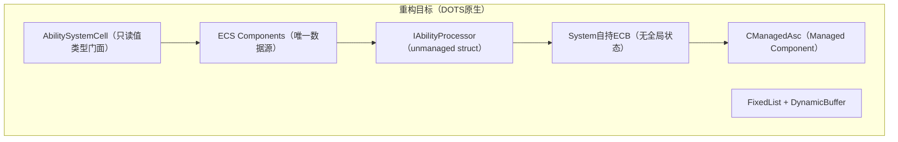

# EX-GAS 2.0 深度架构分析与 ECS/DOTS 重构方向

## 瘦身口径

> 已移除基于 2.0 旧状态的开头问题诊断和明显过时的旧状态对比；保留原始方案中仍可借鉴的设计章节、代码块、图示和实施思路。当前分支事实以 `../00-当前架构事实/README.md` 为准；当前任务路线以 `../02-主线任务树/README.md` 为准；目标态吸收关系以 `../01-目标态架构共识/README.md` 及各 Spec 的 `历史方案定位` 为准。

## 保留的目标态信号

- OOP 层退化为无状态用户 API 门面，ECS Component 才是 gameplay 状态源。
- 热路径 System 应逐步走 Burst/job-friendly；UnityEngine、Cue、GameObject binding 留在 presentation boundary。
- 命令写入与事件输出应使用 ECS request/event stream，不再恢复 Controller / Spec 字典主链。
- 静态配置最终应进入稳定的 definition carrier；prototype / Blob / Luban 的权威链需要先被压实。

## 原始目标态图示

---

## 当前折算

方案1作为早期 ECS-native 方向信号，主要支撑 P10C、P10H 与 P12；其中 `IAbilityProcessor`、`CManagedAsc`、`FixedList` 只保留为原始设计演进材料，不作为当前下一刀实现建议。
