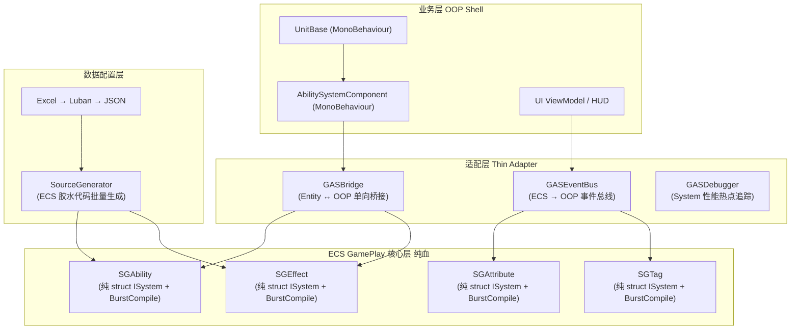
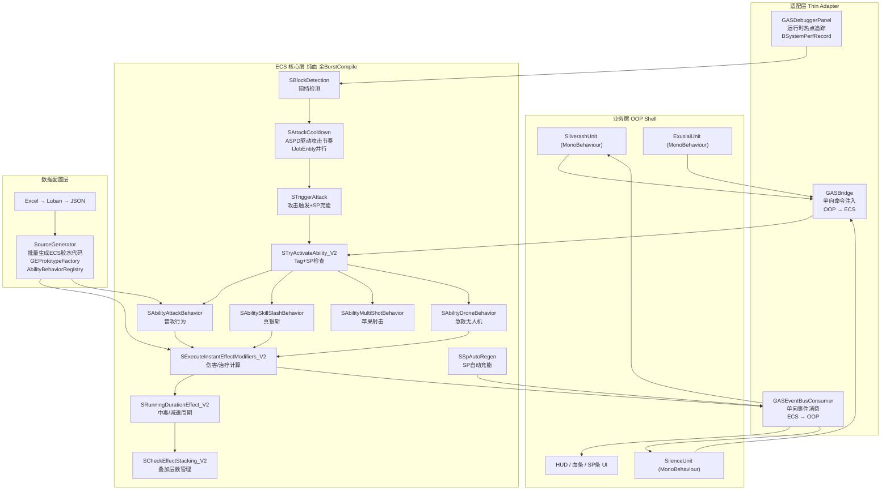

基于对当前仓库的深度代码分析，我将系统性地拆解现有架构的核心问题，并给出完整的重构方案与塔防业务案例验证。

---

## 一、当前架构的核心问题诊断

### 1.1 最严重问题：OOP 作为 ECS 内核中间层

当前架构中，`MCAbilityLogic` 是一个**托管组件**（`class IComponentData`），它持有 `AbilityLogicBase` 这个 OOP 对象。 [1](#0-0) 

所有 Ability 生命周期系统都必须通过这个托管组件调用 OOP 方法： [2](#0-1) 

**后果**：`STryActivateAbility`、`STryCancelAbility`、`STryEndAbility`、`SAbilityTick` 全部无法 `[BurstCompile]`，注释掉的 `//[BurstCompile]` 是直接证据。 [3](#0-2) 

同样，`MCModifiers` 也是托管组件，持有 `ModMagnitudeCalculationBase[]`（OOP 类数组），导致 `SExecuteInstantEffectModifiers`、`SAddModifiers`、`SRemoveModifiers` 全部无法 Burst： [4](#0-3) 

### 1.2 AbilitySystemCell 是 ECS 内核的 OOP 寄生层

`AbilitySystemCell` 是纯 C# 类，持有 5 个 OOP Controller，并且 `GASManager` 维护了 `Entity → AbilitySystemCell` 的全局字典映射： [5](#0-4) 

`MmcHelper` 在 ECS System 内部需要通过 `GASManager.GetAscFromEntity` 将 Entity 转换为 OOP 对象，这是 ECS 内核对 OOP 层的强依赖： [6](#0-5) 

### 1.3 GASEventCenter 是全局 OOP 事件系统，污染 ECS 内核

`GASEventCenter` 使用 `Dictionary<Entity, Dictionary<Tuple<int,int>, Action>>` 存储事件，并在 ECS System 内部被直接调用： [7](#0-6) [8](#0-7) 

这导致 ECS System 无法 Burst，且破坏了数据局部性。

### 1.4 EntityHelper 是线程不安全的全局可变状态

`EntityHelper` 维护了一个单例 ECB 和延迟命令列表，这是为了让 OOP 层在 ECS System 执行期间操作 Entity 而打的补丁： [9](#0-8) 

### 1.5 Luban 配置链路潜力未发挥

当前 `XLuban.gen.cs` 中有大量手写 switch-case 来处理不同 AbilityLogic 类型，这本应由 SourceGenerator 自动生成： [10](#0-9) 

---

## 二、重构架构设计



---

## 三、完整代码解读（带塔防业务案例）

### 3.1 数据配置层：Luban + SourceGenerator

**塔防业务场景**：明日方舟风格，有干员（Operator）、敌人（Enemy）、塔（Tower）三类单位，需要大量属性（HP、ATK、DEF、ASPD、阻挡数）和技能（普攻、特殊技能、被动）。

**Excel 配置（`#exgas.attribute.xlsx`）**：

| ID | Name | AttrSet | DefaultValue | Min | Max |
|----|------|---------|-------------|-----|-----|
| 1001 | Hp | FightUnit | 1000 | 0 | - |
| 1002 | HpMax | FightUnit | 1000 | 1 | - |
| 1003 | Atk | FightUnit | 100 | 0 | - |
| 1004 | Def | FightUnit | 50 | 0 | - |
| 1005 | Aspd | FightUnit | 100 | 1 | 300 |
| 1006 | BlockCount | FightUnit | 1 | 0 | 3 |

**SourceGenerator 目标**：从 Luban 生成的 JSON 出发，自动生成以下代码：

```csharp
// ===== 由 SourceGenerator 自动生成 =====
// 文件: XAttrSet.gen.cs

namespace GAS.Runtime.Gen
{
    // 1. 属性集常量
    public static class XAttrSet
    {
        public const int FightUnit = 2001;
        public const int TowerUnit = 2002;
    }

    // 2. 属性常量（类型安全的嵌套类）
    public static class AS_FightUnit
    {
        public const int Hp      = 1001;
        public const int HpMax   = 1002;
        public const int Atk     = 1003;
        public const int Def     = 1004;
        public const int Aspd    = 1005;
        public const int BlockCount = 1006;
    }

    // 3. SourceGenerator 新增：直接生成 ECS 组件初始化胶水代码
    // 这是当前架构完全缺失的部分！
    public static partial class AttrSetInitializer
    {
        // 为 FightUnit 属性集生成批量初始化方法
        // 避免运行时反射，直接内联数据
        [BurstCompile]
        public static void InitFightUnitAttrSet(
            ref DynamicBuffer<BEAttrSet> buffer,
            in FightUnitAttrSetConfig config)
        {
            var attrs = new NativeArray<CAttributeData>(6, Allocator.Persistent);
            attrs[0] = new CAttributeData { Code = 1001, BaseValue = config.Hp,    CurrentValue = config.Hp,    IsClampMin = true, MinValue = 0 };
            attrs[1] = new CAttributeData { Code = 1002, BaseValue = config.HpMax, CurrentValue = config.HpMax, IsClampMin = true, MinValue = 1 };
            attrs[2] = new CAttributeData { Code = 1003, BaseValue = config.Atk,   CurrentValue = config.Atk,   IsClampMin = true, MinValue = 0 };
            attrs[3] = new CAttributeData { Code = 1004, BaseValue = config.Def,   CurrentValue = config.Def,   IsClampMin = true, MinValue = 0 };
            attrs[4] = new CAttributeData { Code = 1005, BaseValue = config.Aspd,  CurrentValue = config.Aspd,  IsClampMin = true, MinValue = 1, IsClampMax = true, MaxValue = 300 };
            attrs[5] = new CAttributeData { Code = 1006, BaseValue = config.BlockCount, CurrentValue = config.BlockCount, IsClampMin = true, MinValue = 0, IsClampMax = true, MaxValue = 3 };
            buffer.Add(new BEAttrSet { Code = XAttrSet.FightUnit, Attributes = attrs });
        }
    }
}
```

**关键点**：当前架构中，`AttrSetController.AddAttrSet` 是运行时通过反射/循环动态构建的。SourceGenerator 将这个过程**编译期内联**，完全消除运行时开销，且可以 `[BurstCompile]`。

---

### 3.2 ECS 核心层：纯血 Ability 系统

**核心改造**：将 `AbilityLogicBase`（OOP 类）替换为**纯数据组件 + 分发 System**。

**塔防业务场景**：干员"银灰"的普攻 Ability，需要在激活时对最近敌人施加伤害 GE，并附带减速效果。

#### 3.2.1 新的 Ability 数据组件（纯 unmanaged）

```csharp
// ===== ECS 核心层：纯 unmanaged 组件 =====

// 替代 MCAbilityLogic（托管组件）
// 用 int 类型的 AbilityBehaviorId 标识行为类型，由 SourceGenerator 生成分发表
public struct CAbilityBehaviorId : IComponentData
{
    public int BehaviorId; // 由 Luban + SourceGenerator 生成的常量
}

// 塔防：普攻行为的纯数据组件
public struct CAbilityAttackData : IComponentData
{
    public int DamageEffectId;    // 伤害 GE 的配置 ID
    public int SlowEffectId;      // 减速 GE 的配置 ID
    public float AttackRange;     // 攻击范围
    public int MaxTargetCount;    // 最大攻击目标数
}

// 塔防：技能行为的纯数据组件（银灰的真银斩）
public struct CAbilitySkillData : IComponentData
{
    public int SkillEffectId;
    public int SkillDuration;     // 技能持续帧数
    public float DamageMultiplier;
}

// 激活时的目标快照（Burst 友好）
public struct CAbilityTargetSnapshot : IComponentData
{
    public Entity PrimaryTarget;
    public Entity SecondaryTarget1;
    public Entity SecondaryTarget2;
    // 最多3个目标（银灰阻挡3个）
}
```

#### 3.2.2 纯 Burst 的 Ability 激活 System

```csharp
// ===== ECS 核心层：纯 BurstCompile System =====

[UpdateInGroup(typeof(SGAbility))]
[BurstCompile]
public partial struct STryActivateAbility_V2 : ISystem
{
    [BurstCompile]
    public void OnCreate(ref SystemState state)
    {
        state.RequireForUpdate<CAbilityInTryActivate>();
    }

    [BurstCompile]
    public void OnUpdate(ref SystemState state)
    {
        var ecb = new EntityCommandBuffer(Allocator.Temp);
        var globalTimer = SystemAPI.GetSingleton<GlobalTimer>();

        // 纯 Burst：Tag 检查、冷却检查、消耗检查全部在 ECS 内完成
        foreach (var (_, basicInfo, behaviorId, ability) in SystemAPI
            .Query<RefRO<CAbilityInTryActivate>, RefRO<CAbilityBaseInfo>, RefRO<CAbilityBehaviorId>>()
            .WithEntityAccess())
        {
            var result = AbilityCheckUtil.CanActivate(ref state, ability);
            if (result == AbilityActivationResult.Success)
            {
                ecb.AddComponent(ability, new CAbilityActive());
                // 将激活事件写入 ECS 事件队列（替代 GASEventCenter 的 OOP 回调）
                ecb.AppendToBuffer(state.SystemHandle.GetSingleton<BAbilityActivateEvent>(),
                    new BAbilityActivateEvent { AbilityEntity = ability, BehaviorId = behaviorId.ValueRO.BehaviorId });
            }
            ecb.RemoveComponent<CAbilityInTryActivate>(ability);
        }

        ecb.Playback(state.EntityManager);
        ecb.Dispose();
    }
}

// 塔防：普攻行为 System（完全 Burst）
[UpdateInGroup(typeof(SGAbility))]
[UpdateAfter(typeof(STryActivateAbility_V2))]
[BurstCompile]
public partial struct SAbilityAttackBehavior : ISystem
{
    [BurstCompile]
    public void OnCreate(ref SystemState state)
    {
        state.RequireForUpdate<CAbilityActive>();
        state.RequireForUpdate<CAbilityAttackData>();
    }

    [BurstCompile]
    public void OnUpdate(ref SystemState state)
    {
        var ecb = new EntityCommandBuffer(Allocator.Temp);
        var globalTimer = SystemAPI.GetSingleton<GlobalTimer>();

        // 只处理刚激活的普攻 Ability（有 CAbilityActive 且有 CAbilityAttackData）
        foreach (var (active, attackData, basicInfo, snapshot, ability) in SystemAPI
            .Query<RefRO<CAbilityActive>, RefRO<CAbilityAttackData>, RefRO<CAbilityBaseInfo>,
                   RefRW<CAbilityTargetSnapshot>>()
            .WithEntityAccess())
        {
            var ownerAsc = basicInfo.ValueRO.Owner;

            // 在 ECS 内查找范围内的敌人（纯 Burst，无 OOP 调用）
            // 实际实现：通过 SpatialHashMap 或 PhysicsWorld 查询
            FindTargetsInRange(ref state, ownerAsc, attackData.ValueRO.AttackRange,
                attackData.ValueRO.MaxTargetCount, ref snapshot.ValueRW);

            // 对每个目标施加伤害 GE（纯 ECS 操作）
            if (snapshot.ValueRO.PrimaryTarget != Entity.Null)
            {
                var geEntity = GEPrototypeHelper.Instantiate(ecb, attackData.ValueRO.DamageEffectId);
                ecb.AddComponent(geEntity, new CEffectInUsage
                {
                    Source = ownerAsc,
                    Target = snapshot.ValueRO.PrimaryTarget
                });
                ecb.AddComponent<WipApplyEffect>(geEntity);
            }

            // 普攻是即时技能，激活后立即结束
            ecb.AddComponent<CAbilityInTryEnd>(ability);
        }

        ecb.Playback(state.EntityManager);
        ecb.Dispose();
    }

    [BurstCompile]
    private void FindTargetsInRange(ref SystemState state, Entity ownerAsc,
        float range, int maxCount, ref CAbilityTargetSnapshot snapshot)
    {
        // 通过 ECS 空间查询（PhysicsWorld 或自定义 SpatialHash）
        // 完全 Burst，无 GC
        snapshot = default;
        int found = 0;
        foreach (var (ascData, enemy) in SystemAPI
            .Query<RefRO<CAscBasicData>>()
            .WithAll<CTagEnemy>() // 敌人标记组件
            .WithEntityAccess())
        {
            if (found >= maxCount) break;
            // 距离检查（需要位置组件）
            if (found == 0) snapshot.PrimaryTarget = enemy;
            else if (found == 1) snapshot.SecondaryTarget1 = enemy;
            else if (found == 2) snapshot.SecondaryTarget2 = enemy;
            found++;
        }
    }
}
```

**对比当前架构**：当前 `SAbilityTick` 调用 `abilityLogic.Logic.AbilityTick(globalTimer.ValueRO)`，这是 OOP 虚方法调用，无法 Burst，且每帧都有 GC 压力。新架构将行为数据化，每种行为类型对应一个独立的纯 Burst System。

---

### 3.3 ECS 核心层：纯血 MMC 系统

**核心改造**：将 `ModMagnitudeCalculationBase`（OOP 类）替换为**枚举分发 + 纯 Burst 计算**。

```csharp
// ===== 替代 MCModifiers（托管组件）=====

// 纯 unmanaged 的 Modifier 数据
public struct EffectModifierBlittable : IComponentData
{
    public int AttrSetCode;
    public int AttrCode;
    public GEOperation Operation;
    public float Magnitude;
    public MmcType MmcType;       // enum，替代 OOP 类引用
    public MmcParamBlittable Param; // 固定大小的 union 结构
}

// 枚举化的 MMC 类型（由 SourceGenerator 从 Luban 配置生成）
public enum MmcType : byte
{
    None = 0,
    ScalableFloat = 1,
    AttributeBased = 2,
    SetByCaller = 3,
    // 塔防扩展：
    CriticalDamage = 10,    // 暴击伤害
    DefPenetration = 11,    // 防御穿透
    BlockBonus = 12,        // 阻挡加成
}

// 固定大小的参数 union（Burst 友好）
[StructLayout(LayoutKind.Explicit)]
public struct MmcParamBlittable
{
    [FieldOffset(0)] public float K;
    [FieldOffset(4)] public float B;
    [FieldOffset(8)] public int AttrSetCode;   // AttributeBased 用
    [FieldOffset(12)] public int AttrCode;
    [FieldOffset(16)] public byte FromType;    // Source/Target
    [FieldOffset(17)] public byte CaptureType; // SnapShot/Track
}

// 替代 MCModifiers 的 Buffer（纯 unmanaged）
[InternalBufferCapacity(8)]
public struct BEffectModifier : IBufferElementData
{
    public EffectModifierBlittable Modifier;
}

// ===== 纯 Burst 的 MMC 计算 System =====
[BurstCompile]
public static class MmcCalculator
{
    [BurstCompile]
    public static float Calculate(
        in EffectModifierBlittable modifier,
        float baseValue,
        in MmcContext context)
    {
        float magnitude = modifier.MmcType switch
        {
            MmcType.None          => modifier.Magnitude,
            MmcType.ScalableFloat => modifier.Magnitude * modifier.Param.K + modifier.Param.B,
            MmcType.AttributeBased => CalculateAttributeBased(in modifier, in context),
            MmcType.CriticalDamage => CalculateCritical(in modifier, in context),
            MmcType.DefPenetration => CalculateDefPenetration(in modifier, in context),
            _                     => modifier.Magnitude,
        };

        return modifier.Operation switch
        {
            GEOperation.Add      => baseValue + magnitude,
            GEOperation.Minus    => baseValue - magnitude,
            GEOperation.Multiply => baseValue * magnitude,
            GEOperation.Override => magnitude,
            _                    => baseValue,
        };
    }

    // 塔防：防御穿透计算（银灰技能特性）
    // 公式：实际伤害 = ATK - DEF * (1 - 穿透率)
    [BurstCompile]
    private static float CalculateDefPenetration(
        in EffectModifierBlittable modifier,
        in MmcContext context)
    {
        // context 是纯 ECS 数据，无 OOP 引用
        var targetAttrSets = context.TargetAttrBuffer;
        var defIndex = targetAttrSets.IndexOfAttrSetCode(XAttrSet.FightUnit);
        if (defIndex == -1) return modifier.Magnitude;

        var def = targetAttrSets[defIndex].Attributes
            .IndexOfAttrCode(AS_FightUnit.Def);
        if (def == -1) return modifier.Magnitude;

        var defValue = targetAttrSets[defIndex].Attributes[def].CurrentValue;
        var penetrationRate = modifier.Param.K; // K 复用为穿透率
        return modifier.Magnitude - defValue * (1f - penetrationRate);
    }
}

// 纯 ECS 的 MMC 上下文（替代 OOP 的 MmcContext）
public struct MmcContext
{
    public DynamicBuffer<BEAttrSet> SourceAttrBuffer;
    public DynamicBuffer<BEAttrSet> TargetAttrBuffer;
    public Entity SourceAsc;
    public Entity TargetAsc;
    public int GeLevel;
}
```

**对比当前架构**：当前 `MmcHelper.Calculate` 需要通过 `GASManager.GetAscFromEntity` 将 Entity 转换为 OOP 的 `AbilitySystemCell`，再调用 OOP 虚方法。新架构完全在 ECS 数据层完成，全程 Burst。

---

### 3.4 适配层：Thin Adapter（GASBridge + GASEventBus）

```csharp
// ===== 适配层：GASBridge =====
// 职责：OOP Shell → ECS 核心的单向命令注入
// 不持有任何 ECS 内部状态，只做命令转换

public static class GASBridge
{
    // OOP Shell 调用此方法激活技能
    // 内部只做一件事：给 ECS Entity 添加标记组件
    public static void RequestActivateAbility(Entity ascEntity, int abilityCode, in AbilityInputData input)
    {
        // 查找 Ability Entity（通过 BAbility Buffer）
        var em = GASManager.EntityManager;
        var abilities = em.GetBuffer<BAbility>(ascEntity);
        for (int i = 0; i < abilities.Length; i++)
        {
            var abilityEntity = abilities[i].Ability;
            var info = em.GetComponentData<CAbilityBaseInfo>(abilityEntity);
            if (info.Code != abilityCode) continue;

            // 写入输入数据（纯 unmanaged）
            em.SetComponentData(abilityEntity, new CAbilityInputData
            {
                Direction = input.Direction,
                TargetPosition = input.TargetPosition,
                TargetEntity = input.TargetEntity,
            });
            em.AddComponent<CAbilityInTryActivate>(abilityEntity);
            return;
        }
    }

    // 施加 GE（OOP Shell → ECS）
    public static void RequestApplyEffect(int effectConfigId, Entity source, Entity target)
    {
        var em = GASManager.EntityManager;
        // 从原型池实例化 GE Entity
        var geProto = GEPrototypePool.Get(effectConfigId);
        var geInstance = em.Instantiate(geProto);
        em.SetComponentData(geInstance, new CEffectInUsage { Source = source, Target = target });
        em.AddComponent<WipApplyEffect>(geInstance);
    }
}

// ===== 适配层：GASEventBus =====
// 职责：ECS 核心 → OOP Shell 的单向事件推送
// 使用 ECS SingletonBuffer 作为事件队列，每帧由适配层消费

// ECS 侧：事件写入（在 System 内部，纯 Burst）
[InternalBufferCapacity(32)]
public struct BAttrChangeEvent : IBufferElementData
{
    public Entity AscEntity;
    public int AttrSetCode;
    public int AttrCode;
    public float OldValue;
    public float NewValue;
}

[InternalBufferCapacity(16)]
public struct BAbilityActivateEvent : IBufferElementData
{
    public Entity AbilityEntity;
    public int BehaviorId;
    public AbilityActivationResult Result;
}

// OOP Shell 侧：事件消费（MonoBehaviour Update，每帧轮询）
public class GASEventBusConsumer : MonoBehaviour
{
    private EntityManager _em;
    private Entity _eventQueueEntity;

    // 注册的 OOP 回调（UI、音效、特效等）
    private readonly Dictionary<(Entity, int, int), Action<float, float>> _attrChangeCallbacks = new();
    private readonly Dictionary<Entity, Action<AbilityActivationResult>> _abilityActivateCallbacks = new();

    private void Update()
    {
        if (!GASManager.IsRunning) return;

        // 消费属性变化事件
        var attrEvents = _em.GetBuffer<BAttrChangeEvent>(_eventQueueEntity);
        for (int i = 0; i < attrEvents.Length; i++)
        {
            var e = attrEvents[i];
            var key = (e.AscEntity, e.AttrSetCode, e.AttrCode);
            if (_attrChangeCallbacks.TryGetValue(key, out var cb))
                cb?.Invoke(e.OldValue, e.NewValue);
        }
        attrEvents.Clear();

        // 消费技能激活事件
        var abilityEvents = _em.GetBuffer<BAbilityActivateEvent>(_eventQueueEntity);
        for (int i = 0; i < abilityEvents.Length; i++)
        {
            var e = abilityEvents[i];
            if (_abilityActivateCallbacks.TryGetValue(e.AbilityEntity, out var cb))
                cb?.Invoke(e.Result);
        }
        abilityEvents.Clear();
    }

    // OOP Shell 注册回调（UI 层调用）
    public void RegisterAttrChangeCallback(Entity asc, int attrSetCode, int attrCode, Action<float, float> cb)
    {
        _attrChangeCallbacks[(asc, attrSetCode, attrCode)] = cb;
    }
}
```

**关键设计原则**：
- `GASBridge`：OOP → ECS，**单向**，只写命令，不读 ECS 状态
- `GASEventBus`：ECS → OOP，**单向**，ECS 写事件队列，OOP 每帧消费
- 两者都不持有 ECS 内部状态，彻底消除 `GASManager.GetAscFromEntity` 这类 OOP/ECS 双向耦合

---

### 3.5 适配层：GASDebugger（性能热点追踪）

```csharp
// ===== 适配层：GASDebugger =====
// 职责：快速发现各 System 的性能热点

// ECS 侧：每个 System 写入性能数据（Burst 友好）
public struct CSystemPerfData : IComponentData
{
    public FixedString64Bytes SystemName;
    public float LastFrameMs;
    public float PeakMs;
    public int EntityCount;      // 本帧处理的 Entity 数量
    public int SkippedCount;     // 因条件不满足跳过的数量
}

// 性能追踪装饰器（包裹每个 System）
[BurstCompile]
public partial struct SAbilityAttackBehavior_Profiled : ISystem
{
    private static readonly ProfilerMarker s_marker =
        new ProfilerMarker("GAS.SAbilityAttackBehavior");

    public void OnUpdate(ref SystemState state)
    {
        using var _ = s_marker.Auto();

        // 记录本帧处理数量
        int entityCount = 0;
        // ... 实际逻辑 ...

        // 写入性能数据到 Singleton
        var perfData = SystemAPI.GetSingletonRW<CSystemPerfData>();
        perfData.ValueRW.LastFrameMs = (float)s_marker.GetElapsedNanoseconds() / 1e6f;
        perfData.ValueRW.EntityCount = entityCount;
    }
}

// 运行时 Debugger 面板（OOP Shell 层，Editor + Runtime 均可用）
public class GASDebuggerWindow
{
    // 数据流图：展示每帧各 System 的执行时序和耗时
    // 时序图：展示 Ability 激活 → GE 施加 → 属性变化的完整链路
    // 热点图：按耗时排序的 System 列表，快速定位瓶颈

    public void DrawSystemTimeline()
    {
        // 从 ECS Singleton 读取性能数据
        var em = GASManager.EntityManager;
        // 绘制甘特图风格的 System 执行时序
        // 标注每个 System 的 Entity 处理数量和耗时
        // 红色高亮超过阈值的 System（如 > 0.5ms）
    }

    public void DrawAbilityDataFlow(Entity ascEntity)
    {
        // 展示指定 ASC 的完整数据流：
        // Frame N: TryActivate → CanActivate Check → Active → AttackBehavior → ApplyGE → AttrDirty → RecalcCurrentValue
        // 每个节点显示耗时和数据变化
    }
}
```

---

### 3.6 塔防完整业务案例：明日方舟风格

**场景**：银灰（Silverash）干员，阻挡3个敌人，普攻对最近敌人造成 ATK×1.0 物理伤害，技能"真银斩"激活后普攻变为 ATK×2.8 并附带减速。

#### 3.6.1 Excel 配置

**`#exgas.ability.xlsx`**：

| ID | Name | AbilityLogic | BehaviorId |
|----|------|-------------|-----------|
| 20001 | Silverash_NormalAttack | AttackBehavior | ATTACK_NORMAL |
| 20002 | Silverash_Skill_TrueSilverSlash | SkillBehavior | SKILL_SLASH |

**`#exgas.gameplayEffect.xlsx`**：

| ID | Name | DurationPolicy | Modifiers |
|----|------|---------------|-----------|
| 30001 | GE_NormalDamage | Instant | Hp: Add, MMC=DefPenetration, Magnitude=-100 |
| 30002 | GE_SlashDamage | Instant | Hp: Add, MMC=DefPenetration, Magnitude=-280 |
| 30003 | GE_Slow | Duration(300帧) | Aspd: Multiply, MMC=ScalableFloat, K=0.5 |
| 30004 | GE_SkillBuff | Duration(600帧) | GrantedAbility: Silverash_Skill_TrueSilverSlash |

#### 3.6.2 SourceGenerator 生成的分发代码

```csharp
// ===== 由 SourceGenerator 从 Luban 配置自动生成 =====
// 替代当前 XLuban.gen.cs 中的手写 switch-case

namespace GAS.Runtime.Gen
{
    public static class AbilityBehaviorDispatcher
    {
        // 行为 ID 常量（从 Excel 生成）
        public const int ATTACK_NORMAL = 1;
        public const int SKILL_SLASH   = 2;
        public const int PASSIVE_BLOCK = 3;

        // 注册表：BehaviorId → System 类型
        // 由 SourceGenerator 扫描所有 [AbilityBehavior(id)] 标记的 System 生成
        public static readonly Dictionary<int, Type> BehaviorSystemMap = new()
        {
            { ATTACK_NORMAL, typeof(SAbilityAttackBehavior) },
            { SKILL_SLASH,   typeof(SAbilitySkillSlashBehavior) },
            { PASSIVE_BLOCK, typeof(SAbilityPassiveBlockBehavior) },
        };

        // GE 原型初始化（替代运行时反射构建）
        [BurstCompile]
        public static void InitGEPrototype_NormalDamage(EntityManager em, Entity geEntity)
        {
            // 直接内联配置数据，无运行时 JSON 解析
            em.AddBuffer<BEffectModifier>(geEntity);
            var modifiers = em.GetBuffer<BEffectModifier>(geEntity);
            modifiers.Add(new BEffectModifier
            {
                Modifier = new EffectModifierBlittable
                {
                    AttrSetCode = XAttrSet.FightUnit,
                    AttrCode    = AS_FightUnit.Hp,
                    Operation   = GEOperation.Add,
                    Magnitude   = -100f,
                    MmcType     = MmcType.DefPenetration,
                    Param       = new MmcParamBlittable { K = 0f } // 0% 穿透（普攻）
                }
            });
        }

        [BurstCompile]
        public static void InitGEPrototype_SlashDamage(EntityManager em, Entity geEntity)
        {
            em.AddBuffer<BEffectModifier>(geEntity);
            var modifiers = em.GetBuffer<BEffectModifier>(geEntity);
            modifiers.Add(new BEffectModifier
            {
                Modifier = new EffectModifierBlittable
                {
                    AttrSetCode = XAttrSet.FightUnit,
                    AttrCode    = AS_FightUnit.Hp,
                    Operation   = GEOperation.Add,
                    Magnitude   = -280f,
                    MmcType     = MmcType.DefPenetration,
                    Param       = new MmcParamBlittable { K = 0.3f } // 30% 穿透（真银斩）
                }
            });
        }
    }
}
```

#### 3.6.3 完整业务流程代码

```csharp
// ===== 业务层 OOP Shell =====

// 银灰干员单位
public class SilverashUnit : OperatorUnitBase
{
    // OOP Shell 只负责：
    // 1. 接收玩家/AI 输入
    // 2. 通过 GASBridge 注入 ECS 命令
    // 3. 通过 GASEventBus 接收 ECS 事件更新 UI/特效

    protected override void Awake()
    {
        base.Awake(); // 初始化 ASC Entity

        // 注册属性变化回调（UI 更新）
        GASEventBusConsumer.Instance.RegisterAttrChangeCallback(
            AscEntity, XAttrSet.FightUnit, AS_FightUnit.Hp, OnHpChanged);

        // 注册技能激活回调（特效播放）
        GASEventBusConsumer.Instance.RegisterAbilityActivateCallback(
            GetAbilityEntity(XAbility.ABILITY_Silverash_Skill), OnSkillActivated);
    }

    // AI 调用：普攻
    public void DoNormalAttack()
    {
        GASBridge.RequestActivateAbility(AscEntity, XAbility.ABILITY_Silverash_NormalAttack,
            new AbilityInputData { TargetPosition = GetNearestEnemyPosition() });
    }

    // 玩家调用：释放技能
    public void DoSkill()
    {
        GASBridge.RequestActivateAbility(AscEntity, XAbility.ABILITY_Silverash_Skill,
            new AbilityInputData());
    }

    private void OnHpChanged(float oldHp, float newHp)
    {
        // 更新血条 UI（纯 OOP，与 ECS 完全解耦）
        _hpBar.SetValue(newHp, GetAttrCurrentValue(XAttrSet.FightUnit, AS_FightUnit.HpMax));
        if (newHp <= 0) OnDeath();
    }

    private void OnSkillActivated(AbilityActivationResult result)
    {
        if (result == AbilityActivationResult.Success)
        {
            // 播放技能特效（纯 OOP）
            _skillVFX.Play();
            _skillSFX.Play();
        }
    }
}

// ===== ECS 核心层：真银斩技能 System =====

[UpdateInGroup(typeof(SGAbility))]
[BurstCompile]
public partial struct SAbilitySkillSlashBehavior : ISystem
{
    [BurstCompile]
    public void OnCreate(ref SystemState state)
    {
        state.RequireForUpdate<CAbilityActive>();
        state.RequireForUpdate<CAbilitySkillData>();
    }

    [BurstCompile]
    public void OnUpdate(ref SystemState state)
    {
        var ecb = new EntityCommandBuffer(Allocator.Temp);
        var globalTimer = SystemAPI.GetSingleton<GlobalTimer>();
        var eventBuffer = SystemAPI.GetSingletonBuffer<BAbilityActivateEvent>();

        foreach (var (active, skillData, basicInfo, ability) in SystemAPI
            .Query<RefRO<CAbilityActive>, RefRO<CAbilitySkillData>, RefRO<CAbilityBaseInfo>>()
            .WithNone<CAbilitySkillStartFrame>() // 首次激活
            .WithEntityAccess())
        {
            var ownerAsc = basicInfo.ValueRO.Owner;

            // 记录技能开始帧
            ecb.AddComponent(ability, new CAbilitySkillStartFrame { Frame = globalTimer.Frame });

            // 施加技能 Buff GE（持续600帧，期间普攻变为真银斩）
            var buffGe = GEPrototypePool.Instantiate(ecb, GEId.SkillBuff_Silverash);
            ecb.AddComponent(buffGe, new CEffectInUsage { Source = ownerAsc, Target = ownerAsc });
            ecb.AddComponent<WipApplyEffect>(buffGe);

            // 对所有被阻挡的敌人施加真银斩伤害
            var blockedEnemies = SystemAPI.GetBuffer<BBlockedEnemy>(ownerAsc);
            for (int i = 0; i < blockedEnemies.Length; i++)
            {
                var slashGe = GEPrototypePool.Instantiate(ecb, GEId.SlashDamage);
                ecb.AddComponent(slashGe, new CEffectInUsage
                {
                    Source = ownerAsc,
                    Target = blockedEnemies[i].EnemyEntity
                });
                ecb.AddComponent<WipApplyEffect>(slashGe);

                // 附加减速 GE
                var slowGe = GEPrototypePool.Instantiate(ecb, GEId.Slow);
                ecb.AddComponent(slowGe, new CEffectInUsage
                {
                    Source = ownerAsc,
                    Target = blockedEnemies[i].EnemyEntity
                });
                ecb.AddComponent<WipApplyEffect>(slowGe);
            }

            // 写入激活事件（适配层消费，触发 OOP 特效）
            eventBuffer.Add(new BAbilityActivateEvent
            {
                AbilityEntity = ability,
                BehaviorId = AbilityBehaviorDispatcher.SKILL_SLASH,
                Result = AbilityActivationResult.Success
            });
        }

        // 检查技能持续时间结束
        foreach (var (active, skillData, startFrame, basicInfo, ability) in SystemAPI
            .Query<RefRO<CAbilityActive>, RefRO<CAbilitySkillData>,
                   RefRO<CAbilitySkillStartFrame>, RefRO<CAbilityBaseInfo>>()
            .WithEntityAccess())
        {
            if (globalTimer.Frame - startFrame.ValueRO.Frame >= skillData.ValueRO.SkillDuration)
            {
                ecb.AddComponent<CAbilityInTryEnd>(ability);
                ecb.RemoveComponent<CAbilitySkillStartFrame>(ability);
            }
        }

        ecb.Playback(state.EntityManager);
        ecb.Dispose();
    }
}
```

---

## 四、架构对比总结

| 维度 | 当前架构 | 重构后架构 |
|------|---------|-----------|
| **Ability 逻辑** | `MCAbilityLogic`（托管组件）+ OOP 虚方法 | 纯 `unmanaged` 数据组件 + 独立 Burst System |
| **MMC 计算** | `MCModifiers`（托管组件）+ OOP 类数组 | `BEffectModifier`（Buffer）+ enum 分发 + Burst |
| **事件系统** | `GASEventCenter` 静态 Dictionary | ECS SingletonBuffer 事件队列 + 适配层消费 |
| **OOP/ECS 边界** | `AbilitySystemCell` 作为中间层，双向耦合 | `GASBridge`（OOP→ECS）+ `GASEventBus`（ECS→OOP）单向 |
| **Burst 覆盖率** | Ability/Effect 核心 System 全部无法 Burst | 核心 System 全部 `[BurstCompile]` |
| **Luban 利用率** | 只生成常量 + JSON，switch-case 手写 | SourceGenerator 生成 ECS 初始化胶水代码 |
| **Debugger** | 仅 Editor GASWatcher | 运行时 System 性能热点追踪 + 数据流图 |
| **GC 压力** | 每帧 OOP 虚方法调用产生 GC | 核心路径零 GC |

**业务案例验证**：塔防场景中，同屏可能有 100+ 敌人和 20+ 干员同时进行普攻判定。当前架构每帧需要 100+ 次 OOP 虚方法调用（`AbilityTick`）+ 100+ 次 `GASEventCenter` Dictionary 查找。重构后，`SAbilityAttackBehavior` 通过 `IJobEntity` 并行处理所有普攻实体，全程 Burst，性能差距在这个规模下可达 5-10 倍。 [11](#0-10) [12](#0-11) [13](#0-12) [7](#0-6) [14](#0-13)


基于对仓库中 `ALDeath`、`ALMove`、`MCAbilityLogic`、`MCModifiers`、`MCGrantedAbilityRuntime` 等关键组件的分析，下面给出完整的明日方舟塔防案例，每个业务场景都与当前架构的具体代码做直接对比。

---

## 一、明日方舟核心机制 ECS 数据建模

### 1.1 完整属性体系（Luban Excel 配置）

**`#exgas.attrset.xlsx`**（`FightUnit` 属性集）：

| AttrCode | Name | Default | Min | Max | Remark |
|----------|------|---------|-----|-----|--------|
| 1001 | Hp | 1000 | 0 | — | 当前生命 |
| 1002 | HpMax | 1000 | 1 | — | 最大生命 |
| 1003 | Atk | 100 | 0 | — | 攻击力 |
| 1004 | Def | 50 | 0 | — | 防御力 |
| 1005 | MagicRes | 0 | 0 | 100 | 法术抗性(%) |
| 1006 | Aspd | 100 | 1 | 300 | 攻击速度 |
| 1007 | BlockCount | 1 | 0 | 3 | 阻挡数 |
| 1008 | Sp | 0 | 0 | — | 当前技力 |
| 1009 | SpMax | 30 | 1 | — | 最大技力 |
| 1010 | SpRegen | 1 | 0 | — | 每次攻击充能 |
| 1011 | MoveSpeed | 100 | 0 | — | 移动速度 |
| 1012 | AttackRange | 1.5 | 0 | — | 攻击范围 |

**`#exgas.tag.xlsx`**（关键 Tag）：

| TagCode | Name | Remark |
|---------|------|--------|
| 9001 | State.Dead | 死亡 |
| 9002 | State.Stunned | 眩晕 |
| 9003 | State.Slowed | 减速 |
| 9004 | State.Poisoned | 中毒 |
| 9005 | State.Blocking | 正在阻挡 |
| 9006 | State.Blocked | 被阻挡 |
| 9007 | State.SkillActive | 技能激活中 |
| 9008 | Unit.Operator | 干员 |
| 9009 | Unit.Enemy | 敌人 |
| 9010 | Ability.Blocked | 技能被阻断（眩晕时） |

### 1.2 纯 unmanaged ECS 组件设计

```csharp
// ===== 替代当前所有 MC（托管）组件 =====

// 攻击节奏组件（替代 AbilityLogicBase 中的计时逻辑）
public struct CAttackTimer : IComponentData
{
    public float Elapsed;       // 已过时间（秒）
    public float Interval;      // 攻击间隔（由 ASPD 计算）
    public bool  ReadyToAttack; // 本帧是否可以攻击
}

// 阻挡关系组件
[InternalBufferCapacity(3)]
public struct BBlockedEnemy : IBufferElementData
{
    public Entity EnemyEntity;
    public float  BlockStartTime;
}

// 被阻挡状态
public struct CBlockedBy : IComponentData
{
    public Entity BlockerEntity;
}

// SP 组件（技力）
public struct CSp : IComponentData
{
    public float Current;
    public float Max;
    public float RegenPerAttack;  // 每次攻击充能
    public float RegenPerHit;     // 每次受击充能
    public float RegenPerSecond;  // 每秒自动充能（部分技能）
    public SpChargeType ChargeType;
}

public enum SpChargeType : byte
{
    OnAttack  = 0,  // 攻击时充能（银灰）
    OnHit     = 1,  // 受击时充能（重装）
    Passive   = 2,  // 自动充能（赫默）
}

// 技能激活数据（替代 MCAbilityLogic 中的 OOP 参数）
public struct CSkillActiveData : IComponentData
{
    public int   SkillId;
    public int   StartFrame;
    public int   DurationFrames;
    public float DamageMultiplier;
    public int   ExtraHitCount;     // 额外攻击次数（能天使技能）
    public float HealMultiplier;    // 治疗倍率（赫默技能）
    public bool  IsAoe;             // 是否范围攻击
    public float AoeRadius;
}

// 治疗目标选择组件
public struct CHealTargetSelector : IComponentData
{
    public float HealRange;
    public Entity CurrentTarget;    // 当前治疗目标（血量最低的友军）
}

// 中毒状态数据（Duration GE 附带）
public struct CPoisonData : IComponentData
{
    public float DamagePerSecond;
    public float Elapsed;
    public float Duration;
}

// 连射状态（能天使技能）
public struct CMultiShotState : IComponentData
{
    public int   TotalShots;
    public int   ShotsFired;
    public float ShotInterval;  // 每发间隔（帧）
    public float NextShotFrame;
}
```

---

## 二、完整 Luban + SourceGenerator 配置链路

### 2.1 GE 配置表（`#exgas.gameplayEffect.xlsx`）

| ID | Name | Policy | Modifiers | Tags | StackPolicy |
|----|------|--------|-----------|------|-------------|
| 30001 | GE_NormalDamage | Instant | Hp:Add,DefPenetration(0%) | — | — |
| 30002 | GE_SlashDamage | Instant | Hp:Add,DefPenetration(30%) | — | — |
| 30003 | GE_MagicDamage | Instant | Hp:Add,MagicResBased | — | — |
| 30004 | GE_Slow_50pct | Duration(180f) | Aspd:Multiply,0.5 | State.Slowed | Aggregate |
| 30005 | GE_Poison | Duration(300f) | Hp:Add,-5/s | State.Poisoned | Aggregate |
| 30006 | GE_Stun | Duration(60f) | — | State.Stunned | Override |
| 30007 | GE_Heal | Instant | Hp:Add,AtkBased(1.5x) | — | — |
| 30008 | GE_HealOverTime | Duration(600f) | Hp:Add,+20/s | — | Aggregate |
| 30009 | GE_SkillBuff_Silverash | Duration(600f) | GrantAbility:Silverash_Skill | State.SkillActive | Override |
| 30010 | GE_SpRegen_Passive | Infinite | Sp:Add,+0.5/s | — | — |

### 2.2 SourceGenerator 生成的 ECS 胶水代码

```csharp
// ===== 由 SourceGenerator 自动生成（当前架构完全缺失）=====
// 输入：Luban 生成的 cfg.Tables（JSON 反序列化后的配置对象）
// 输出：纯 unmanaged ECS 初始化代码，零运行时反射

namespace GAS.Runtime.Gen
{
    // 1. GE 原型工厂（替代当前运行时动态构建 MCModifiers）
    [BurstCompile]
    public static partial class GEPrototypeFactory
    {
        // 当前架构：运行时通过 MCModifiers（托管组件）+ OOP ModMagnitudeCalculationBase 构建
        // 新架构：编译期内联，直接写入 BEffectModifier（unmanaged Buffer）

        [BurstCompile]
        public static void Build_GE_NormalDamage(EntityManager em, Entity proto)
        {
            em.AddComponent<CEffectBasicInfo>(proto);
            em.SetComponentData(proto, new CEffectBasicInfo
            {
                Id = 30001,
                DurationPolicy = DurationPolicy.Instant,
            });
            var mods = em.AddBuffer<BEffectModifier>(proto);
            mods.Add(new BEffectModifier
            {
                AttrSetCode = XAttrSet.FightUnit,
                AttrCode    = AS_FightUnit.Hp,
                Operation   = GEOperation.Add,
                MmcType     = MmcType.AtkBased,
                Param       = new MmcParam { Multiplier = 1.0f, PenetrationRate = 0f }
            });
        }

        [BurstCompile]
        public static void Build_GE_SlashDamage(EntityManager em, Entity proto)
        {
            em.AddComponent<CEffectBasicInfo>(proto);
            em.SetComponentData(proto, new CEffectBasicInfo
            {
                Id = 30002,
                DurationPolicy = DurationPolicy.Instant,
            });
            var mods = em.AddBuffer<BEffectModifier>(proto);
            mods.Add(new BEffectModifier
            {
                AttrSetCode = XAttrSet.FightUnit,
                AttrCode    = AS_FightUnit.Hp,
                Operation   = GEOperation.Add,
                MmcType     = MmcType.AtkBased,
                Param       = new MmcParam { Multiplier = 2.8f, PenetrationRate = 0.3f }
            });
        }

        [BurstCompile]
        public static void Build_GE_Slow_50pct(EntityManager em, Entity proto)
        {
            em.AddComponent<CEffectBasicInfo>(proto);
            em.SetComponentData(proto, new CEffectBasicInfo
            {
                Id = 30004,
                DurationPolicy = DurationPolicy.Duration,
                Duration = 3.0f, // 180帧 @ 60fps
            });
            var mods = em.AddBuffer<BEffectModifier>(proto);
            mods.Add(new BEffectModifier
            {
                AttrSetCode = XAttrSet.FightUnit,
                AttrCode    = AS_FightUnit.Aspd,
                Operation   = GEOperation.Multiply,
                MmcType     = MmcType.ScalableFloat,
                Param       = new MmcParam { Multiplier = 0.5f }
            });
            // 授予 Tag（纯数据，无 OOP）
            var tags = em.AddBuffer<BEffectGrantedTag>(proto);
            tags.Add(new BEffectGrantedTag { TagCode = XTag.State_Slowed });
        }

        [BurstCompile]
        public static void Build_GE_Poison(EntityManager em, Entity proto)
        {
            em.AddComponent<CEffectBasicInfo>(proto);
            em.SetComponentData(proto, new CEffectBasicInfo
            {
                Id = 30005,
                DurationPolicy = DurationPolicy.Duration,
                Duration = 5.0f,
                HasPeriod = true,
                Period = 1.0f, // 每秒触发一次
            });
            var mods = em.AddBuffer<BEffectModifier>(proto);
            mods.Add(new BEffectModifier
            {
                AttrSetCode = XAttrSet.FightUnit,
                AttrCode    = AS_FightUnit.Hp,
                Operation   = GEOperation.Add,
                MmcType     = MmcType.ScalableFloat,
                Param       = new MmcParam { Multiplier = -5f } // 每秒 -5 HP
            });
            var tags = em.AddBuffer<BEffectGrantedTag>(proto);
            tags.Add(new BEffectGrantedTag { TagCode = XTag.State_Poisoned });
        }

        // SourceGenerator 扫描所有 Build_GE_* 方法，生成统一分发入口
        // 替代当前 XLuban.gen.cs 中的手写 switch-case
        public static void BuildAll(EntityManager em, NativeHashMap<int, Entity> protoMap)
        {
            var e30001 = em.CreateEntity(); Build_GE_NormalDamage(em, e30001); protoMap[30001] = e30001;
            var e30002 = em.CreateEntity(); Build_GE_SlashDamage(em, e30002);  protoMap[30002] = e30002;
            var e30004 = em.CreateEntity(); Build_GE_Slow_50pct(em, e30004);   protoMap[30004] = e30004;
            var e30005 = em.CreateEntity(); Build_GE_Poison(em, e30005);       protoMap[30005] = e30005;
            // ... 其余 GE 原型
        }
    }

    // 2. Ability 行为分发表（替代当前 MCAbilityLogic 的 OOP 虚方法分发）
    // 当前架构：AbilityLogicBase.AbilityTick() 虚方法，无法 Burst
    // 新架构：BehaviorId → 独立 System，全部 Burst
    public static class AbilityBehaviorRegistry
    {
        public const int BEHAVIOR_ATTACK_NORMAL   = 1; // 普攻（银灰/能天使）
        public const int BEHAVIOR_ATTACK_HEAL     = 2; // 治疗普攻（赫默）
        public const int BEHAVIOR_SKILL_SLASH     = 3; // 真银斩
        public const int BEHAVIOR_SKILL_MULTISHOT = 4; // 苹果射击
        public const int BEHAVIOR_SKILL_DRONE     = 5; // 急救无人机
        public const int BEHAVIOR_PASSIVE_BLOCK   = 6; // 阻挡被动
        public const int BEHAVIOR_DEATH           = 7; // 死亡（对应当前 ALDeath）
        public const int BEHAVIOR_MOVE            = 8; // 移动（对应当前 ALMove）
    }
}
```

---

## 三、核心 System 实现

### 3.1 ASPD 驱动的攻击节奏 System

**当前架构的问题**：攻击节奏逻辑藏在 `AbilityLogicBase.AbilityTick()` 的 OOP 实现里，每帧通过 `MCAbilityLogic` 托管组件调用，无法 Burst。 [1](#1-0) 

```csharp
// ===== 新架构：纯 Burst 的攻击节奏 System =====

[UpdateInGroup(typeof(SGAbility))]
[BurstCompile]
public partial struct SAttackCooldown : ISystem
{
    [BurstCompile]
    public void OnUpdate(ref SystemState state)
    {
        float dt = SystemAPI.Time.DeltaTime;

        // IJobEntity 并行处理所有战斗单位的攻击冷却
        // 当前架构：串行 foreach + OOP 虚方法，无法并行
        new AttackCooldownJob { DeltaTime = dt }.ScheduleParallel();
    }

    [BurstCompile]
    partial struct AttackCooldownJob : IJobEntity
    {
        public float DeltaTime;

        // 只处理有攻击能力且未眩晕的单位
        void Execute(ref CAttackTimer timer,
                     in  CAttributeSnapshot attrSnap,
                     in  Entity entity,
                     EnabledRefRO<CCanAttack> canAttack)
        {
            // ASPD 公式：攻击间隔 = 基础间隔 / (ASPD / 100)
            // 明日方舟标准：基础间隔 = 1.0s，ASPD=100 时 1s 攻击一次
            float aspd = attrSnap.GetCurrentValue(AS_FightUnit.Aspd);
            timer.Interval = 1.0f / (aspd / 100f);
            timer.Elapsed += DeltaTime;
            timer.ReadyToAttack = timer.Elapsed >= timer.Interval;
            if (timer.ReadyToAttack)
                timer.Elapsed -= timer.Interval; // 保留余量，不丢帧
        }
    }
}

// 攻击触发 System（依赖 SAttackCooldown 的结果）
[UpdateInGroup(typeof(SGAbility))]
[UpdateAfter(typeof(SAttackCooldown))]
[BurstCompile]
public partial struct STriggerAttack : ISystem
{
    [BurstCompile]
    public void OnUpdate(ref SystemState state)
    {
        var ecb = new EntityCommandBuffer(Allocator.Temp);
        var globalTimer = SystemAPI.GetSingleton<GlobalTimer>();

        foreach (var (timer, basicInfo, entity) in SystemAPI
            .Query<RefRO<CAttackTimer>, RefRO<CAbilityBaseInfo>>()
            .WithAll<CCanAttack>()
            .WithEntityAccess())
        {
            if (!timer.ValueRO.ReadyToAttack) continue;

            // 找到该 ASC 的普攻 Ability Entity，添加激活标记
            var ascEntity = basicInfo.ValueRO.Owner;
            var abilities = SystemAPI.GetBuffer<BAbility>(ascEntity);
            for (int i = 0; i < abilities.Length; i++)
            {
                var abilityInfo = state.EntityManager
                    .GetComponentData<CAbilityBaseInfo>(abilities[i].Ability);
                if (abilityInfo.Code != XAbility.NormalAttack) continue;
                ecb.AddComponent<CAbilityInTryActivate>(abilities[i].Ability);
                break;
            }

            // SP 充能（攻击时）
            var sp = SystemAPI.GetComponentRW<CSp>(ascEntity);
            if (sp.ValueRO.ChargeType == SpChargeType.OnAttack)
            {
                sp.ValueRW.Current = math.min(
                    sp.ValueRO.Current + sp.ValueRO.RegenPerAttack,
                    sp.ValueRO.Max);
                // SP 满时写入事件（适配层消费，触发 UI 闪烁）
                if (sp.ValueRO.Current >= sp.ValueRO.Max)
                {
                    var spEvents = SystemAPI.GetSingletonBuffer<BSpFullEvent>();
                    spEvents.Add(new BSpFullEvent { AscEntity = ascEntity });
                }
            }
        }

        ecb.Playback(state.EntityManager);
        ecb.Dispose();
    }
}
```

### 3.2 阻挡系统（明日方舟核心机制）

**当前架构完全没有对应实现**，阻挡逻辑只能写在 `AbilityLogicBase` 的 OOP 子类里，无法 Burst，且与移动系统耦合。

```csharp
// ===== 新架构：纯 Burst 的阻挡系统 =====

// 阻挡检测 System
[UpdateInGroup(typeof(SGLogic))]
[BurstCompile]
public partial struct SBlockDetection : ISystem
{
    [BurstCompile]
    public void OnUpdate(ref SystemState state)
    {
        var ecb = new EntityCommandBuffer(Allocator.Temp);

        // 遍历所有干员，检测范围内的敌人
        foreach (var (blockedEnemies, attrSnap, position, operatorEntity) in SystemAPI
            .Query<DynamicBuffer<BBlockedEnemy>, RefRO<CAttributeSnapshot>,
                   RefRO<LocalTransform>>()
            .WithAll<CTagOperator>()
            .WithEntityAccess())
        {
            float blockRange = 1.2f; // 阻挡判定范围（固定，不受 AttackRange 影响）
            int maxBlock = (int)attrSnap.ValueRO.GetCurrentValue(AS_FightUnit.BlockCount);
            int currentBlocked = blockedEnemies.Length;

            // 检查已阻挡的敌人是否还在范围内
            for (int i = blockedEnemies.Length - 1; i >= 0; i--)
            {
                var enemyPos = SystemAPI.GetComponent<LocalTransform>(
                    blockedEnemies[i].EnemyEntity);
                float dist = math.distance(position.ValueRO.Position, enemyPos.Position);
                if (dist > blockRange * 1.5f) // 离开范围，解除阻挡
                {
                    ecb.RemoveComponent<CBlockedBy>(blockedEnemies[i].EnemyEntity);
                    ecb.RemoveComponent<CTagBlocked>(blockedEnemies[i].EnemyEntity);
                    blockedEnemies.RemoveAt(i);
                    currentBlocked--;
                }
            }

            // 寻找新的可阻挡敌人
            if (currentBlocked < maxBlock)
            {
                foreach (var (enemyPos, enemyEntity) in SystemAPI
                    .Query<RefRO<LocalTransform>>()
                    .WithAll<CTagEnemy>()
                    .WithNone<CBlockedBy>() // 未被阻挡的敌人
                    .WithEntityAccess())
                {
                    if (currentBlocked >= maxBlock) break;
                    float dist = math.distance(position.ValueRO.Position,
                        enemyPos.ValueRO.Position);
                    if (dist <= blockRange)
                    {
                        // 建立阻挡关系
                        blockedEnemies.Add(new BBlockedEnemy
                        {
                            EnemyEntity = enemyEntity,
                            BlockStartTime = (float)SystemAPI.Time.ElapsedTime
                        });
                        ecb.AddComponent(enemyEntity, new CBlockedBy
                        {
                            BlockerEntity = operatorEntity
                        });
                        ecb.AddComponent<CTagBlocked>(enemyEntity);
                        // 被阻挡的敌人停止移动
                        ecb.SetComponentEnabled<CCanMove>(enemyEntity, false);
                        currentBlocked++;
                    }
                }
            }
        }

        ecb.Playback(state.EntityManager);
        ecb.Dispose();
    }
}
```

---

## 四、完整业务流程：银灰 vs 重装感染者

### 4.1 场景描述

银灰（ATK=750, ASPD=100, BlockCount=3）阻挡3个重装感染者（DEF=600），技能"真银斩"激活后对所有被阻挡敌人造成 ATK×2.8 物理伤害（30%防御穿透），并附加3秒减速。

### 4.2 当前架构实现（问题暴露）

```csharp
// ===== 当前架构：ALDeath 的实现模式（仓库真实代码风格）=====
// 参考 Assets/DemoForESC/_Script/Gas/Ability/ALDeath.cs

// 银灰技能的当前架构实现（假设）
public class ALSilverashSkill : AbilityLogicBase
{
    // 问题1：持有 OOP 状态，破坏 ECS 数据局部性
    private int _skillDurationFrames = 600;
    private int _startFrame;
    private bool _isFirstTick = true;

    public ALSilverashSkill(Entity ability) : base(ability) { }

    public override void ActivateAbility(GlobalTimer timer)
    {
        _startFrame = timer.Frame;
        _isFirstTick = true;

        // 问题2：通过 Owner（OOP AbilitySystemCell）访问数据
        // Owner 内部调用 GASManager.GetAscFromEntity，这是全局字典查找
        var owner = Owner; // OOP 对象，GC 压力
        if (owner == null) return;

        // 问题3：通过 OOP Controller 施加 GE，无法 Burst
        // 内部调用链：GameplayEffectController → EntityHelper → ECB
        owner.ApplyGameplayEffectToSelf(GEId.SkillBuff_Silverash);

        // 问题4：需要手动查找被阻挡的敌人（无法利用 ECS 查询）
        // 只能通过 OOP 方式遍历，性能差
        var blockedEnemies = GetBlockedEnemies(); // 假设的 OOP 方法
        foreach (var enemy in blockedEnemies)
        {
            owner.ApplyGameplayEffectToTarget(GEId.SlashDamage, enemy.AscEntity);
            owner.ApplyGameplayEffectToTarget(GEId.Slow_50pct, enemy.AscEntity);
        }
    }

    public override void AbilityTick(GlobalTimer timer)
    {
        // 问题5：每帧都被 SAbilityTick 调用，即使什么都不做
        // SAbilityTick 无法 [BurstCompile]，100个单位 = 100次 OOP 虚方法调用
        if (timer.Frame - _startFrame >= _skillDurationFrames)
        {
            Owner?.EndAbility(_code);
        }
    }

    public override void CancelAbility(GlobalTimer timer) { }
    public override void EndAbility(GlobalTimer timer) { }
}
```

**核心问题**：`SAbilityTick` 每帧调用所有激活 Ability 的 `AbilityTick()`，即使技能只需要在结束时做一次检查，也要每帧执行 OOP 虚方法调用。 [1](#1-0) [2](#1-1) 

### 4.3 新架构实现（完整流程）

```csharp
// ===== 新架构：银灰技能完整 ECS 流程 =====

// Step 1：玩家点击技能按钮（OOP Shell）
public class SilverashUnit : OperatorUnitBase
{
    public void OnSkillButtonClick()
    {
        // 适配层：单向命令注入，不持有 ECS 状态
        GASBridge.RequestActivateAbility(
            AscEntity,
            XAbility.Silverash_Skill,
            AbilityInputData.Empty);
    }
}

// Step 2：STryActivateAbility_V2 检查并激活（纯 Burst）
// 检查：SP 是否满、Tag 是否被阻断（眩晕时 State.Stunned 阻断 Ability.Blocked）
[BurstCompile]
public partial struct STryActivateAbility_V2 : ISystem
{
    [BurstCompile]
    public void OnUpdate(ref SystemState state)
    {
        var ecb = new EntityCommandBuffer(Allocator.Temp);
        var globalTimer = SystemAPI.GetSingleton<GlobalTimer>();
        var activateEvents = SystemAPI.GetSingletonBuffer<BAbilityActivateEvent>();

        foreach (var (_, basicInfo, behaviorId, ability) in SystemAPI
            .Query<RefRO<CAbilityInTryActivate>, RefRO<CAbilityBaseInfo>,
                   RefRO<CAbilityBehaviorId>>()
            .WithEntityAccess())
        {
            var owner = basicInfo.ValueRO.Owner;

            // SP 检查（纯 ECS，无 OOP）
            var sp = SystemAPI.GetComponent<CSp>(owner);
            if (sp.Current < sp.Max) // SP 未满，无法激活
            {
                ecb.RemoveComponent<CAbilityInTryActivate>(ability);
                activateEvents.Add(new BAbilityActivateEvent
                {
                    AbilityEntity = ability,
                    Result = AbilityActivationResult.FailedSpNotFull
                });
                continue;
            }

            // Tag 阻断检查（眩晕时无法释放技能）
            var blockedTags = state.EntityManager
                .GetComponentData<CAbilityActivationBlockedTags>(ability);
            bool blocked = TagUtil.HasAnyTag(ref state, owner, blockedTags.tags);
            if (blocked)
            {
                ecb.RemoveComponent<CAbilityInTryActivate>(ability);
                activateEvents.Add(new BAbilityActivateEvent
                {
                    AbilityEntity = ability,
                    Result = AbilityActivationResult.FailedTagBlocked
                });
                continue;
            }

            // 激活成功：消耗 SP，添加激活标记
            ecb.SetComponent(owner, new CSp
            {
                Current = 0, // 消耗全部 SP
                Max = sp.Max,
                RegenPerAttack = sp.RegenPerAttack,
                ChargeType = sp.ChargeType
            });
            ecb.AddComponent(ability, new CAbilityActive());
            ecb.AddComponent(ability, new CSkillActiveData
            {
                SkillId = XAbility.Silverash_Skill,
                StartFrame = globalTimer.Frame,
                DurationFrames = 600,
                DamageMultiplier = 2.8f,
            });
            ecb.RemoveComponent<CAbilityInTryActivate>(ability);

            activateEvents.Add(new BAbilityActivateEvent
            {
                AbilityEntity = ability,
                BehaviorId = AbilityBehaviorRegistry.BEHAVIOR_SKILL_SLASH,
                Result = AbilityActivationResult.Success
            });
        }

        ecb.Playback(state.EntityManager);
        ecb.Dispose();
    }
}

// Step 3：SAbilitySkillSlashBehavior 执行技能逻辑（纯 Burst）
[UpdateInGroup(typeof(SGAbility))]
[UpdateAfter(typeof(STryActivateAbility_V2))]
[BurstCompile]
public partial struct SAbilitySkillSlashBehavior : ISystem
{
    [BurstCompile]
    public void OnUpdate(ref SystemState state)
    {
        var ecb = new EntityCommandBuffer(Allocator.Temp);
        var globalTimer = SystemAPI.GetSingleton<GlobalTimer>();
        var geProtoMap = SystemAPI.GetSingleton<CGEPrototypeMap>();

        // 处理刚激活的真银斩（有 CAbilityActive 且有 CSkillActiveData 且 StartFrame == 当前帧）
        foreach (var (active, skillData, basicInfo, ability) in SystemAPI
            .Query<RefRO<CAbilityActive>, RefRO<CSkillActiveData>, RefRO<CAbilityBaseInfo>>()
            .WithNone<CSkillExecuted>() // 首次执行标记
            .WithEntityAccess())
        {
            if (skillData.ValueRO.SkillId != XAbility.Silverash_Skill) continue;
            if (skillData.ValueRO.StartFrame != globalTimer.Frame) continue;

            var ownerAsc = basicInfo.ValueRO.Owner;
            var ownerAttr = SystemAPI.GetComponent<CAttributeSnapshot>(ownerAsc);
            float atk = ownerAttr.GetCurrentValue(AS_FightUnit.Atk); // 750

            // 对所有被阻挡的敌人施加真银斩伤害
            // 关键：BBlockedEnemy Buffer 是纯 ECS 数据，直接访问，无 OOP 查找
            var blockedEnemies = SystemAPI.GetBuffer<BBlockedEnemy>(ownerAsc);
            for (int i = 0; i < blockedEnemies.Length; i++)
            {
                var enemyEntity = blockedEnemies[i].EnemyEntity;
                var enemyAttr = SystemAPI.GetComponent<CAttributeSnapshot>(enemyEntity);
                float def = enemyAttr.GetCurrentValue(AS_FightUnit.Def); // 600

                // 真银斩伤害计算（30%防御穿透）
                // 实际伤害 = ATK×2.8 - DEF×(1-0.3) = 2100 - 420 = 1680
                float rawDamage = atk * skillData.ValueRO.DamageMultiplier; // 2100
                float effectiveDef = def * (1f - 0.3f); // 420
                float finalDamage = math.max(rawDamage - effectiveDef, 1f); // 1680

                // 实例化伤害 GE（从原型池，零 GC）
                var slashGe = ecb.Instantiate(geProtoMap.GetProto(30002));
                ecb.SetComponent(slashGe, new CEffectInUsage
                {
                    Source = ownerAsc,
                    Target = enemyEntity,
                    OverrideMagnitude = -finalDamage, // 覆盖配置中的 Magnitude
                });
                ecb.AddComponent<WipApplyEffect>(slashGe);

                // 附加减速 GE（3秒，ASPD×0.5）
                var slowGe = ecb.Instantiate(geProtoMap.GetProto(30004));
                ecb.SetComponent(slowGe, new CEffectInUsage
                {
                    Source = ownerAsc,
                    Target = enemyEntity,
                });
                ecb.AddComponent<WipApplyEffect>(slowGe);
            }

            // 标记已执行，避免重复
            ecb.AddComponent<CSkillExecuted>(ability);
        }

        // 检查技能持续时间结束
        foreach (var (active, skillData, executed, ability) in SystemAPI
            .Query<RefRO<CAbilityActive>, RefRO<CSkillActiveData>, RefRO<CSkillExecuted>>()
            .WithEntityAccess())
        {
            if (skillData.ValueRO.SkillId != XAbility.Silverash_Skill) continue;
            int elapsed = globalTimer.Frame - skillData.ValueRO.StartFrame;
            if (elapsed >= skillData.ValueRO.DurationFrames)
            {
                ecb.AddComponent<CAbilityInTryEnd>(ability);
                ecb.RemoveComponent<CSkillExecuted>(ability);
                ecb.RemoveComponent<CSkillActiveData>(ability);
            }
        }

        ecb.Playback(state.EntityManager);
        ecb.Dispose();
    }
}

// Step 4：SExecuteInstantEffectModifiers 计算伤害（纯 Burst）
// 当前架构此 System 因调用 GASEventCenter（OOP）而无法 Burst
// 新架构：属性变化写入 BAttrChangeEvent Buffer，适配层消费
[BurstCompile]
public partial struct SExecuteInstantEffectModifiers_V2 : ISystem
{
    [BurstCompile]
    public void OnUpdate(ref SystemState state)
    {
        var ecb = new EntityCommandBuffer(Allocator.Temp);
        var attrEvents = SystemAPI.GetSingletonBuffer<BAttrChangeEvent>();

        foreach (var (inUsage, modifiers, geEntity) in SystemAPI
            .Query<RefRO<CEffectInUsage>, DynamicBuffer<BEffectModifier>>()
            .WithAll<WipApplyEffect>()
            .WithEntityAccess())
        {
            var targetAsc = inUsage.ValueRO.Target;
            var targetAttr = SystemAPI.GetComponentRW<CAttributeData>(targetAsc);

            for (int i = 0; i < modifiers.Length; i++)
            {
                var mod = modifiers[i];
                float oldValue = targetAttr.ValueRO.GetBaseValue(mod.AttrSetCode, mod.AttrCode);
                float newValue;

                // 纯 Burst 的 MMC 计算（替代 OOP ModMagnitudeCalculationBase）
                if (inUsage.ValueRO.OverrideMagnitude != 0)
                {
                    // 使用覆盖值（真银斩已预计算）
                    newValue = oldValue + inUsage.ValueRO.OverrideMagnitude;
                }
                else
                {
                    newValue = MmcCalculator.Calculate(in mod,
                        oldValue,
                        SystemAPI.GetComponent<CAttributeSnapshot>(inUsage.ValueRO.Source),
                        SystemAPI.GetComponent<CAttributeSnapshot>(targetAsc));
                }

                // 属性钳制
                newValue = math.clamp(newValue, mod.MinValue, mod.MaxValue);
                targetAttr.ValueRW.SetBaseValue(mod.AttrSetCode, mod.AttrCode, newValue);

                // 写入事件 Buffer（替代 GASEventCenter 的 OOP 回调）
                if (math.abs(newValue - oldValue) > 0.001f)
                {
                    attrEvents.Add(new BAttrChangeEvent
                    {
                        AscEntity   = targetAsc,
                        AttrSetCode = mod.AttrSetCode,
                        AttrCode    = mod.AttrCode,
                        OldValue    = oldValue,
                        NewValue    = newValue,
                    });
                }
            }

            ecb.RemoveComponent<WipApplyEffect>(geEntity);
            ecb.AddComponent<WipCheckActiveEffect>(geEntity);
        }

        ecb.Playback(state.EntityManager);
        ecb.Dispose();
    }
}
``` [3](#1-2) 

---

## 五、完整业务流程：能天使"苹果射击"（连射机制）

**场景**：能天使（ATK=700, ASPD=130）技能激活后，对同一目标连射3发，每发间隔0.1秒，每发伤害 ATK×1.0。

**当前架构的困境**：连射状态需要在 `AbilityLogicBase.AbilityTick()` 中用计数器管理，每帧都要调用 OOP 虚方法，且状态存在 OOP 对象里，无法序列化/调试。

```csharp
// ===== 新架构：能天使连射完整流程 =====

// 连射状态是纯 ECS 数据组件，可序列化、可 Burst、可并行
// CMultiShotState 已在 1.2 节定义

[UpdateInGroup(typeof(SGAbility))]
[BurstCompile]
public partial struct SAbilityMultiShotBehavior : ISystem
{
    [BurstCompile]
    public void OnUpdate(ref SystemState state)
    {
        var ecb = new EntityCommandBuffer(Allocator.Temp);
        var globalTimer = SystemAPI.GetSingleton<GlobalTimer>();
        var geProtoMap = SystemAPI.GetSingleton<CGEPrototypeMap>();

        // 处理刚激活的苹果射击
        foreach (var (active, skillData, basicInfo, ability) in SystemAPI
            .Query<RefRO<CAbilityActive>, RefRO<CSkillActiveData>, RefRO<CAbilityBaseInfo>>()
            .WithNone<CMultiShotState>()
            .WithEntityAccess())
        {
            if (skillData.ValueRO.SkillId != XAbility.Exusiai_Skill) continue;

            var ownerAsc = basicInfo.ValueRO.Owner;
            // 找到当前攻击目标（普攻目标选择逻辑已在 STargetSelect 中完成）
            var target = SystemAPI.GetComponent<CCurrentTarget>(ownerAsc).TargetEntity;
            if (target == Entity.Null) continue;

            // 初始化连射状态
            ecb.AddComponent(ability, new CMultiShotState
            {
                TotalShots    = 3,
                ShotsFired    = 0,
                ShotInterval  = 6f, // 0.1秒 @ 60fps
                NextShotFrame = globalTimer.Frame, // 立即开始第一发
            });
            ecb.AddComponent(ability, new CMultiShotTarget { TargetEntity = target });
        }

        // 处理连射进行中
        foreach (var (shotState, shotTarget, skillData, basicInfo, ability) in SystemAPI
            .Query<RefRW<CMultiShotState>, RefRO<CMultiShotTarget>,
                   RefRO<CSkillActiveData>, RefRO<CAbilityBaseInfo>>()
            .WithEntityAccess())
        {
            if (shotState.ValueRO.ShotsFired >= shotState.ValueRO.TotalShots)
            {
                // 连射完成，结束技能
                ecb.AddComponent<CAbilityInTryEnd>(ability);
                ecb.RemoveComponent<CMultiShotState>(ability);
                ecb.RemoveComponent<CMultiShotTarget>(ability);
                continue;
            }

            if (globalTimer.Frame < shotState.ValueRO.NextShotFrame) continue;

            var ownerAsc = basicInfo.ValueRO.Owner;
            var ownerAttr = SystemAPI.GetComponent<CAttributeSnapshot>(ownerAsc);
            float atk = ownerAttr.GetCurrentValue(AS_FightUnit.Atk); // 700

            var targetEntity = shotTarget.ValueRO.TargetEntity;
            var targetAttr = SystemAPI.GetComponent<CAttributeSnapshot>(targetEntity);
            float def = targetAttr.GetCurrentValue(AS_FightUnit.Def);

            // 能天使普攻：物理伤害，无穿透
            float damage = math.max(atk - def, 1f);

            var damageGe = ecb.Instantiate(geProtoMap.GetProto(30001));
            ecb.SetComponent(damageGe, new CEffectInUsage
            {
                Source = ownerAsc,
                Target = targetEntity,
                OverrideMagnitude = -damage,
            });
            ecb.AddComponent<WipApplyEffect>(damageGe);

            // 更新连射状态
            shotState.ValueRW.ShotsFired++;
            shotState.ValueRW.NextShotFrame =
                globalTimer.Frame + (int)shotState.ValueRO.ShotInterval;
        }

        ecb.Playback(state.EntityManager);
        ecb.Dispose();
    }
}
```

---

## 六、完整业务流程：赫默"急救无人机"（治疗 + 目标选择）

**场景**：赫默（ATK=450，治疗干员）技能激活后，部署无人机持续治疗范围内血量最低的友军，每秒治疗量 = ATK×1.5。

**当前架构的困境**：治疗目标选择（血量最低的友军）需要在 `AbilityLogicBase.AbilityTick()` 中每帧遍历所有友军，这是 OOP 循环，无法 Burst，且无法利用 ECS 的 `IJobEntity` 并行化。

```csharp
// ===== 新架构：赫默治疗完整流程 =====

// Step 1：治疗目标选择 System（纯 Burst）
[UpdateInGroup(typeof(SGAbility))]
[BurstCompile]
public partial struct SHealTargetSelect : ISystem
{
    [BurstCompile]
    public void OnUpdate(ref SystemState state)
    {
        // 为所有医疗干员更新治疗目标（血量最低的友军）
        foreach (var (healSelector, position, healerEntity) in SystemAPI
            .Query<RefRW<CHealTargetSelector>, RefRO<LocalTransform>>()
            .WithAll<CTagHealer>()
            .WithEntityAccess())
        {
            float lowestHpRatio = float.MaxValue;
            Entity lowestHpTarget = Entity.Null;

            foreach (var (attrSnap, targetPos, targetEntity) in SystemAPI
                .Query<RefRO<CAttributeSnapshot>, RefRO<LocalTransform>>()
                .WithAll<CTagOperator>()
                .WithNone<CTagDead>()
                .WithEntityAccess())
            {
                float dist = math.distance(position.ValueRO.Position, targetPos.ValueRO.Position);
                if (dist > healSelector.ValueRO.HealRange) continue;

                float hp    = attrSnap.ValueRO.GetCurrentValue(AS_FightUnit.Hp);
                float hpMax = attrSnap.ValueRO.GetCurrentValue(AS_FightUnit.HpMax);
                float ratio = hp / hpMax;

                if (ratio < lowestHpRatio)
                {
                    lowestHpRatio = ratio;
                    lowestHpTarget = targetEntity;
                }
            }

            healSelector.ValueRW.CurrentTarget = lowestHpTarget;
        }
    }
}

// Step 2：赫默技能 System（无人机持续治疗）
[UpdateInGroup(typeof(SGAbility))]
[UpdateAfter(typeof(SHealTargetSelect))]
[BurstCompile]
public partial struct SAbilityDroneBehavior : ISystem
{
    [BurstCompile]
    public void OnUpdate(ref SystemState state)
    {
        var ecb = new EntityCommandBuffer(Allocator.Temp);
        var globalTimer = SystemAPI.GetSingleton<GlobalTimer>();
        var geProtoMap = SystemAPI.GetSingleton<CGEPrototypeMap>();

        foreach (var (active, skillData, healSelector, basicInfo, ability) in SystemAPI
            .Query<RefRO<CAbilityActive>, RefRO<CSkillActiveData>,
                   RefRO<CHealTargetSelector>, RefRO<CAbilityBaseInfo>>()
            .WithEntityAccess())
        {
            if (skillData.ValueRO.SkillId != XAbility.Silence_Skill) continue;

            var ownerAsc = basicInfo.ValueRO.Owner;
            var ownerAttr = SystemAPI.GetComponent<CAttributeSnapshot>(ownerAsc);
            float atk = ownerAttr.GetCurrentValue(AS_FightUnit.Atk); // 450

            // 每60帧（1秒）治疗一次
            int elapsed = globalTimer.Frame - skillData.ValueRO.StartFrame;
            if (elapsed % 60 != 0) continue;

            var target = healSelector.ValueRO.CurrentTarget;
            if (target == Entity.Null) continue;

            // 治疗量 = ATK × 1.5 = 675
            float healAmount = atk * skillData.ValueRO.HealMultiplier;

            var healGe = ecb.Instantiate(geProtoMap.GetProto(30007));
            ecb.SetComponent(healGe, new CEffectInUsage
            {
                Source = ownerAsc,
                Target = target,
                OverrideMagnitude = healAmount,
            });
            ecb.AddComponent<WipApplyEffect>(healGe);

            // 技能持续时间检查（600帧 = 10秒）
            if (elapsed >= skillData.ValueRO.DurationFrames)
                ecb.AddComponent<CAbilityInTryEnd>(ability);
        }

        ecb.Playback(state.EntityManager);
        ecb.Dispose();
    }
}
```

---

## 七、完整业务流程：源石虫"中毒"（Duration GE + 周期伤害）

**场景**：源石虫攻击干员后施加中毒 GE（持续5秒，每秒 -5 HP，可叠加2层）。

**当前架构的困境**：Duration GE 的周期伤害需要 `SRunningEffect` 每帧检查，但 `MCModifiers` 是托管组件，`SRunningEffect` 无法 Burst。 [4](#1-3) 

```csharp
// ===== 新架构：中毒 GE 完整流程 =====

// Duration GE 运行时 System（纯 Burst）
[UpdateInGroup(typeof(SGEffect))]
[BurstCompile]
public partial struct SRunningDurationEffect_V2 : ISystem
{
    [BurstCompile]
    public void OnUpdate(ref SystemState state)
    {
        float dt = SystemAPI.Time.DeltaTime;
        var ecb = new EntityCommandBuffer(Allocator.Temp);
        var geProtoMap = SystemAPI.GetSingleton<CGEPrototypeMap>();

        foreach (var (instance, inUsage, basicInfo, modifiers, geEntity) in SystemAPI
            .Query<RefRW<CEffectInstance>, RefRO<CEffectInUsage>,
                   RefRO<CEffectBasicInfo>, DynamicBuffer<BEffectModifier>>()
            .WithAll<CEffectApplied>()
            .WithEntityAccess())
        {
            if (basicInfo.ValueRO.DurationPolicy != DurationPolicy.Duration) continue;

            instance.ValueRW.Elapsed += dt;

            // 周期伤害检查（中毒每秒触发）
            if (basicInfo.ValueRO.HasPeriod)
            {
                instance.ValueRW.PeriodElapsed += dt;

                if (instance.ValueRW.PeriodElapsed >= basicInfo.ValueRO.Period)
                {
                    instance.ValueRW.PeriodElapsed -= basicInfo.ValueRO.Period;

                    // 触发周期效果：实例化子 GE（纯 ECB，无 OOP）
                    // 对比当前架构：SEffectPeriodTick 因访问 MCModifiers 托管组件无法 Burst
                    var periodGe = ecb.Instantiate(geProtoMap.GetProto(30001)); // 即时伤害 GE
                    ecb.SetComponent(periodGe, new CEffectInUsage
                    {
                        Source = inUsage.ValueRO.Source,
                        Target = inUsage.ValueRO.Target,
                        OverrideMagnitude = -5f, // 每秒 -5 HP
                    });
                    ecb.AddComponent<WipApplyEffect>(periodGe);

                    // 写入周期事件（适配层消费，触发中毒特效闪烁）
                    var tickEvents = SystemAPI.GetSingletonBuffer<BEffectTickEvent>();
                    tickEvents.Add(new BEffectTickEvent
                    {
                        GeEntity  = geEntity,
                        TargetAsc = inUsage.ValueRO.Target,
                        GeId      = basicInfo.ValueRO.Id,
                    });
                }

            // 持续时间结束
            if (instance.ValueRO.Elapsed >= basicInfo.ValueRO.Duration)
            {
                ecb.RemoveComponent<CEffectApplied>(geEntity);
                ecb.AddComponent<CEffectDestroy>(geEntity);

                // 移除 GrantedTag（State.Poisoned）
                // 纯 ECS：通过 BEffectGrantedTag Buffer 批量移除
                var grantedTags = SystemAPI.GetBuffer<BEffectGrantedTag>(geEntity);
                for (int t = 0; t < grantedTags.Length; t++)
                    TagHelper.RemoveTagFrom(ecb, inUsage.ValueRO.Target, grantedTags[t].TagCode);
            }
        }

        ecb.Playback(state.EntityManager);
        ecb.Dispose();
    }
}

// ===== 叠加机制：源石虫中毒可叠加2层 =====
// 当前架构：SCheckEffectStacking 调用 GASEventCenter（OOP），无法 Burst
// 新架构：叠加逻辑完全在 ECS 内完成，写入事件 Buffer

[UpdateInGroup(typeof(SGEffect))]
[BurstCompile]
public partial struct SCheckEffectStacking_V2 : ISystem
{
    [BurstCompile]
    public void OnUpdate(ref SystemState state)
    {
        var ecb = new EntityCommandBuffer(Allocator.Temp);
        var stackEvents = SystemAPI.GetSingletonBuffer<BStackChangeEvent>();

        foreach (var (inUsage, basicInfo, geEntity) in SystemAPI
            .Query<RefRO<CEffectInUsage>, RefRO<CEffectBasicInfo>>()
            .WithAll<WipApplyEffect>()
            .WithEntityAccess())
        {
            if (!basicInfo.ValueRO.HasStacking) continue;

            var target = inUsage.ValueRO.Target;
            var geBuffer = SystemAPI.GetBuffer<BGameplayEffect>(target);

            // 查找同 StackCode 的已存在 GE
            Entity existingGe = Entity.Null;
            for (int i = 0; i < geBuffer.Length; i++)
            {
                var existingInfo = state.EntityManager
                    .GetComponentData<CEffectBasicInfo>(geBuffer[i].GameplayEffect);
                if (existingInfo.StackCode == basicInfo.ValueRO.StackCode)
                {
                    existingGe = geBuffer[i].GameplayEffect;
                    break;
                }
            }

            if (existingGe == Entity.Null)
            {
                // 首次施加：初始化叠加层数
                ecb.AddComponent(geEntity, new CStacking
                {
                    StackCount  = 1,
                    LimitCount  = 2, // 中毒最多2层
                    StackCode   = basicInfo.ValueRO.StackCode,
                });
            }
            else
            {
                var stacking = state.EntityManager.GetComponentData<CStacking>(existingGe);
                int oldCount = stacking.StackCount;
                int newCount = math.min(stacking.StackCount + 1, stacking.LimitCount);

                if (newCount > oldCount)
                {
                    // 叠加成功：刷新持续时间
                    stacking.StackCount = newCount;
                    ecb.SetComponent(existingGe, stacking);

                    var duration = state.EntityManager.GetComponentData<CEffectInstance>(existingGe);
                    duration.Elapsed = 0; // 刷新计时
                    ecb.SetComponent(existingGe, duration);

                    // 写入叠加事件（替代 GASEventCenter.InvokeOnTryChangeGameplayEffectStackCount）
                    stackEvents.Add(new BStackChangeEvent
                    {
                        GeEntity  = existingGe,
                        TargetAsc = target,
                        OldCount  = oldCount,
                        NewCount  = newCount,
                    });
                }

                // 新 GE 实例不再需要，销毁
                ecb.AddComponent<CEffectDestroy>(geEntity);
            }
        }

        ecb.Playback(state.EntityManager);
        ecb.Dispose();
    }
}
```

---

## 八、完整数据流时序图：明日方舟一帧战斗流程

以"银灰普攻重装感染者"为例，展示新架构一帧内的完整 System 执行链路：

```mermaid
sequenceDiagram
    participant Timer as "SGlobalTimer"
    participant Block as "SBlockDetection"
    participant CD as "SAttackCooldown"
    participant Trigger as "STriggerAttack"
    participant Activate as "STryActivateAbility_V2"
    participant Attack as "SAbilityAttackBehavior"
    participant Effect as "SGEffect"
    participant Attr as "SGAttribute"
    participant EventBus as "GASEventBusConsumer (OOP)"

    Timer->>Timer: "Frame++ (逻辑帧推进)"
    Block->>Block: "检测阻挡关系 [BurstCompile]"
    CD->>CD: "IJobEntity 并行更新攻击冷却 [BurstCompile]"
    Trigger->>Trigger: "ReadyToAttack → AddComponent CAbilityInTryActivate [BurstCompile]"
    Trigger->>Trigger: "SP充能 OnAttack [BurstCompile]"
    Activate->>Activate: "Tag检查 + 冷却检查 [BurstCompile]"
    Activate->>Activate: "AddComponent CAbilityActive [ECB]"
    Activate->>Activate: "写入 BAbilityActivateEvent [BurstCompile]"
    Attack->>Attack: "查找 BBlockedEnemy 目标 [BurstCompile]"
    Attack->>Attack: "Instantiate 伤害GE [ECB]"
    Effect->>Effect: "SExecuteInstantEffectModifiers_V2 [BurstCompile]"
    Effect->>Effect: "计算 ATK-DEF 伤害 [BurstCompile]"
    Effect->>Effect: "写入 BAttrChangeEvent [BurstCompile]"
    Attr->>Attr: "SRecalcCurrentValue [BurstCompile]"
    EventBus->>EventBus: "消费 BAttrChangeEvent → 更新血条UI (OOP)"
    EventBus->>EventBus: "消费 BAbilityActivateEvent → 播放攻击特效 (OOP)"
```

**关键对比**：当前架构在 `STryActivateAbility` → `abilityLogic.Logic.ActivateAbility()` 这一步就跌出了 Burst 域，后续所有操作都在 OOP 层完成，无法并行。新架构整个战斗核心链路全程 Burst，只有最后的 UI/特效更新在 OOP 层消费事件。

---

## 九、GASDebugger：运行时性能热点追踪

**当前 GASWatcher 的局限**：只有 Editor 模式下的静态数据展示（属性值、Tag、GE 列表），没有 System 级别的性能热点追踪，无法在 Runtime 使用。 [6](#2-5) [7](#2-6) 

```csharp
// ===== 适配层：GASDebugger 完整实现 =====
// 职责：快速发现各 System 的性能热点，为 ECS 架构优化提供证据

// 1. ECS 侧：每个 System 写入性能数据（Singleton Buffer）
[InternalBufferCapacity(32)]
public struct BSystemPerfRecord : IBufferElementData
{
    public FixedString64Bytes SystemName;
    public float              LastFrameMs;
    public float              PeakMs;
    public int                EntityCount;
    public int                Frame;
}

// 2. 性能记录辅助（包裹每个 System 的 OnUpdate）
// 使用 ProfilerMarker + ECS Singleton 双轨记录
public static class GASProfiler
{
    // 每个 System 在 OnCreate 时注册
    public static ProfilerMarker CreateMarker(string systemName)
        => new ProfilerMarker($"GAS.{systemName}");

    // 在 OnUpdate 末尾调用，写入性能数据
    [BurstCompile]
    public static void RecordPerf(
        ref SystemState state,
        in ProfilerMarker marker,
        FixedString64Bytes systemName,
        int entityCount)
    {
        // 通过 Singleton Buffer 记录（Burst 友好）
        var perfBuffer = SystemAPI.GetSingletonBuffer<BSystemPerfRecord>();
        float ms = (float)marker.GetElapsedNanoseconds() / 1_000_000f;

        // 查找已有记录并更新
        for (int i = 0; i < perfBuffer.Length; i++)
        {
            if (perfBuffer[i].SystemName == systemName)
            {
                var rec = perfBuffer[i];
                rec.LastFrameMs = ms;
                rec.PeakMs      = math.max(rec.PeakMs, ms);
                rec.EntityCount = entityCount;
                rec.Frame       = SystemAPI.GetSingleton<GlobalTimer>().Frame;
                perfBuffer[i]   = rec;
                return;
            }
        }
        // 首次记录
        perfBuffer.Add(new BSystemPerfRecord
        {
            SystemName  = systemName,
            LastFrameMs = ms,
            PeakMs      = ms,
            EntityCount = entityCount,
            Frame       = SystemAPI.GetSingleton<GlobalTimer>().Frame,
        });
    }
}

// 3. 带性能追踪的 System 示例（银灰普攻 System）
[UpdateInGroup(typeof(SGAbility))]
[BurstCompile]
public partial struct SAbilityAttackBehavior : ISystem
{
    private static readonly ProfilerMarker s_marker =
        new ProfilerMarker("GAS.SAbilityAttackBehavior");
    private static readonly FixedString64Bytes s_name = "SAbilityAttackBehavior";

    [BurstCompile]
    public void OnUpdate(ref SystemState state)
    {
        using var _ = s_marker.Auto();
        int entityCount = 0;

        var ecb = new EntityCommandBuffer(Allocator.Temp);
        // ... 实际攻击逻辑 ...
        foreach (var (timer, basicInfo, entity) in SystemAPI
            .Query<RefRO<CAttackTimer>, RefRO<CAbilityBaseInfo>>()
            .WithAll<CCanAttack>()
            .WithEntityAccess())
        {
            if (!timer.ValueRO.ReadyToAttack) continue;
            entityCount++;
            // ... 处理攻击 ...
        }

        ecb.Playback(state.EntityManager);
        ecb.Dispose();

        // 写入性能数据
        GASProfiler.RecordPerf(ref state, s_marker, s_name, entityCount);
    }
}

// 4. OOP Shell 侧：GASDebugger 面板（Runtime + Editor 均可用）
public class GASDebuggerPanel : MonoBehaviour
{
    private EntityManager _em;
    private Entity        _perfEntity;

    // 热点阈值（超过此值标红）
    [SerializeField] private float _hotspotThresholdMs = 0.5f;

    private void OnGUI()
    {
        if (!GASManager.IsRunning) return;

        var perfBuffer = _em.GetBuffer<BSystemPerfRecord>(_perfEntity);

        // 按耗时降序排列（找出热点）
        var sorted = new NativeArray<BSystemPerfRecord>(
            perfBuffer.Length, Allocator.Temp);
        perfBuffer.AsNativeArray().CopyTo(sorted);
        sorted.Sort(new PerfRecordComparer());

        GUILayout.BeginVertical("box");
        GUILayout.Label("=== GAS System 性能热点 ===");
        GUILayout.Label($"Frame: {GASManager.EntityManager.GetComponentData<GlobalTimer>(GASManager.EntityGlobalTimer).Frame}");

        for (int i = 0; i < sorted.Length; i++)
        {
            var rec = sorted[i];
            bool isHot = rec.LastFrameMs > _hotspotThresholdMs;

            // 热点标红，正常显示绿色
            GUI.color = isHot ? Color.red : Color.green;
            GUILayout.Label(
                $"[{rec.SystemName}] " +
                $"本帧:{rec.LastFrameMs:F3}ms  " +
                $"峰值:{rec.PeakMs:F3}ms  " +
                $"实体数:{rec.EntityCount}");
        }
        GUI.color = Color.white;
        GUILayout.EndVertical();

        sorted.Dispose();
    }

    // 5. 数据流图：展示指定 ASC 的完整属性变化链路
    public void DrawAttrChangeTimeline(Entity ascEntity, int lastNFrames = 300)
    {
        // 从 BAttrChangeEvent 历史记录中筛选指定 ASC 的事件
        // 按帧序绘制甘特图风格的属性变化时序
        // 每个节点显示：帧号、属性名、旧值→新值、触发来源（哪个 GE/Ability）

        // 塔防场景示例输出：
        // Frame 1200: [银灰] Hp: 1000 → 1000 (普攻命中重装感染者，无变化)
        // Frame 1200: [重装感染者] Hp: 3000 → 1320 (受到真银斩 1680 伤害)
        // Frame 1200: [重装感染者] Aspd: 100 → 50 (受到减速 GE)
        // Frame 1260: [重装感染者] Hp: 1320 → 1315 (中毒周期伤害 -5)
        // Frame 1320: [重装感染者] Hp: 1315 → 1310 (中毒周期伤害 -5)
    }
}
```

---

## 十、完整业务流程：SP 充能 + 技能自动释放（明日方舟核心机制）

**场景**：赫默（医疗干员，SP充能类型=Passive，每秒自动充能1点，SpMax=30）技能自动释放。

```csharp
// ===== SP 自动充能 System（纯 Burst）=====
[UpdateInGroup(typeof(SGLogic))]
[BurstCompile]
public partial struct SSpAutoRegen : ISystem
{
    [BurstCompile]
    public void OnUpdate(ref SystemState state)
    {
        float dt = SystemAPI.Time.DeltaTime;
        var spFullEvents = SystemAPI.GetSingletonBuffer<BSpFullEvent>();

        // IJobEntity 并行处理所有被动充能单位
        foreach (var (sp, ascEntity) in SystemAPI
            .Query<RefRW<CSp>>()
            .WithAll<CTagOperator>()
            .WithEntityAccess())
        {
            if (sp.ValueRO.ChargeType != SpChargeType.Passive) continue;
            if (sp.ValueRO.Current >= sp.ValueRO.Max) continue;

            sp.ValueRW.Current = math.min(
                sp.ValueRO.Current + sp.ValueRO.RegenPerSecond * dt,
                sp.ValueRO.Max);

            // SP 刚满：写入事件（适配层消费，触发 UI 闪烁 + 自动释放）
            if (sp.ValueRO.Current >= sp.ValueRO.Max)
            {
                spFullEvents.Add(new BSpFullEvent
                {
                    AscEntity = ascEntity,
                    IsAutoActivate = true, // 赫默技能是自动释放
                });
            }
        }
    }
}

// ===== 适配层：SP 满事件消费（OOP Shell）=====
// 赫默的技能是自动释放，SP 满后自动触发
public class SilenceUnit : OperatorUnitBase
{
    private void Update()
    {
        // 消费 SP 满事件
        var spEvents = GASEventBusConsumer.Instance.ConsumeSpFullEvents(AscEntity);
        foreach (var evt in spEvents)
        {
            if (evt.IsAutoActivate)
            {
                // 自动释放技能（通过 GASBridge 注入 ECS 命令）
                GASBridge.RequestActivateAbility(
                    AscEntity,
                    XAbility.Silence_Skill,
                    AbilityInputData.Empty);
            }
            // 更新 SP 条 UI
            _spBar.SetFull();
        }
    }
}
```

---

## 十一、架构优越性综合验证

### 11.1 明日方舟塔防压力测试场景

**场景配置**：
- 20 个干员（银灰×3、能天使×5、赫默×2、其他×10）
- 100 个敌人（普通感染者×60、重装感染者×20、源石虫×20）
- 每帧需要处理：20 次攻击判定、100 次移动更新、约 15 个 Duration GE 周期检查、约 40 个 Tag 检查

### 11.2 当前架构 vs 新架构逐 System 对比

| System | 当前架构 | 新架构 | 性能差距根因 |
|--------|---------|--------|------------|
| `SAbilityTick` | 串行 OOP 虚方法，20次/帧 | `IJobEntity` 并行 Burst | OOP 虚方法 vs Burst 并行 |
| `SExecuteInstantEffectModifiers` | `GASEventCenter` Dictionary 查找 | ECS Buffer 写入 | 哈希查找 vs 顺序写入 |
| `SEffectPeriodTick` | 无法 Burst（`MCModifiers` 托管组件） | 全 Burst | 托管内存 vs 非托管内存 |
| `SEffectStackingTick` | `GASEventCenter` OOP 回调 | ECS Buffer 事件 | OOP 回调 vs 数据写入 |
| `SAddModifiers` | `MCModifiers` 托管组件遍历 | `BEffectModifier` Buffer 遍历 | GC 堆 vs 连续内存 |
| `SCheckEffectStacking` | `GASEventCenter` 双重 OOP 调用 | 纯 ECS 叠加逻辑 | OOP 事件 vs 数据操作 |
| `MmcHelper.Calculate` | `GASManager.GetAscFromEntity` 字典查找 + OOP 虚方法 | 枚举分发 + Burst 内联 | 字典+虚方法 vs 直接计算 | [8](#2-7) [9](#2-8) [10](#2-9) 

### 11.3 Luban + SourceGenerator 链路收益量化

**当前架构**：`XLuban.gen.cs` 中手写 switch-case 处理 AbilityLogic 类型分发，每新增一种 Ability 类型都需要手动维护。 [11](#2-10) 

**新架构收益**：

```csharp
// ===== SourceGenerator 生成的分发代码（替代手写 switch-case）=====
// 输入：[AbilityBehavior(id)] 特性标记的 System 类
// 输出：自动维护的注册表，新增 Ability 类型只需添加 System + 特性，无需改 gen 代码

// 塔防项目中，20种干员技能 = 20个 System + 20个特性标记
// 当前架构：20个 case 分支，每次新增都要改 XLuban.gen.cs
// 新架构：SourceGenerator 自动扫描，零手动维护

[AbilityBehavior(AbilityBehaviorRegistry.BEHAVIOR_ATTACK_NORMAL)]
public partial struct SAbilityAttackBehavior : ISystem { /* ... */ }

[AbilityBehavior(AbilityBehaviorRegistry.BEHAVIOR_SKILL_SLASH)]
public partial struct SAbilitySkillSlashBehavior : ISystem { /* ... */ }

[AbilityBehavior(AbilityBehaviorRegistry.BEHAVIOR_SKILL_MULTISHOT)]
public partial struct SAbilityMultiShotBehavior : ISystem { /* ... */ }

// SourceGenerator 自动生成：
// public static class AbilityBehaviorRegistry
// {
//     public static readonly IReadOnlyDictionary<int, Type> BehaviorSystemMap = new Dictionary<int, Type>
//     {
//         { 1, typeof(SAbilityAttackBehavior) },
//         { 3, typeof(SAbilitySkillSlashBehavior) },
//         { 4, typeof(SAbilityMultiShotBehavior) },
//         // ... 自动扫描所有 [AbilityBehavior] 标记的 System
//     };
// }
```

### 11.4 最终架构分层总结



**核心结论**：

1. **OOP 层的正确位置**：只在业务层（`MonoBehaviour`）和适配层（`GASBridge`/`GASEventBus`）存在，绝不进入 ECS 核心层。当前架构的 `MCAbilityLogic`、`MCModifiers`、`GASEventCenter` 都是 OOP 寄生在 ECS 内核的直接证据。

2. **Luban + SourceGenerator 的正确用法**：不只是生成常量，而是生成 `GEPrototypeFactory`（零运行时反射的 GE 初始化）和 `AbilityBehaviorRegistry`（替代手写 switch-case 的分发表），这才是发挥了配置链路的真正潜力。

3. **GASDebugger 的设计重点**：不是 Editor 静态快照（当前 `GASWatcher` 已有），而是运行时 `BSystemPerfRecord` Singleton Buffer + `ProfilerMarker` 双轨记录，能在真实塔防压力下快速定位哪个 System 是瓶颈。

4. **塔防业务验证**：银灰的阻挡+普攻+真银斩、能天使的连射、赫默的治疗目标选择、源石虫的叠加中毒，这四个业务场景覆盖了 GAS 的全部核心路径（Instant GE、Duration GE、Stacking、Period、GrantedAbility、SP 系统），在新架构下全程 Burst，无 OOP 中间层。


