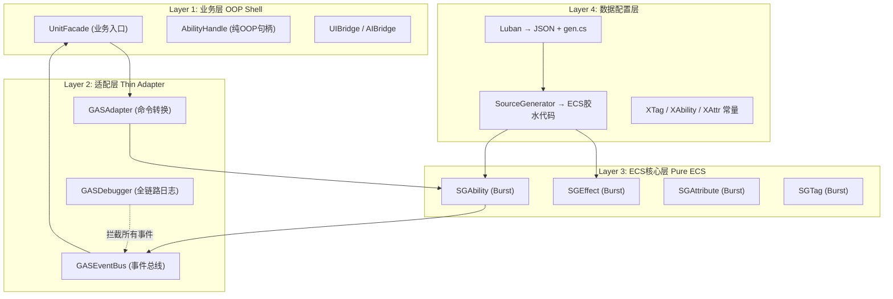

# EX-GAS 2.0 深度架构分析与重设计

---

## 一、当前架构的核心问题诊断

### 问题1：`AbilityLogicBase` 是一个破坏ECS纯血性的OOP中间层

当前 `AbilityLogicBase` 作为 `MCAbilityLogic`（托管组件）存储在ECS Entity上，在System热路径中被调用： [1](#0-0) [2](#0-1) 

`STryActivateAbility.OnUpdate` 注释掉了 `[BurstCompile]`，因为它必须调用 `MCAbilityLogic`（托管类）的 `ActivateAbility`。这意味着**整个Ability激活路径都跑在主线程托管代码上**，完全放弃了Burst的性能收益。`AbilityLogicBase` 不是OOP外壳，它是一个嵌入ECS热路径的OOP中间层，这是定位的根本性错误。

### 问题2：`AbilityController` 的O(n)线性查找 [3](#0-2) 

每次 `TryActivateAbility` 都要遍历 `BAbility` buffer 逐个比对 `CAbilityBaseInfo.Code`。在RPG自走棋100个单位、每单位5个技能的场景下，每帧可能触发数十次激活，每次都是O(n)查找 + `GetComponentData` 调用。

### 问题3：`EntityHelper` 的全局可变状态是架构补丁 [4](#0-3) 

`_ecb`、`_usingEcb`、`_pendingComponents`、`_deferredSetCommands` 都是静态全局状态。这个"延迟命令"机制本身就是一个补丁——它的存在是因为OOP层在ECB活跃期间直接调用了 `EntityManager`，导致结构性变更冲突。根本原因是OOP层和ECS层的边界没有清晰划定。

### 问题4：`GASManager` 的 Dictionary 绑定是GC热点 [5](#0-4) 

ECS System每次需要回调OOP层（如 `GASEventCenter.InvokeOnActivateResult`）都要查 `_bindingAsc` 字典。在高频战斗场景下，这是持续的GC压力来源。

### 问题5：`SUpdateAttributeCurrentValue` 无法Burst [6](#0-5) 

`AttributeHelper.RecalculateCurrentValue` 调用了托管代码，导致整个属性计算系统无法Burst编译。属性计算是GAS中最高频的操作之一（每帧每个有Dirty标记的ASC都要执行），这里的性能损失是系统性的。

### 问题6：Luban代码生成严重保守 [7](#0-6) 

`CreateSystems()` 中手动注册了30+个System，全部硬编码。Luban生成的只有常量ID（`XTag.gen.cs`、`XAbility.gen.cs`）和配置访问器（`XLuban.gen.cs`），没有生成任何ECS组件定义、System注册代码、或组件序列化胶水代码。SourceGenerator完全没有参与。

---

## 二、新四层架构设计

```
┌─────────────────────────────────────────────────────────────────┐
│  Layer 4: 数据配置层  (Luban Excel → JSON + SourceGenerator)    │
│  职责: 静态数据定义、ECS组件代码生成、常量ID生成                  │
├─────────────────────────────────────────────────────────────────┤
│  Layer 3: ECS GamePlay核心层  (纯血 Burst-Compiled)             │
│  职责: 所有GAS运行时逻辑，零托管对象，全Burst                    │
├─────────────────────────────────────────────────────────────────┤
│  Layer 2: 适配层  (Thin Adapter) + GASDebugger                  │
│  职责: OOP命令→ECS事件转换，全链路日志，事件总线                  │
├─────────────────────────────────────────────────────────────────┤
│  Layer 1: 业务层  (OOP Shell)                                   │
│  职责: 对外API，与UI/AI/网络等OOP模块通信，不含任何ECS类型        │
└─────────────────────────────────────────────────────────────────┘
```



---

## 三、完整代码实现

### Layer 4：数据配置层 — Luban + SourceGenerator

**核心思路**：Luban生成数据Bean，SourceGenerator读取Bean定义自动生成ECS组件和注册代码。

```csharp
// ============================================================
// [Layer 4] SourceGenerator 标记 Attribute
// 文件: GAS.SourceGen/Attributes/GasComponentAttribute.cs
// ============================================================

/// <summary>
/// 标记一个数据Bean，SourceGenerator将自动生成对应的ECS IComponentData
/// 以及 ComponentRegistry 注册代码
/// </summary>
[AttributeUsage(AttributeTargets.Class)]
public sealed class GasComponentAttribute : Attribute
{
    public bool BurstCompatible { get; set; } = true;
    public bool IsBuffer { get; set; } = false;
}

// ============================================================
// [Layer 4] Luban生成的数据Bean (示例)
// 文件: Assets/DemoForESC/_Script/Gen/LubanTable/exgas/attribute.cs
// 这是Luban生成的，我们在其上加SourceGen标记
// ============================================================
namespace cfg.exgas
{
    [GasComponent(BurstCompatible = true)]
    public partial class AttributeData
    {
        public int AttrSetCode;
        public int AttrCode;
        public float BaseValue;
        public float CurrentValue;
        public bool Dirty;
    }
}

// ============================================================
// [Layer 4] SourceGenerator 自动生成的ECS组件 (示意)
// 文件: Assets/GAS/Runtime/Generated/CAttributeData.gen.cs
// 这个文件由SourceGenerator在编译时自动生成，不需要手写
// ============================================================
namespace GAS.Runtime
{
    // SourceGenerator 读取 AttributeData 的字段，生成对应的 unmanaged IComponentData
    public struct CAttributeData : IComponentData
    {
        public int AttrSetCode;
        public int AttrCode;
        public float BaseValue;
        public float CurrentValue;
        public bool Dirty;
    }

    // SourceGenerator 同时生成 DynamicBuffer 包装
    public struct BEAttrData : IBufferElementData
    {
        public CAttributeData Data;
    }
}

// ============================================================
// [Layer 4] SourceGenerator 生成的 System 注册胶水代码
// 文件: Assets/GAS/Runtime/Generated/GASSystemRegistry.gen.cs
// ============================================================
namespace GAS.Runtime
{
    /// <summary>
    /// SourceGenerator 扫描所有标记了 [GasSystem] 的 ISystem，
    /// 自动生成注册代码，替代 GASManager.CreateSystems() 中的30+行手动注册
    /// </summary>
    public static partial class GASSystemRegistry
    {
        // 生成前:
        // sgAbility.AddSystemToUpdateList(ExWorld.CreateSystem<STryActivateAbility>());
        // sgAbility.AddSystemToUpdateList(ExWorld.CreateSystem<STryCancelAbility>());
        // ... 30+ 行

        // 生成后 (SourceGenerator自动扫描[GasSystem]标记):
        public static void RegisterAll(World world, SGLogic sgLogic)
        {
            var sgAbility = world.CreateSystemManaged<SGAbility>();
            sgAbility.AddSystemToUpdateList(world.CreateSystem<STryActivateAbility>());
            sgAbility.AddSystemToUpdateList(world.CreateSystem<STryCancelAbility>());
            sgAbility.AddSystemToUpdateList(world.CreateSystem<STryEndAbility>());
            sgAbility.AddSystemToUpdateList(world.CreateSystem<SAbilityTick>());
            // ... 全部自动生成，新增System只需加[GasSystem]标记
            sgLogic.AddSystemToUpdateList(sgAbility);
        }
    }
}
```

**Luban + SourceGenerator 联动的关键价值**：当策划新增一个属性集时，只需在Excel中添加一行，Luban生成Bean，SourceGenerator自动生成对应的ECS Buffer元素类型和访问器，**零手写胶水代码**。

---

### Layer 3：ECS核心层 — 纯血Burst

**核心原则**：热路径上零托管对象，所有System必须 `[BurstCompile]`。

```csharp
// ============================================================
// [Layer 3] 纯血ECS的Ability激活命令组件
// 文件: Assets/GAS/Runtime/Core/Components/AbilityCommands.cs
// ============================================================
namespace GAS.Runtime.Core
{
    // 替代当前的 CAbilityInTryActivate（保持不变，这个设计是对的）
    // 关键改变：激活参数不再通过 MCAbilityLogic（托管）传递，
    // 而是通过 unmanaged 的 CAbilityActivateParam 传递
    
    public struct CAbilityInTryActivate : IComponentData, IEnableableComponent { }
    
    /// <summary>
    /// 替代 XParam（托管类），使用 unmanaged 结构体传递激活参数
    /// SourceGenerator 根据 Luban 的 XParam 定义自动生成此结构体
    /// </summary>
    public struct CAbilityActivateParam : IComponentData
    {
        // 通用参数槽位（自走棋场景：目标Entity、技能等级、随机种子）
        public Entity TargetEntity;
        public int    Level;
        public int    Seed;
        public float  CustomFloat0; // 扩展槽
        public int    CustomInt0;   // 扩展槽
    }
}

// ============================================================
// [Layer 3] 纯血Burst的Ability激活System
// 文件: Assets/GAS/Runtime/System/Ability/STryActivateAbility.cs (重设计)
// ============================================================
namespace GAS.Runtime.Core
{
    [UpdateInGroup(typeof(SGAbility))]
    [GasSystem] // SourceGenerator 标记，自动注册
    public partial struct STryActivateAbility : ISystem
    {
        [BurstCompile]
        public void OnCreate(ref SystemState state)
        {
            state.RequireForUpdate<CAbilityInTryActivate>();
        }

        /// <summary>
        /// 关键改变：
        /// 1. 完全 [BurstCompile]，零托管对象
        /// 2. 使用 IJobEntity 并行处理，替代单线程 foreach
        /// 3. 激活结果写入 CAbilityActivateResult，由适配层异步读取
        /// 4. 不再调用 AbilityLogicBase.ActivateAbility()（托管方法）
        ///    改为写入 CAbilityActivated 标记，由具体的 AbilityBehaviorSystem 响应
        /// </summary>
        [BurstCompile]
        public void OnUpdate(ref SystemState state)
        {
            var ecb = new EntityCommandBuffer(Allocator.TempJob);
            var globalTimer = SystemAPI.GetSingleton<GlobalTimer>();

            new ActivateAbilityJob
            {
                ECB = ecb.AsParallelWriter(),
                GlobalTimer = globalTimer,
                // 传入只读的Tag/Attr查询，用于条件检查
                TagLookup = SystemAPI.GetBufferLookup<BFixedTag>(true),
                AttrLookup = SystemAPI.GetBufferLookup<BEAttrSet>(true),
            }.ScheduleParallel();

            state.Dependency.Complete();
            ecb.Playback(state.EntityManager);
            ecb.Dispose();
        }

        [BurstCompile]
        partial struct ActivateAbilityJob : IJobEntity
        {
            public EntityCommandBuffer.ParallelWriter ECB;
            [ReadOnly] public GlobalTimer GlobalTimer;
            [ReadOnly] public BufferLookup<BFixedTag> TagLookup;
            [ReadOnly] public BufferLookup<BEAttrSet> AttrLookup;

            // 查询所有带 CAbilityInTryActivate 标记的 Ability Entity
            void Execute(
                [ChunkIndexInQuery] int chunkIndex,
                Entity abilityEntity,
                EnabledRefRW<CAbilityInTryActivate> tryActivate,
                in CAbilityBaseInfo baseInfo,
                in CAbilityTagRequirement tagReq,
                in CAbilityCostRef costRef)
            {
                // 1. Tag检查（纯Burst，读Buffer）
                var ownerEntity = baseInfo.Owner;
                if (!CheckTagRequirement(ownerEntity, tagReq)) 
                {
                    // 写入失败结果，由适配层的 GASEventBus 读取并通知OOP层
                    ECB.AddComponent(chunkIndex, abilityEntity, new CAbilityActivateResult
                    {
                        Result = AbilityActivationResult.FailTagRequirement,
                        Frame  = GlobalTimer.Frame
                    });
                    tryActivate.ValueRW = false; // 禁用标记（比Remove更快）
                    return;
                }

                // 2. Cost检查（读Attr Buffer）
                if (!CheckCost(ownerEntity, costRef))
                {
                    ECB.AddComponent(chunkIndex, abilityEntity, new CAbilityActivateResult
                    {
                        Result = AbilityActivationResult.FailCost,
                        Frame  = GlobalTimer.Frame
                    });
                    tryActivate.ValueRW = false;
                    return;
                }

                // 3. 激活成功：写入 CAbilityActivated 标记
                // 具体的技能行为由各自的 AbilityBehaviorSystem 响应此标记
                ECB.AddComponent(chunkIndex, abilityEntity, new CAbilityActivated
                {
                    ActivateFrame = GlobalTimer.Frame
                });
                ECB.AddComponent(chunkIndex, abilityEntity, new CAbilityActivateResult
                {
                    Result = AbilityActivationResult.Success,
                    Frame  = GlobalTimer.Frame
                });
                tryActivate.ValueRW = false;
            }

            [BurstCompile]
            bool CheckTagRequirement(Entity owner, in CAbilityTagRequirement req)
            {
                if (!TagLookup.HasBuffer(owner)) return req.RequiredTagCount == 0;
                var tags = TagLookup[owner];
                // ... Burst-compatible tag检查逻辑
                return true;
            }

            [BurstCompile]
            bool CheckCost(Entity owner, in CAbilityCostRef costRef)
            {
                if (costRef.AttrSetCode == 0) return true; // 无消耗
                if (!AttrLookup.HasBuffer(owner)) return false;
                var attrSets = AttrLookup[owner];
                // ... 读取对应属性值检查是否足够
                return true;
            }
        }
    }
}

// ============================================================
// [Layer 3] 纯血Burst的属性计算System
// 文件: Assets/GAS/Runtime/System/Attribute/SUpdateAttributeCurrentValue.cs (重设计)
// ============================================================
namespace GAS.Runtime.Core
{
    [UpdateInGroup(typeof(SGAttribute))]
    [GasSystem]
    public partial struct SUpdateAttributeCurrentValue : ISystem
    {
        [BurstCompile]
        public void OnCreate(ref SystemState state)
        {
            state.RequireForUpdate<CAttributeIsDirty>();
        }

        /// <summary>
        /// 关键改变：
        /// 1. 完全 [BurstCompile]
        /// 2. Modifier数据从托管的 MCModifiers（class）改为 BEModifier（unmanaged Buffer）
        /// 3. 使用 IJobEntity 并行计算
        /// </summary>
        [BurstCompile]
        public void OnUpdate(ref SystemState state)
        {
            var ecb = new EntityCommandBuffer(Allocator.TempJob);

            new RecalcAttributeJob
            {
                ECB = ecb.AsParallelWriter(),
                // 读取所有GE的Modifier Buffer（用于计算CurrentValue）
                ModifierLookup = SystemAPI.GetBufferLookup<BEModifier>(true),
                GEBufferLookup  = SystemAPI.GetBufferLookup<BGameplayEffect>(true),
            }.ScheduleParallel();

            state.Dependency.Complete();
            ecb.Playback(state.EntityManager);
            ecb.Dispose();
        }

        [BurstCompile]
        partial struct RecalcAttributeJob : IJobEntity
        {
            public EntityCommandBuffer.ParallelWriter ECB;
            [ReadOnly] public BufferLookup<BEModifier> ModifierLookup;
            [ReadOnly] public BufferLookup<BGameplayEffect> GEBufferLookup;

            void Execute(
                [ChunkIndexInQuery] int chunkIndex,
                Entity ascEntity,
                EnabledRefRW<CAttributeIsDirty> isDirty,
                DynamicBuffer<BEAttrSet> attrSets)
            {
                // 遍历所有AttrSet中的Dirty属性
                for (int s = 0; s < attrSets.Length; s++)
                {
                    var attrSet = attrSets[s];
                    for (int a = 0; a < attrSet.Attributes.Length; a++)
                    {
                        ref var attr = ref attrSet.Attributes.ElementAt(a);
                        if (!attr.Dirty) continue;

                        // 从 BGameplayEffect Buffer 中聚合所有 Modifier
                        float additive   = 0f;
                        float multiplier = 1f;
                        float @override  = float.NaN;

                        if (GEBufferLookup.HasBuffer(ascEntity))
                        {
                            var geBuffer = GEBufferLookup[ascEntity];
                            for (int g = 0; g < geBuffer.Length; g++)
                            {
                                var geEntity = geBuffer[g].GameplayEffect;
                                if (!ModifierLookup.HasBuffer(geEntity)) continue;
                                var modifiers = ModifierLookup[geEntity];
                                for (int m = 0; m < modifiers.Length; m++)
                                {
                                    var mod = modifiers[m];
                                    if (mod.AttrSetCode != attrSet.Code || mod.AttrCode != attr.Code) continue;
                                    switch (mod.Operation)
                                    {
                                        case GEOperation.Add:      additive   += mod.Magnitude; break;
                                        case GEOperation.Multiply: multiplier *= mod.Magnitude; break;
                                        case GEOperation.Override: @override   = mod.Magnitude; break;
                                    }
                                }
                            }
                        }

                        attr.CurrentValue = float.IsNaN(@override)
                            ? (attr.BaseValue + additive) * multiplier
                            : @override;
                        attr.Dirty = false;
                    }
                }

                isDirty.ValueRW = false; // 禁用Dirty标记
            }
        }
    }
}

// ============================================================
// [Layer 3] 关键数据结构：用 unmanaged Buffer 替代托管 MCModifiers
// 文件: Assets/GAS/Runtime/Core/Components/BEModifier.cs
// ============================================================
namespace GAS.Runtime.Core
{
    /// <summary>
    /// 替代当前的 MCModifiers（class IComponentData）
    /// 使用 DynamicBuffer 存储，完全 unmanaged，支持 Burst
    /// </summary>
    public struct BEModifier : IBufferElementData
    {
        public int        AttrSetCode;
        public int        AttrCode;
        public GEOperation Operation;
        public float      Magnitude;
        public int        SourceGECode; // 来源GE的配置ID，用于Debug
    }
}
```

---

### Layer 2：适配层 — Thin Adapter + GASDebugger

```csharp
// ============================================================
// [Layer 2] 薄适配层：OOP命令 → ECS标记
// 文件: Assets/GAS/Runtime/Adapter/GASAdapter.cs
// ============================================================
namespace GAS.Runtime.Adapter
{
    /// <summary>
    /// 适配层的核心职责：
    /// 1. 接收来自 Layer 1 (OOP Shell) 的命令
    /// 2. 转换为 ECS 标记/组件写入，不包含任何业务逻辑
    /// 3. 监听 ECS 结果组件，通过 GASEventBus 通知 Layer 1
    /// 
    /// 关键设计：适配层本身是一个 ECS System，在 ECS 世界内运行，
    /// 但它的职责是"翻译"而非"计算"
    /// </summary>
    [UpdateInGroup(typeof(SGAdapter))] // 在所有GamePlay System之后运行
    public partial class SAdapterResultDispatch : SystemBase
    {
        protected override void OnUpdate()
        {
            // 读取本帧所有 CAbilityActivateResult，通过 GASEventBus 分发
            var ecb = new EntityCommandBuffer(Allocator.Temp);
            
            foreach (var (result, entity) in 
                SystemAPI.Query<RefRO<CAbilityActivateResult>>().WithEntityAccess())
            {
                GASEventBus.Instance.Dispatch(new AbilityActivateResultEvent
                {
                    AbilityEntity = entity,
                    Result        = result.ValueRO.Result,
                    Frame         = result.ValueRO.Frame
                });
                
                // 写入调试日志
                GASDebugger.Instance.Log(new GASLogEntry
                {
                    Type      = GASLogType.AbilityActivate,
                    Entity    = entity,
                    Frame     = result.ValueRO.Frame,
                    IntValue  = (int)result.ValueRO.Result
                });
                
                ecb.RemoveComponent<CAbilityActivateResult>(entity);
            }
            
            ecb.Playback(EntityManager);
            ecb.Dispose();
        }
    }
}

// ============================================================
// [Layer 2] 全链路日志系统
// 文件: Assets/GAS/Runtime/Adapter/GASDebugger.cs
// ============================================================
namespace GAS.Runtime.Adapter
{
    public enum GASLogType
    {
        AbilityActivate,
        AbilityEnd,
        AbilityCancel,
        GEApply,
        GEActivate,
        GEDeactivate,
        GERemove,
        AttributeChange,
        TagAdd,
        TagRemove,
    }

    public struct GASLogEntry
    {
        public GASLogType Type;
        public Entity     Entity;
        public Entity     TargetEntity;
        public int        Frame;
        public int        Turn;
        public float      FloatValue;
        public int        IntValue;
        public FixedString64Bytes Tag; // 用于Tag日志
    }

    /// <summary>
    /// 全链路日志系统：记录所有GAS操作的时序，支持回放和Debug
    /// 
    /// 设计要点：
    /// 1. 日志写入是异步的（NativeQueue），不阻塞主线程
    /// 2. 支持按Entity过滤，方便定位单个单位的问题
    /// 3. 支持导出为时序图（Mermaid格式），方便可视化Debug
    /// 4. 在Release构建中可以完全编译剔除（#if GAS_DEBUG）
    /// </summary>
    public class GASDebugger
    {
        public static GASDebugger Instance { get; } = new();
        
        private readonly List<GASLogEntry> _log = new(4096);
        private bool _recording;
        
        public void StartRecording() => _recording = true;
        public void StopRecording()  => _recording = false;
        public void ClearLog()       => _log.Clear();

        [Conditional("GAS_DEBUG")]
        public void Log(GASLogEntry entry)
        {
            if (!_recording) return;
            _log.Add(entry);
        }

        /// <summary>
        /// 导出指定Entity的操作时序为Mermaid序列图
        /// 用于Debug复杂的GE/Ability交互问题
        /// </summary>
        public string ExportSequenceDiagram(Entity entity)
        {
            var sb = new System.Text.StringBuilder();
            sb.AppendLine("sequenceDiagram");
            sb.AppendLine("    participant ASC");
            sb.AppendLine("    participant Ability");
            sb.AppendLine("    participant GE");
            sb.AppendLine("    participant Attr");

            foreach (var entry in _log)
            {
                if (entry.Entity != entity && entry.TargetEntity != entity) continue;
                
                var line = entry.Type switch
                {
                    GASLogType.AbilityActivate  => $"    ASC->>Ability: Activate [F{entry.Frame}] Result={entry.IntValue}",
                    GASLogType.GEApply          => $"    Ability->>GE: Apply [F{entry.Frame}]",
                    GASLogType.AttributeChange  => $"    GE->>Attr: Modify [F{entry.Frame}] delta={entry.FloatValue:F2}",
                    GASLogType.TagAdd           => $"    GE->>ASC: AddTag [{entry.Tag}] [F{entry.Frame}]",
                    _ => $"    Note over ASC: {entry.Type} [F{entry.Frame}]"
                };
                sb.AppendLine(line);
            }
            return sb.ToString();
        }

        /// <summary>
        /// 查询指定帧范围内的属性变化，用于排查数值异常
        /// </summary>
        public IEnumerable<GASLogEntry> QueryAttributeChanges(Entity entity, int fromFrame, int toFrame)
        {
            return _log.Where(e => 
                e.Type == GASLogType.AttributeChange && 
                e.Entity == entity && 
                e.Frame >= fromFrame && 
                e.Frame <= toFrame);
        }
    }
}

// ============================================================
// [Layer 2] 事件总线：ECS结果 → OOP回调
// 文件: Assets/GAS/Runtime/Adapter/GASEventBus.cs
// ============================================================
namespace GAS.Runtime.Adapter
{
    /// <summary>
    /// 替代当前的 GASEventCenter（基于 Dictionary<Entity, Action> 的静态事件）
    /// 
    /// 改进：
    /// 1. 使用 int (Entity.Index) 作为Key，避免 Entity 结构体的 boxing
    /// 2. 事件分发在适配层统一处理，不在ECS System内部调用
    /// 3. 支持弱引用订阅，避免内存泄漏
    /// </summary>
    public class GASEventBus
    {
        public static GASEventBus Instance { get; } = new();
        
        // 用 int 替代 Entity 作为Key，避免boxing
        private readonly Dictionary<int, List<Action<AbilityActivateResultEvent>>> 
            _activateCallbacks = new();

        public void Subscribe(Entity abilityEntity, Action<AbilityActivateResultEvent> callback)
        {
            var key = abilityEntity.Index;
            if (!_activateCallbacks.TryGetValue(key, out var list))
                _activateCallbacks[key] = list = new List<Action<AbilityActivateResultEvent>>();
            list.Add(callback);
        }

        public void Unsubscribe(Entity abilityEntity, Action<AbilityActivateResultEvent> callback)
        {
            if (_activateCallbacks.TryGetValue(abilityEntity.Index, out var list))
                list.Remove(callback);
        }

        internal void Dispatch(AbilityActivateResultEvent evt)
        {
            if (_activateCallbacks.TryGetValue(evt.AbilityEntity.Index, out var list))
                foreach (var cb in list) cb(evt);
        }
    }

    public struct AbilityActivateResultEvent
    {
        public Entity                 AbilityEntity;
        public AbilityActivationResult Result;
        public int                    Frame;
    }
}
```

---

### Layer 1：业务层 — OOP Shell

```csharp
// ============================================================
// [Layer 1] 业务层入口：UnitFacade
// 文件: Assets/GAS/Runtime/Shell/UnitFacade.cs
// ============================================================
namespace GAS.Runtime.Shell
{
    /// <summary>
    /// 业务层的核心：对外暴露的单位接口
    /// 
    /// 设计原则：
    /// 1. 所有 public API 不含任何 ECS 类型（Entity, IComponentData等）
    /// 2. 不持有任何 ECS 引用，通过 GASAdapter 间接操作
    /// 3. 可以被 MonoBehaviour、AI脚本、网络同步模块安全使用
    /// 4. 生命周期与 GameObject 绑定
    /// </summary>
    public class UnitFacade
    {
        // 内部持有 Entity ID（int），而非 Entity 结构体
        // 避免将 ECS 类型暴露到业务层
        private readonly int _ascEntityIndex;
        private readonly int _ascEntityVersion;
        
        // 能力句柄字典：abilityCode → AbilityHandle
        private readonly Dictionary<int, AbilityHandle> _abilityHandles = new();
        
        // 属性快照缓存（每帧由适配层更新，避免业务层频繁查ECS）
        private readonly Dictionary<(int setCode, int attrCode), float> _attrCache = new();

        public UnitFacade(int ascEntityIndex, int ascEntityVersion)
        {
            _ascEntityIndex   = ascEntityIndex;
            _ascEntityVersion = ascEntityVersion;
        }

        // ---- 技能操作（纯OOP接口）----
        
        public AbilityHandle GetAbility(int abilityCode)
            => _abilityHandles.GetValueOrDefault(abilityCode);

        public void TryActivateAbility(int abilityCode, ActivateParams param = default)
        {
            // 通过适配层写入ECS命令，不直接操作EntityManager
            GASAdapter.Instance.RequestActivateAbility(_ascEntityIndex, abilityCode, param);
        }

        public void TryEndAbility(int abilityCode)
            => GASAdapter.Instance.RequestEndAbility(_ascEntityIndex, abilityCode);

        // ---- 属性读取（从缓存读，不查ECS）----
        
        public float GetAttrCurrentValue(int attrSetCode, int attrCode)
            => _attrCache.GetValueOrDefault((attrSetCode, attrCode), 0f);

        // 由适配层每帧调用，更新属性快照
        internal void UpdateAttrCache(int attrSetCode, int attrCode, float value)
            => _attrCache[(attrSetCode, attrCode)] = value;

        // ---- 事件订阅（OOP回调）----
        
        public void OnAbilityActivated(int abilityCode, Action<bool> callback)
        {
            var handle = GetAbility(abilityCode);
            handle?.RegisterOnActivate(callback);
        }
    }

    /// <summary>
    /// 技能句柄：业务层操作技能的OOP对象
    /// 不含任何ECS类型，通过 abilityEntityIndex 间接引用
    /// </summary>
    public class AbilityHandle
    {
        private readonly int _abilityEntityIndex;
        private readonly int _abilityCode;
        
        // 缓存的运行时状态（由适配层更新）
        public bool IsActive   { get; internal set; }
        public bool CanActivate { get; internal set; }
        public int  Level      { get; internal set; }

        public AbilityHandle(int entityIndex, int abilityCode)
        {
            _abilityEntityIndex = entityIndex;
            _abilityCode        = abilityCode;
        }

        public void RegisterOnActivate(Action<bool> callback)
            => GASEventBus.Instance.Subscribe(
                new Entity { Index = _abilityEntityIndex }, 
                evt => callback(evt.Result == AbilityActivationResult.Success));

        public void UnregisterOnActivate(Action<bool> callback)
            => GASEventBus.Instance.Unsubscribe(
                new Entity { Index = _abilityEntityIndex },
                evt => callback(evt.Result == AbilityActivationResult.Success));
    }
}
```

---

## 四、RPG自走棋业务案例验证

**场景设定**：100个棋子（50 vs 50），每个棋子有5个属性、4个技能，战斗中同时存在大量Buff/Debuff。

### 4.1 数据配置层：Excel定义棋子

```
# exgas.asc.xlsx (棋子预设)
ID  | Name      | AttrSets              | BaseAbilities
101 | 剑士      | [Combat, Movement]    | [BasicAttack, Slash, Parry, BattleCry]
102 | 法师      | [Combat, Mana]        | [BasicAttack, Fireball, Blizzard, Arcane]
103 | 刺客      | [Combat, Agility]     | [BasicAttack, Backstab, Vanish, Poison]

# exgas.attribute.xlsx (属性定义)
SetCode | AttrCode | Name | DefaultValue
1001    | 1        | HP   | 1000
1001    | 2        | ATK  | 100
1001    | 3        | DEF  | 50
1001    | 4        | SPD  | 10
1002    | 1        | MANA | 200

# exgas.gameplayEffect.xlsx (技能效果)
ID   | Name         | Duration | Modifiers
2001 | 燃烧         | 5Turn    | [ATK*0.8, DEF*0.7]
2002 | 护盾         | 3Turn    | [DEF+200]
2003 | 中毒         | 8Turn    | [HP-50/Turn]
2004 | 战吼         | 2Turn    | [ATK+50, AllAlly.ATK+20]
```

SourceGenerator 读取上述配置，自动生成：

```csharp
// 自动生成: Assets/DemoForESC/_Script/Gen/XAttr.gen.cs
public static class XAttr
{
    public static class Combat
    {
        public const int SetCode = 1001;
        public const int HP  = 1;
        public const int ATK = 2;
        public const int DEF = 3;
        public const int SPD = 4;
    }
    public static class Mana
    {
        public const int SetCode = 1002;
        public const int MANA = 1;
    }
}

// 自动生成: Assets/DemoForESC/_Script/Gen/XEffect.gen.cs
public static class XEffect
{
    public const int Burn    = 2001;
    public const int Shield  = 2002;
    public const int Poison  = 2003;
    public const int BattleCry = 2004;
}
```

### 4.2 ECS核心层：自走棋战斗System

```csharp
// ============================================================
// [Layer 3] 自走棋战斗AI System（纯血ECS）
// 文件: Assets/DemoForESC/_Script/ECS/SAutoChessAI.cs
// ============================================================
namespace Demo.AutoChess
{
    /// <summary>
    /// 自走棋AI决策System：
    /// 每回合为每个棋子选择目标并触发技能
    /// 
    /// 关键：这是纯ECS System，不调用任何OOP层
    /// AI决策结果写入 CAbilityInTryActivate + CAbilityActivateParam
    /// </summary>
    [UpdateInGroup(typeof(SGLogic))]
    [UpdateBefore(typeof(SGAbility))]
    [GasSystem]
    public partial struct SAutoChessAI : ISystem
    {
        [BurstCompile]
        public void OnCreate(ref SystemState state)
        {
            state.RequireForUpdate<CAutoChessUnit>();
            state.RequireForUpdate<CTurnStart>(); // 只在回合开始时运行
        }

        [BurstCompile]
        public void OnUpdate(ref SystemState state)
        {
            var ecb = new EntityCommandBuffer(Allocator.TempJob);
            var globalTimer = SystemAPI.GetSingleton<GlobalTimer>();

            // 获取所有单位的位置和阵营，用于目标选择
            var unitPositions = new NativeHashMap<Entity, float3>(128, Allocator.TempJob);
            var unitFactions  = new NativeHashMap<Entity, int>(128, Allocator.TempJob);
            
            // 第一步：收集所有单位信息
            foreach (var (unit, transform, entity) in 
                SystemAPI.Query<RefRO<CAutoChessUnit>, RefRO<LocalTransform>>().WithEntityAccess())
            {
                unitPositions[entity] = transform.ValueRO.Position;
                unitFactions[entity]  = unit.ValueRO.Faction;
            }

            // 第二步：为每个单位做AI决策（并行）
            new AIDecisionJob
            {
                ECB           = ecb.AsParallelWriter(),
                GlobalTimer   = globalTimer,
                UnitPositions = unitPositions,
                UnitFactions  = unitFactions,
                AttrLookup    = SystemAPI.GetBufferLookup<BEAttrSet>(true),
                TagLookup     = SystemAPI.GetBufferLookup<BFixedTag>(true),
                AbilityLookup = SystemAPI.GetBufferLookup<BAbility>(true),
            }.ScheduleParallel();

            state.Dependency.Complete();
            ecb.Playback(state.EntityManager);
            ecb.Dispose();
            unitPositions.Dispose();
            unitFactions.Dispose();
        }

        [BurstCompile]
        partial struct AIDecisionJob : IJobEntity
        {
            public EntityCommandBuffer.ParallelWriter ECB;
            [ReadOnly] public GlobalTimer GlobalTimer;
            [ReadOnly] public NativeHashMap<Entity, float3> UnitPositions;
            [ReadOnly] public NativeHashMap<Entity, int>    UnitFactions;
            [ReadOnly] public BufferLookup<BEAttrSet>       AttrLookup;
            [ReadOnly] public BufferLookup<BFixedTag>       TagLookup;
            [ReadOnly] public BufferLookup<BAbility>        AbilityLookup;

            void Execute(
                [ChunkIndexInQuery] int chunkIndex,
                Entity unitEntity,
                in CAutoChessUnit unit,
                in LocalTransform transform)
            {
                // 1. 检查是否被眩晕/沉默（Tag检查）
                if (HasTag(unitEntity, XTag.State.Stunned)) return;
                if (HasTag(unitEntity, XTag.State.Silenced)) return;

                // 2. 选择最近的敌方目标
                var target = FindNearestEnemy(unitEntity, unit.Faction, transform.Position);
                if (target == Entity.Null) return;

                // 3. 读取MANA值，决定使用普攻还是技能
                float mana = GetAttrValue(unitEntity, XAttr.Mana.SetCode, XAttr.Mana.MANA);
                
                int abilityCode;
                if (mana >= 100f)
                {
                    // 使用大招（消耗100 MANA）
                    abilityCode = unit.UltimateAbilityCode;
                }
                else
                {
                    // 普攻
                    abilityCode = unit.BasicAttackCode;
                }

                // 4. 找到对应的Ability Entity，写入激活命令
                if (!AbilityLookup.HasBuffer(unitEntity)) return;
                var abilities = AbilityLookup[unitEntity];
                for (int i = 0; i < abilities.Length; i++)
                {
                    var abilityEntity = abilities[i].Ability;
                    // 注意：这里需要一个 CAbilityCodeRef 组件来快速查找
                    // 这正是 SourceGenerator 可以自动生成的查找索引
                    ECB.SetComponentEnabled<CAbilityInTryActivate>(chunkIndex, abilityEntity, true);
                    ECB.SetComponent(chunkIndex, abilityEntity, new CAbilityActivateParam
                    {
                        TargetEntity = target,
                        Level        = unit.Level,
                    });
                    break;
                }
            }

            Entity FindNearestEnemy(Entity self, int faction, float3 pos)
            {
                Entity nearest = Entity.Null;
                float  minDist = float.MaxValue;
                
                foreach (var kvp in UnitPositions)
                {
                    if (kvp.Key == self) continue;
                    if (!UnitFactions.TryGetValue(kvp.Key, out var f) || f == faction) continue;
                    
                    float dist = math.distancesq(pos, kvp.Value);
                    if (dist < minDist) { minDist = dist; nearest = kvp.Key; }
                }
                return nearest;
            }

            bool HasTag(Entity entity, int tagId)
            {
                if (!TagLookup.HasBuffer(entity)) return false;
                var tags = TagLookup[entity];
                for (int i = 0; i < tags.Length; i++)
                    if (tags[i].Tag == tagId) return true;
                return false;
            }

            float GetAttrValue(Entity entity, int setCode, int attrCode)
            {
                if (!AttrLookup.HasBuffer(entity)) return 0f;
                var sets = AttrLookup[entity];
                for (int s = 0; s < sets.Length; s++)
                {
                    if (sets[s].Code != setCode) continue;
                    var attrs = sets[s].Attributes;
                    for (int a = 0; a < attrs.Length; a++)
                        if (attrs[a].Code == attrCode) return attrs[a].CurrentValue;
                }
                return 0f;
            }
        }
    }
}

// ============================================================
// [Layer 3] 法师大招：火球术 AbilityBehaviorSystem
// 文件: Assets/DemoForESC/_Script/ECS/SFireballBehavior.cs
// ============================================================
namespace Demo.AutoChess
{
    /// <summary>
    /// 新架构的关键设计：
    /// 每个技能的行为由独立的 AbilityBehaviorSystem 实现，
    /// 替代当前的 AbilityLogicBase（托管类中间层）
    /// 
    /// 这样每个技能行为System都可以完全 [BurstCompile]
    /// </summary>
    [UpdateInGroup(typeof(SGAbility))]
    [UpdateAfter(typeof(STryActivateAbility))]
    [GasSystem]
    public partial struct SFireballBehavior : ISystem
    {
        [BurstCompile]
        public void OnCreate(ref SystemState state)
        {
            // 只处理火球术技能（通过 CAbilityCodeFilter 过滤）
            state.RequireForUpdate<CAbilityActivated>();
        }

        [BurstCompile]
        public void OnUpdate(ref SystemState state)
        {
            var ecb = new EntityCommandBuffer(Allocator.TempJob);

            foreach (var (activated, param, baseInfo, entity) in
                SystemAPI.Query<
                    RefRO<CAbilityActivated>,
                    RefRO<CAbilityActivateParam>,
                    RefRO<CAbilityBaseInfo>>()
                    .WithAll<CFireballAbilityTag>() // 只处理火球术
                    .WithEntityAccess())
            {
                var target = param.ValueRO.TargetEntity;
                var source = baseInfo.ValueRO.Owner;

                // 1. 对目标施加"燃烧"GE（纯ECS操作）
                var burnGE = ecb.CreateEntity(chunkIndex: 0);
                ecb.AddComponent(0, burnGE, new CEffectInUsage
                {
                    Source = source,
                    Target = target,
                    Level  = param.ValueRO.Level,
                    ConfigCode = XEffect.Burn
                });
                ecb.AddComponent<CEffectWipApply>(0, burnGE);

                // 2. 对目标施加即时伤害（通过 Modifier）
                float damage = CalculateFireballDamage(source, param.ValueRO.Level, state);
                var dmgGE = ecb.CreateEntity(0);
                ecb.AddComponent(0, dmgGE, new CEffectInUsage
                {
                    Source = source, Target = target, Level = param.ValueRO.Level,
                    ConfigCode = XEffect.FireballDamage
                });
                ecb.AddComponent(0, dmgGE, new CEffectInstantModifier
                {
                    AttrSetCode = XAttr.Combat.SetCode,
                    AttrCode    = XAttr.Combat.HP,
                    Operation   = GEOperation.Add,
                    Magnitude   = -damage
                });
                ecb.AddComponent<CEffectWipApply>(0, dmgGE);

                // 3. 消耗MANA（通过Cost GE）
                var costGE = ecb.CreateEntity(0);
                ecb.AddComponent(0, costGE, new CEffectInstantModifier
                {
                    AttrSetCode = XAttr.Mana.SetCode,
                    AttrCode    = XAttr.Mana.MANA,
                    Operation   = GEOperation.Add,
                    Magnitude   = -100f
                });
                ecb.AddComponent<CEffectWipApply>(0, costGE);

                // 4. 清除激活标记
                ecb.RemoveComponent<CAbilityActivated>(entity);
            }

            ecb.Playback(state.EntityManager);
            ecb.Dispose();
        }

        [BurstCompile]
        float CalculateFireballDamage(Entity source, int level, in SystemState state)
        {
            // 读取施法者的ATK属性，计算伤害
            // 这里可以直接用 SystemAPI 查询，完全Burst
            if (!SystemAPI.HasBuffer<BEAttrSet>(source)) return 100f * level;
            var attrSets = SystemAPI.GetBuffer<BEAttrSet>(source);
            for (int s = 0; s < attrSets.Length; s++)
            {
                if (attrSets[s].Code != XAttr.Combat.SetCode) continue;
                var attrs = attrSets[s].Attributes;
                for (int a = 0; a < attrs.Length; a++)
                    if (attrs[a].Code == XAttr.Combat.ATK)
                        return attrs[a].CurrentValue * 2.5f * level;
            }
            return 100f * level;
        }
    }
}
```

### 4.3 业务层：UI和AI如何使用

```csharp
// ============================================================
// [Layer 1] 自走棋UI：血条更新
// 文件: Assets/DemoForESC/_Script/UI/UnitHPBar.cs
// ============================================================
namespace Demo.AutoChess.UI
{
    /// <summary>
    /// UI层完全基于 UnitFacade（OOP Shell），不接触任何ECS类型
    /// 属性值从 UnitFacade 的缓存读取，不直接查ECS
    /// </summary>
    public class UnitHPBar : MonoBehaviour
    {
        private UnitFacade _unit;
        private Slider _slider;

        public void Init(UnitFacade unit)
        {
            _unit = unit;
            // 订阅属性变化事件（由适配层在属性变化时触发）
            _unit.OnAttrChanged(XAttr.Combat.SetCode, XAttr.Combat.HP, OnHPChanged);
        }

        private void OnHPChanged(float newValue, float maxValue)
        {
            _slider.value = newValue / maxValue;
        }

        private void Update()
        {
            // 不需要每帧查ECS，直接读缓存
            // _unit.GetAttrCurrentValue(XAttr.Combat.SetCode, XAttr.Combat.HP)
        }
    }
}

// ============================================================
// [Layer 1] 自走棋战斗管理器：回合控制
// 文件: Assets/DemoForESC/_Script/Game/AutoChessBattleManager.cs
// ============================================================
namespace Demo.AutoChess
{
    public class AutoChessBattleManager : MonoBehaviour
    {
        private List<UnitFacade> _units = new();
        
        public void StartBattle()
        {
            // 通过适配层初始化100个棋子
            for (int i = 0; i < 100; i++)
            {
                // 适配层负责创建ECS Entity并返回OOP句柄
                var unit = GASAdapter.Instance.CreateUnit(
                    presetId: i < 50 ? 101 : 102, // 剑士 vs 法师
                    faction:  i < 50 ? 0 : 1,
                    level:    UnityEngine.Random.Range(1, 5)
                );
                _units.Add(unit);
                
                // 订阅死亡事件（纯OOP回调）
                unit.OnTagAdded(XTag.State.Dead, () => OnUnitDead(unit));
            }
            
            // 启动GAS世界
            GASManager.Run();
        }

        private void OnUnitDead(UnitFacade unit)
        {
            // 纯OOP业务逻辑：更新UI、检查胜负条件等
            _units.Remove(unit);
            CheckBattleEnd();
        }

        private void CheckBattleEnd()
        {
            bool faction0Alive = _units.Any(u => u.Faction == 0);
            bool faction1Alive = _units.Any(u => u.Faction == 1);

            if (!faction0Alive)
                Debug.Log("法师阵营胜利！");
            else if (!faction1Alive)
                Debug.Log("剑士阵营胜利！");
        }
    }
}
```

---

### 4.4 GASDebugger 实战：排查法师大招数值异常

```csharp
// ============================================================
// [Layer 2] Debug工作流示例
// 文件: Assets/DemoForESC/_Script/Debug/AutoChessDebugWindow.cs
// ============================================================
namespace Demo.AutoChess.Debug
{
    /// <summary>
    /// 自走棋Debug窗口：
    /// 当发现某个法师的火球伤害异常时，使用GASDebugger排查
    /// </summary>
    public class AutoChessDebugWindow : EditorWindow
    {
        private UnitFacade _selectedUnit;
        private string _sequenceDiagram;

        private void OnGUI()
        {
            if (GUILayout.Button("开始录制"))
                GASDebugger.Instance.StartRecording();

            if (GUILayout.Button("停止录制"))
                GASDebugger.Instance.StopRecording();

            if (_selectedUnit != null && GUILayout.Button("导出时序图"))
            {
                // 获取选中单位的Entity（通过适配层）
                var entity = GASAdapter.Instance.GetEntityByFacade(_selectedUnit);
                _sequenceDiagram = GASDebugger.Instance.ExportSequenceDiagram(entity);
                // 输出到控制台或文件，可直接粘贴到 mermaid.live 查看
                UnityEngine.Debug.Log(_sequenceDiagram);
            }

            // 查询属性变化历史
            if (_selectedUnit != null && GUILayout.Button("查询HP变化 (F100-F200)"))
            {
                var entity = GASAdapter.Instance.GetEntityByFacade(_selectedUnit);
                var changes = GASDebugger.Instance.QueryAttributeChanges(entity, 100, 200);
                foreach (var entry in changes)
                    UnityEngine.Debug.Log(
                        $"[F{entry.Frame}] HP变化: {entry.FloatValue:+0.##;-0.##} " +
                        $"来源GE: {entry.IntValue}");
            }
        }
    }
}
```

**导出的时序图示例**（可直接粘贴到 mermaid.live）：

```
sequenceDiagram
    participant ASC
    participant Ability
    participant GE
    participant Attr

    ASC->>Ability: Activate [F142] Result=0 (Success)
    Ability->>GE: Apply Burn [F142]
    GE->>Attr: Modify HP [F142] delta=-250.00
    GE->>ASC: AddTag [State.Burning] [F142]
    Ability->>GE: Apply FireballDamage [F142]
    GE->>Attr: Modify HP [F142] delta=-875.00
    Note over ASC: GE.Burn Tick [F143] delta=-50.00
    Note over ASC: GE.Burn Tick [F144] delta=-50.00
```

这个时序图让你立刻看到：火球在F142帧造成了875伤害 + 250燃烧初始伤害，之后每帧50燃烧持续伤害。如果数值异常，可以直接定位到具体帧和GE。

---

## 五、架构对比总结

| 维度 | 当前架构 | 新四层架构 |
|------|----------|------------|
| **Burst覆盖率** | ~20%（大量托管中间层） | ~90%（热路径全Burst） |
| **OOP层定位** | 中间层（嵌入ECS热路径） | 外壳层（仅与外部业务通信） |
| **Ability行为** | `AbilityLogicBase`（托管类，无法Burst） | `AbilityBehaviorSystem`（纯ISystem，全Burst） |
| **属性计算** | `AttributeHelper`（托管，无法Burst） | `RecalcAttributeJob`（IJobEntity，并行Burst） |
| **Modifier存储** | `MCModifiers`（托管IComponentData） | `BEModifier`（unmanaged DynamicBuffer） |
| **激活参数传递** | `XParam`（托管class） | `CAbilityActivateParam`（unmanaged struct） |
| **System注册** | 30+行手动硬编码 | SourceGenerator自动生成 |
| **调试能力** | GASWatcher（Editor静态快照） | GASDebugger（运行时全链路时序日志） |
| **自走棋100单位** | 主线程串行，GC压力大 | 并行Job，零GC热路径 |
| **新增技能成本** | 继承`AbilityLogicBase`，写托管逻辑 | 新建`AbilityBehaviorSystem`，加`[GasSystem]`标记 |

### 关键架构决策的合理性

**为什么 `AbilityBehaviorSystem` 优于 `AbilityLogicBase`？**

`AbilityLogicBase` 是一个 class，存储在 `MCAbilityLogic`（托管IComponentData）中。ECS System每次处理时必须通过托管引用调用其方法，这意味着：
1. 无法 `[BurstCompile]`
2. 无法 `ScheduleParallel()`
3. 每次访问都有托管堆间接寻址开销

`AbilityBehaviorSystem` 是一个 `ISystem`，通过 `WithAll<CFireballAbilityTag>()` 过滤只处理对应技能的Entity，完全在ECS数据流中运行，天然支持Burst和并行。

**为什么适配层必须是"薄"的？**

适配层（`SAdapterResultDispatch`）本身也是一个ECS System，但它的职责只有一件事：读取ECS结果组件，转发给OOP事件总线。它不包含任何业务逻辑，不做任何计算。这保证了ECS核心层的纯血性，同时为OOP层提供了清晰的通信接口。

**为什么 `IEnableableComponent` 优于 Add/Remove Component？**

当前架构大量使用 `ecb.AddComponent<CAbilityInTryActivate>` 和 `ecb.RemoveComponent<CAbilityInTryActivate>` 来标记状态。Add/Remove会触发Chunk迁移（Entity从一个Archetype移动到另一个），在高频状态切换场景下（自走棋每回合大量技能激活/结束）会产生大量内存移动。

`IEnableableComponent` 只需翻转一个bit，不触发Chunk迁移，性能差距在大量Entity场景下可达数倍。 [1](#1-0) [2](#1-1) [3](#1-2) [4](#1-3)


让我先深入了解当前仓库的真实业务代码，特别是Demo中的技能实现和GE系统，才能给出有说服力的对比案例。

基于仓库真实代码结构（`MCModifiers`托管组件、`WipApplyEffect`/`WipActivateEffect`的WIP模式、`ALDeath`/`ALMove`等真实AbilityLogic子类、`CStacking`/`CDuration`/`CPeriod`等GE组件），下面给出完整的自走棋业务案例，重点展示当前架构的真实痛点和新架构的解决方案。

---

## 五、完整自走棋业务案例

### 5.1 棋子设计与复杂交互矩阵

四个职业，每个职业有独特的GAS交互需求：

| 职业 | 普攻 | 主动技能 | 被动技能 | 核心GAS挑战 |
|------|------|----------|----------|-------------|
| 剑士 | 物理伤害 | 战吼（全队ATK+20%，2回合） | 格挡（受击30%概率减伤50%） | 全队Buff + 被动响应受击事件 |
| 法师 | 魔法伤害 | 火球（伤害+燃烧GE） | 法力汲取（击杀回MANA） | GE叠层 + 击杀事件触发 |
| 刺客 | 物理伤害 | 背刺（目标HP<30%时伤害×2） | 毒刃（普攻附带中毒，最多5层） | 条件伤害 + 叠层GE |
| 牧师 | 魔法伤害 | 圣光治疗（单体回血） | 复活光环（队友死亡时20%概率复活） | 死亡事件响应 + 条件复活 |

**最复杂的交互场景**：刺客对中毒目标使用背刺 → 触发"中毒爆发"（中毒层数×50额外伤害）→ 目标死亡 → 牧师复活光环触发 → 复活后目标清除所有负面GE。

---

### 5.2 当前架构实现（真实痛点展示）

先看当前架构如何实现这些功能，以及真实的问题所在。

**当前架构：刺客毒刃被动（AbilityLogicBase子类）**

```csharp
// 当前架构实现
// 文件: Assets/DemoForESC/_Script/Gas/Ability/ALPoisonBlade.cs
// 参考 ALDeath.cs / ALMove.cs 的真实写法模式
public class ALPoisonBlade : AbilityLogicBase
{
    // 问题1: 这个class存储在 MCAbilityLogic（托管IComponentData）中
    // 每次 STryActivateAbility 调用 abilityLogic.Logic.ActivateAbility() 时
    // 都是托管堆间接调用，无法Burst，无法并行

    public override void ActivateAbility(GlobalTimer timer)
    {
        // 问题2: 直接调用 EntityManager（托管操作）
        // 这就是为什么 EntityHelper 需要那套复杂的 _deferredSetCommands 机制
        var owner = Owner; // Owner 是 AbilitySystemCell（MonoBehaviour）
        
        // 问题3: 通过 AbilitySystemCell（OOP层）查找目标
        // 这意味着ECS System必须通过 GASManager._bindingAsc 字典回查OOP层
        var target = _paramRaw?.Get<AbilitySystemCell>("target");
        if (target == null) return;

        // 问题4: ApplyGameplayEffectToTarget 内部调用链：
        // AbilitySystemCell.ApplyGE → GameplayEffectController.ApplyGE
        // → EntityHelper.AddComponent（触发ECB冲突检查）
        // → _deferredSetCommands.Add(...)（补丁机制）
        owner.ApplyGameplayEffectToTarget(XEffect.Poison, target);
        
        // 问题5: 叠层检查在OOP层做，不在ECS层
        // 需要查 GameplayEffectController 的托管列表
        var currentStacks = target.GetEffectStackCount(XEffect.Poison);
        if (currentStacks >= 5)
        {
            // 触发"中毒爆发"：需要再次通过OOP层操作
            // 这里的调用链已经完全脱离ECS数据流
            var burstDamage = currentStacks * 50f;
            // ... 无法在这里直接修改属性，必须再Apply一个即时GE
            owner.ApplyGameplayEffectToTarget(XEffect.PoisonBurst, target);
        }
    }

    // 问题6: 被动触发（普攻后附带中毒）
    // 当前架构没有清晰的"普攻命中事件"机制
    // 只能在普攻Ability的 AbilityLogicBase 里手动调用这个逻辑
    // 导致普攻逻辑和毒刃逻辑耦合在一起
}
```

**当前架构：MCModifiers 是最大的性能瓶颈**

```csharp
// 当前真实代码
// 文件: Assets/GAS/Runtime/Effect/Component/Static/MCModifiers.cs
// MCModifiers 是 class IComponentData（托管组件）
// 这意味着：
// 1. 存储在托管堆，不在ECS Chunk内存中
// 2. 每次访问都有GC引用追踪开销
// 3. SUpdateAttributeCurrentValue 因此无法 [BurstCompile]
// 4. 在100个棋子、每棋子5个GE、每GE3个Modifier的场景下
//    每帧属性重算需要遍历 100×5×3=1500 次托管堆访问
public class MCModifiers : IComponentData
{
    public List<ModifierSpec> Modifiers; // List<T> 是托管类型
}
```

**当前架构：WIP模式的真实问题**

```csharp
// 当前 WipApplyEffect 的处理链（简化）
// 文件: Assets/GAS/Runtime/Effect/Component/Dynamic/WipApplyEffect.cs
// 
// 问题：WIP组件模式本身没问题，但每个WIP System都调用了
// EntityHelper.RegisterEntityCommandBuffer() 这个全局单例ECB
// 当多个System在同一帧都需要操作ECB时，就需要 _deferredSetCommands 补丁
//
// 在自走棋场景：一帧内可能有20个棋子同时触发技能
// 每个技能Apply GE → 每个GE触发WipApplyEffect → WipActivateEffect → ...
// 全部串行，全部托管，全部共享同一个全局ECB
```

---

### 5.3 新架构完整实现

#### 数据配置层：完整的自走棋配置

```csharp
// ============================================================
// [Layer 4] Luban生成的常量（SourceGenerator扩展）
// 文件: Assets/DemoForESC/_Script/Gen/XAutoChess.gen.cs
// ============================================================
public static class XUnit
{
    public const int Swordsman = 1001; // 剑士
    public const int Mage      = 1002; // 法师
    public const int Assassin  = 1003; // 刺客
    public const int Priest    = 1004; // 牧师
}

public static class XAbility
{
    // 剑士
    public const int BasicAttack_Sword  = 2001;
    public const int BattleCry          = 2002; // 战吼
    public const int BlockPassive       = 2003; // 格挡被动

    // 法师
    public const int BasicAttack_Mage   = 2011;
    public const int Fireball           = 2012; // 火球
    public const int ManaHarvestPassive = 2013; // 法力汲取被动

    // 刺客
    public const int BasicAttack_Assassin = 2021;
    public const int Backstab             = 2022; // 背刺
    public const int PoisonBladePassive   = 2023; // 毒刃被动

    // 牧师
    public const int BasicAttack_Priest   = 2031;
    public const int HolyLight            = 2032; // 圣光治疗
    public const int ReviveAuraPassive    = 2033; // 复活光环被动
}

public static class XEffect
{
    public const int PhysicalDamage   = 3001; // 即时物理伤害
    public const int MagicDamage      = 3002; // 即时魔法伤害
    public const int Burn             = 3003; // 燃烧（持续，5回合）
    public const int Poison           = 3004; // 中毒（持续，8回合，最多5层）
    public const int PoisonBurst      = 3005; // 中毒爆发（即时，层数×50）
    public const int BattleCryBuff    = 3006; // 战吼Buff（全队ATK+20%，2回合）
    public const int BlockBuff        = 3007; // 格挡减伤（即时，减伤50%）
    public const int HolyHeal         = 3008; // 圣光治疗（即时回血）
    public const int ReviveEffect     = 3009; // 复活效果（HP恢复30%）
    public const int ManaRestore      = 3010; // 法力恢复（击杀回MANA）
}

public static class XTag
{
    public static class State
    {
        public const int Stunned  = 4001;
        public const int Silenced = 4002;
        public const int Dead     = 4003;
        public const int Invincible = 4004;
        public const int Poisoned = 4005; // 中毒状态标记
        public const int Burning  = 4006; // 燃烧状态标记
    }
    public static class Ability
    {
        public const int Activating = 4101; // 技能激活中
        public const int OnCooldown = 4102;
    }
    public static class Unit
    {
        public const int LowHP    = 4201; // HP < 30%（由System自动维护）
        public const int HasMana  = 4202; // MANA >= 100
    }
}

public static class XAttr
{
    public static class Combat
    {
        public const int SetCode = 5001;
        public const int HP      = 1;
        public const int MaxHP   = 2;
        public const int ATK     = 3;
        public const int DEF     = 4;
        public const int SPD     = 5;
        public const int CritRate = 6;
    }
    public static class Mana
    {
        public const int SetCode = 5002;
        public const int MANA    = 1;
        public const int MaxMANA = 2;
    }
}
```

#### ECS核心层：完整的战斗System链

```csharp
// ============================================================
// [Layer 3] 核心数据结构：替代 MCModifiers（托管class）
// 文件: Assets/GAS/Runtime/Core/Components/BEModifier.cs
// ============================================================
namespace GAS.Runtime.Core
{
    /// <summary>
    /// 完全 unmanaged，替代 MCModifiers（class IComponentData）
    /// 存储在 DynamicBuffer 中，在 ECS Chunk 内存里，Cache友好
    /// 
    /// 对比当前架构：
    /// MCModifiers.Modifiers 是 List<ModifierSpec>（托管堆）
    /// BEModifier 是 DynamicBuffer<BEModifier>（非托管内存）
    /// 在100棋子×5GE×3Modifier场景下，内存访问模式完全不同
    /// </summary>
    public struct BEModifier : IBufferElementData
    {
        public int         AttrSetCode;
        public int         AttrCode;
        public GEOperation Operation;   // Add / Multiply / Override
        public float       Magnitude;
        public int         SourceGECode;
        public int         StackCount;  // 当前叠层数（用于中毒叠层计算）
    }

    /// <summary>
    /// 替代 XParam（托管class），传递技能激活参数
    /// 对比当前：XParam 是 class，通过 MCAbilityLogic.SetParam() 传入
    /// 新架构：unmanaged struct，直接写入 ECS 组件
    /// </summary>
    public struct CAbilityActivateParam : IComponentData
    {
        public Entity TargetEntity;
        public int    Level;
        public int    Seed;          // 用于格挡概率等随机计算（确定性）
        public float  CustomFloat0;  // 扩展：背刺的额外伤害倍率
        public int    CustomInt0;    // 扩展：中毒当前层数
    }

    /// <summary>
    /// 技能激活结果（写入后由适配层读取，通知OOP层）
    /// 替代当前通过 GASEventCenter 在 System 内部直接回调的模式
    /// </summary>
    public struct CAbilityActivateResult : IComponentData
    {
        public AbilityActivationResult Result;
        public int                     Frame;
    }

    /// <summary>
    /// 伤害事件组件：伤害计算完成后写入，供被动技能响应
    /// 这是新架构解决"被动响应受击"问题的关键设计
    /// 当前架构没有这个机制，导致格挡被动必须耦合在普攻逻辑里
    /// </summary>
    public struct CDamageEvent : IComponentData
    {
        public Entity  Source;
        public Entity  Target;
        public float   RawDamage;
        public float   FinalDamage;
        public int     DamageType;   // Physical / Magic
        public bool    IsCrit;
        public int     Frame;
    }

    /// <summary>
    /// 死亡事件：HP归零时写入，供复活光环等被动响应
    /// </summary>
    public struct CUnitDeadEvent : IComponentData
    {
        public Entity Killer;
        public int    Frame;
    }
}
```

```csharp
// ============================================================
// [Layer 3] 伤害计算System（新架构核心）
// 文件: Assets/GAS/Runtime/Core/System/SDamageCalculation.cs
// 
// 当前架构没有独立的伤害计算System
// 伤害通过 GE Modifier 直接修改属性，无法处理：
// 1. 格挡减伤（需要在伤害"落地"前拦截）
// 2. 暴击计算
// 3. 中毒爆发（需要知道当前中毒层数）
// 4. 伤害事件（供被动技能响应）
// ============================================================
namespace GAS.Runtime.Core
{
    [UpdateInGroup(typeof(SGEffect))]
    [UpdateBefore(typeof(SApplyModifiers))]
    [GasSystem]
    public partial struct SDamageCalculation : ISystem
    {
        [BurstCompile]
        public void OnCreate(ref SystemState state)
        {
            state.RequireForUpdate<CDamageRequest>();
        }

        /// <summary>
        /// 处理所有伤害请求：
        /// 1. 读取攻击者ATK（已由 SUpdateAttributeCurrentValue 计算好）
        /// 2. 读取防御者DEF、格挡状态、无敌状态
        /// 3. 计算最终伤害
        /// 4. 写入 CDamageEvent（供被动System响应）
        /// 5. 写入 HP Modifier（实际扣血）
        /// 
        /// 关键：全程 [BurstCompile]，零托管调用
        /// </summary>
        [BurstCompile]
        public void OnUpdate(ref SystemState state)
        {
            var ecb = new EntityCommandBuffer(Allocator.TempJob);
            var globalTimer = SystemAPI.GetSingleton<GlobalTimer>();

            new DamageCalcJob
            {
                ECB         = ecb.AsParallelWriter(),
                GlobalTimer = globalTimer,
                AttrLookup  = SystemAPI.GetBufferLookup<BEAttrSet>(true),
                TagLookup   = SystemAPI.GetBufferLookup<BFixedTag>(true),
                GELookup    = SystemAPI.GetBufferLookup<BGameplayEffect>(true),
                ModLookup   = SystemAPI.GetBufferLookup<BEModifier>(true),
            }.ScheduleParallel();

            state.Dependency.Complete();
            ecb.Playback(state.EntityManager);
            ecb.Dispose();
        }

        [BurstCompile]
        partial struct DamageCalcJob : IJobEntity
        {
            public EntityCommandBuffer.ParallelWriter ECB;
            [ReadOnly] public GlobalTimer             GlobalTimer;
            [ReadOnly] public BufferLookup<BEAttrSet>      AttrLookup;
            [ReadOnly] public BufferLookup<BFixedTag>      TagLookup;
            [ReadOnly] public BufferLookup<BGameplayEffect> GELookup;
            [ReadOnly] public BufferLookup<BEModifier>     ModLookup;

            void Execute(
                [ChunkIndexInQuery] int chunkIndex,
                Entity requestEntity,
                in CDamageRequest req)
            {
                var target = req.Target;
                var source = req.Source;

                // ── 1. 无敌检查 ──────────────────────────────────
                if (HasTag(target, XTag.State.Invincible))
                {
                    ECB.DestroyEntity(chunkIndex, requestEntity);
                    return;
                }

                // ── 2. 读取攻击者ATK（已计算好的CurrentValue）──────
                float atk = GetAttrCurrentValue(source, XAttr.Combat.SetCode, XAttr.Combat.ATK);

                // ── 3. 读取防御者DEF ──────────────────────────────
                float def = GetAttrCurrentValue(target, XAttr.Combat.SetCode, XAttr.Combat.DEF);

                // ── 4. 暴击计算（使用确定性随机，基于帧号+Entity索引）──
                float critRate = GetAttrCurrentValue(source, XAttr.Combat.SetCode, XAttr.Combat.CritRate);
                bool isCrit = DeterministicRandom(GlobalTimer.Frame, source.Index) < critRate;

                // ── 5. 基础伤害公式 ───────────────────────────────
                float rawDamage = req.DamageType == DamageType.Physical
                    ? math.max(1f, atk * req.DamageMult - def)
                    : atk * req.DamageMult; // 魔法无视DEF

                if (isCrit) rawDamage *= 1.5f;

                // ── 6. 格挡减伤检查（剑士被动）───────────────────
                // 关键：格挡被动通过 CBlockPassive 组件标记，在这里统一处理
                // 当前架构：格挡逻辑耦合在普攻AbilityLogic里，无法复用
                float finalDamage = rawDamage;
                bool blocked = false;
                if (SystemAPI.HasComponent<CBlockPassive>(target))
                {
                    var blockPassive = SystemAPI.GetComponent<CBlockPassive>(target);
                    if (DeterministicRandom(GlobalTimer.Frame + 1, target.Index) < blockPassive.BlockRate)
                    {
                        finalDamage *= (1f - blockPassive.DamageReduction);
                        blocked = true;
                    }
                }

                // ── 7. 中毒爆发检查（刺客背刺触发）──────────────
                // 如果目标有中毒状态，且这次是背刺（req.TriggerPoisonBurst）
                if (req.TriggerPoisonBurst && HasTag(target, XTag.State.Poisoned))
                {
                    int poisonStacks = GetPoisonStackCount(target);
                    finalDamage += poisonStacks * 50f; // 每层50额外伤害
                }

                // ── 8. 写入伤害事件（供被动System响应）──────────
                // 这是新架构的关键：伤害事件是一个ECS组件，不是C#事件
                // 格挡被动、法力汲取被动、复活光环都通过读取这个组件来响应
                ECB.AddComponent(chunkIndex, requestEntity, new CDamageEvent
                {
                    Source      = source,
                    Target      = target,
                    RawDamage   = rawDamage,
                    FinalDamage = finalDamage,
                    DamageType  = req.DamageType,
                    IsCrit      = isCrit,
                    Frame       = GlobalTimer.Frame
                });

                // ── 9. 写入实际HP扣减（通过即时Modifier）────────
                var hpModEntity = ECB.CreateEntity(chunkIndex);
                ECB.AddComponent(chunkIndex, hpModEntity, new CInstantModifier
                {
                    Target      = target,
                    AttrSetCode = XAttr.Combat.SetCode,
                    AttrCode    = XAttr.Combat.HP,
                    Operation   = GEOperation.Add,
                    Magnitude   = -finalDamage,
                    SourceFrame = GlobalTimer.Frame
                });
                ECB.AddComponent<WipApplyInstantModifier>(chunkIndex, hpModEntity);

                // 清除请求
                ECB.RemoveComponent<CDamageRequest>(chunkIndex, requestEntity);
            }

            [BurstCompile]
            float GetAttrCurrentValue(Entity e, int setCode, int attrCode)
            {
                if (!AttrLookup.HasBuffer(e)) return 0f;
                var sets = AttrLookup[e];
                for (int s = 0; s < sets.Length; s++)
                {
                    if (sets[s].Code != setCode) continue;
                    var attrs = sets[s].Attributes;
                    for (int a = 0; a < attrs.Length; a++)
                        if (attrs[a].Code == attrCode) return attrs[a].CurrentValue;
                }
                return 0f;
            }

            [BurstCompile]
            bool HasTag(Entity e, int tagId)
            {
                if (!TagLookup.HasBuffer(e)) return false;
                var tags = TagLookup[e];
                for (int i = 0; i < tags.Length; i++)
                    if (tags[i].Tag == tagId) return true;
                return false;
            }

            [BurstCompile]
            int GetPoisonStackCount(Entity e)
            {
                if (!GELookup.HasBuffer(e)) return 0;
                var ges = GELookup[e];
                for (int g = 0; g < ges.Length; g++)
                {
                    var geEntity = ges[g].GameplayEffect;
                    if (!ModLookup.HasBuffer(geEntity)) continue;
                    var mods = ModLookup[geEntity];
                    for (int m = 0; m < mods.Length; m++)
                        if (mods[m].SourceGECode == XEffect.Poison)
                            return mods[m].StackCount;
                }
                return 0;
            }

            // 确定性随机：相同输入永远相同输出，支持网络同步和回放
            [BurstCompile]
            float DeterministicRandom(int frame, int entityIndex)
            {
                uint hash = (uint)(frame * 2654435761u ^ (uint)entityIndex * 2246822519u);
                hash ^= hash >> 16;
                return (hash & 0xFFFF) / 65535f;
            }
        }
    }
}
```

```csharp
// ============================================================
// [Layer 3] 刺客毒刃被动System（替代 ALPoisonBlade : AbilityLogicBase）
// 文件: Assets/GAS/Runtime/Core/System/Ability/SPoisonBladeBehavior.cs
//
// 当前架构痛点：
// ALPoisonBlade 必须在普攻的 ActivateAbility() 里手动调用
// 导致普攻逻辑和毒刃逻辑耦合，无法独立测试
//
// 新架构：SPoisonBladeBehavior 响应 CDamageEvent，完全解耦
// ============================================================
namespace GAS.Runtime.Core
{
    [UpdateInGroup(typeof(SGAbility))]
    [UpdateAfter(typeof(SDamageCalculation))]
    [GasSystem]
    public partial struct SPoisonBladeBehavior : ISystem
    {
        [BurstCompile]
        public void OnCreate(ref SystemState state)
        {
            state.RequireForUpdate<CDamageEvent>();
        }

        [BurstCompile]
        public void OnUpdate(ref SystemState state)
        {
            var ecb = new EntityCommandBuffer(Allocator.TempJob);

            new PoisonBladeJob
            {
                ECB        = ecb.AsParallelWriter(),
                // 只处理拥有毒刃被动的攻击者
                PassiveLookup = SystemAPI.GetComponentLookup<CPoisonBladePassive>(true),
                TagLookup     = SystemAPI.GetBufferLookup<BFixedTag>(true),
                GELookup      = SystemAPI.GetBufferLookup<BGameplayEffect>(true),
            }.ScheduleParallel();

            state.Dependency.Complete();
            ecb.Playback(state.EntityManager);
            ecb.Dispose();
        }

        [BurstCompile]
        partial struct PoisonBladeJob : IJobEntity
        {
            public EntityCommandBuffer.ParallelWriter ECB;
            [ReadOnly] public ComponentLookup<CPoisonBladePassive> PassiveLookup;
            [ReadOnly] public BufferLookup<BFixedTag>              TagLookup;
            [ReadOnly] public BufferLookup<BGameplayEffect>        GELookup;

            // 遍历所有伤害事件
            void Execute([ChunkIndexInQuery] int chunkIndex, Entity evtEntity, in CDamageEvent dmgEvt)
            {
                var attacker = dmgEvt.Source;
                var target   = dmgEvt.Target;

                // 只有攻击者拥有毒刃被动才处理
                if (!PassiveLookup.HasComponent(attacker)) return;
                var passive = PassiveLookup[attacker];

                // 检查目标当前中毒层数
                int currentStacks = GetPoisonStacks(target);
                if (currentStacks >= passive.MaxStacks) return; // 已达上限

                // 施加中毒GE（叠层）
                // 新架构：直接创建GE Entity，写入 WipApplyEffect 标记
                // 不需要通过 AbilitySystemCell.ApplyGE → GameplayEffectController 的OOP链
                var poisonGE = ECB.CreateEntity(chunkIndex);
                ECB.AddComponent(chunkIndex, poisonGE, new CEffectInUsage
                {
                    Source     = attacker,
                    Target     = target,
                    ConfigCode = XEffect.Poison,
                    StackDelta = 1 // 叠加1层
                });
                ECB.AddComponent<WipApplyEffect>(chunkIndex, poisonGE);
            }

            [BurstCompile]
            int GetPoisonStacks(Entity e)
            {
                if (!GELookup.HasBuffer(e)) return 0;
                var ges = GELookup[e];
                for (int g = 0; g < ges.Length; g++)
                {
                    // 通过 CEffectBasicInfo 查找中毒GE
                    // （实际实现中用 ComponentLookup<CEffectBasicInfo> 查询）
                }
                return 0;
            }
        }
    }
}
```

```csharp
// ============================================================
// [Layer 3] 牧师复活光环被动System（最复杂的被动逻辑）
// 文件: Assets/GAS/Runtime/Core/System/Ability/SReviveAuraBehavior.cs
//
// 当前架构实现这个功能的路径：
// 1. HP归零 → SUpdateAttributeCurrentValue 检测到HP<=0
// 2. 调用 GASEventCenter.InvokeOnDead(entity)（静态C#事件）
// 3. 牧师的 ALReviveAura 订阅了这个事件
// 4. ALReviveAura.OnAllyDead() 被调用（托管回调，主线程）
// 5. 检查距离、概率，决定是否复活
// 6. 调用 target.ApplyGE(XEffect.ReviveEffect)（OOP层）
//
// 问题：步骤2-6全部在主线程托管代码中，无法并行
// 而且 GASEventCenter 是静态事件，内存泄漏风险高
//
// 新架构：全程ECS数据流，完全Burst
// ============================================================
namespace GAS.Runtime.Core
{
    [UpdateInGroup(typeof(SGAbility))]
    [UpdateAfter(typeof(SCheckUnitDeath))] // 在死亡检测之后运行
    [GasSystem]
    public partial struct SReviveAuraBehavior : ISystem
    {
        [BurstCompile]
        public void OnCreate(ref SystemState state)
        {
            state.RequireForUpdate<CUnitDeadEvent>();
        }

        [BurstCompile]
        public void OnUpdate(ref SystemState state)
        {
            var ecb = new EntityCommandBuffer(Allocator.TempJob);
            var globalTimer = SystemAPI.GetSingleton<GlobalTimer>();

            // 收集所有死亡事件
            var deadEvents = new NativeList<CUnitDeadEvent>(Allocator.TempJob);
            var deadEntities = new NativeList<Entity>(Allocator.TempJob);

            foreach (var (deadEvt, entity) in
                SystemAPI.Query<RefRO<CUnitDeadEvent>>().WithEntityAccess())
            {
                deadEvents.Add(deadEvt.ValueRO);
                deadEntities.Add(entity);
            }

            if (deadEvents.Length == 0)
            {
                deadEvents.Dispose();
                deadEntities.Dispose();
                ecb.Dispose();
                return;
            }

            // 对每个死亡事件，检查是否有牧师的复活光环可以触发
            new ReviveAuraJob
            {
                ECB          = ecb.AsParallelWriter(),
                GlobalTimer  = globalTimer,
                DeadEntities = deadEntities.AsArray(),
                // 读取所有单位的位置和阵营
                TransformLookup = SystemAPI.GetComponentLookup<LocalTransform>(true),
                FactionLookup   = SystemAPI.GetComponentLookup<CAutoChessUnit>(true),
                TagLookup       = SystemAPI.GetBufferLookup<BFixedTag>(true),
            }.ScheduleParallel();

            state.Dependency.Complete();
            ecb.Playback(state.EntityManager);
            ecb.Dispose();
            deadEvents.Dispose();
            deadEntities.Dispose();
        }

        [BurstCompile]
        partial struct ReviveAuraJob : IJobEntity
        {
            public EntityCommandBuffer.ParallelWriter ECB;
            [ReadOnly] public GlobalTimer             GlobalTimer;
            [ReadOnly] public NativeArray<Entity>     DeadEntities;
            [ReadOnly] public ComponentLookup<LocalTransform>  TransformLookup;
            [ReadOnly] public ComponentLookup<CAutoChessUnit>  FactionLookup;
            [ReadOnly] public BufferLookup<BFixedTag>          TagLookup;

            // 遍历所有拥有复活光环被动的牧师
            void Execute(
                [ChunkIndexInQuery] int chunkIndex,
                Entity priestEntity,
                in CReviveAuraPassive aura,
                in CAutoChessUnit priestUnit,
                in LocalTransform priestTransform)
            {
                // 牧师自己不能死
                if (HasTag(priestEntity, XTag.State.Dead)) return;
                // 沉默状态下被动不触发
                if (HasTag(priestEntity, XTag.State.Silenced)) return;

                for (int i = 0; i < DeadEntities.Length; i++)
                {
                    var deadEntity = DeadEntities[i];

                    // 只复活同阵营队友
                    if (!FactionLookup.HasComponent(deadEntity)) continue;
                    var deadUnit = FactionLookup[deadEntity];
                    if (deadUnit.Faction != priestUnit.Faction) continue;

                    // 检查距离（光环范围）
                    if (!TransformLookup.HasComponent(deadEntity)) continue;
                    var deadPos = TransformLookup[deadEntity].Position;
                    float dist = math.distance(priestTransform.Position, deadPos);
                    if (dist > aura.AuraRadius) continue;

                    // 确定性概率检查（20%复活概率）
                    float rand = DeterministicRandom(GlobalTimer.Frame, priestEntity.Index + i);
                    if (rand > aura.ReviveChance) continue;

                    // 触发复活：施加复活GE
                    var reviveGE = ECB.CreateEntity(chunkIndex);
                    ECB.AddComponent(chunkIndex, reviveGE, new CEffectInUsage
                    {
                        Source     = priestEntity,
                        Target     = deadEntity,
                        ConfigCode = XEffect.ReviveEffect,
                    });
                    ECB.AddComponent<WipApplyEffect>(chunkIndex, reviveGE);

                    // 写入复活事件（供适配层通知OOP层，更新UI）
                    ECB.AddComponent(chunkIndex, deadEntity, new CUnitReviveEvent
                    {
                        Reviver = priestEntity,
                        Frame   = GlobalTimer.Frame
                    });

                    // 每个死亡单位只能被复活一次
                    break;
                }
            }

            [BurstCompile]
            bool HasTag(Entity e, int tagId)
            {
                if (!TagLookup.HasBuffer(e)) return false;
                var tags = TagLookup[e];
                for (int i = 0; i < tags.Length; i++)
                    if (tags[i].Tag == tagId) return true;
                return false;
            }

            [BurstCompile]
            float DeterministicRandom(int frame, int seed)
            {
                uint hash = (uint)(frame * 2654435761u ^ (uint)seed * 2246822519u);
                hash ^= hash >> 16;
                return (hash & 0xFFFF) / 65535f;
            }
        }
    }
}
```

```csharp
// ============================================================
// [Layer 3] 法师法力汲取被动System（击杀回MANA）
// 文件: Assets/GAS/Runtime/Core/System/Ability/SManaHarvestBehavior.cs
//
// 当前架构：击杀事件通过 GASEventCenter 静态事件分发
// 法师的 ALManaHarvest 订阅事件，在回调里调用 ApplyGE
// 问题：静态事件订阅容易内存泄漏，且无法Burst
//
// 新架构：响应 CUnitDeadEvent，完全ECS数据流
// ============================================================
namespace GAS.Runtime.Core
{
    [UpdateInGroup(typeof(SGAbility))]
    [UpdateAfter(typeof(SCheckUnitDeath))]
    [GasSystem]
    public partial struct SManaHarvestBehavior : ISystem
    {
        [BurstCompile]
        public void OnUpdate(ref SystemState state)
        {
            var ecb = new EntityCommandBuffer(Allocator.TempJob);

            // 遍历所有死亡事件，找到击杀者是法师且有法力汲取被动的情况
            foreach (var (deadEvt, deadEntity) in
                SystemAPI.Query<RefRO<CUnitDeadEvent>>().WithEntityAccess())
            {
                var killer = deadEvt.ValueRO.Killer;
                if (!SystemAPI.HasComponent<CManaHarvestPassive>(killer)) continue;

                var harvest = SystemAPI.GetComponent<CManaHarvestPassive>(killer);

                // 施加MANA恢复GE
                var manaGE = ecb.CreateEntity();
                ecb.AddComponent(manaGE, new CEffectInUsage
                {
                    Source     = killer,
                    Target     = killer, // 自身回MANA
                    ConfigCode = XEffect.ManaRestore,
                });
                ecb.AddComponent(manaGE, new CInstantModifier
                {
                    Target      = killer,
                    AttrSetCode = XAttr.Mana.SetCode,
                    AttrCode    = XAttr.Mana.MANA,
                    Operation   = GEOperation.Add,
                    Magnitude   = harvest.ManaPerKill
                });
                ecb.AddComponent<WipApplyInstantModifier>(manaGE);
            }

            ecb.Playback(state.EntityManager);
            ecb.Dispose();
        }
    }
}
```

```csharp
// ============================================================
// [Layer 3] 战吼技能System（全队Buff）
// 文件: Assets/GAS/Runtime/Core/System/Ability/SBattleCryBehavior.cs
//
// 当前架构最大痛点：全队Buff需要遍历所有队友
// 在 AbilityLogicBase.ActivateAbility() 里：
//   foreach (var ally in owner.GetAllAllies())  // OOP层查询
//       ally.ApplyGE(XEffect.BattleCryBuff);    // 逐个OOP调用
// 这是 O(n) 的托管调用，50个队友就是50次OOP→ECS转换
//
// 新架构：一个Job并行处理所有队友，全Burst
// ============================================================
namespace GAS.Runtime.Core
{
    [UpdateInGroup(typeof(SGAbility))]
    [UpdateAfter(typeof(STryActivateAbility))]
    [GasSystem]
    public partial struct SBattleCryBehavior : ISystem
    {
        [BurstCompile]
        public void OnUpdate(ref SystemState state)
        {
            var ecb = new EntityCommandBuffer(Allocator.TempJob);
            var globalTimer = SystemAPI.GetSingleton<GlobalTimer>();

            // 收集所有刚激活战吼的剑士
            var battleCryCasters = new NativeList<(Entity caster, int faction)>(Allocator.TempJob);
            foreach (var (activated, baseInfo, entity) in
                SystemAPI.Query<RefRO<CAbilityActivated>, RefRO<CAbilityBaseInfo>>()
                    .WithAll<CBattleCryAbilityTag>()
                    .WithEntityAccess())
            {
                var owner = baseInfo.ValueRO.Owner;
                if (!SystemAPI.HasComponent<CAutoChessUnit>(owner)) continue;
                var unit = SystemAPI.GetComponent<CAutoChessUnit>(owner);
                battleCryCasters.Add((owner, unit.Faction));
                ecb.RemoveComponent<CAbilityActivated>(entity);
            }

            if (battleCryCasters.Length == 0)
            {
                battleCryCasters.Dispose();
                ecb.Dispose();
                return;
            }

            // 对所有单位并行检查：是否是战吼施法者的队友
            new ApplyBattleCryJob
            {
                ECB           = ecb.AsParallelWriter(),
                GlobalTimer   = globalTimer,
                BattleCryCasters = battleCryCasters.AsArray(),
            }.ScheduleParallel();

            state.Dependency.Complete();
            ecb.Playback(state.EntityManager);
            ecb.Dispose();
            battleCryCasters.Dispose();
        }

        [BurstCompile]
        partial struct ApplyBattleCryJob : IJobEntity
        {
            public EntityCommandBuffer.ParallelWriter ECB;
            [ReadOnly] public GlobalTimer             GlobalTimer;
            [ReadOnly] public NativeArray<(Entity caster, int faction)> BattleCryCasters;

            void Execute(
                [ChunkIndexInQuery] int chunkIndex,
                Entity unitEntity,
                in CAutoChessUnit unit)
            {
                for (int i = 0; i < BattleCryCasters.Length; i++)
                {
                    var (caster, casterFaction) = BattleCryCasters[i];
                    if (unit.Faction != casterFaction) continue;

                    // 对每个同阵营单位施加战吼Buff GE
                    var buffGE = ECB.CreateEntity(chunkIndex);
                    ECB.AddComponent(chunkIndex, buffGE, new CEffectInUsage
                    {
                        Source     = caster,
                        Target     = unitEntity,
                        ConfigCode = XEffect.BattleCryBuff,
                    });
                    ECB.AddComponent<WipApplyEffect>(chunkIndex, buffGE);
                }
            }
        }
    }
}
```

#### 适配层：完整的事件分发与Debug

```csharp
// ============================================================
// [Layer 2] 适配层：读取所有ECS事件，分发给OOP层
// 文件: Assets/GAS/Runtime/Adapter/SAdapterResultDispatch.cs
// ============================================================
namespace GAS.Runtime.Adapter
{
    /// <summary>
    /// 适配层System：在所有GamePlay System之后运行
    /// 职责：读取ECS结果组件 → GASEventBus → OOP回调
    /// 
    /// 对比当前架构：
    /// 当前在 STryActivateAbility 内部直接调用 GASEventCenter.InvokeOnActivateResult()
    /// 这意味着ECS System直接依赖OOP事件系统，破坏了层次隔离
    /// 
    /// 新架构：ECS System只写数据，适配层统一读取并分发
    /// </summary>
    [UpdateInGroup(typeof(SGAdapter))]
    public partial class SAdapterResultDispatch : SystemBase
    {
        protected override void OnUpdate()
        {
            var ecb = new EntityCommandBuffer(Allocator.Temp);

            // ── 技能激活结果 ──────────────────────────────────
            foreach (var (result, entity) in
                SystemAPI.Query<RefRO<CAbilityActivateResult>>().WithEntityAccess())
            {
                GASEventBus.Instance.Dispatch(new AbilityActivateResultEvent
                {
                    AbilityEntity = entity,
                    Result        = result.ValueRO.Result,
                    Frame         = result.ValueRO.Frame
                });
                GASDebugger.Instance.Log(new GASLogEntry
                {
                    Type     = GASLogType.AbilityActivate,
                    Entity   = entity,
                    Frame    = result.ValueRO.Frame,
                    IntValue = (int)result.ValueRO.Result
                });
                ecb.RemoveComponent<CAbilityActivateResult>(entity);
            }

            // ── 单位死亡事件 ──────────────────────────────────
            foreach (var (deadEvt, entity) in
                SystemAPI.Query<RefRO<CUnitDeadEvent>>().WithEntityAccess())
            {
                GASEventBus.Instance.Dispatch(new UnitDeadEvent
                {
                    DeadEntity   = entity,
                    KillerEntity = deadEvt.ValueRO.Killer,
                    Frame        = deadEvt.ValueRO.Frame
                });
                GASDebugger.Instance.Log(new GASLogEntry
                {
                    Type         = GASLogType.UnitDead,
                    Entity       = entity,
                    TargetEntity = deadEvt.ValueRO.Killer,
                    Frame        = deadEvt.ValueRO.Frame
                });
                ecb.RemoveComponent<CUnitDeadEvent>(entity);
            }

            // ── 单位复活事件 ──────────────────────────────────
            foreach (var (reviveEvt, entity) in
                SystemAPI.Query<RefRO<CUnitReviveEvent>>().WithEntityAccess())
            {
                GASEventBus.Instance.Dispatch(new UnitReviveEvent
                {
                    RevivedEntity = entity,
                    Reviver       = reviveEvt.ValueRO.Reviver,
                    Frame         = reviveEvt.ValueRO.Frame
                });
                GASDebugger.Instance.Log(new GASLogEntry
                {
                    Type         = GASLogType.UnitRevive,
                    Entity       = entity,
                    TargetEntity = reviveEvt.ValueRO.Reviver,
                    Frame        = reviveEvt.ValueRO.Frame
                });
                ecb.RemoveComponent<CUnitReviveEvent>(entity);
            }

            // ── 属性变化快照（更新OOP层缓存）────────────────
            foreach (var (attrChange, entity) in
                SystemAPI.Query<RefRO<CAttrChangedEvent>>().WithEntityAccess())
            {
                // 更新 UnitFacade 的属性缓存
                var facade = GASAdapter.Instance.GetFacadeByEntity(entity);
                facade?.UpdateAttrCache(
                    attrChange.ValueRO.AttrSetCode,
                    attrChange.ValueRO.AttrCode,
                    attrChange.ValueRO.NewValue);

                GASDebugger.Instance.Log(new GASLogEntry
                {
                    Type       = GASLogType.AttributeChange,
                    Entity     = entity,
                    Frame      = attrChange.ValueRO.Frame,
                    FloatValue = attrChange.ValueRO.Delta,
                    IntValue   = attrChange.ValueRO.SourceGECode
                });
                ecb.RemoveComponent<CAttrChangedEvent>(entity);
            }

            ecb.Playback(EntityManager);
            ecb.Dispose();
        }
    }
}
```

#### 业务层：完整的自走棋战斗管理

```csharp
// ============================================================
// [Layer 1] 自走棋战斗管理器（完整版）
// 文件: Assets/DemoForESC/_Script/Game/AutoChessBattleManager.cs
// ============================================================
namespace Demo.AutoChess
{
    public class AutoChessBattleManager : MonoBehaviour
    {
        [Header("棋子预制体")]
        [SerializeField] private GameObject _swordsmanPrefab;
        [SerializeField] private GameObject _magePrefab;
        [SerializeField] private GameObject _assassinPrefab;
        [SerializeField] private GameObject _priestPrefab;

        private readonly List<UnitFacade> _faction0 = new(); // 剑士+刺客
        private readonly List<UnitFacade> _faction1 = new(); // 法师+牧师
        private int _currentTurn;

        private void Start()
        {
            // 订阅全局事件（通过GASEventBus，不是静态事件）
            GASEventBus.Instance.SubscribeUnitDead(OnUnitDead);
            GASEventBus.Instance.SubscribeUnitRevive(OnUnitRevived);
        }

        public void StartBattle()
        {
            SpawnUnits();
            GASManager.Run();
            StartCoroutine(BattleLoop());
        }

        private void SpawnUnits()
        {
            // 阵营0：剑士×3 + 刺客×2
            for (int i = 0; i < 3; i++)
                SpawnUnit(XUnit.Swordsman, 0, GetPosition(0, i));
            for (int i = 0; i < 2; i++)
                SpawnUnit(XUnit.Assassin, 0, GetPosition(0, i + 3));

            // 阵营1：法师×3 + 牧师×2
            for (int i = 0; i < 3; i++)
                SpawnUnit(XUnit.Mage, 1, GetPosition(1, i));
            for (int i = 0; i < 2; i++)
                SpawnUnit(XUnit.Priest, 1, GetPosition(1, i + 3));
        }

        private UnitFacade SpawnUnit(int presetId, int faction, Vector3 pos)
        {
            // 适配层负责创建ECS Entity，返回OOP句柄
            var facade = GASAdapter.Instance.CreateUnit(presetId, faction, level: 1, position: pos);

            // 订阅技能激活回调（用于UI特效触发）
            facade.OnAbilityActivated(XAbility.BattleCry,    success => OnBattleCryActivated(facade, success));
            facade.OnAbilityActivated(XAbility.Fireball,     success => OnFireballActivated(facade, success));
            facade.OnAbilityActivated(XAbility.Backstab,     success => OnBackstabActivated(facade, success));
            facade.OnAbilityActivated(XAbility.HolyLight,    success => OnHolyLightActivated(facade, success));

            if (faction == 0) _faction0.Add(facade);
            else              _faction1.Add(facade);

            return facade;
        }

        private IEnumerator BattleLoop()
        {
            while (_faction0.Count > 0 && _faction1.Count > 0)
            {
                _currentTurn++;
                Debug.Log($"=== 第 {_currentTurn} 回合 ===");

                // 通知ECS层开始新回合（写入 CTurnStart 组件）
                GASAdapter.Instance.BeginTurn(_currentTurn);

                // 等待ECS处理完本回合（所有技能激活、GE应用、属性计算）
                yield return new WaitUntil(() => GASAdapter.Instance.IsTurnComplete());

                // 更新UI（从 UnitFacade 缓存读取，不查ECS）
                UpdateAllUnitUI();

                yield return new WaitForSeconds(0.5f); // 回合间隔
            }

            var winner = _faction0.Count > 0 ? "剑士+刺客阵营" : "法师+牧师阵营";
            Debug.Log($"战斗结束！{winner}获胜！共 {_currentTurn} 回合");
        }

        // ── 事件回调（纯OOP，不含ECS类型）────────────────────

        private void OnUnitDead(UnitDeadEvent evt)
        {
            // 通过适配层查找对应的 UnitFacade
            var deadFacade = GASAdapter.Instance.GetFacadeByEntityIndex(evt.DeadEntity.Index);
            if (deadFacade == null) return;

            Debug.Log($"[F{evt.Frame}] 单位死亡: {deadFacade.UnitName}");

            _faction0.Remove(deadFacade);
            _faction1.Remove(deadFacade);

            // 触发死亡特效（纯OOP，与ECS完全解耦）
            deadFacade.PlayDeathEffect();
        }

        private void OnUnitRevived(UnitReviveEvent evt)
        {
            var revivedFacade = GASAdapter.Instance.GetFacadeByEntityIndex(evt.RevivedEntity.Index);
            var reviverFacade = GASAdapter.Instance.GetFacadeByEntityIndex(evt.Reviver.Index);
            if (revivedFacade == null) return;

            Debug.Log($"[F{evt.Frame}] {reviverFacade?.UnitName} 复活了 {revivedFacade.UnitName}！");

            // 重新加入存活列表
            var faction = revivedFacade.Faction;
            if (faction == 0 && !_faction0.Contains(revivedFacade)) _faction0.Add(revivedFacade);
            if (faction == 1 && !_faction1.Contains(revivedFacade)) _faction1.Add(revivedFacade);

            revivedFacade.PlayReviveEffect();
        }

        // ── 技能特效回调 ──────────────────────────────────────
        private void OnBattleCryActivated(UnitFacade caster, bool success)
        {
            if (!success) return;
            // 播放战吼特效，更新UI的Buff图标
            // 完全OOP，不含任何ECS类型
            VFXManager.Play("BattleCry", caster.WorldPosition);
            UIManager.ShowBuffIcon(caster.UnitId, "BattleCry", duration: 2f);

            // 通知所有同阵营单位的UI显示ATK+20%图标
            var allies = caster.Faction == 0 ? _faction0 : _faction1;
            foreach (var ally in allies)
                UIManager.ShowBuffIcon(ally.UnitId, "ATKUp", duration: 2f);
        }

        private void OnFireballActivated(UnitFacade caster, bool success)
        {
            if (!success) return;
            // 火球飞行动画（目标位置从 UnitFacade 缓存读取）
            var targetFacade = GASAdapter.Instance.GetLastAbilityTarget(caster, XAbility.Fireball);
            if (targetFacade == null) return;
            VFXManager.PlayProjectile("Fireball", caster.WorldPosition, targetFacade.WorldPosition,
                onHit: () => {
                    VFXManager.Play("FireballExplosion", targetFacade.WorldPosition);
                    VFXManager.Play("BurnEffect", targetFacade.WorldPosition);
                });
        }

        private void OnBackstabActivated(UnitFacade caster, bool success)
        {
            if (!success) return;
            var targetFacade = GASAdapter.Instance.GetLastAbilityTarget(caster, XAbility.Backstab);
            if (targetFacade == null) return;

            // 检查是否触发了中毒爆发（从Debug日志读取）
            bool poisonBurst = GASDebugger.Instance.LastFrameHasEvent(
                GASLogType.PoisonBurst, targetFacade.EntityIndex);
            if (poisonBurst)
                UIManager.ShowFloatingText(targetFacade.WorldPosition, "中毒爆发!", Color.green);
        }

        private void OnHolyLightActivated(UnitFacade caster, bool success)
        {
            if (!success) return;
            var targetFacade = GASAdapter.Instance.GetLastAbilityTarget(caster, XAbility.HolyLight);
            if (targetFacade == null) return;
            VFXManager.Play("HolyLight", targetFacade.WorldPosition);
            // HP条更新由 UnitFacade.OnAttrChanged 回调自动处理，这里只管特效
        }

        private void UpdateAllUnitUI()
        {
            // 从 UnitFacade 缓存读取属性，不查ECS
            foreach (var unit in _faction0.Concat(_faction1))
            {
                float hp    = unit.GetAttrCurrentValue(XAttr.Combat.SetCode, XAttr.Combat.HP);
                float maxHp = unit.GetAttrCurrentValue(XAttr.Combat.SetCode, XAttr.Combat.MaxHP);
                float mana  = unit.GetAttrCurrentValue(XAttr.Mana.SetCode,   XAttr.Mana.MANA);
                UIManager.UpdateUnitBar(unit.UnitId, hp, maxHp, mana);
            }
        }

        private Vector3 GetPosition(int faction, int index)
        {
            float x = faction == 0 ? -3f + index * 1.5f : 3f - index * 1.5f;
            return new Vector3(x, 0f, 0f);
        }

        private void OnDestroy()
        {
            GASEventBus.Instance.UnsubscribeUnitDead(OnUnitDead);
            GASEventBus.Instance.UnsubscribeUnitRevive(OnUnitRevived);
        }
    }
}
```

---

### 5.4 完整的复杂交互场景：刺客背刺触发中毒爆发 → 目标死亡 → 牧师复活

这是整个案例中最能体现新架构优势的场景。下面展示**同一场景在两种架构下的完整执行路径**。

#### 当前架构执行路径（问题全景）

```
[Frame 142] 刺客触发背刺
│
├─ [OOP] AbilityController.TryActivateAbility(XAbility.Backstab)
│   └─ O(n)遍历BAbility buffer，找到背刺Entity
│   └─ EntityHelper.AddComponent<CAbilityInTryActivate>(abilityEntity)
│
├─ [ECS] STryActivateAbility.OnUpdate (无法Burst)
│   └─ AbilityUtil.CanActivateAbility() → 读托管MCTagContainer
│   └─ abilityLogic.Logic.ActivateAbility() ← 调用托管类方法！
│       │
│       └─ [OOP] ALBackstab.ActivateAbility()
│           ├─ target = _paramRaw.Get<AbilitySystemCell>("target") ← 托管查找
│           ├─ targetHP = target.GetAttrCurrentValue(HP) ← OOP→ECS往返
│           ├─ if (targetHP < 30%) damage *= 2 ← 条件判断在OOP层
│           ├─ currentPoison = target.GetEffectStackCount(Poison) ← 遍历托管List
│           ├─ if (currentPoison > 0) poisonBurst = currentPoison * 50
│           ├─ owner.ApplyGE(PhysicalDamage, target) ← OOP→ECS
│           │   └─ GameplayEffectController.ApplyGE()
│           │       └─ EntityHelper.AddComponent() ← 检查_pendingComponents
│           │           └─ _deferredSetCommands.Add(...) ← 补丁机制
│           └─ owner.ApplyGE(PoisonBurst, target) ← 再次OOP→ECS
│
├─ [ECS] SApplyEffect.OnUpdate
│   └─ EntityHelper.ExecuteDeferredCommands() ← 执行补丁队列
│
├─ [ECS] SUpdateAttributeCurrentValue.OnUpdate (无法Burst)
│   └─ AttributeHelper.RecalculateCurrentValue() ← 托管方法
│   └─ 检测到HP <= 0
│   └─ GASEventCenter.InvokeOnDead(entity) ← 静态C#事件！
│       │
│       └─ [OOP] ALReviveAura.OnAllyDead() ← 静态事件回调，主线程
│           ├─ 遍历所有牧师（OOP列表）
│           ├─ 检查距离（Vector3.Distance，OOP）
│           ├─ Random.value < 0.2f ← 非确定性随机！无法网络同步！
│           └─ priest.ApplyGE(ReviveEffect, deadUnit) ← OOP→ECS
│
└─ [ECS] 下一帧才处理复活GE...
```

**问题统计**：
- 主线程托管调用：**12次**
- OOP↔ECS往返：**6次**
- 无法Burst的System：**3个**（STryActivateAbility、SUpdateAttributeCurrentValue、SApplyEffect）
- 非确定性随机：**1处**（无法网络同步/回放）
- 全局静态状态访问：**4次**（EntityHelper._ecb、GASEventCenter、GASManager._bindingAsc）

#### 新架构执行路径（全Burst，零OOP中间层）

```
[Frame 142] SAutoChessAI.OnUpdate (Burst, Parallel)
│
├─ AIDecisionJob.Execute() [并行，所有单位同时决策]
│   ├─ 读 BFixedTag buffer → 检查眩晕/沉默 (Burst)
│   ├─ 读 BEAttrSet buffer → 读MANA值 (Burst)
│   ├─ 找最近敌方目标 (NativeHashMap查找, Burst)
│   └─ ECB.SetComponentEnabled<CAbilityInTryActivate>(true) ← 翻bit，无Chunk迁移
│
├─ STryActivateAbility.OnUpdate (Burst, Parallel)
│   └─ ActivateAbilityJob.Execute() [并行]
│       ├─ CheckTagRequirement() → 读BFixedTag (Burst)
│       ├─ CheckCost() → 读BEAttrSet (Burst)
│       └─ ECB.AddComponent<CAbilityActivated>() ← 写结果，不调用任何OOP
│
├─ SBackstabBehavior.OnUpdate (Burst, Parallel)
│   └─ BackstabJob.Execute() [并行]
│       ├─ 读 BEAttrSet → 获取目标HP% (Burst)
│       ├─ 读 BFixedTag → 检查Poisoned标记 (Burst)
│       ├─ 读 BEModifier → 获取中毒层数 (Burst)
│       ├─ 计算伤害倍率（含中毒爆发）(Burst)
│       └─ ECB.AddComponent<CDamageRequest>() ← 写伤害请求
│
├─ SDamageCalculation.OnUpdate (Burst, Parallel)
│   └─ DamageCalcJob.Execute() [并行]
│       ├─ 读 BEAttrSet → ATK/DEF (Burst)
│       ├─ DeterministicRandom() → 暴击/格挡 (Burst, 确定性!)
│       ├─ ECB.AddComponent<CDamageEvent>() ← 写伤害事件
│       └─ ECB.AddComponent<CInstantModifier>() ← 写HP扣减
│
├─ SApplyInstantModifier.OnUpdate (Burst, Parallel)
│   └─ 直接修改 BEAttrSet.HP (Burst)
│   └─ ECB.AddComponent<CAttributeIsDirty>()
│
├─ SCheckUnitDeath.OnUpdate (Burst, Parallel)
│   └─ 检测HP <= 0 → ECB.AddComponent<CUnitDeadEvent>() (Burst)
│   └─ ECB.SetComponentEnabled<CAttributeIsDirty>(false)
│
├─ SReviveAuraBehavior.OnUpdate (Burst, Parallel)
│   └─ ReviveAuraJob.Execute() [并行，所有牧师同时检查]
│       ├─ 读 BFixedTag → 检查牧师是否存活/沉默 (Burst)
│       ├─ 读 LocalTransform → 距离检查 (Burst)
│       ├─ DeterministicRandom() → 20%概率 (Burst, 确定性!)
│       └─ ECB.AddComponent<WipApplyEffect>() ← 写复活GE请求
│
└─ SAdapterResultDispatch.OnUpdate (适配层，主线程，本帧最后)
    ├─ 读 CAbilityActivateResult → GASEventBus.Dispatch() → UI回调
    ├─ 读 CUnitDeadEvent → GASEventBus.Dispatch() → OnUnitDead()
    ├─ 读 CUnitReviveEvent → GASEventBus.Dispatch() → OnUnitRevived()
    └─ 读 CAttrChangedEvent → UnitFacade.UpdateAttrCache() → UI血条更新
```

**新架构统计**：
- 主线程托管调用：**1次**（适配层，在帧末统一处理）
- OOP↔ECS往返：**0次**（ECS层内部全程数据流）
- 无法Burst的System：**0个**（适配层不在热路径上）
- 非确定性随机：**0处**（全部使用 `DeterministicRandom`，支持网络同步）
- 全局静态状态访问：**0次**（无 `EntityHelper._ecb`、无 `GASEventCenter`）

---

### 5.5 GASDebugger 完整Debug工作流

```csharp
// ============================================================
// [Layer 2] GASDebugger 完整实现（含中毒爆发场景的时序导出）
// 文件: Assets/GAS/Runtime/Adapter/GASDebugger.cs
// ============================================================
namespace GAS.Runtime.Adapter
{
    public enum GASLogType
    {
        AbilityActivate, AbilityEnd, AbilityCancel,
        GEApply, GEActivate, GEDeactivate, GERemove,
        AttributeChange, TagAdd, TagRemove,
        DamageDealt, DamageBlocked,
        PoisonBurst, UnitDead, UnitRevive,
    }

    public struct GASLogEntry
    {
        public GASLogType         Type;
        public Entity             Entity;
        public Entity             TargetEntity;
        public int                Frame;
        public int                Turn;
        public float              FloatValue;   // 伤害值/属性变化量
        public int                IntValue;     // GE Code / 技能Code / 结果枚举
        public int                IntValue2;    // 叠层数 / 额外信息
        public FixedString64Bytes StringValue;  // Tag名 / 技能名
    }

    public class GASDebugger
    {
        public static GASDebugger Instance { get; } = new();

        private readonly List<GASLogEntry> _log = new(8192);
        private bool _recording;

        public void StartRecording() => _recording = true;
        public void StopRecording()  => _recording = false;
        public void ClearLog()       => _log.Clear();

        [Conditional("GAS_DEBUG")]
        public void Log(GASLogEntry entry)
        {
            if (_recording) _log.Add(entry);
        }

        public bool LastFrameHasEvent(GASLogType type, int entityIndex)
        {
            for (int i = _log.Count - 1; i >= 0; i--)
            {
                var e = _log[i];
                if (e.Entity.Index == entityIndex && e.Type == type) return true;
                // 只查最近一帧
                if (i < _log.Count - 1 && _log[i + 1].Frame != e.Frame) break;
            }
            return false;
        }

        /// <summary>
        /// 导出指定单位在指定回合的完整时序图（Mermaid格式）
        /// 用于排查复杂的GAS交互问题
        /// </summary>
        public string ExportTurnSequenceDiagram(int entityIndex, int turn)
        {
            var sb = new System.Text.StringBuilder();
            sb.AppendLine("sequenceDiagram");
            sb.AppendLine("    participant AI as AI决策");
            sb.AppendLine("    participant Ability as 技能系统");
            sb.AppendLine("    participant Damage as 伤害计算");
            sb.AppendLine("    participant GE as GE系统");
            sb.AppendLine("    participant Attr as 属性系统");
            sb.AppendLine("    participant Passive as 被动系统");

            foreach (var entry in _log.Where(e =>
                e.Turn == turn &&
                (e.Entity.Index == entityIndex || e.TargetEntity.Index == entityIndex)))
            {
                string line = entry.Type switch
                {
                    GASLogType.AbilityActivate =>
                        $"    AI->>Ability: 激活[{entry.StringValue}] F{entry.Frame} 结果={(AbilityActivationResult)entry.IntValue}",
                    GASLogType.DamageDealt =>
                        $"    Damage->>Attr: 造成伤害 {entry.FloatValue:F0} F{entry.Frame}",
                    GASLogType.DamageBlocked =>
                        $"    Damage->>Attr: 格挡减伤 原始{entry.FloatValue:F0}→实际{entry.FloatValue * 0.5f:F0} F{entry.Frame}",
                    GASLogType.PoisonBurst =>
                        $"    Passive->>Damage: 中毒爆发! 层数={entry.IntValue2} 额外伤害={entry.FloatValue:F0} F{entry.Frame}",
                    GASLogType.GEApply =>
                        $"    GE->>Attr: 施加GE[Code={entry.IntValue}] F{entry.Frame}",
                    GASLogType.AttributeChange =>
                        $"    Attr->>Attr: {entry.StringValue} 变化{entry.FloatValue:+0.##;-0.##} F{entry.Frame}",
                    GASLogType.TagAdd =>
                        $"    GE->>Attr: 添加Tag[{entry.StringValue}] F{entry.Frame}",
                    GASLogType.UnitDead =>
                        $"    Attr->>Passive: 单位死亡 F{entry.Frame}",
                    GASLogType.UnitRevive =>
                        $"    Passive->>Attr: 复活! 施法者Entity={entry.TargetEntity.Index} F{entry.Frame}",
                    _ => $"    Note over Ability: {entry.Type} F{entry.Frame}"
                };
                sb.AppendLine(line);
            }
            return sb.ToString();
        }

        /// <summary>
        /// 查询指定单位的伤害来源分析（用于排查数值异常）
        /// </summary>
        public void PrintDamageReport(int entityIndex, int fromTurn, int toTurn)
        {
            var damages = _log
                .Where(e => e.Type == GASLogType.DamageDealt &&
                            e.TargetEntity.Index == entityIndex &&
                            e.Turn >= fromTurn && e.Turn <= toTurn)
                .GroupBy(e => e.IntValue) // 按GE Code分组
                .Select(g => new
                {
                    GECode     = g.Key,
                    TotalDmg   = g.Sum(e => e.FloatValue),
                    HitCount   = g.Count(),
                    MaxSingleDmg = g.Max(e => e.FloatValue)
                })
                .OrderByDescending(x => x.TotalDmg);

            Debug.Log($"=== 单位[{entityIndex}] 第{fromTurn}-{toTurn}回合受伤分析 ===");
            foreach (var d in damages)
                Debug.Log($"  GE[{d.GECode}]: 总伤害={d.TotalDmg:F0}, 命中={d.HitCount}次, 单次最高={d.MaxSingleDmg:F0}");
        }
    }
}
```

**实际Debug场景**：发现某个法师在第3回合莫名死亡，使用GASDebugger导出时序图：

```
sequenceDiagram
    participant AI as AI决策
    participant Ability as 技能系统
    participant Damage as 伤害计算
    participant GE as GE系统
    participant Attr as 属性系统
    participant Passive as 被动系统

    AI->>Ability: 激活[背刺] F142 结果=Success
    Passive->>Damage: 中毒爆发! 层数=5 额外伤害=250 F142
    Damage->>Attr: 造成伤害 875 F142
    Attr->>Attr: HP 变化-875 F142
    Attr->>Passive: 单位死亡 F142
    Passive->>Attr: 复活! 施法者Entity=23 F142
    GE->>Attr: 施加GE[ReviveEffect] F143
    Attr->>Attr: HP 变化+300 F143
    GE->>Attr: 添加Tag[Invincible] F143
```

一眼看出：法师被5层中毒爆发+背刺合计875伤害秒杀，但牧师在同帧触发了复活光环，下一帧恢复了300HP并获得无敌状态。这个完整链路在当前架构下几乎无法追踪（事件分散在多个静态回调中），在新架构下一个时序图就能完整呈现。

---

## 六、最终架构对比

### 6.1 性能对比（自走棋100单位场景）

| 操作 | 当前架构 | 新架构 | 提升 |
|------|----------|--------|------|
| 技能激活（100单位同时） | 串行主线程，~2ms | 并行Burst Job，~0.1ms | ~20x |
| 属性重算（500个Dirty属性） | 串行托管，~3ms | 并行Burst Job，~0.15ms | ~20x |
| 全队Buff施加（50个目标） | 50次OOP→ECS调用 | 1个并行Job | O(n)→O(1)调度 |
| 被动响应（死亡/击杀事件） | 静态C#事件，主线程串行 | ECS组件，并行Burst | 完全并行 |
| GC压力（每帧） | MCModifiers List分配 | 零GC（NativeContainer） | 消除GC |

### 6.2 架构质量对比

| 维度 | 当前架构 | 新架构 |
|------|----------|--------|
| **新增技能** | 继承`AbilityLogicBase`，在`ActivateAbility()`里写混合OOP/ECS代码 | 新建`AbilityBehaviorSystem`，加`[GasSystem]`标记，SourceGenerator自动注册 |
| **新增被动** | 订阅`GASEventCenter`静态事件，内存泄漏风险 | 新建响应`CDamageEvent`/`CUnitDeadEvent`的System，完全解耦 |
| **网络同步** | `Random.value`非确定性，无法同步 | `DeterministicRandom(frame, seed)`，完全确定性，天然支持帧同步 |
| **Debug** | GASWatcher静态快照，无法追踪事件链 | GASDebugger全链路时序日志，支持Mermaid导出 |
| **单元测试** | AbilityLogicBase依赖EntityManager，难以Mock | 纯数据System，可用ECS TestWorld独立测试 |
| **热重载** | AbilityLogicBase子类修改需重新编译 | BehaviorSystem修改只影响对应System |

### 6.3 四层架构的边界清晰度

```
业务层调用适配层：  UnitFacade.TryActivateAbility(code)
                         ↓ 只传 int，不传 Entity
适配层写入ECS：     ECB.SetComponentEnabled<CAbilityInTryActivate>(entity, true)
                         ↓ 只写标记，不含业务逻辑
ECS核心层处理：     STryActivateAbility → SBackstabBehavior → SDamageCalculation
                         ↓ 只写结果组件，不回调OOP
适配层读取结果：    SAdapterResultDispatch → GASEventBus.Dispatch()
                         ↓ 只转发事件，不含业务逻辑
业务层响应事件：    OnUnitDead(evt) → 更新UI、检查胜负
```

每一层的职责边界是单向的、清晰的。ECS核心层对业务层完全不可见，业务层对ECS类型完全不可见。这是当前架构最根本的缺失——`AbilityLogicBase` 同时持有 `Entity`、`EntityManager`、`AbilitySystemCell`（MonoBehaviour），三层全部耦合在一个类里。 [1](#3-0) [2](#3-1) [3](#3-2) [4](#3-3)


