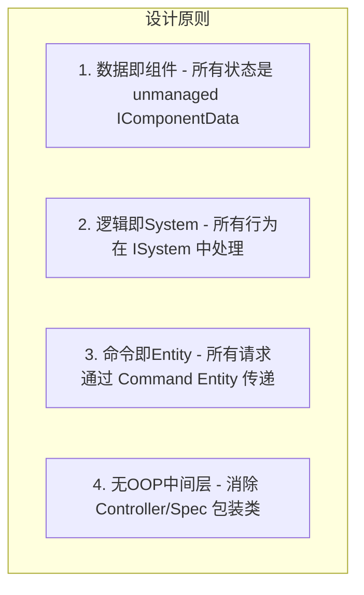

# 方案2 纯 ECS/DOTS 目标态方案

## 瘦身口径

> 已移除基于 2.0 旧状态的开头问题诊断和明显过时的旧状态对比；保留原始方案中仍可借鉴的设计章节、代码块、图示和实施思路。当前分支事实以 `../00-当前架构事实/README.md` 为准；当前任务路线以 `../02-主线任务树/README.md` 为准；目标态吸收关系以 `../01-目标态架构共识/README.md` 及各 Spec 的 `历史方案定位` 为准。

## 重新设计方案：纯 ECS/DOTS 架构

以下是完整的重新划分设计，每一段代码都附有设计理由说明。

---

### 核心设计原则



---

### 第一层：Tag 系统重设计 — Bitmask 替代 Buffer


**新设计**：用固定大小的 `ulong` 数组实现 Bitmask，`HasTag` 降为 O(1)。

```csharp
// ============================================================
// 文件: Components/CTagContainer.cs
// 设计理由:
//   1. 使用 FixedList 而非 DynamicBuffer，避免 Buffer 分配开销
//   2. 每个 ulong 存储 64 个 Tag 的状态位
//   3. 支持最多 256 个 Tag（4 个 ulong），覆盖绝大多数游戏需求
//   4. 完全 unmanaged，Burst 可编译，可在 Job 中并行读取
// ============================================================
public struct CTagContainer : IComponentData
{
    // 4 个 ulong = 256 个 Tag 槽位，按需扩展
    public ulong Bits0; // Tag ID 0-63
    public ulong Bits1; // Tag ID 64-127
    public ulong Bits2; // Tag ID 128-191
    public ulong Bits3; // Tag ID 192-255

    // O(1) 位运算，Burst 友好
    public bool HasTag(int tagId)
    {
        int slot = tagId >> 6;       // tagId / 64
        int bit  = tagId & 63;       // tagId % 64
        return slot switch
        {
            0 => (Bits0 >> bit & 1UL) != 0,
            1 => (Bits1 >> bit & 1UL) != 0,
            2 => (Bits2 >> bit & 1UL) != 0,
            3 => (Bits3 >> bit & 1UL) != 0,
            _ => false
        };
    }

    public void AddTag(int tagId)
    {
        int slot = tagId >> 6;
        int bit  = tagId & 63;
        switch (slot)
        {
            case 0: Bits0 |= 1UL << bit; break;
            case 1: Bits1 |= 1UL << bit; break;
            case 2: Bits2 |= 1UL << bit; break;
            case 3: Bits3 |= 1UL << bit; break;
        }
    }

    public void RemoveTag(int tagId)
    {
        int slot = tagId >> 6;
        int bit  = tagId & 63;
        switch (slot)
        {
            case 0: Bits0 &= ~(1UL << bit); break;
            case 1: Bits1 &= ~(1UL << bit); break;
            case 2: Bits2 &= ~(1UL << bit); break;
            case 3: Bits3 &= ~(1UL << bit); break;
        }
    }

    // 批量检查：HasAllTags 用 AND，HasAnyTags 用 OR
    // 这是 Bitmask 设计最大的优势：多 Tag 检查仍然是 O(1)
    public bool HasAllTags(in CTagContainer required)
        => (Bits0 & required.Bits0) == required.Bits0
        && (Bits1 & required.Bits1) == required.Bits1
        && (Bits2 & required.Bits2) == required.Bits2
        && (Bits3 & required.Bits3) == required.Bits3;

    public bool HasAnyTags(in CTagContainer any)
        => (Bits0 & any.Bits0) != 0
        || (Bits1 & any.Bits1) != 0
        || (Bits2 & any.Bits2) != 0
        || (Bits3 & any.Bits3) != 0;
}
```

**设计理由**：当前架构的 `BFixedTag` + `BTemporaryTag` 是两个独立 Buffer，合并检查需要遍历两次。新设计将固定Tag和临时Tag合并为一个 `CTagContainer`，Tag 的增删改查全部是位运算，且完全 Burst 兼容。

---

### 第二层：Attribute 系统重设计 — SoA 布局


**新设计**：将属性数据展平为 SoA（Structure of Arrays）布局，用 `DynamicBuffer` 存储纯数值，索引由代码生成器在编译期确定。

```csharp
// ============================================================
// 文件: Components/CAttributeValues.cs
// 设计理由:
//   1. 将所有属性的 BaseValue 和 CurrentValue 分开存储
//   2. 索引在代码生成阶段确定（编译期常量），运行时直接下标访问
//   3. BaseValues 和 CurrentValues 分离，方便 System 只读 Current
//      而不触碰 Base，减少 Chunk 失效
//   4. 完全 unmanaged，支持 Burst Job 并行读取
// ============================================================
public struct BAttrBase : IBufferElementData
{
    public float Value; // 基础值，由 GE 的 Override/Add 修改
}

public struct BAttrCurrent : IBufferElementData
{
    public float Value; // 当前值 = Base + 所有 Modifier 叠加结果
}

// 脏标记：只有 Base 被修改时才设置，避免每帧重算
// 这是性能关键：Current 值只在 Base 或 Modifier 变化时重算
public struct CAttrDirty : IComponentData, IEnableableComponent { }
```

```csharp
// ============================================================
// 文件: Systems/SRecalculateAttributes.cs
// 设计理由:
//   1. 只处理带有 CAttrDirty 的 Entity（IEnableableComponent 过滤）
//   2. 使用 IJobEntity 并行处理所有 ASC Entity
//   3. Burst 编译，无 GC 分配
//   4. 读取 GE Buffer 中的 Modifier，叠加到 Current
// ============================================================
[BurstCompile]
[UpdateInGroup(typeof(GASAttributeSystemGroup))]
public partial struct SRecalculateAttributes : ISystem
{
    [BurstCompile]
    public void OnUpdate(ref SystemState state)
    {
        // 只处理属性脏的 Entity，大幅减少每帧工作量
        new RecalcJob().ScheduleParallel();
    }

    [BurstCompile]
    partial struct RecalcJob : IJobEntity
    {
        // 只查询有 CAttrDirty 且 Enabled 的 Entity
        void Execute(
            ref DynamicBuffer<BAttrCurrent> currents,
            in DynamicBuffer<BAttrBase> bases,
            in DynamicBuffer<BGameplayEffectModifier> modifiers,
            EnabledRefRW<CAttrDirty> dirty)
        {
            // 1. 将 Current 重置为 Base
            for (int i = 0; i < bases.Length; i++)
                currents[i] = new BAttrCurrent { Value = bases[i].Value };

            // 2. 叠加所有激活的 Modifier（Add/Multiply/Override）
            for (int i = 0; i < modifiers.Length; i++)
            {
                var mod = modifiers[i];
                if (!mod.IsActive) continue;
                ref var cur = ref currents.ElementAt(mod.AttrIndex);
                cur.Value = mod.Operation switch
                {
                    ModOp.Add      => cur.Value + mod.Magnitude,
                    ModOp.Multiply => cur.Value * mod.Magnitude,
                    ModOp.Override => mod.Magnitude,
                    _              => cur.Value
                };
            }

            // 3. 清除脏标记，避免下帧重算
            dirty.ValueRW = false;
        }
    }
}
```

---

### 第三层：GameplayEffect 系统重设计 — 纯 ECS Entity


**新设计**：GE 本身就是 Entity，其生命周期完全由 System 管理，无需任何Controller包装。

```csharp
// ============================================================
// 文件: Components/GEComponents.cs
// 设计理由:
//   1. GE 的每个功能特性都是独立的 IComponentData
//   2. 没有 GE 功能的 Entity 不携带对应组件，节省内存
//   3. System 通过 EntityQuery 精确过滤，只处理相关 GE
//   4. 完全消除 GameplayEffectController 这个中间层
// ============================================================

// GE 的核心身份信息
public struct CGEIdentity : IComponentData
{
    public int ConfigId;    // 配置表 ID
    public Entity Owner;    // 施法者 ASC Entity
    public Entity Target;   // 目标 ASC Entity
}

// 持续时间（只有 Duration GE 才有此组件）
public struct CGEDuration : IComponentData
{
    public float TotalDuration;
    public float RemainingTime;
}

// 周期触发（只有 Periodic GE 才有此组件）
public struct CGEPeriod : IComponentData
{
    public float Period;
    public float TimeSinceLastTick;
}

// 叠加层数（只有 Stacking GE 才有此组件）
public struct CGEStack : IComponentData
{
    public int CurrentStack;
    public int MaxStack;
    public StackPolicy Policy; // Aggregate / Independent
}

// GE 携带的 Modifier 列表（存在 Buffer 中）
public struct BGEModifier : IBufferElementData
{
    public int    AttrSetId;
    public int    AttrIndex;
    public ModOp  Operation;
    public float  Magnitude;
    public int    MmcId;      // 0 = 无 MMC
}

// GE 授予的 Tag（存在 Buffer 中）
public struct BGEGrantedTag : IBufferElementData
{
    public int TagId;
}

// 标记：GE 已被应用到目标（下一帧由 System 处理激活逻辑）
public struct CGEPendingApply : IComponentData, IEnableableComponent { }

// 标记：GE 需要被移除
public struct CGEPendingRemove : IComponentData, IEnableableComponent { }
```

```csharp
// ============================================================
// 文件: Systems/SGEDurationTick.cs
// 设计理由:
//   1. 纯 ISystem + IJobEntity，完全 Burst 编译
//   2. 只处理有 CGEDuration 的 Entity（精确查询）
//   3. 到期的 GE 通过 EnabledRefRW<CGEPendingRemove> 标记，
//      由专门的 SRemoveExpiredGE System 统一清理
//   4. 职责单一：只负责时间推进，不负责移除
// ============================================================
[BurstCompile]
[UpdateInGroup(typeof(GASEffectSystemGroup))]
public partial struct SGEDurationTick : ISystem
{
    [BurstCompile]
    public void OnUpdate(ref SystemState state)
    {
        float dt = SystemAPI.Time.DeltaTime;
        new TickJob { DeltaTime = dt }.ScheduleParallel();
    }

    [BurstCompile]
    partial struct TickJob : IJobEntity
    {
        public float DeltaTime;

        void Execute(
            ref CGEDuration duration,
            EnabledRefRW<CGEPendingRemove> pendingRemove)
        {
            duration.RemainingTime -= DeltaTime;
            if (duration.RemainingTime <= 0f)
                pendingRemove.ValueRW = true; // 标记待移除，不直接销毁
        }
    }
}
```

---

### 第四层：Ability 系统重设计 — 消除 AbilityController 和 AbilitySpec


**新设计**：Ability 激活请求通过 Command Entity 传递，System 通过 EntityQuery 批量处理。

```csharp
// ============================================================
// 文件: Components/AbilityComponents.cs
// 设计理由:
//   1. 消除 AbilityController._specs Dictionary，
//      改用 ECS 原生的 EntityQuery 查找
//   2. 激活/结束/取消 通过 IEnableableComponent 标记，
//      避免 Structural Change（AddComponent/RemoveComponent）
//      的 Sync Point 开销
//   3. AbilityLogic 的"OOP继承"改为"策略ID + 纯数据参数"，
//      由 System 根据 LogicType 分发处理
// ============================================================

// Ability 的核心身份（每个 Ability Entity 必有）
public struct CAbilityIdentity : IComponentData
{
    public int ConfigId;   // 配置 ID，用于查找配置
    public Entity Owner;   // 所属 ASC Entity
    public int Level;
}

// Ability 的逻辑类型（替代 MCAbilityLogic 的 Managed Component）
// 设计理由：用 int 枚举替代 C# 类引用，Burst 可编译
public struct CAbilityLogicType : IComponentData
{
    public int LogicTypeId; // 对应代码生成的常量，如 AbilityLogicType.Melee = 1
}

// Ability 的自定义参数（替代 XParam 的 OOP 对象）
// 设计理由：用 FixedBytes 存储序列化参数，避免 Managed 引用
public struct CAbilityParam : IComponentData
{
    public FixedBytes126 Data; // 最多 126 字节的参数数据
}

// 激活状态标记（IEnableableComponent 避免 Structural Change）
public struct CAbilityActive : IComponentData, IEnableableComponent { }

// 激活请求标记
public struct CAbilityActivateRequest : IComponentData, IEnableableComponent { }

// 结束请求标记
public struct CAbilityEndRequest : IComponentData, IEnableableComponent { }

// 取消请求标记
public struct CAbilityCancelRequest : IComponentData, IEnableableComponent { }
```

```csharp
// ============================================================
// 文件: Systems/STryActivateAbility.cs
// 设计理由:
//   1. 完全消除 AbilityController.TryActivateAbility 的 O(n) 遍历
//   2. EntityQuery 由 ECS 内部用 Archetype 索引，接近 O(1)
//   3. 使用 IEnableableComponent 而非 AddComponent，
//      避免每次激活都产生 Structural Change（Sync Point）
//   4. Tag/Cost/CD 检查全部在 Job 内完成，Burst 编译
// ============================================================
[BurstCompile]
[UpdateInGroup(typeof(GASAbilitySystemGroup))]
public partial struct STryActivateAbility : ISystem
{
    [BurstCompile]
    public void OnUpdate(ref SystemState state)
    {
        // 只处理有激活请求的 Ability Entity
        // EntityQuery 自动过滤，无需手动遍历
        var ecb = SystemAPI
            .GetSingleton<BeginSimulationEntityCommandBufferSystem.Singleton>()
            .CreateCommandBuffer(state.WorldUnmanaged);

        new ActivateJob { Ecb = ecb.AsParallelWriter() }.ScheduleParallel();
    }

    [BurstCompile]
    partial struct ActivateJob : IJobEntity
    {
        public EntityCommandBuffer.ParallelWriter Ecb;

        // 只处理有 CAbilityActivateRequest(Enabled) 的 Entity
        void Execute(
            Entity entity,
            [ChunkIndexInQuery] int chunkIndex,
            in CAbilityIdentity identity,
            in CAbilityLogicType logicType,
            EnabledRefRW<CAbilityActivateRequest> request,
            EnabledRefRW<CAbilityActive> active,
            // 从 Owner ASC 读取 Tag（ComponentLookup，只读）
            [ReadOnly] ComponentLookup<CTagContainer> tagLookup,
            // 从 Owner ASC 读取属性（BufferLookup，只读）
            [ReadOnly] BufferLookup<BAttrCurrent> attrLookup)
        {
            // 1. 清除请求标记（无论成功失败）
            request.ValueRW = false;

            // 2. Tag 检查（Bitmask O(1)）
            if (!tagLookup.TryGetComponent(identity.Owner, out var ownerTags))
                return;
            // ... 检查 ActivationRequiredTags / BlockedTags

            // 3. Cost 检查（直接读 Buffer，无 OOP 调用）
            // ...

            // 4. CD 检查
            // ...

            // 5. 激活：启用 CAbilityActive 标记
            active.ValueRW = true;

            // 6. 触发激活逻辑（通过 LogicTypeId 分发，而非虚函数）
            // 不同 LogicType 的 System 各自处理自己的 Entity
        }
    }
}
```

---

### 第五层：ASC 重设计 — 消除 MonoBehaviour 包装


**新设计**：ASC 就是 Entity，MonoBehaviour 只做"桥接"，不持有任何状态。

```csharp
// ============================================================
// 文件: AbilitySystemBridge.cs
// 设计理由:
//   1. MonoBehaviour 只持有 Entity 引用，不持有任何 Controller
//   2. 所有状态都在 ECS Entity 上，MonoBehaviour 只是"门牌号"
//   3. 消除 AbilitySystemCell 这个中间层
//   4. 对外 API 通过 EntityCommandBuffer 提交请求，
//      不直接操作 ECS（避免主线程 Sync Point）
// ============================================================
public class AbilitySystemBridge : MonoBehaviour
{
    // 唯一状态：对应的 ECS Entity
    public Entity AscEntity { get; private set; }

    private EntityManager _em;
    private EntityCommandBuffer _ecb; // 延迟命令缓冲

    private void Awake()
    {
        var world = World.DefaultGameObjectInjectionWorld;
        _em = world.EntityManager;

        // 创建 ASC Entity，附加所有必要组件
        AscEntity = _em.CreateEntity(
            typeof(CTagContainer),      // Tag Bitmask
            typeof(BAttrBase),          // 属性基础值 Buffer
            typeof(BAttrCurrent),       // 属性当前值 Buffer
            typeof(BGameplayEffect),    // 激活的 GE Buffer
            typeof(BAbilityRef),        // Ability Entity 引用 Buffer
            typeof(CAscLevel),          // 等级
            typeof(CAttrDirty)          // 属性脏标记
        );

        // 绑定 GameObject（用于 Cue 等表现层）
        _em.AddComponentObject(AscEntity, gameObject);
    }

    private void OnDestroy()
    {
        if (_em.Exists(AscEntity))
            _em.DestroyEntity(AscEntity);
    }

    // ============================================================
    // 对外 API：提交 Command Entity，不直接操作 ECS
    // 设计理由：避免主线程直接调用 EntityManager 产生 Sync Point
    // ============================================================
    public void TryActivateAbility(int abilityConfigId)
    {
        // 找到对应的 Ability Entity，启用激活请求标记
        // 通过 SystemAPI 或 EntityCommandBuffer 提交
        var system = World.DefaultGameObjectInjectionWorld
            .GetExistingSystemManaged<GASCommandSystem>();
        system.EnqueueActivateAbility(AscEntity, abilityConfigId);
    }

    public void ApplyGameplayEffect(int geConfigId, Entity target)
    {
        var system = World.DefaultGameObjectInjectionWorld
            .GetExistingSystemManaged<GASCommandSystem>();
        system.EnqueueApplyGE(AscEntity, target, geConfigId);
    }
}
```

---

### 第六层：System Group 重新划分


**新设计**：

```csharp
// ============================================================
// 文件: SystemGroups.cs
// 设计理由：
//   严格按照数据依赖顺序排列，确保每个 Group 的输入数据
//   在上一个 Group 执行完毕后已经稳定
// ============================================================

// 1. 命令处理：将外部请求转化为 ECS 状态变更
[UpdateInGroup(typeof(SimulationSystemGroup), OrderFirst = true)]
public partial class GASCommandGroup : ComponentSystemGroup { }

// 2. Tag 处理：Tag 变化会影响 GE 和 Ability 的条件判断
//    必须在 GE/Ability 处理之前完成
[UpdateInGroup(typeof(SimulationSystemGroup))]
[UpdateAfter(typeof(GASCommandGroup))]
public partial class GASTagSystemGroup : ComponentSystemGroup { }

// 3. GE 处理：GE 的 Tick/到期/Modifier 变化会影响属性
//    必须在属性重算之前完成
[UpdateInGroup(typeof(SimulationSystemGroup))]
[UpdateAfter(typeof(GASTagSystemGroup))]
public partial class GASEffectSystemGroup : ComponentSystemGroup { }

// 4. 属性重算：依赖 GE Modifier 的最终状态
[UpdateInGroup(typeof(SimulationSystemGroup))]
[UpdateAfter(typeof(GASEffectSystemGroup))]
public partial class GASAttributeSystemGroup : ComponentSystemGroup { }

// 5. Ability 处理：依赖 Tag 和属性的最终状态做条件检查
[UpdateInGroup(typeof(SimulationSystemGroup))]
[UpdateAfter(typeof(GASAttributeSystemGroup))]
public partial class GASAbilitySystemGroup : ComponentSystemGroup { }

// 6. Cue 处理：纯表现层，依赖所有逻辑层的最终状态
//    放在 PresentationSystemGroup，与渲染同步
[UpdateInGroup(typeof(PresentationSystemGroup))]
public partial class GASCueSystemGroup : ComponentSystemGroup { }
```

---

### 关于"OOP中间层是否完全可以消除"的客观说明

有一点需要客观指出：**Ability 的自定义逻辑（AbilityLogicBase 的继承体系）是最难纯ECS化的部分**。

当前的 `MCAbilityLogic`（Managed Component）存储 `AbilityLogicBase` 实例，这是因为 Ability 的逻辑本质上是"行为"而非"数据"，纯数据化需要将所有可能的 Ability 行为枚举为有限的 `LogicTypeId`，并为每种类型写一个专门的 System。这在大型项目中会导致 System 数量爆炸。

**实用的折中方案**：
- **数据层**（Tag、Attribute、GE生命周期、CD、Cost）：完全纯ECS，Burst编译
- **逻辑层**（AbilityLogic 的具体行为）：保留 Managed System，但消除 Controller/Spec 包装，直接在 System 中操作 Entity

这样可以获得 80% 的性能收益（数据层是热路径），同时保持 Ability 逻辑的可扩展性。
