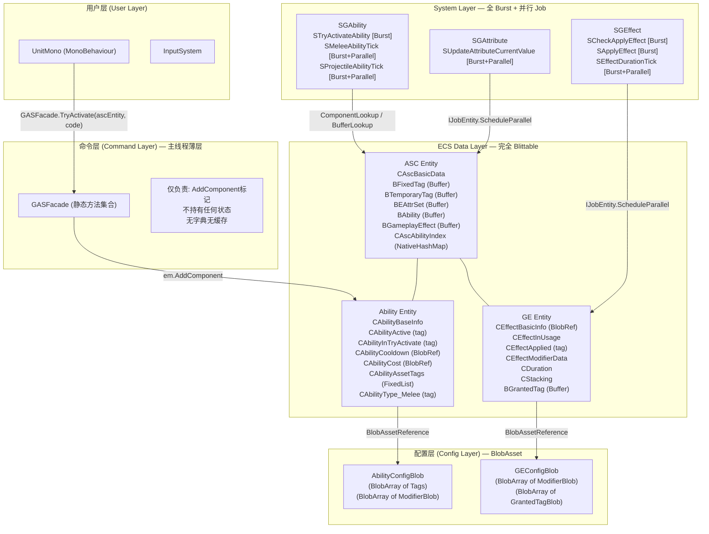

# EX-GAS 2.0 深度架构分析与 DOTS 重构方案

## 瘦身口径

> 已移除基于 2.0 旧状态的开头问题诊断和明显过时的旧状态对比；保留原始方案中仍可借鉴的设计章节、代码块、图示和实施思路。当前分支事实以 `../00-当前架构事实/README.md` 为准；当前任务路线以 `../02-主线任务树/README.md` 为准；目标态吸收关系以 `../01-目标态架构共识/README.md` 及各 Spec 的 `历史方案定位` 为准。

## 二、重构方案：纯 DOTS 架构设计

### 核心设计原则

```
1. 数据完全 Blittable — 消除所有 NativeArray in IComponentData
2. Burst 全覆盖热路径 — 所有 System.OnUpdate 加 [BurstCompile]
3. 零 GC 运行时 — 消除所有运行时堆分配
4. 消除 OOP 中间层 — 用 ComponentLookup + EntityQuery 替代 Spec/Controller
5. 并行化 — 用 IJobEntity.ScheduleParallel() 替代 foreach
```

---

### 重构点 1：用 `FixedList` 替换 `NativeArray<int>` in IComponentData


```csharp
// ❌ 当前：NativeArray in IComponentData — 需要手动 Dispose，无法 Burst
public struct CAbilityAssetTags : IComponentData {
    public NativeArray<int> tags; // Allocator.Persistent，手动管理
}

// ✅ 重构后：FixedList — 值类型，Burst 友好，零分配
// FixedList128Bytes<int> 可存 32 个 int（128/4），足够大多数 Tag 场景
public struct CAbilityAssetTags : IComponentData {
    public FixedList128Bytes<int> tags; // 栈上值类型，无需 Dispose
}

// 对于超大 Tag 集合（如 GE 的 GrantedTags），使用 DynamicBuffer
public struct BGrantedTag : IBufferElementData {
    public int TagId;
}
```

**合理性**：`FixedList128Bytes<int>` 是 Unity.Collections 提供的值类型固定容量列表，完全 Blittable，可被 Burst 编译，无需手动 Dispose。GAS 中单个 Ability/Effect 的 Tag 数量通常不超过 16 个，128 字节（32 个 int）绰绰有余。

---

### 重构点 2：用 `BlobAsset` 存储静态配置数据，消除原型 Entity


```csharp
// ❌ 当前：用 Entity 存储原型配置
public struct CAbilityCooldown : IComponentData {
    public int Cooldown;
    public NativeArray<int> CooldownTags;
    public Entity ProtoGameplayEffectCooldown; // Entity 作为配置载体
}

// ✅ 重构后：BlobAsset 存储不可变配置
public struct AbilityCooldownBlob {
    public int Cooldown;
    public BlobArray<int> CooldownTags;
    public BlobArray<EffectModifierBlob> CostModifiers;
}

public struct CAbilityCooldown : IComponentData {
    public BlobAssetReference<AbilityCooldownBlob> Config; // 不可变，共享，零拷贝
    public int RemainingFrames; // 运行时状态
}

// BlobAsset 构建（在初始化时一次性完成）
public static BlobAssetReference<AbilityCooldownBlob> BuildCooldownBlob(
    int cooldown, int[] tags)
{
    var builder = new BlobBuilder(Allocator.Temp);
    ref var root = ref builder.ConstructRoot<AbilityCooldownBlob>();
    root.Cooldown = cooldown;
    var tagsArray = builder.Allocate(ref root.CooldownTags, tags.Length);
    for (int i = 0; i < tags.Length; i++) tagsArray[i] = tags[i];
    var result = builder.CreateBlobAssetReference<AbilityCooldownBlob>(Allocator.Persistent);
    builder.Dispose();
    return result;
}
```

**合理性**：`BlobAsset` 是 Unity DOTS 专为不可变共享数据设计的结构。GE 配置、Ability 配置在运行时不会改变，完全符合 BlobAsset 的使用场景。多个 Ability 可以共享同一个 BlobAsset，内存效率极高。

---

### 重构点 3：消除 `MCAbilityLogic`，用 `IAbilitySystem` 接口 + 分离 System 替代虚函数


```csharp
// ❌ 当前：托管虚函数，无法 Burst
public abstract class AbilityLogicBase {
    public abstract void ActivateAbility(GlobalTimer timer);
    public abstract void AbilityTick(GlobalTimer timer);
}

// ✅ 重构后方案 A：数据驱动 + 分离 System（推荐）
// 每种 Ability 类型对应一个独立的 Tag Component + 独立的 System

// 1. 定义 Ability 类型标记组件（零大小，仅用于 Archetype 分类）
public struct CAbilityType_Melee : IComponentData { }
public struct CAbilityType_Projectile : IComponentData { }
public struct CAbilityType_Timeline : IComponentData { }

// 2. 每种类型有自己的数据组件
public struct CAbilityMeleeData : IComponentData {
    public float AttackRange;
    public int HitCount;
    public int DamageEffectConfigId;
}

// 3. 每种类型有自己的 Burst 编译 System
[BurstCompile]
[UpdateInGroup(typeof(SGAbility))]
public partial struct SMeleeAbilityTick : ISystem
{
    [BurstCompile]
    public void OnUpdate(ref SystemState state)
    {
        new MeleeTickJob {
            Timer = SystemAPI.GetSingleton<GlobalTimer>(),
            ECB = SystemAPI.GetSingleton<BeginSimulationEntityCommandBufferSystem.Singleton>()
                      .CreateCommandBuffer(state.WorldUnmanaged).AsParallelWriter()
        }.ScheduleParallel();
    }
}

[BurstCompile]
partial struct MeleeTickJob : IJobEntity
{
    public GlobalTimer Timer;
    public EntityCommandBuffer.ParallelWriter ECB;

    // 只处理 CAbilityType_Melee + CAbilityActive 的 Entity
    void Execute([ChunkIndexInQuery] int chunkIndex, Entity entity,
        ref CAbilityMeleeData meleeData, in CAbilityActive active, in CAbilityBaseInfo info)
    {
        // 纯数据操作，完全 Burst 编译，可并行
        meleeData.ElapsedFrames++;
        if (meleeData.ElapsedFrames >= meleeData.HitFrame)
        {
            ECB.AddComponent<CAbilityInTryEnd>(chunkIndex, entity);
        }
    }
}
```

**合理性**：这是 Unity DOTS 官方推荐的多态替代方案。每种 Ability 类型形成独立的 Archetype，ECS 的 Chunk 机制天然实现了"类型分组"，System 通过 `WithAll<CAbilityType_Melee>()` 精确过滤，比虚函数调用更高效。

---

### 重构点 4：消除 `EntityHelper` 全局静态 ECB，改用 ECB System

```csharp
// ❌ 当前：全局静态 ECB，不可并行，有 GC
EntityHelper.RegisterEntityCommandBuffer();
EntityHelper.AddComponent<CAbilityInTryActivate>(entity);
EntityHelper.ExecuteDeferredCommands(); // 隐式二次提交
EntityHelper.UnregisterEntityCommandBuffer();

// ✅ 重构后：使用 Unity 内置 ECB System，支持并行写入
[BurstCompile]
public partial struct STryActivateAbility : ISystem
{
    [BurstCompile]
    public void OnUpdate(ref SystemState state)
    {
        // 从 ECB System 获取 ECB，自动在正确时机 Playback
        var ecb = SystemAPI
            .GetSingleton<BeginSimulationEntityCommandBufferSystem.Singleton>()
            .CreateCommandBuffer(state.WorldUnmanaged)
            .AsParallelWriter(); // 支持并行写入

        new TryActivateJob { ECB = ecb, Timer = SystemAPI.GetSingleton<GlobalTimer>() }
            .ScheduleParallel();
    }
}

[BurstCompile]
partial struct TryActivateJob : IJobEntity
{
    public EntityCommandBuffer.ParallelWriter ECB;
    [ReadOnly] public GlobalTimer Timer;

    void Execute([ChunkIndexInQuery] int sortKey, Entity entity,
        in CAbilityInTryActivate _, in CAbilityBaseInfo info,
        in CAbilityActivationRequiredTags reqTags)
    {
        // 纯 Burst 逻辑：检查 Tag、CD、Cost
        // 通过 ComponentLookup 读取 ASC 数据
        ECB.RemoveComponent<CAbilityInTryActivate>(sortKey, entity);
        ECB.AddComponent<CAbilityActive>(sortKey, entity);
    }
}
```

**合理性**：Unity 的 `BeginSimulationEntityCommandBufferSystem` 等内置 ECB System 在正确的时机自动 Playback，无需手动管理。`AsParallelWriter()` 允许多个 Job 线程安全地写入同一个 ECB，彻底解锁并行化。

---

### 重构点 5：消除 `GASManager._bindingAsc` 字典，用 `ComponentLookup` 替代

```csharp
// ❌ 当前：全局字典，主线程，无法在 Job 中使用
GASManager.GetAscFromEntity(entity) // Dictionary<Entity, AbilitySystemCell>

// ✅ 重构后：完全消除 OOP 层，在 System 中用 ComponentLookup 直接访问
[BurstCompile]
partial struct EffectApplyJob : IJobEntity
{
    // ComponentLookup 是线程安全的只读访问器
    [ReadOnly] public ComponentLookup<CAscBasicData> AscBasicDataLookup;
    [ReadOnly] public BufferLookup<BEAttrSet> AttrSetLookup;
    [ReadOnly] public BufferLookup<BFixedTag> TagLookup;

    void Execute(Entity geEntity, in CEffectInUsage usage, in CEffectApplyPending _)
    {
        var targetAsc = usage.Target;
        if (!AscBasicDataLookup.HasComponent(targetAsc)) return;

        // 直接通过 Lookup 访问目标 ASC 的数据，无需字典
        var attrSets = AttrSetLookup[targetAsc];
        var tags = TagLookup[targetAsc];
        // ... 执行 modifier 计算
    }
}
```

**合理性**：`ComponentLookup<T>` 和 `BufferLookup<T>` 是 Unity DOTS 为"随机访问"场景设计的工具，支持在 Job 中安全使用，完全替代了 `Dictionary<Entity, T>` 的功能，且无 GC、可 Burst。

---

### 重构点 6：`AbilityController` 的 O(n) 查找 → `NativeHashMap` Singleton

```csharp
// ❌ 当前：O(n) 线性扫描 + 托管字典双重维护
private Dictionary<int, AbilitySpec> _specs = new(); // 托管字典
// 每次操作都要遍历 DynamicBuffer<BAbility>

// ✅ 重构后：在 ASC Entity 上存储 NativeHashMap（或用 BlobAsset 索引）
// 方案：将 Code→Entity 映射存为 ASC 的一个组件
public struct CAscAbilityIndex : IComponentData, IDisposable
{
    public NativeHashMap<int, Entity> CodeToAbilityEntity;

    public void Dispose() => CodeToAbilityEntity.Dispose();
}

// 授予 Ability 时同步更新索引
public static void GrantAbility(EntityManager em, Entity asc, Entity abilityEntity, int code)
{
    var buffer = em.GetBuffer<BAbility>(asc);
    buffer.Add(new BAbility { Ability = abilityEntity });

    var index = em.GetComponentData<CAscAbilityIndex>(asc);
    index.CodeToAbilityEntity[code] = abilityEntity; // O(1) 插入
    em.SetComponentData(asc, index);
}

// 激活时 O(1) 查找
public static void TryActivateAbility(EntityManager em, Entity asc, int code)
{
    var index = em.GetComponentData<CAscAbilityIndex>(asc);
    if (index.CodeToAbilityEntity.TryGetValue(code, out var abilityEntity))
        em.AddComponent<CAbilityInTryActivate>(abilityEntity);
}
```

---

### 重构点 7：属性计算 Burst 化 — 用 `BlobAsset` 存储 MMC 配置

```csharp
// ❌ 当前：MMC 是托管虚函数，无法 Burst
// AttributeHelper.RecalculateCurrentValue 内部调用 MMC 虚函数

// ✅ 重构后：MMC 用 BlobAsset + 函数指针（FunctionPointer<T>）实现
public struct MmcBlob {
    public int MmcType; // 枚举：Linear, Curve, Custom...
    public float Coefficient;
    public float PreMultiplyAdditiveValue;
    public float PostMultiplyAdditiveValue;
    public int SourceAttrSetCode;
    public int SourceAttrCode;
}

// 属性计算 System — 完全 Burst
[BurstCompile]
public partial struct SUpdateAttributeCurrentValue : ISystem
{
    [BurstCompile]
    public void OnUpdate(ref SystemState state)
    {
        new RecalcAttrJob {
            GEBufferLookup = SystemAPI.GetBufferLookup<BGameplayEffect>(true),
            ModifierLookup = SystemAPI.GetComponentLookup<CEffectModifierData>(true),
        }.ScheduleParallel();
    }
}

[BurstCompile]
partial struct RecalcAttrJob : IJobEntity
{
    [ReadOnly] public BufferLookup<BGameplayEffect> GEBufferLookup;
    [ReadOnly] public ComponentLookup<CEffectModifierData> ModifierLookup;

    void Execute(Entity asc, ref DynamicBuffer<BEAttrSet> attrSets,
        in CAttributeIsDirty _)
    {
        for (int i = 0; i < attrSets.Length; i++)
        {
            var attrSet = attrSets[i];
            for (int j = 0; j < attrSet.Attributes.Length; j++)
            {
                ref var attr = ref attrSet.Attributes.ElementAt(j);
                if (!attr.Dirty) continue;

                float current = attr.BaseValue;
                // 遍历所有激活的 GE，累加 Modifier
                var geBuffer = GEBufferLookup[asc];
                for (int k = 0; k < geBuffer.Length; k++)
                {
                    var ge = geBuffer[k].Effect;
                    if (!ModifierLookup.HasComponent(ge)) continue;
                    var mod = ModifierLookup[ge];
                    if (mod.AttrSetCode == attrSet.Code && mod.AttrCode == attr.Code)
                        current = ApplyModifier(current, mod); // 纯函数，Burst 友好
                }
                attr.CurrentValue = current;
                attr.Dirty = false;
            }
        }
    }

    [BurstCompile]
    static float ApplyModifier(float base_, in CEffectModifierData mod) => mod.Operation switch {
        GEOperation.Add      => base_ + mod.Magnitude,
        GEOperation.Multiply => base_ * mod.Magnitude,
        GEOperation.Override => mod.Magnitude,
        _                    => base_
    };
}
```

---

## 三、重构后的整体架构图



---

## 五、关于"OOP 门面"的保留策略

完全消除 OOP 层对用户不友好。合理的做法是**保留薄层门面，但改为只读快照模式**：

```csharp
// ✅ 重构后的薄层门面 — 只读快照，不持有状态
// 用 readonly struct 替代 class，栈上分配，零 GC
public readonly struct AbilityHandle
{
    private readonly Entity _entity;
    // 不持有任何缓存，不持有 EntityManager 引用
    // 所有操作通过静态方法 + 传入 EntityManager 完成

    public AbilityHandle(Entity entity) => _entity = entity;

    // 命令方法：只添加标记组件，不读取数据
    public void TryActivate(EntityManager em)
        => em.AddComponent<CAbilityInTryActivate>(_entity);

    public void TryEnd(EntityManager em)
        => em.AddComponent<CAbilityInTryEnd>(_entity);
}

// 用法：
var handle = new AbilityHandle(abilityEntity); // 栈上，零 GC
handle.TryActivate(GASManager.EntityManager);
```

这样的 `AbilityHandle` 是一个 `readonly struct`（值类型），栈上分配，零 GC，职责单一（只发命令），不持有任何状态，彻底消除了当前 `AbilitySpec` 519 行的复杂度。 [13](#0-12) [14](#0-13) [15](#0-14) [16](#0-15) [17](#0-16)
