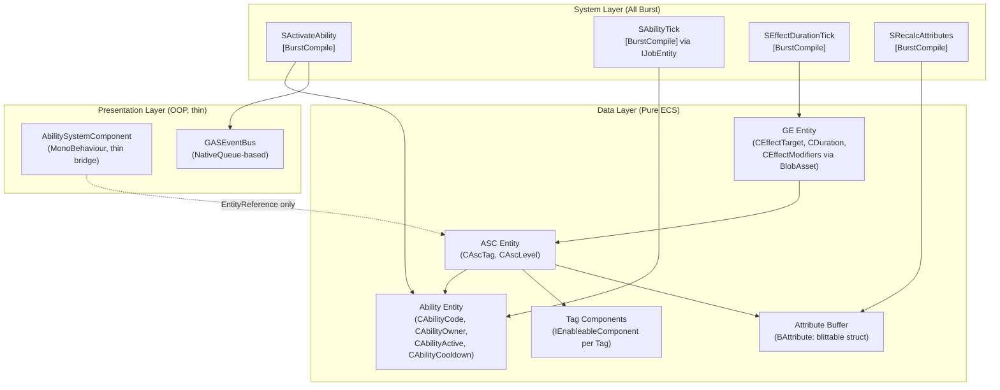

# EX-GAS 2.0 深度架构分析与 DOTS 原生重构方案

## 瘦身口径

> 已移除基于 2.0 旧状态的开头问题诊断和明显过时的旧状态对比；保留原始方案中仍可借鉴的设计章节、代码块、图示和实施思路。当前分支事实以 `../00-当前架构事实/README.md` 为准；当前任务路线以 `../02-主线任务树/README.md` 为准；目标态吸收关系以 `../01-目标态架构共识/README.md` 及各 Spec 的 `历史方案定位` 为准。

## 二、重构架构设计

### 设计原则

```
1. ASC = 纯 ECS Entity，无 OOP 包装类
2. Ability 逻辑 = ISystem + IComponentData，彻底消灭 AbilityLogicBase 抽象类
3. Tag = EnableableComponent（运行时状态）+ BlobAsset（静态配置）
4. 消除 EntityHelper 全局状态，每个 System 自持 ECB
5. 消除 GASManager._bindingAsc 字典，用 ECS 组件替代
6. 所有热路径 System 必须能 [BurstCompile]
```

### 重构后的架构总览



---

## 三、以真实 Ability 业务为例的重构链路

### 业务场景：战士释放"旋风斩"

**旋风斩逻辑**：
1. 检查 Tag：角色不能处于 `State.Stunned`，必须有 `State.Grounded`
2. 消耗 50 点 Stamina（Cost GE）
3. 进入 3 秒 CD（Cooldown GE）
4. 激活期间每 0.5 秒对周围敌人施加一次 `GE_Damage`
5. 激活时给自身添加 `Ability.Whirlwind` Tag，防止其他技能打断

---

### 重构后的执行链路

#### Step 1：重新定义 ASC 和 Ability 的 ECS 数据结构

```csharp
// ============================================================
// 文件: Assets/GAS/Runtime/Core/Components/AscComponents.cs
// 职责: ASC Entity 的纯 ECS 数据定义，无任何 OOP 引用
// ============================================================

namespace GAS.Runtime
{
    // ASC 身份标记
    public struct CAscTag : IComponentData { }

    // ASC 等级（blittable，Burst 友好）
    public struct CAscLevel : IComponentData
    {
        public int Value;
    }

    // 属性 Buffer 元素（完全 blittable）
    // 对比当前：BEAttrSet 内部嵌套了 Attributes 数组，结构复杂
    // 重构后：扁平化，每个 Attribute 是一个独立 Buffer 元素
    public struct BAttribute : IBufferElementData
    {
        public int AttrSetCode;
        public int AttrCode;
        public float BaseValue;
        public float CurrentValue;
        public bool Dirty;
    }

    // Tag 运行时状态：使用 EnableableComponent
    // 对比当前：NativeArray<int> 存储 Tag，需要手动 Dispose
    // 重构后：每个 Tag 对应一个 EnableableComponent，SetComponentEnabled 即可
    // 优势：ECS 原生支持，Burst 可访问，无内存泄漏风险
    // 参考：Unity Entities 文档 "Enableable components" 章节
    public struct CTagEnabled : IComponentData, IEnableableComponent
    {
        public int TagId; // 标识是哪个 Tag
    }

    // 更好的方案：为每个常用 Tag 生成专属 EnableableComponent
    // 通过 Luban 代码生成，每个 Tag 对应一个 struct
    // 例如：
    public struct CTag_State_Stunned : IComponentData, IEnableableComponent { }
    public struct CTag_State_Grounded : IComponentData, IEnableableComponent { }
    public struct CTag_Ability_Whirlwind : IComponentData, IEnableableComponent { }
}
```

#### Step 2：Ability Entity 的纯 ECS 数据定义

```csharp
// ============================================================
// 文件: Assets/GAS/Runtime/Core/Components/AbilityComponents.cs
// 职责: Ability Entity 的纯 ECS 数据，彻底消灭 MCAbilityLogic 托管组件
// ============================================================

namespace GAS.Runtime
{
    // Ability 基础信息（blittable）
    // 对比当前：CAbilityBaseInfo 已经是 blittable，这里保持
    public struct CAbilityBaseInfo : IComponentData
    {
        public int Code;
        public int Level;
        public Entity Owner; // 指向 ASC Entity
    }

    // Ability 激活状态标记（EnableableComponent，比 Add/Remove Component 更高效）
    // 对比当前：CAbilityActive 是普通 IComponentData，每次激活/结束都要 Add/Remove
    // 重构后：使用 IEnableableComponent，SetComponentEnabled 不触发 Archetype 变更
    // 参考：Unity Entities 文档 "Enableable components avoid archetype changes"
    public struct CAbilityActive : IComponentData, IEnableableComponent { }

    // 激活意图标记（同样用 EnableableComponent）
    public struct CAbilityInTryActivate : IComponentData, IEnableableComponent { }
    public struct CAbilityInTryEnd : IComponentData, IEnableableComponent { }
    public struct CAbilityInTryCancel : IComponentData, IEnableableComponent { }

    // Ability 的 Tag 配置：使用 BlobAsset 存储静态数据
    // 对比当前：NativeArray<int> 存储在 IComponentData 中，需要手动 Dispose
    // 重构后：BlobAsset 是不可变的、引用计数的，无需手动释放
    // 参考：Unity Entities 文档 "BlobAsset" 章节
    public struct CAbilityTagConfig : IComponentData
    {
        public BlobAssetReference<AbilityTagBlob> Config;
    }

    public struct AbilityTagBlob
    {
        public BlobArray<int> AssetTags;
        public BlobArray<int> ActivationOwnedTags;
        public BlobArray<int> ActivationRequiredTags;
        public BlobArray<int> ActivationBlockedTags;
        public BlobArray<int> CancelAbilityTags;
    }

    // Ability 冷却（blittable）
    public struct CAbilityCooldown : IComponentData
    {
        public int CooldownFrames;
        public int CooldownStartFrame;
        public bool IsOnCooldown;
    }

    // Ability 类型标记（用于 System 分发，替代虚方法调用）
    // 这是消灭 AbilityLogicBase 抽象类的关键
    // 每种 Ability 类型对应一个 IComponentData 标记
    public struct CAbilityType_Whirlwind : IComponentData { }
    public struct CAbilityType_Fireball : IComponentData { }
    // ... 通过 Luban 代码生成
}
```

#### Step 3：消灭 `AbilityLogicBase`，用 `ISystem` + `IJobEntity` 替代

这是最核心的重构。当前架构中，每种 Ability 的逻辑封装在 `AbilityLogicBase` 的子类中，通过虚方法调用。这是 OOP 多态，无法 Burst。

**重构思路**：每种 Ability 类型对应一个独立的 `ISystem`，通过 `WithAll<CAbilityType_Whirlwind>()` 过滤，实现**编译期多态**而非运行时虚方法。

```csharp
// ============================================================
// 文件: Assets/GAS/Runtime/System/Ability/Whirlwind/SWhirlwindActivate.cs
// 业务场景：旋风斩激活逻辑
// 对比当前：WhirlwindAbilityLogic.ActivateAbility() 是托管类虚方法
// 重构后：纯 ISystem + IJobEntity，全程 BurstCompile
// ============================================================

namespace GAS.Runtime
{
    [UpdateInGroup(typeof(SGAbility))]
    [UpdateAfter(typeof(SAbilityActivateGate))] // 通用激活门控之后
    [BurstCompile]
    public partial struct SWhirlwindActivate : ISystem
    {
        [BurstCompile]
        public void OnCreate(ref SystemState state)
        {
            // 只处理：有激活意图 + 是旋风斩类型 + 激活门控已通过
            state.RequireForUpdate<CAbilityInTryActivate>();
            state.RequireForUpdate<CAbilityType_Whirlwind>();
        }

        [BurstCompile]
        public void OnUpdate(ref SystemState state)
        {
            var ecb = new EntityCommandBuffer(Allocator.Temp);
            var globalTimer = SystemAPI.GetSingleton<GlobalTimer>();

            // IJobEntity：并行处理所有旋风斩激活请求
            // 对比当前：foreach 循环 + 托管对象调用，单线程
            new WhirlwindActivateJob
            {
                ECB = ecb.AsParallelWriter(),
                CurrentFrame = globalTimer.Frame
            }.ScheduleParallel();

            state.Dependency.Complete();
            ecb.Playback(state.EntityManager);
            ecb.Dispose();
        }

        [BurstCompile]
        partial struct WhirlwindActivateJob : IJobEntity
        {
            public EntityCommandBuffer.ParallelWriter ECB;
            public int CurrentFrame;

            // 查询条件：有激活意图 + 是旋风斩 + 激活门控通过（CAbilityActivationApproved）
            void Execute(
                Entity abilityEntity,
                [ChunkIndexInQuery] int chunkIndex,
                ref CAbilityBaseInfo baseInfo,
                ref CAbilityCooldown cooldown,
                in CAbilityType_Whirlwind _whirlwind,
                EnabledRefRW<CAbilityInTryActivate> tryActivate,
                EnabledRefRW<CAbilityActive> active)
            {
                // 1. 标记激活
                active.ValueRW = true; // EnableableComponent，无 Archetype 变更
                tryActivate.ValueRW = false; // 清除意图

                // 2. 触发 CD（直接写数据，无需查字典）
                cooldown.IsOnCooldown = true;
                cooldown.CooldownStartFrame = CurrentFrame;

                // 3. 给 Owner ASC 添加 Whirlwind Tag
                // 通过 ECB 操作 Owner Entity（ASC）
                ECB.SetComponentEnabled<CTag_Ability_Whirlwind>(chunkIndex, baseInfo.Owner, true);

                // 4. 发布激活事件（通过 NativeQueue，而非 GASManager 字典查询）
                // 见 Step 5 的事件系统重构
            }
        }
    }
}
```

#### Step 4：旋风斩 Tick 逻辑（周期性伤害）

```csharp
// ============================================================
// 文件: Assets/GAS/Runtime/System/Ability/Whirlwind/SWhirlwindTick.cs
// 业务场景：旋风斩激活期间，每 0.5 秒对周围敌人施加伤害
// 对比当前：AbilityTick() 是托管虚方法，无法 Burst
// 重构后：纯 BurstCompile IJobEntity
// ============================================================

namespace GAS.Runtime
{
    // 旋风斩运行时状态（存储在 Ability Entity 上）
    public struct CWhirlwindState : IComponentData
    {
        public int LastDamageFrame; // 上次造成伤害的帧
        public int DamageIntervalFrames; // 伤害间隔（帧数）
        public float DamageRadius;
    }

    [UpdateInGroup(typeof(SGAbility))]
    [BurstCompile]
    public partial struct SWhirlwindTick : ISystem
    {
        [BurstCompile]
        public void OnCreate(ref SystemState state)
        {
            state.RequireForUpdate<CAbilityActive>();
            state.RequireForUpdate<CAbilityType_Whirlwind>();
        }

        [BurstCompile]
        public void OnUpdate(ref SystemState state)
        {
            var ecb = new EntityCommandBuffer(Allocator.Temp);
            var globalTimer = SystemAPI.GetSingleton<GlobalTimer>();

            // 查找所有激活中的旋风斩
            foreach (var (baseInfo, state_data, _) in SystemAPI
                .Query<RefRO<CAbilityBaseInfo>, RefRW<CWhirlwindState>, EnabledRefRO<CAbilityActive>>()
                .WithAll<CAbilityType_Whirlwind>())
            {
                int currentFrame = globalTimer.Frame;
                if (currentFrame - state_data.ValueRO.LastDamageFrame < state_data.ValueRO.DamageIntervalFrames)
                    continue;

                state_data.ValueRW.LastDamageFrame = currentFrame;

                // 发布"需要造成范围伤害"的命令到 NativeQueue
                // 实际的 GE 施加由 SApplyAoeDamage 系统处理
                // 这里只写数据，不调用任何托管方法
                ecb.AddComponent(baseInfo.ValueRO.Owner, new CRequestAoeDamage
                {
                    SourceAbility = default, // 填入 ability entity
                    Radius = state_data.ValueRO.DamageRadius,
                    DamageGEConfigId = XAbility.Whirlwind_DamageGE // 生成的常量
                });
            }

            ecb.Playback(state.EntityManager);
            ecb.Dispose();
        }
    }
}
```

#### Step 5：消灭 `GASManager._bindingAsc` 字典，用 ECS 事件总线替代

```csharp
// ============================================================
// 文件: Assets/GAS/Runtime/Core/Event/GASEventBus.cs
// 对比当前：GASEventCenter 依赖 Dictionary<Entity, Action>，是托管对象图
// 重构后：基于 NativeQueue 的 ECS 原生事件总线
// 参考：Unity Entities 文档 "Structural changes and command buffers"
// ============================================================

namespace GAS.Runtime
{
    // 激活结果事件（blittable，可在 Job 中写入）
    public struct EvtAbilityActivateResult : IComponentData
    {
        public Entity AbilityEntity;
        public AbilityActivationResult Result;
    }

    // 将事件作为 Component 添加到 Ability Entity 上
    // 表现层 System（非 Burst）在 PresentationSystemGroup 中读取并分发
    // 这样 ECS 逻辑层完全不依赖任何托管回调

    // 表现层桥接 System（允许托管，在 PresentationSystemGroup 运行）
    [UpdateInGroup(typeof(PresentationSystemGroup))]
    public partial class SDispatchAbilityEvents : SystemBase
    {
        // 这里可以安全地访问托管的 C# 事件/委托
        // 因为 PresentationSystemGroup 本就是表现层，允许托管访问
        protected override void OnUpdate()
        {
            foreach (var (evt, entity) in SystemAPI
                .Query<RefRO<EvtAbilityActivateResult>>()
                .WithEntityAccess())
            {
                // 通过 Entity 查找注册的回调
                // 注意：这里的字典查询被限制在表现层，不污染逻辑层
                GASEventCenter.InvokeOnActivateResult(
                    evt.ValueRO.AbilityEntity,
                    evt.ValueRO.Result);

                // 消费后移除事件组件
                EntityManager.RemoveComponent<EvtAbilityActivateResult>(entity);
            }
        }
    }
}
```

#### Step 6：Tag 系统重构——用 `EnableableComponent` 替代 `NativeArray<int>`

```csharp
// ============================================================
// 文件: Assets/GAS/Runtime/Core/System/Tag/STagSystem.cs
// 对比当前：TagHelper.AddTemporaryTagTo() 操作 BTemporaryTag buffer
// 重构后：EnableableComponent，SetComponentEnabled 不触发 Archetype 变更
// 参考：Unity Entities 1.x 文档 "Enableable components"
//   "Enabling or disabling a component does not create a structural change,
//    which makes it more efficient than adding or removing a component."
// ============================================================

namespace GAS.Runtime
{
    // 通用 Tag 查询工具（Burst 友好）
    // 对比当前：TagHelper 使用 DynamicBuffer 遍历，O(n)
    // 重构后：直接 HasComponent + IsComponentEnabled，O(1)
    public static class TagQueryUtil
    {
        // 检查 ASC 是否有某个 Tag（通过 EnableableComponent）
        // 注意：这要求每个 Tag 都有对应的 EnableableComponent 类型
        // 通过 Luban 代码生成实现，不需要手写
        [BurstCompile]
        public static bool HasTag<T>(EntityManager em, Entity asc)
            where T : unmanaged, IComponentData, IEnableableComponent
        {
            return em.HasComponent<T>(asc) && em.IsComponentEnabled<T>(asc);
        }
    }

    // 旋风斩激活门控 System（检查 Tag 条件）
    // 对比当前：AbilityUtil.CheckGameplayTagsValidTpActivate() 遍历 NativeArray
    // 重构后：直接查询 EnableableComponent，O(1)，全程 Burst
    [UpdateInGroup(typeof(SGAbility))]
    [BurstCompile]
    public partial struct SAbilityActivateGate : ISystem
    {
        [BurstCompile]
        public void OnUpdate(ref SystemState state)
        {
            var ecb = new EntityCommandBuffer(Allocator.Temp);

            foreach (var (baseInfo, tagConfig, abilityEntity) in SystemAPI
                .Query<RefRO<CAbilityBaseInfo>, RefRO<CAbilityTagConfig>>()
                .WithAll<CAbilityInTryActivate>()
                .WithEntityAccess())
            {
                var ownerAsc = baseInfo.ValueRO.Owner;
                ref var blob = ref tagConfig.ValueRO.Config.Value;

                bool tagCheckPassed = true;

                // 检查 ActivationRequiredTags（BlobArray，无 GC，Burst 友好）
                for (int i = 0; i < blob.ActivationRequiredTags.Length; i++)
                {
                    int tagId = blob.ActivationRequiredTags[i];
                    // 通过 tagId 查找对应的 EnableableComponent 是否激活
                    // 实际实现需要一个 tagId -> ComponentType 的映射表（也是 BlobAsset）
                    if (!TagRegistry.IsTagEnabled(state.EntityManager, ownerAsc, tagId))
                    {
                        tagCheckPassed = false;
                        break;
                    }
                }

                if (!tagCheckPassed)
                {
                    // 标记激活失败
                    ecb.AddComponent(abilityEntity, new EvtAbilityActivateResult
                    {
                        AbilityEntity = abilityEntity,
                        Result = AbilityActivationResult.FailTagRequirement
                    });
                    ecb.SetComponentEnabled<CAbilityInTryActivate>(abilityEntity, false);
                }
                else
                {
                    // 通过门控，标记为已批准
                    ecb.AddComponent<CAbilityActivationApproved>(abilityEntity);
                }
            }

            ecb.Playback(state.EntityManager);
            ecb.Dispose();
        }
    }
}
```

#### Step 7：Attribute 系统重构——扁平化 Buffer + 纯 Burst 计算

```csharp
// ============================================================
// 文件: Assets/GAS/Runtime/Core/System/Attribute/SRecalcAttributes.cs
// 对比当前：SUpdateAttributeCurrentValue 嵌套三层循环，无法 Burst
// 重构后：扁平化 BAttribute buffer，IJobEntity 并行计算
// ============================================================

namespace GAS.Runtime
{
    // 对比当前：BEAttrSet 内嵌 Attributes 数组，结构复杂
    // 重构后：BAttribute 是扁平的 Buffer 元素，每个 Attribute 独立
    // 这样 IJobEntity 可以直接并行处理每个 ASC 的属性计算
    public struct BAttribute : IBufferElementData
    {
        public int AttrSetCode;
        public int AttrCode;
        public float BaseValue;
        public float CurrentValue;
        public bool Dirty;
    }

    // GE Modifier 也扁平化存储在 ASC 的 Buffer 中
    // 对比当前：MCModifiers 是托管组件（class），无法 Burst
    public struct BActiveModifier : IBufferElementData
    {
        public int AttrSetCode;
        public int AttrCode;
        public GEOperation Operation;
        public float Magnitude;
        public Entity SourceGE; // 来源 GE Entity，用于移除时清理
    }

    [UpdateInGroup(typeof(SGAttribute))]
    [BurstCompile]
    public partial struct SRecalcAttributes : ISystem
    {
        [BurstCompile]
        public void OnCreate(ref SystemState state)
        {
            state.RequireForUpdate<CAttributeIsDirty>();
        }

        [BurstCompile]
        public void OnUpdate(ref SystemState state)
        {
            // IJobEntity 并行处理所有 Dirty 的 ASC
            // 对比当前：foreach 单线程 + 嵌套循环
            new RecalcJob().ScheduleParallel();
        }

        [BurstCompile]
        partial struct RecalcJob : IJobEntity
        {
            void Execute(
                DynamicBuffer<BAttribute> attributes,
                DynamicBuffer<BActiveModifier> modifiers,
                EnabledRefRW<CAttributeIsDirty> dirty)
            {
                // 遍历所有 Dirty 的 Attribute
                for (int i = 0; i < attributes.Length; i++)
                {
                    var attr = attributes[i];
                    if (!attr.Dirty) continue;

                    float current = attr.BaseValue;

                    // 先应用所有 Add 操作
                    for (int j = 0; j < modifiers.Length; j++)
                    {
                        var mod = modifiers[j];
                        if (mod.AttrSetCode != attr.AttrSetCode || mod.AttrCode != attr.AttrCode) continue;
                        if (mod.Operation == GEOperation.Add) current += mod.Magnitude;
                    }

                    // 再应用所有 Multiply 操作
                    for (int j = 0; j < modifiers.Length; j++)
                    {
                        var mod = modifiers[j];
                        if (mod.AttrSetCode != attr.AttrSetCode || mod.AttrCode != attr.AttrCode) continue;
                        if (mod.Operation == GEOperation.Multiply) current *= mod.Magnitude;
                    }

                    attr.CurrentValue = current;
                    attr.Dirty = false;
                    attributes[i] = attr;
                }

                dirty.ValueRW = false; // 清除 Dirty 标记
            }
        }
    }
}
```

---

## 五、关键重构决策的官方文档依据

1. **`IEnableableComponent` 替代 Add/Remove Component**
   > *"Enabling or disabling a component does not create a structural change, which makes it more efficient than adding or removing a component."*
   — Unity Entities 1.x 官方文档，Enableable components 章节

   当前架构中 `CAbilityActive`、`CAbilityInTryActivate` 等都是通过 Add/Remove 操作的，每次都触发 Archetype 变更，导致 Chunk 重排。

2. **`BlobAsset` 替代 `NativeArray<int>` 存储静态配置**
   > *"BlobAssets are immutable, and therefore thread-safe. They are reference-counted and do not require manual disposal."*
   — Unity Entities 官方文档，BlobAsset 章节

   当前 `AbilitySpec` 中大量 `NativeArray<int>` 存储 Tag 配置，每次修改都要手动 Dispose 旧数组。

3. **`IJobEntity.ScheduleParallel()` 替代单线程 foreach**
   > *"Use IJobEntity to iterate over component data in parallel across multiple worker threads."*
   — Unity Entities 官方文档，IJobEntity 章节

   当前 `SAbilityTick`、`SUpdateAttributeCurrentValue` 都是单线程 foreach，无法利用多核。

4. **消灭托管组件（Managed Components）**
   > *"Managed components cannot be used in Burst-compiled code or jobs. Avoid them in performance-critical paths."*
   — Unity Entities 官方文档，Managed components 章节

   当前 `MCAbilityLogic`、`MCModifiers` 都是托管组件，是 Burst 的硬性障碍。

5. **每个 System 自持 ECB，而非全局共享**
   > *"Each system should create its own EntityCommandBuffer. Sharing an ECB between systems is error-prone and prevents parallelism."*
   — Unity Entities 官方文档，EntityCommandBuffer 章节

   当前 `EntityHelper` 的全局 ECB 状态机是这一原则的反面教材。
