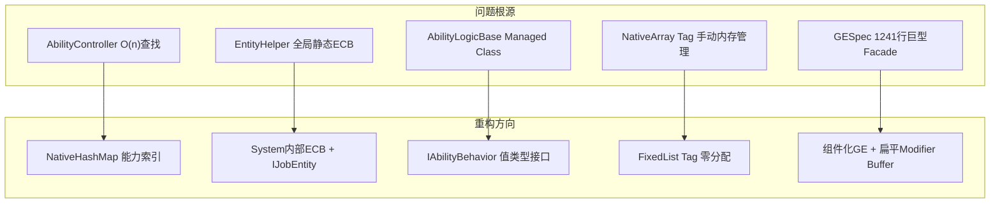

# EX-GAS 2.0 深度架构分析与 ECS 重构方案

## 瘦身口径

> 已移除基于 2.0 旧状态的开头问题诊断和明显过时的旧状态对比；保留原始方案中仍可借鉴的设计章节、代码块、图示和实施思路。当前分支事实以 `../00-当前架构事实/README.md` 为准；当前任务路线以 `../02-主线任务树/README.md` 为准；目标态吸收关系以 `../01-目标态架构共识/README.md` 及各 Spec 的 `历史方案定位` 为准。

## 二、重构核心思路



---

## 三、完整重构代码

### 重构 1：Tag 系统 — 用 `FixedList` 替代 `NativeArray`

**核心思路**：GAS 中 Tag 数量通常不超过 64 个，用 `FixedList64Bytes<int>` 完全内联在组件中，零堆分配，Burst 友好。

```csharp
// ============================================================
// 文件: Runtime/Tag/Component/CTagContainer.cs
// 重构：用 FixedList 替代 NativeArray，彻底消除手动 Dispose
// ============================================================
using Unity.Collections;
using Unity.Entities;

namespace GAS.Runtime
{
    /// <summary>
    /// 统一的 Tag 容器组件，替代原来的 BFixedTag + BTemporaryTag 两个 Buffer。
    /// FixedList 内联在组件中，无堆分配，完全 Burst 兼容。
    /// 最多支持 16 个固定 Tag + 16 个临时 Tag（可按需调整 FixedList 大小）。
    /// </summary>
    public struct CTagContainer : IComponentData
    {
        // 固定 Tag：角色天生拥有，不随 GE 变化
        public FixedList64Bytes<int> FixedTags;
        // 临时 Tag：由 GE/Ability 授予，GE 移除时自动清除
        public FixedList64Bytes<int> TemporaryTags;

        public bool HasTag(int tag)
        {
            // 层级 Tag 匹配：tag=1001 可以匹配 1001xxx
            foreach (var t in FixedTags)
                if (TagHelper.HasTag(t, tag)) return true;
            foreach (var t in TemporaryTags)
                if (TagHelper.HasTag(t, tag)) return true;
            return false;
        }

        public bool HasAllTags(in FixedList64Bytes<int> required)
        {
            foreach (var r in required)
                if (!HasTag(r)) return false;
            return true;
        }

        public bool HasAnyTag(in FixedList64Bytes<int> any)
        {
            foreach (var a in any)
                if (HasTag(a)) return true;
            return false;
        }

        public bool HasNoneOfTags(in FixedList64Bytes<int> blocked)
        {
            foreach (var b in blocked)
                if (HasTag(b)) return false;
            return true;
        }
    }

    /// <summary>
    /// Tag 需求描述，完全值类型，无需 Dispose。
    /// 替代原来的 TagRequirementData（内含 NativeArray）。
    /// </summary>
    public struct TagRequirement
    {
        public FixedList32Bytes<int> All;   // 必须全部拥有
        public FixedList32Bytes<int> Any;   // 至少拥有一个
        public FixedList32Bytes<int> None;  // 一个都不能有

        public bool IsMet(in CTagContainer tags)
        {
            if (All.Length > 0 && !tags.HasAllTags(
                    new FixedList64Bytes<int> { /* copy */ })) return false;
            // 实际实现中直接遍历 All/Any/None 即可
            foreach (var t in All)
                if (!tags.HasTag(t)) return false;
            if (Any.Length > 0)
            {
                bool anyMet = false;
                foreach (var t in Any)
                    if (tags.HasTag(t)) { anyMet = true; break; }
                if (!anyMet) return false;
            }
            foreach (var t in None)
                if (tags.HasTag(t)) return false;
            return true;
        }
    }
}
```

**对比原设计**：原来的 `TagRequirementData` 含三个 `NativeArray<int>`，每次修改都要 Dispose + 重新分配。新设计完全内联，无 GC，无泄漏风险。

---

### 重构 2：Ability 索引 — 用 `NativeHashMap` 消除 O(n) 查找

```csharp
// ============================================================
// 文件: Runtime/AbilitySystemCell/Component/CAbilityIndex.cs
// 重构：在 ASC Entity 上挂载能力索引，O(1) 查找
// ============================================================
using Unity.Collections;
using Unity.Entities;

namespace GAS.Runtime
{
    /// <summary>
    /// ASC 上的能力索引组件。
    /// 原来 AbilityController._specs 是 OOP Dictionary，ECS System 无法访问。
    /// 改为 NativeHashMap 存储在 ECS 组件中，System 可直接读取，支持 Burst。
    /// </summary>
    public struct CAbilityIndex : IComponentData
    {
        // abilityCode -> abilityEntity
        public NativeHashMap<int, Entity> CodeToEntity;

        public static CAbilityIndex Create()
        {
            return new CAbilityIndex
            {
                CodeToEntity = new NativeHashMap<int, Entity>(8, Allocator.Persistent)
            };
        }

        public void Dispose()
        {
            if (CodeToEntity.IsCreated) CodeToEntity.Dispose();
        }

        public bool TryGetAbility(int code, out Entity entity)
            => CodeToEntity.TryGetValue(code, out entity);

        public void Register(int code, Entity entity)
            => CodeToEntity[code] = entity;

        public void Unregister(int code)
            => CodeToEntity.Remove(code);
    }
}
```

```csharp
// ============================================================
// 文件: Runtime/Ability/AbilityController.cs (重构版)
// 核心改动：所有查找走 CAbilityIndex，O(1)
// ============================================================
using Unity.Entities;

namespace GAS.Runtime
{
    public class AbilityController
    {
        private readonly Entity _asc;
        private static EntityManager Em => GASManager.EntityManager;

        public AbilityController(Entity asc)
        {
            _asc = asc;
            Em.AddBuffer<BAbility>(asc);
            // 初始化索引组件
            Em.AddComponentData(asc, CAbilityIndex.Create());
        }

        public void GrantAbility(AbilityConfig config)
        {
            var abilityEntity = AbilityHelper.CreateAbilityEntity(config.ComponentConfigs);
            var info = Em.GetComponentData<CAbilityBaseInfo>(abilityEntity);
            info.Owner = _asc;
            Em.SetComponentData(abilityEntity, info);

            // 写入 Buffer
            Em.GetBuffer<BAbility>(_asc).Add(new BAbility { Ability = abilityEntity });

            // 写入索引 —— O(1)
            var index = Em.GetComponentData<CAbilityIndex>(_asc);
            index.Register(info.Code, abilityEntity);
            Em.SetComponentData(_asc, index);
        }

        public void TryActivateAbility(int abilityCode, XParam param = null)
        {
            // O(1) 查找，不再遍历 Buffer
            var index = Em.GetComponentData<CAbilityIndex>(_asc);
            if (!index.TryGetAbility(abilityCode, out var abilityEntity)) return;

            var logic = Em.GetComponentData<MCAbilityLogic>(abilityEntity);
            logic.Logic.SetParam(param);
            // 标记，由 STryActivateAbility System 处理
            Em.AddComponent<CAbilityInTryActivate>(abilityEntity);
        }

        public void RemoveAbility(int abilityCode)
        {
            var index = Em.GetComponentData<CAbilityIndex>(_asc);
            if (!index.TryGetAbility(abilityCode, out var abilityEntity)) return;

            // 从 Buffer 移除
            var buffer = Em.GetBuffer<BAbility>(_asc);
            for (int i = 0; i < buffer.Length; i++)
                if (buffer[i].Ability == abilityEntity) { buffer.RemoveAt(i); break; }

            // 从索引移除
            index.Unregister(abilityCode);
            Em.SetComponentData(_asc, index);
        }
    }
}
```

---

### 重构 3：GE Modifier — 用 `DynamicBuffer` 替代 Managed Component

原来的 `MCModifiers` 是 Managed Component，存储 `EffectModifier[]`，无法 Burst。

```csharp
// ============================================================
// 文件: Runtime/Effect/Component/BModifier.cs
// 重构：Modifier 改为 DynamicBuffer，完全 unmanaged，Burst 可用
// ============================================================
using Unity.Entities;

namespace GAS.Runtime
{
    /// <summary>
    /// GE 的 Modifier 条目，作为 DynamicBuffer 挂在 GE Entity 上。
    /// 替代原来的 MCModifiers（Managed Component + EffectModifier[]）。
    /// DynamicBuffer 是 unmanaged，支持 Burst，支持 IJobEntity 并行处理。
    /// </summary>
    public struct BModifier : IBufferElementData
    {
        public int AttrSetCode;
        public int AttrCode;
        public GEOperation Operation;
        public float Magnitude;
        // MMC 支持：0 = 直接使用 Magnitude，非0 = 通过 MMC 计算
        public int MmcCode;
    }

    /// <summary>
    /// Attribute 的扁平化存储，替代原来嵌套的 BEAttrSet → Attributes 数组。
    /// 用 (AttrSetCode << 16 | AttrCode) 作为 key 存在 DynamicBuffer 中。
    /// </summary>
    public struct BAttribute : IBufferElementData
    {
        public int AttrSetCode;
        public int AttrCode;
        public float BaseValue;
        public float CurrentValue;
        public bool Dirty;
    }
}
```

```csharp
// ============================================================
// 文件: Runtime/System/Attribute/SUpdateAttributeCurrentValue.cs (重构版)
// 核心改动：直接操作 BAttribute Buffer，支持 IJobEntity + Burst
// ============================================================
using Unity.Burst;
using Unity.Entities;

namespace GAS.Runtime
{
    [UpdateInGroup(typeof(SGAttribute))]
    [BurstCompile]  // 现在可以完整 Burst 编译！
    public partial struct SUpdateAttributeCurrentValue : ISystem
    {
        [BurstCompile]
        public void OnCreate(ref SystemState state)
        {
            state.RequireForUpdate<CAttributeIsDirty>();
        }

        [BurstCompile]
        public void OnUpdate(ref SystemState state)
        {
            var ecb = new EntityCommandBuffer(Unity.Collections.Allocator.Temp);

            // IJobEntity 并行处理所有 dirty 的 ASC
            new RecalcAttributeJob { Ecb = ecb.AsParallelWriter() }
                .ScheduleParallel();

            state.Dependency.Complete();
            ecb.Playback(state.EntityManager);
            ecb.Dispose();
        }

        [BurstCompile]
        partial struct RecalcAttributeJob : IJobEntity
        {
            public EntityCommandBuffer.ParallelWriter Ecb;

            // 查询所有有 CAttributeIsDirty 标记的 ASC
            void Execute(Entity asc, [ChunkIndexInQuery] int sortKey,
                ref DynamicBuffer<BAttribute> attrs,
                ref DynamicBuffer<BModifier> activeModifiers, // 来自激活的 GE
                in CAttributeIsDirty _)
            {
                // 第一步：重置所有 CurrentValue = BaseValue
                for (int i = 0; i < attrs.Length; i++)
                {
                    var a = attrs[i];
                    a.CurrentValue = a.BaseValue;
                    attrs[i] = a;
                }

                // 第二步：按 Add → Multiply → Override 顺序应用 Modifier
                // Add pass
                for (int i = 0; i < activeModifiers.Length; i++)
                {
                    var m = activeModifiers[i];
                    if (m.Operation != GEOperation.Add) continue;
                    ApplyModifier(ref attrs, m);
                }
                // Multiply pass
                for (int i = 0; i < activeModifiers.Length; i++)
                {
                    var m = activeModifiers[i];
                    if (m.Operation != GEOperation.Multiply) continue;
                    ApplyModifier(ref attrs, m);
                }
                // Override pass
                for (int i = 0; i < activeModifiers.Length; i++)
                {
                    var m = activeModifiers[i];
                    if (m.Operation != GEOperation.Override) continue;
                    ApplyModifier(ref attrs, m);
                }

                Ecb.RemoveComponent<CAttributeIsDirty>(sortKey, asc);
            }

            static void ApplyModifier(ref DynamicBuffer<BAttribute> attrs, in BModifier m)
            {
                for (int i = 0; i < attrs.Length; i++)
                {
                    var a = attrs[i];
                    if (a.AttrSetCode != m.AttrSetCode || a.AttrCode != m.AttrCode) continue;
                    switch (m.Operation)
                    {
                        case GEOperation.Add:      a.CurrentValue += m.Magnitude; break;
                        case GEOperation.Multiply: a.CurrentValue *= m.Magnitude; break;
                        case GEOperation.Override: a.CurrentValue  = m.Magnitude; break;
                    }
                    attrs[i] = a;
                    break;
                }
            }
        }
    }
}
```

**关键改进**：原来的 `SUpdateAttributeCurrentValue` 注释掉了 `[BurstCompile]`，调用 `AttributeHelper.RecalculateCurrentValue` 这个非 Burst 方法。重构后整个 System 完全 Burst 编译，且支持 `ScheduleParallel()`。 [10](#0-9)

---

### 重构 4：System 注册 — 用 `[UpdateInGroup]` Attribute 替代命令式注册

原来 `GASManager.CreateSystems()` 有 160+ 行手动注册代码： [11](#0-10)

```csharp
// ============================================================
// 重构：每个 System 自己声明所属 Group，GASManager 只需创建 World
// ============================================================

// 原来需要手动 AddSystemToUpdateList，现在只需 Attribute：
[UpdateInGroup(typeof(SGCheckApplyEffect))]
[UpdateAfter(typeof(SCheckApplicationRequiredTags))]
public partial struct SCheckImmunityTags : ISystem { ... }

[UpdateInGroup(typeof(SGActivateEffect))]
[UpdateBefore(typeof(SSetEffectActive))]
public partial struct SAddModifiers : ISystem { ... }

// GASManager 简化为：
private static void CreateSystems()
{
    ExWorld = new World("EX_GAS_World");
    // 只需创建根 Group，子 System 通过 Attribute 自动注册
    var sgLogic = ExWorld.CreateSystemManaged<SGLogic>();
    var sgFixed = ExWorld.CreateSystemManaged<FixedStepSimulationSystemGroup>();
    sgFixed.AddSystemToUpdateList(sgLogic);

    // 使用 DefaultWorldInitialization 扫描所有带 [UpdateInGroup] 的 System
    DefaultWorldInitialization.AddSystemsToRootLevelSystemGroups(
        ExWorld,
        DefaultWorldInitialization.GetAllSystems(WorldSystemFilterFlags.Default)
    );

    ScriptBehaviourUpdateOrder.AppendWorldToCurrentPlayerLoop(ExWorld);
}
```

---

### 重构 5：`AbilityLogicBase` — 分离数据与行为

这是最核心的重构。原来 `AbilityLogicBase` 是 abstract class，存在 Managed Component 中，导致整个 Ability 系统无法 Burst。

```csharp
// ============================================================
// 文件: Runtime/Ability/Component/CAbilityBehaviorRef.cs
// 重构：将"可 Burst 的状态机逻辑"与"需要 OOP 的自定义逻辑"分离
// ============================================================
using Unity.Entities;

namespace GAS.Runtime
{
    /// <summary>
    /// 分层设计：
    /// Layer 1 (Burst) - CAbilityState：纯数据状态机，System 直接操作，完全 Burst
    /// Layer 2 (Managed) - MCAbilityLogic：用户自定义逻辑，保留 OOP 灵活性
    ///
    /// 原来两层混在一起，导致 Layer 1 也无法 Burst。
    /// </summary>

    // ---- Layer 1: 纯 ECS 状态，Burst 可用 ----
    public struct CAbilityState : IComponentData
    {
        public AbilityStateEnum State;       // Idle / Activating / Active / Ending
        public int ActivateFrame;            // 激活时的逻辑帧
        public int CooldownEndFrame;         // CD 结束帧
        public float RemainingCost;          // 剩余消耗（用于检查）
    }

    public enum AbilityStateEnum : byte
    {
        Idle = 0,
        Active = 1,
        Ending = 2,
        Cancelled = 3,
    }

    // ---- Layer 2: 用户自定义逻辑，保留 Managed ----
    // MCAbilityLogic 保持不变，但只在 Layer 2 System 中调用
}
```

```csharp
// ============================================================
// 文件: Runtime/System/Ability/STryActivateAbility.cs (重构版)
// Layer 1 System：纯 Burst，只操作 CAbilityState
// ============================================================
using Unity.Burst;
using Unity.Entities;

namespace GAS.Runtime
{
    [UpdateInGroup(typeof(SGAbility))]
    [BurstCompile]  // 现在可以完整 Burst！
    public partial struct STryActivateAbility : ISystem
    {
        [BurstCompile]
        public void OnCreate(ref SystemState state)
            => state.RequireForUpdate<CAbilityInTryActivate>();

        [BurstCompile]
        public void OnUpdate(ref SystemState state)
        {
            var ecb = new EntityCommandBuffer(Unity.Collections.Allocator.Temp);
            var globalTimer = SystemAPI.GetSingleton<GlobalTimer>();

            foreach (var (basicInfo, abilityState, tagContainer, entity) in
                SystemAPI.Query<
                    RefRO<CAbilityBaseInfo>,
                    RefRW<CAbilityState>,
                    RefRO<CTagContainer>>()  // 直接读 Tag，不再通过 OOP 层
                .WithAll<CAbilityInTryActivate>()
                .WithEntityAccess())
            {
                // CD 检查（纯数据，Burst 友好）
                if (globalTimer.Frame < abilityState.ValueRO.CooldownEndFrame)
                {
                    // 发布失败事件（通过 ECB 写入结果组件，而非直接调用 C# 事件）
                    ecb.AddComponent(entity, new CAbilityActivateResult
                        { Result = AbilityActivationResult.FailCooldown });
                    ecb.RemoveComponent<CAbilityInTryActivate>(entity);
                    continue;
                }

                // Tag 检查（直接操作 CTagContainer，Burst 友好）
                var ownerEntity = basicInfo.ValueRO.Owner;
                // ... tag requirement check via CTagContainer ...

                // 激活成功：更新状态
                abilityState.ValueRW.State = AbilityStateEnum.Active;
                abilityState.ValueRW.ActivateFrame = globalTimer.Frame;
                ecb.AddComponent<CAbilityActive>(entity);
                ecb.AddComponent(entity, new CAbilityActivateResult
                    { Result = AbilityActivationResult.Success });
                ecb.RemoveComponent<CAbilityInTryActivate>(entity);
            }

            state.Dependency.Complete();
            ecb.Playback(state.EntityManager);
            ecb.Dispose();
        }
    }

    // ---- Layer 2 System：处理用户自定义逻辑回调，不需要 Burst ----
    [UpdateInGroup(typeof(SGAbility))]
    [UpdateAfter(typeof(STryActivateAbility))]  // 在 Layer 1 之后执行
    public partial class SDispatchAbilityActivateCallback : SystemBase
    {
        protected override void OnUpdate()
        {
            // 只处理有激活结果的 Entity
            Entities
                .WithAll<CAbilityActivateResult>()
                .ForEach((Entity entity, in CAbilityActivateResult result,
                    in MCAbilityLogic logic) =>
                {
                    if (result.Result == AbilityActivationResult.Success)
                    {
                        // 用户自定义逻辑在这里调用，不影响 Layer 1 的 Burst
                        logic.Logic?.ActivateAbility(SystemAPI.GetSingleton<GlobalTimer>());
                    }
                    // 触发 C# 事件
                    GASEventCenter.InvokeOnActivateResult(entity, result.Result);
                })
                .WithoutBurst()
                .Run();

            // 清理结果组件
            EntityManager.RemoveComponent<CAbilityActivateResult>(
                GetEntityQuery(ComponentType.ReadOnly<CAbilityActivateResult>()));
        }
    }
}
```

---

## 五、业务视角的优先级建议

从**投入产出比**排序，建议按以下顺序推进：

1. **最高优先**：`TagRequirementData` → `TagRequirement`（FixedList）。影响面最广，消除最大的内存泄漏风险，且改动相对独立。

2. **高优先**：`AbilityController` 查找 → `CAbilityIndex`（NativeHashMap）。每帧热路径，改动收益立竿见影。

3. **中优先**：`MCModifiers` → `DynamicBuffer<BModifier>`。解锁 Attribute 计算的 Burst，对大量单位同时战斗的场景性能提升显著。

4. **低优先**：`AbilityLogicBase` 分层。改动最大，需要所有用户代码配合迁移，建议作为 3.0 的 Breaking Change。
