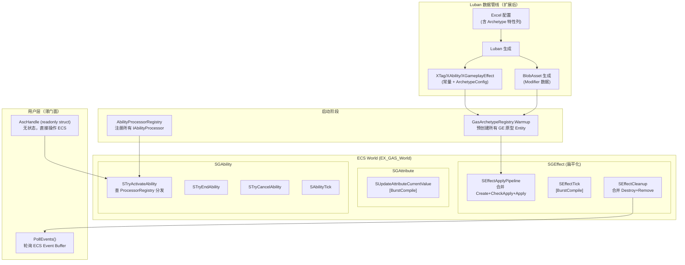

# EX-GAS 2.0 架构深度分析与 ECS 重构方案

## 瘦身口径

> 已移除基于 2.0 旧状态的开头问题诊断和明显过时的旧状态对比；保留原始方案中仍可借鉴的设计章节、代码块、图示和实施思路。当前分支事实以 `../00-当前架构事实/README.md` 为准；当前任务路线以 `../02-主线任务树/README.md` 为准；目标态吸收关系以 `../01-目标态架构共识/README.md` 及各 Spec 的 `历史方案定位` 为准。

## 二、重构方案：面向真实业务的 ECS-Native GAS

### 核心设计原则

```
1. 数据完全在 ECS 中，OOP 层只是薄门面（Facade），不持有任何状态
2. Tag 用 FixedList 替代 NativeArray，消除手动内存管理
3. AbilityLogic 改为 IAbilityProcessor 注册表 + 纯数据驱动
4. Luban 直接生成 EntityArchetype 预制，运行时 Instantiate 而非动态 AddComponent
5. GE 管线扁平化，减少 SystemGroup 嵌套
6. 消除 GASManager._bindingAsc 字典，用 ECS 原生机制替代
```

---

### 重构一：Tag 系统 —— FixedList 替代 NativeArray


**方案**：使用 `FixedList64Bytes<int>`（最多 14 个 int），对于大多数 GAS 场景完全够用。

```csharp
// ===== 重构后：Assets/GAS/Runtime/Tag/Component/TagComponents.cs =====

using Unity.Collections;
using Unity.Entities;

namespace GAS.Runtime
{
    // 固定 Tag 列表（最多 14 个 int，零堆分配，Burst 友好）
    public struct BFixedTag : IBufferElementData
    {
        public int TagId;
    }

    // 临时 Tag（由 GE/Ability 授予，随来源移除）
    public struct BTemporaryTag : IBufferElementData
    {
        public int TagId;
        public Entity Source; // 来源 Entity（GE 或 Ability）
    }

    // ===== 替代 TagRequirementData 中的 NativeArray =====
    // 使用 FixedList，完全 unmanaged，可以放在 IComponentData 中
    public struct TagRequirement
    {
        public FixedList64Bytes<int> All;  // 必须全部拥有
        public FixedList64Bytes<int> Any;  // 至少拥有一个
        public FixedList64Bytes<int> None; // 一个都不能有

        public bool Evaluate(DynamicBuffer<BFixedTag> fixedTags, DynamicBuffer<BTemporaryTag> tempTags)
        {
            // All 检查
            foreach (var required in All)
            {
                bool found = false;
                foreach (var t in fixedTags) if (TagHelper.HasTag(t.TagId, required)) { found = true; break; }
                if (!found) foreach (var t in tempTags) if (TagHelper.HasTag(t.TagId, required)) { found = true; break; }
                if (!found) return false;
            }
            // Any 检查
            if (Any.Length > 0)
            {
                bool anyFound = false;
                foreach (var required in Any)
                {
                    foreach (var t in fixedTags) if (TagHelper.HasTag(t.TagId, required)) { anyFound = true; break; }
                    if (!anyFound) foreach (var t in tempTags) if (TagHelper.HasTag(t.TagId, required)) { anyFound = true; break; }
                    if (anyFound) break;
                }
                if (!anyFound) return false;
            }
            // None 检查
            foreach (var blocked in None)
            {
                foreach (var t in fixedTags) if (TagHelper.HasTag(t.TagId, blocked)) return false;
                foreach (var t in tempTags) if (TagHelper.HasTag(t.TagId, blocked)) return false;
            }
            return true;
        }
    }

    // Ability 激活条件（完全 unmanaged，可 Burst）
    public struct CAbilityActivationRequiredTags : IComponentData
    {
        public TagRequirement Requirement; // 替代原来的 NativeArray 版本
    }

    public struct CAbilityActivationBlockedTags : IComponentData
    {
        public TagRequirement Requirement;
    }

    // GE 应用条件
    public struct CApplicationRequiredTags : IComponentData
    {
        public TagRequirement Requirement;
    }

    // GE 授予的 Tag（最多 8 个，足够大多数 Buff 场景）
    public struct CEffectGrantedTags : IComponentData
    {
        public FixedList32Bytes<int> Tags;
    }
}
```

**合理性**：`FixedList64Bytes<int>` 是 Unity.Collections 提供的栈分配固定容量列表，完全 `unmanaged`，可以放在 `IComponentData` 中，支持 Burst 编译，零 GC 压力。对于 GAS 场景，一个技能/效果的 Tag 条件通常不超过 8 个，`FixedList64Bytes<int>` 可存 14 个 int，完全够用。

---

### 重构二：消除 OOP Controller 层，引入纯 ECS ASC + 薄 Facade


**方案**：ASC 完全是 ECS Entity，所有操作通过静态工具方法。提供一个无状态的 `AscHandle` 作为用户入口。

```csharp
// ===== 重构后：Assets/GAS/Runtime/AbilitySystemCell/AscHandle.cs =====
// AscHandle 是纯粹的薄门面，不持有任何状态，不需要 Controller

using Unity.Entities;
using Unity.Collections;

namespace GAS.Runtime
{
    /// <summary>
    /// ASC 的薄门面。
    /// 内部只持有 Entity，所有操作委托给静态工具类。
    /// 不持有任何 OOP 状态，不需要与 ECS 同步。
    /// </summary>
    public readonly struct AscHandle
    {
        public readonly Entity Entity;

        public AscHandle(Entity entity) => Entity = entity;

        public bool IsValid => Entity != Entity.Null && GASManager.EntityManager.Exists(Entity);

        // ===== Tag 操作（直接操作 ECS Buffer，无 Controller 中间层）=====
        public bool HasTag(int tagId) => AscTagUtil.HasTag(Entity, tagId);
        public void AddFixedTag(int tagId) => AscTagUtil.AddFixedTag(Entity, tagId);
        public void RemoveFixedTag(int tagId) => AscTagUtil.RemoveFixedTag(Entity, tagId);

        // ===== Attribute 操作 =====
        public float GetAttrCurrentValue(int attrSetCode, int attrCode)
            => AttributeUtil.GetCurrentValue(Entity, attrSetCode, attrCode);

        public void SetAttrBaseValue(int attrSetCode, int attrCode, float value)
            => AttributeUtil.SetBaseValue(Entity, attrSetCode, attrCode, value);

        // ===== Ability 操作 =====
        public void TryActivateAbility(int abilityCode, XParam param = null)
            => AbilityUtil.TryActivate(Entity, abilityCode, param);

        public void GrantAbility(int abilityConfigId)
            => AbilityUtil.GrantAbility(Entity, abilityConfigId);

        // ===== GE 操作 =====
        public void ApplyEffect(int geConfigId, AscHandle source)
            => GameplayEffectUtil.Apply(Entity, source.Entity, geConfigId);
    }

    // ===== 重构后：Assets/GAS/Runtime/Tag/AscTagUtil.cs =====
    // 原 GameplayTagController 的所有逻辑变为静态方法
    public static class AscTagUtil
    {
        private static EntityManager Em => GASManager.EntityManager;

        public static bool HasTag(Entity asc, int tagId)
        {
            if (Em.HasBuffer<BFixedTag>(asc))
            {
                var fixedTags = Em.GetBuffer<BFixedTag>(asc, true);
                foreach (var t in fixedTags)
                    if (TagHelper.HasTag(t.TagId, tagId)) return true;
            }
            if (Em.HasBuffer<BTemporaryTag>(asc))
            {
                var tempTags = Em.GetBuffer<BTemporaryTag>(asc, true);
                foreach (var t in tempTags)
                    if (TagHelper.HasTag(t.TagId, tagId)) return true;
            }
            return false;
        }

        public static void AddFixedTag(Entity asc, int tagId)
        {
            var buffer = Em.GetBuffer<BFixedTag>(asc);
            // 防重复
            foreach (var t in buffer)
                if (t.TagId == tagId) return;
            buffer.Add(new BFixedTag { TagId = tagId });
        }

        public static void RemoveFixedTag(Entity asc, int tagId)
        {
            var buffer = Em.GetBuffer<BFixedTag>(asc);
            for (int i = 0; i < buffer.Length; i++)
            {
                if (buffer[i].TagId == tagId)
                {
                    buffer.RemoveAtSwapBack(i);
                    return;
                }
            }
        }
    }
}
```

**合理性**：`AscHandle` 是 `readonly struct`，值类型，零堆分配。所有操作都是对 ECS 数据的直接操作，没有中间状态需要同步。原来 5 个 Controller 的职责被分散到对应的静态 Util 类中，职责更清晰，且这些 Util 方法可以在 ECS System 内部直接调用。

---

### 重构三：AbilityLogic 改为 IAbilityProcessor 注册表


**方案**：将技能逻辑分为两层：
- **数据层**：技能的所有配置数据存在 ECS Component 中（Luban 生成）
- **逻辑层**：通过 `IAbilityProcessor` 接口注册，按 `abilityTypeId` 分发

```csharp
// ===== 重构后：Assets/GAS/Runtime/Ability/IAbilityProcessor.cs =====

using Unity.Entities;

namespace GAS.Runtime
{
    /// <summary>
    /// 技能处理器接口。
    /// 业务层实现此接口，注册到 AbilityProcessorRegistry。
    /// 不再继承 AbilityLogicBase，不持有 Entity 引用。
    /// </summary>
    public interface IAbilityProcessor
    {
        /// <summary>对应的技能类型 ID（由 Luban 配置定义）</summary>
        int AbilityTypeId { get; }

        void OnActivate(Entity abilityEntity, Entity ownerAsc, GlobalTimer timer);
        void OnTick(Entity abilityEntity, Entity ownerAsc, GlobalTimer timer);
        void OnEnd(Entity abilityEntity, Entity ownerAsc, GlobalTimer timer);
        void OnCancel(Entity abilityEntity, Entity ownerAsc, GlobalTimer timer);
    }

    // ===== 重构后：Assets/GAS/Runtime/Ability/AbilityProcessorRegistry.cs =====
    // 替代 MCAbilityLogic Managed Component
    public static class AbilityProcessorRegistry
    {
        private static readonly Dictionary<int, IAbilityProcessor> _processors = new();

        public static void Register(IAbilityProcessor processor)
            => _processors[processor.AbilityTypeId] = processor;

        public static IAbilityProcessor Get(int abilityTypeId)
            => _processors.GetValueOrDefault(abilityTypeId);
    }

    // ===== 重构后：ECS Component，替代 MCAbilityLogic =====
    // 只存储类型 ID，不存储 OOP 对象
    public struct CAbilityTypeId : IComponentData
    {
        public int TypeId; // 对应 IAbilityProcessor.AbilityTypeId
    }

    // ===== 重构后：STryActivateAbility.cs =====
    [UpdateInGroup(typeof(SGAbility))]
    public partial struct STryActivateAbility : ISystem
    {
        public void OnUpdate(ref SystemState state)
        {
            var globalTimer = SystemAPI.GetSingleton<GlobalTimer>();
            var ecb = new EntityCommandBuffer(Allocator.Temp);

            foreach (var (_, basicInfo, typeId, abilityEntity) in SystemAPI
                .Query<RefRO<CAbilityInTryActivate>, RefRO<CAbilityBaseInfo>, RefRO<CAbilityTypeId>>()
                .WithEntityAccess())
            {
                var result = AbilityUtil.CanActivate(abilityEntity, state.EntityManager);
                if (result == AbilityActivationResult.Success)
                {
                    ecb.AddComponent<CAbilityActive>(abilityEntity);

                    // 通过注册表分发，不再调用虚方法
                    var processor = AbilityProcessorRegistry.Get(typeId.ValueRO.TypeId);
                    processor?.OnActivate(abilityEntity, basicInfo.ValueRO.Owner, globalTimer);

                    AbilityUtil.CancelAbilitiesWithTags(abilityEntity, state.EntityManager);
                }

                // 事件通知改为写入 ECS Event Buffer，不再查 Dictionary
                ecb.AppendToBuffer(basicInfo.ValueRO.Owner, new BAbilityActivateEvent
                {
                    AbilityEntity = abilityEntity,
                    Result = result
                });

                ecb.RemoveComponent<CAbilityInTryActivate>(abilityEntity);
            }

            ecb.Playback(state.EntityManager);
            ecb.Dispose();
        }
    }
}
```

**业务层使用示例**（真实业务视角）：

```csharp
// ===== 业务层：Assets/Demo/Ability/FireballAbilityProcessor.cs =====
// 火球技能处理器，不再继承 AbilityLogicBase

using Unity.Entities;
using GAS.Runtime;

namespace Demo
{
    public class FireballAbilityProcessor : IAbilityProcessor
    {
        public int AbilityTypeId => XAbility.Fireball; // Luban 生成的常量

        public void OnActivate(Entity abilityEntity, Entity ownerAsc, GlobalTimer timer)
        {
            // 读取技能参数（从 ECS Component 中读，不从 OOP 字段读）
            var em = GASManager.EntityManager;
            var param = em.GetComponentData<CAbilityFireballParam>(abilityEntity);

            // 施加伤害 GE
            GameplayEffectUtil.Apply(param.TargetAsc, ownerAsc, XGameplayEffect.FireballDamage);

            // 触发 CD
            AbilityUtil.DoCooldown(abilityEntity);
            AbilityUtil.DoCost(abilityEntity);

            // 技能是即时的，立即结束
            EntityHelper.AddComponent<CAbilityInTryEnd>(abilityEntity);
        }

        public void OnTick(Entity abilityEntity, Entity ownerAsc, GlobalTimer timer) { }
        public void OnEnd(Entity abilityEntity, Entity ownerAsc, GlobalTimer timer) { }
        public void OnCancel(Entity abilityEntity, Entity ownerAsc, GlobalTimer timer) { }
    }

    // 游戏启动时注册
    public static class AbilityProcessorBootstrap
    {
        [RuntimeInitializeOnLoadMethod(RuntimeInitializeLoadType.BeforeSceneLoad)]
        public static void RegisterAll()
        {
            AbilityProcessorRegistry.Register(new FireballAbilityProcessor());
            AbilityProcessorRegistry.Register(new SlashAbilityProcessor());
            // ...
        }
    }
}
```

**合理性**：`IAbilityProcessor` 是接口而非抽象类，不持有 Entity 引用，不持有 OOP 状态。技能的所有运行时数据都在 ECS Component 中。`AbilityProcessorRegistry` 是一个简单的字典，查找是 O(1)。这样 `STryActivateAbility` 中不再需要 Managed Component，ECB 可以正常使用，且未来可以将 `CanActivate` 等纯数据检查逻辑提取为 Burst Job。

---

### 重构四：消除 `GASManager._bindingAsc`，用 ECS Event Buffer 替代回调


**方案**：引入 ECS Event Buffer，System 写入事件，OOP 层在主线程读取。

```csharp
// ===== 重构后：Assets/GAS/Runtime/General/GasEventBuffer.cs =====

using Unity.Entities;

namespace GAS.Runtime
{
    // ECS 事件 Buffer，替代 GASEventCenter 的字典回调
    public struct BAbilityActivateEvent : IBufferElementData
    {
        public Entity AbilityEntity;
        public AbilityActivationResult Result;
    }

    public struct BAbilityEndEvent : IBufferElementData
    {
        public Entity AbilityEntity;
    }

    public struct BAttributeChangedEvent : IBufferElementData
    {
        public int AttrSetCode;
        public int AttrCode;
        public float OldValue;
        public float NewValue;
    }

    // ===== 重构后：AscHandle 上的事件订阅 =====
    // 不再需要 GASManager._bindingAsc 字典
    // 用户在 MonoBehaviour 的 Update 中轮询 ECS Event Buffer

    public readonly struct AscHandle
    {
        public readonly Entity Entity;

        /// <summary>
        /// 在 MonoBehaviour.Update 中调用，处理本帧的 GAS 事件。
        /// 替代原来的 GASEventCenter 字典回调。
        /// </summary>
        public void PollEvents(
            System.Action<Entity, AbilityActivationResult> onActivate = null,
            System.Action<Entity> onEnd = null,
            System.Action<int, int, float, float> onAttrChanged = null)
        {
            var em = GASManager.EntityManager;
            if (!em.Exists(Entity)) return;

            if (onActivate != null && em.HasBuffer<BAbilityActivateEvent>(Entity))
            {
                var events = em.GetBuffer<BAbilityActivateEvent>(Entity);
                foreach (var e in events)
                    onActivate(e.AbilityEntity, e.Result);
                events.Clear();
            }

            if (onEnd != null && em.HasBuffer<BAbilityEndEvent>(Entity))
            {
                var events = em.GetBuffer<BAbilityEndEvent>(Entity);
                foreach (var e in events)
                    onEnd(e.AbilityEntity);
                events.Clear();
            }

            if (onAttrChanged != null && em.HasBuffer<BAttributeChangedEvent>(Entity))
            {
                var events = em.GetBuffer<BAttributeChangedEvent>(Entity);
                foreach (var e in events)
                    onAttrChanged(e.AttrSetCode, e.AttrCode, e.OldValue, e.NewValue);
                events.Clear();
            }
        }
    }
}
```

**业务层使用示例**：

```csharp
// ===== 业务层：Assets/Demo/Unit/UnitController.cs =====

using UnityEngine;
using GAS.Runtime;

namespace Demo
{
    public class UnitController : MonoBehaviour
    {
        private AscHandle _asc;

        void Start()
        {
            // 创建 ASC Entity，不再 new AbilitySystemCell()
            var entity = GASManager.EntityManager.CreateEntity();
            _asc = new AscHandle(entity);
            AscFactory.InitFromPreset(entity, XAsc.Warrior); // Luban 预设
        }

        void Update()
        {
            // 轮询事件，替代 GASEventCenter 字典回调
            _asc.PollEvents(
                onActivate: (abilityEntity, result) =>
                {
                    if (result == AbilityActivationResult.Success)
                        PlayActivateAnimation();
                },
                onAttrChanged: (attrSetCode, attrCode, oldVal, newVal) =>
                {
                    if (attrCode == XAttribute.HP)
                        UpdateHealthBar(newVal);
                }
            );

            // 技能输入
            if (Input.GetKeyDown(KeyCode.Q))
                _asc.TryActivateAbility(XAbility.Fireball, new FireballParam { TargetAsc = _targetAsc.Entity });
        }
    }
}
```

**合理性**：ECS Event Buffer 是 ECS 原生机制，System 写入事件时不需要查任何字典，可以在 Job 中安全写入（通过 ECB）。OOP 层在主线程的 `Update` 中轮询，符合 Unity 的线程模型。这完全消除了 `GASManager._bindingAsc` 字典。

---

### 重构五：Luban 配置直接生成 EntityArchetype，GE 用 Instantiate 替代动态 AddComponent


**方案**：Luban 生成时同时生成 Archetype 定义，运行时预创建原型 Entity，施加时 `Instantiate`。

```csharp
// ===== 重构后：Assets/GAS/Runtime/General/GasArchetypeRegistry.cs =====
// Luban 配置加载时预注册所有 GE Archetype

using Unity.Entities;
using System.Collections.Generic;

namespace GAS.Runtime
{
    /// <summary>
    /// GE 原型注册表。
    /// 运行时启动时，根据 Luban 配置预创建所有 GE 原型 Entity。
    /// 施加 GE 时通过 Instantiate 克隆，避免动态 AddComponent。
    /// </summary>
    public static class GasArchetypeRegistry
    {
        // geConfigId -> 原型 Entity
        private static readonly Dictionary<int, Entity> _gePrototypes = new();

        /// <summary>
        /// 在 GASManager.Initialize() 后调用，预热所有 GE 原型。
        /// </summary>
        public static void WarmupFromLuban()
        {
            var em = GASManager.EntityManager;
            var allGeConfigs = XLuban.GetAllGameplayEffectConfigs(); // Luban 生成的 API

            foreach (var config in allGeConfigs)
            {
                // 根据配置的组件列表，一次性创建 Archetype（不再逐个 AddComponent）
                var archetype = BuildArchetype(em, config);
                var protoEntity = em.CreateEntity(archetype);

                // 填充配置数据
                FillGeComponents(em, protoEntity, config);

                _gePrototypes[config.Id] = protoEntity;
            }
        }

        private static EntityArchetype BuildArchetype(EntityManager em, GameplayEffectLubanConfig config)
        {
            // 根据配置的特性决定 Archetype 组成
            // 这样相同类型的 GE 共享同一 Archetype，Chunk 利用率最高
            var componentTypes = new List<ComponentType>
            {
                ComponentType.ReadWrite<CEffectBasicInfo>(),
                ComponentType.ReadWrite<CEffectInUsage>(),
            };

            if (config.HasDuration)
                componentTypes.Add(ComponentType.ReadWrite<CDuration>());
            if (config.HasPeriod)
                componentTypes.Add(ComponentType.ReadWrite<CPeriod>());
            if (config.HasStacking)
                componentTypes.Add(ComponentType.ReadWrite<CStacking>());
            if (config.HasModifiers)
                componentTypes.Add(ComponentType.ReadWrite<CModifiersBlob>()); // 改用 BlobAsset
            if (config.HasGrantedTags)
                componentTypes.Add(ComponentType.ReadWrite<CEffectGrantedTags>());
            if (config.HasApplicationRequiredTags)
                componentTypes.Add(ComponentType.ReadWrite<CApplicationRequiredTags>());

            return em.CreateArchetype(componentTypes.ToArray());
        }

        /// <summary>
        /// 施加 GE：从原型 Instantiate，填充运行时数据，加入 GE 管线。
        /// 替代原来的 GameplayEffectHelper.CreateGameplayEffectEntity(componentConfigs)。
        /// </summary>
        public static Entity InstantiateGe(int geConfigId, Entity target, Entity source, int level = 1)
        {
            if (!_gePrototypes.TryGetValue(geConfigId, out var proto))
                throw new System.Exception($"GE config {geConfigId} not warmed up");

            var em = GASManager.EntityManager;
            var instance = em.Instantiate(proto); // 一次 Instantiate，无 Archetype 变更

            // 填充运行时数据
            em.SetComponentData(instance, new CEffectInUsage
            {
                Target = target,
                Source = source,
                Level = level
            });

            // 加入 GE 管线（标记为待处理）
            em.AddComponent<CEffectPendingApply>(instance);

            return instance;
        }
    }

    // ===== Modifier 改用 BlobAsset，替代 MCModifiers Managed Component =====
    // BlobAsset 是只读的，完全 Burst 友好
    public struct ModifierBlob
    {
        public BlobArray<EffectModifier> Modifiers;
    }

    public struct CModifiersBlob : IComponentData
    {
        public BlobAssetReference<ModifierBlob> Blob;
    }
}
```

**Luban 配置链路扩展**（解放 Luban 潜力）：

```csharp
// ===== 重构后：Luban 生成的配置直接包含 Archetype 信息 =====
// EX_GAS_Config/ProjectConfigTable/exgas_config/Datas/#exgas.gameplayEffect.xlsx
// 新增列：HasDuration, HasPeriod, HasStacking, HasModifiers, HasGrantedTags
// Luban 生成：

// Assets/DemoForESC/_Script/Gen/XGameplayEffect.gen.cs（Luban 生成）
public static class XGameplayEffect
{
    // 常量 ID
    public const int FireballDamage = 1001;
    public const int StunDebuff = 1002;
    public const int RegenBuff = 1003;

    // 直接生成 Archetype 特性标志，供 GasArchetypeRegistry 使用
    public static readonly GameplayEffectLubanConfig FireballDamageConfig = new()
    {
        Id = FireballDamage,
        HasDuration = false,   // 即时效果
        HasModifiers = true,
        HasGrantedTags = false,
    };

    public static readonly GameplayEffectLubanConfig StunDebuffConfig = new()
    {
        Id = StunDebuff,
        HasDuration = true,    // 持续效果
        HasGrantedTags = true, // 授予 State.Stunned Tag
        HasModifiers = false,
    };
}
```

**合理性**：`Instantiate` 是 ECS 中最高效的 Entity 创建方式，因为原型 Entity 已经确定了 Archetype，克隆时不会触发 Archetype 变更。所有相同类型的 GE 实例共享同一 Archetype，Chunk 内存利用率最高，System 查询时缓存命中率最高。`BlobAsset` 替代 `MCModifiers` Managed Component，使 Modifier 数据完全 Burst 友好。

---

### 重构六：GE 管线扁平化


**方案**：将 GE 管线压缩为 3 个阶段，每个阶段一个 System。

```csharp
// ===== 重构后：GE 管线扁平化 =====
// 原来：SGEffect → SGEffectCreate/Operation/Destroy/Tick → 多层子组
// 重构后：3 个 System，顺序执行

// 阶段 1：处理所有待应用的 GE（合并原来的 Create + CheckApply + Apply）
[UpdateInGroup(typeof(SGEffect))]
[UpdateBefore(typeof(SEffectTick))]
public partial struct SEffectApplyPipeline : ISystem
{
    public void OnUpdate(ref SystemState state)
    {
        var ecb = new EntityCommandBuffer(Allocator.Temp);
        var em = state.EntityManager;

        // 处理所有 CEffectPendingApply 的 GE
        foreach (var (_, inUsage, geEntity) in SystemAPI
            .Query<RefRO<CEffectPendingApply>, RefRO<CEffectInUsage>>()
            .WithEntityAccess())
        {
            var target = inUsage.ValueRO.Target;
            var source = inUsage.ValueRO.Source;

            // 1. 检查应用条件（原 SGCheckApplyEffect）
            if (!CheckApplicationRequirements(em, geEntity, target))
            {
                ecb.DestroyEntity(geEntity);
                continue;
            }

            // 2. 检查免疫（原 SCheckImmunityTags）
            if (CheckImmunity(em, geEntity, target))
            {
                ecb.DestroyEntity(geEntity);
                continue;
            }

            // 3. 移除被此 GE 驱逐的其他 GE（原 SRemoveEffectWithTags）
            RemoveEffectsWithTags(em, geEntity, target, ecb);

            // 4. 根据类型分发（即时/持续）
            bool isInstant = !em.HasComponent<CDuration>(geEntity);
            if (isInstant)
            {
                // 即时效果：直接执行 Modifier，然后销毁
                ExecuteInstantModifiers(em, geEntity, target, source);
                ecb.DestroyEntity(geEntity);
            }
            else
            {
                // 持续效果：加入 ASC 的 GE Buffer，标记为激活
                ecb.AppendToBuffer(target, new BGameplayEffect { GameplayEffect = geEntity });
                ecb.AddComponent<CEffectActive>(geEntity);
                ecb.RemoveComponent<CEffectPendingApply>(geEntity);

                // 处理堆叠（原 SCheckEffectStacking）
                HandleStacking(em, geEntity, target, ecb);
            }
        }

        ecb.Playback(em);
        ecb.Dispose();
    }

    // 内联原来分散在多个 System 中的逻辑
    private static bool CheckApplicationRequirements(EntityManager em, Entity ge, Entity target)
    {
        if (!em.HasComponent<CApplicationRequiredTags>(ge)) return true;
        var req = em.GetComponentData<CApplicationRequiredTags>(ge).Requirement;
        var fixedTags = em.GetBuffer<BFixedTag>(target, true);
        var tempTags = em.GetBuffer<BTemporaryTag>(target, true);
        return req.Evaluate(fixedTags, tempTags);
    }

    // ... 其他内联方法
}

// 阶段 2：Tick 所有活跃的持续 GE（原 SGEffectTick）
[UpdateInGroup(typeof(SGEffect))]
[UpdateAfter(typeof(SEffectApplyPipeline))]
[UpdateBefore(typeof(SEffectCleanup))]
public partial struct SEffectTick : ISystem
{
    [BurstCompile] // 现在可以 Burst 了，因为没有 Managed Component
    public void OnUpdate(ref SystemState state)
    {
        var globalTimer = SystemAPI.GetSingleton<GlobalTimer>();
        var ecb = new EntityCommandBuffer(Allocator.Temp);

        foreach (var (duration, geEntity) in SystemAPI
            .Query<RefRW<CDuration>>()
            .WithAll<CEffectActive>()
            .WithEntityAccess())
        {
            // Duration Tick
            int elapsed = globalTimer.Frame - duration.ValueRO.activeTime;
            if (duration.ValueRO.duration > 0 && elapsed >= duration.ValueRO.duration)
            {
                ecb.AddComponent<CEffectExpired>(geEntity);
            }
        }

        // Period Tick（独立查询，只处理有 CPeriod 的 GE）
        foreach (var (period, inUsage, geEntity) in SystemAPI
            .Query<RefRW<CPeriod>, RefRO<CEffectInUsage>>()
            .WithAll<CEffectActive>()
            .WithEntityAccess())
        {
            int elapsed = globalTimer.Frame - period.ValueRO.StartTime;
            if (elapsed > 0 && elapsed % period.ValueRO.Period == 0)
            {
                // 触发周期效果
                TriggerPeriodEffects(state.EntityManager, geEntity, inUsage.ValueRO.Target, inUsage.ValueRO.Source, ecb);
            }
        }

        ecb.Playback(state.EntityManager);
        ecb.Dispose();
    }
}

// 阶段 3：清理过期/被移除的 GE（原 SGEffectDestroy + SGRemoveEffect）
[UpdateInGroup(typeof(SGEffect))]
[UpdateAfter(typeof(SEffectTick))]
public partial struct SEffectCleanup : ISystem
{
    public void OnUpdate(ref SystemState state)
    {
        var ecb = new EntityCommandBuffer(Allocator.Temp);
        var em = state.EntityManager;

        foreach (var (inUsage, geEntity) in SystemAPI
            .Query<RefRO<CEffectInUsage>>()
            .WithAny<CEffectExpired, CEffectPendingRemove>()
            .WithEntityAccess())
        {
            var target = inUsage.ValueRO.Target;

            // 移除授予的 Tag
            if (em.HasComponent<CEffectGrantedTags>(geEntity))
            {
                var grantedTags = em.GetComponentData<CEffectGrantedTags>(geEntity);
                RemoveGrantedTags(em, target, geEntity, grantedTags.Tags);
            }

            // 移除授予的 Ability
            // ...

            // 从 ASC 的 GE Buffer 中移除
            RemoveFromAscBuffer(em, target, geEntity, ecb);

            // 写入移除事件
            ecb.AppendToBuffer(target, new BGeRemovedEvent { GeEntity = geEntity });

            ecb.DestroyEntity(geEntity);
        }

        ecb.Playback(em);
        ecb.Dispose();
    }
}
```

**合理性**：将原来 4 层嵌套、20+ 个 System 压缩为 3 个 System，每帧 SystemGroup 切换次数从 ~15 次降低到 3 次。`SEffectTick` 现在只处理纯数据（`CDuration`、`CPeriod`），没有 Managed Component，可以加 `[BurstCompile]`。

---

## 三、重构后的架构总览



---

## 五、关键结论

当前 EX-GAS 2.0 的根本矛盾是：**用 ECS 存储数据，但用 OOP 控制流程**。这导致 ECS 的性能优势（Burst、Job、Chunk 局部性）几乎全部被 OOP 层抵消。 [1](#0-0) [4](#0-3) [5](#0-4) [10](#0-9)

重构的核心思路不是"把 OOP 代码翻译成 ECS"，而是**重新思考数据的归属**：

- **配置数据** → Luban 生成 BlobAsset，运行时只读，Burst 友好
- **运行时状态** → ECS Component/Buffer，System 直接操作
- **技能逻辑** → `IAbilityProcessor` 注册表，数据与逻辑分离
- **事件通知** → ECS Event Buffer，OOP 层
