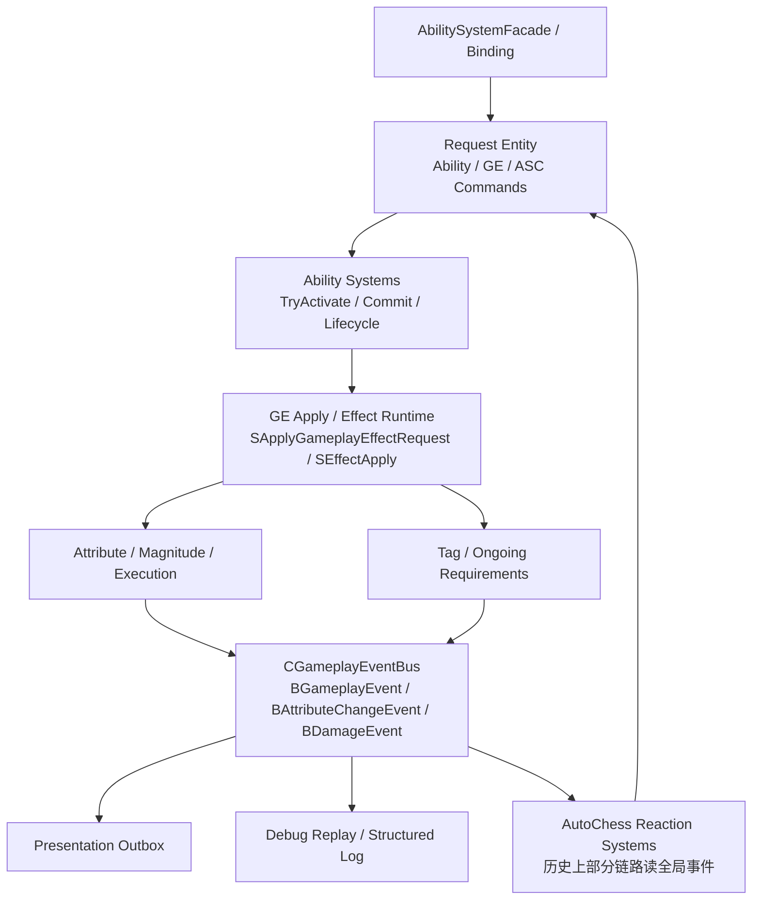
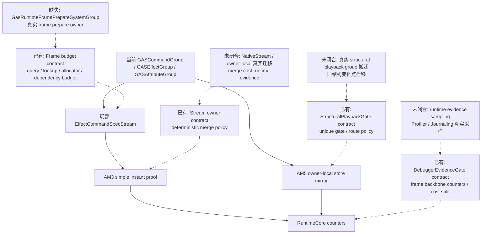
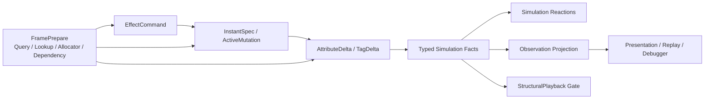

# 当前架构图

## 当前实际链路

## 当前问题边界

1. `Request -> GE Apply -> Runtime GE Entity -> EventBus` 对 simple instant effect 过重。
2. `EventBus -> Reactions` 在高频链路中容易形成 observation stream 反向参与 simulation 的事实依赖。
3. `Presentation / Replay / Debug` 与 simulation tick 的计时边界需要拆开。
4. 当前 AM2 / AM3 / AM5 局部链路已出现 `EffectCommandSpecStream` 和 `ActiveEffectStore`，AM2B-B 已补 `FrameBudget` contract，AM2B-C 已补 `StreamOwner / DeterministicMerge` contract，AM2B-D 已补 `StructuralPlaybackGate` contract，AM2B-E 已补 `DebuggerEvidenceGate` contract；但它们仍挂在旧 group / helper / singleton buffer 形态上，真实 `FramePrepareSystemGroup / StreamOwner / DeterministicMerge / StructuralPlaybackGate / RuntimeEvidenceSampling` 尚未成为完整当前实际链路。

## DOTS 官方参考重诊断后的缺口

当前事实判断：`EffectCommandSpecStream`、`ActiveEffectStore`、Debugger baseline、AM2B-B frame budget contract、AM2B-C stream owner contract、AM2B-D structural playback gate contract 和 AM2B-E Debugger evidence gate contract 只能证明局部迁移与 contract-first 口径已经开始，不能证明 Runtime Core 已具备 DOTS scale-ready 执行骨架。该缺口维护在 `核心问题诊断/ISSUE-009-RuntimeCoreFrameBackbone缺失.md`。

## 当前目标迁移方向

