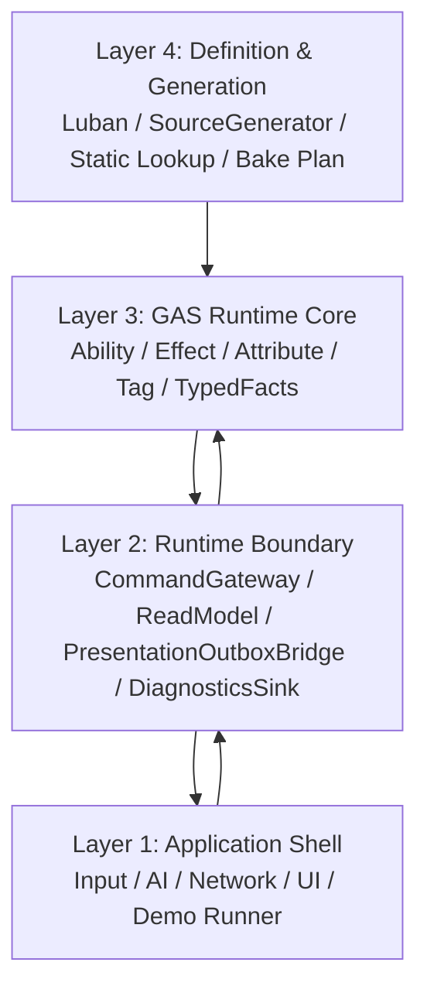

# 总览 Spec

## 目的

定义 EX-GAS 2.0 的目标态：用 Unity ECS/DOTS 表达 GAS 的核心语义，OOP 只保留在应用壳层和运行时边界层；Runtime Core 热路径只使用显式 ECS 数据流。

目标态的第一性技术约束来自 `90-目标态不变量.md`（40条 P0/P1 不变量）和当前路线级 `../UnityDOTS官方文档参考/README.md`。GAS 概念、UE GAS / tranek 文档和历史方案参考只能作为业务语义参考；DOTS 相关设计必须先确认官方文档覆盖主题。Runtime Core 的最终承载机制必须对齐 `../UnityDOTS官方文档参考/主题/01-Entities系统与World.md`，具体编码和业务系统编写必须遵守 `../UnityDOTS官方文档参考/主题/90-规则编号索引.md`，具体 API 选型必须复核 `../UnityDOTS官方文档参考/主题/20-GASRuntimeCore-API选型基线.md`，并用 `../UnityDOTS官方文档参考/主题/12-官方案例模式.md` 对照官方示例实际写法，再用 `../UnityDOTS官方文档参考/主题/21-官方文档覆盖与流程闭环.md` 检查官方文档覆盖矩阵和反哺流程。

## 架构视图

目标态主架构采用四层命名：

| 层级 | 规范中文名 | 职责 |
|---|---|---|
| Layer 1 | 应用壳层 | UI、输入、AI、网络、场景、Demo runner、真实资源或无头 log marker |
| Layer 2 | 运行时边界层 | 命令写入、只读镜像、表现 outbox、诊断与 replay 导出 |
| Layer 3 | GAS 运行时核心层 | GAS 权威状态、规则计算、phase/stream、typed facts |
| Layer 4 | 定义与生成层 | Luban、SourceGenerator、静态定义、BakePlan、validation |

## 核心结论

1. Gameplay 权威只存在于 ECS 数据和显式 System 调度中。（`SYS-01`）
2. 外部写入只通过 request entity 或等价 command data。（`SEL-01`）
3. 外部观察只通过 fact stream、presentation outbox、replay sink、read model。（`SYS-05`）
4. Definition 不携带 runtime state。（`BAKE-01`）
5. Debugger / Replay / Presentation 只读派生，不反向驱动 Runtime Core。（`DBG-01` `SYS-05`）
6. 命名必须显式表达层级、读写方向和状态归属，禁止继续用万能 `Manager / Helper / Adapter / EventBus` 掩盖混合职责。（`STORE-01`）
7. Runtime Core 的 phase / stream 必须落到 Unity Entities 的 SystemGroup、ISystem、Job、ECB、Enableable、DynamicBuffer、Blob/Baker 和 Query filter 等具体机制。（`SYS-02` `QRY-01` `JOB-01` `ECB-01` `EN-01` `BUF-01` `BAKE-01`）
8. Runtime Core 业务代码必须能说明遵守了哪些 Unity Entities 使用规则，不允许只用”ECS 化”作为实现理由。（`PRF-01`~`PRF-34`）
9. Runtime Core 目标态必须把 Query / Filter / Allocator / Dependency / Chunk layout 当成架构输入，而不是调优阶段才补的实现细节。（`PRF-09` `NAT-01` `PRF-14`）
10. 无头 Demo 只省略真实资源和画面，不省略 Cue / UI / VFX / SFX 的 Boundary 链路；表现资源加载状态不能反向影响 Core simulation。（`ODF-18`）
11. Runtime Core 任务必须能把自己的实现写法映射到 Unity 官方 DocCodeSamples / Tests / PerformanceTests 中的案例模式；若拒绝官方常见模式，必须说明原因和重新选型触发条件。（`CASE-01`~`CASE-47`）
12. Runtime Core / Debugger / Luban / Demo 任务必须能把自己的实现取舍映射到 `../UnityDOTS官方文档参考/主题/21-官方文档覆盖与流程闭环.md` 的官方文档覆盖主题和 `ODF-*` 规则；若某主题暂不相关，必须说明原因。（`ODF-01`~`ODF-18`）
13. Runtime Core 落地顺序遵守 `DOTS Backbone First`：先建立 SystemGroup / Frame Arena / Query / Lookup / Allocator / Dependency / Structural Playback / Debugger evidence 的统一骨架，再继续扩展 AM3 / AM5 等 GAS 功能迁移。（`SYS-01` `SYS-02` `PRF-04` `CASE-16`）

## DOTS Backbone First

四层架构只定义工程职责边界，不替代 Unity DOTS 的执行机制。Runtime Core 进入更多功能迁移前，必须先拥有可验收的 frame backbone：

1. `GasRuntimeFramePrepareSystemGroup` 统一准备 query、lookup、type handle、frame scratch、allocator 和 dependency budget。
2. command / spec / delta / fact / active mutation stream 必须声明 frame owner、clear phase、merge policy、deterministic ordering 和重新选型触发条件。
3. `GasStructuralPlaybackSystemGroup` 是 hot path 唯一结构变化屏障；其他 phase 禁止直接做 `EntityManager` 结构变化。
4. Runtime Core Debugger 必须输出 frame backbone counters，并能与 Unity Profiler / Entities Journaling / Burst evidence 对照。
5. AM3 / AM5 后续任务只能在该 backbone 上扩展，不允许继续把旧 lifecycle mirror 当作目标态主线。

## 当前优先 Spec

1. [03-RuntimeCore管线Spec](03-RuntimeCore管线Spec.md) — SystemGroup 层级、Component 读写矩阵、Frame Arena 物理设计
2. [13-EntityComponent物理布局Spec](13-EntityComponent物理布局Spec.md) — Entity/Component 布局、Archetype 审计、Buffer 容量策略
3. [04-EffectCommand-SpecStream-AttributeDeltaSpec](04-EffectCommand-SpecStream-AttributeDeltaSpec.md)
4. [07-RuntimeCoreDebuggerSpec](07-RuntimeCoreDebuggerSpec.md)
5. [08-Luban-SourceGenerator配置生成链路Spec](08-Luban-SourceGenerator配置生成链路Spec.md)
6. [12-命名规范Spec](12-命名规范Spec.md)
7. [UnityDOTS官方文档参考](../UnityDOTS官方文档参考/README.md)
8. [GAS Runtime Core API 选型基线](../UnityDOTS官方文档参考/主题/20-GASRuntimeCore-API选型基线.md)
9. [官方文档覆盖与流程闭环](../UnityDOTS官方文档参考/主题/21-官方文档覆盖与流程闭环.md)
10. [DOTS编写规范与性能陷阱](../UnityDOTS官方文档参考/主题/13-DOTS编写规范与性能陷阱.md)

## 禁止方向

1. 不恢复旧 OOP runtime 主链。
2. 不把托管 EventBus / Logger 作为 simulation 路由。
3. 不让 SourceGenerator 发明 gameplay lifecycle。
4. 不把自走棋 replay/log 当 simulation 输入。
5. 不用自定义 ECS 抽象绕过 Unity Entities 的结构变化、sync point、DynamicBuffer handle、query filter 和 baking 规则。
6. 不在缺少 Unity Entities 使用规则检查表的情况下推进 Runtime Core 代码任务。
7. 不在缺少 DOTS API 选型复核的情况下把 DynamicBuffer、ECB、Enableable、request entity 或 singleton 固化为最终承载。
8. 不用 `avgTickMs`、单个 system timing 或项目内部日志替代 Unity Profiler / Journaling / Burst Inspector 等官方证据。
9. 不让 generated code 隐藏 query、allocator、system 调度、结构变化或 runtime lifecycle。
10. 不把官方入门示例的主线程 foreach、ECB immediate playback、SceneSystem load 等边界用法直接搬进 Runtime Core hot path。
11. 不把官方文档结论只停留在摘要；必须通过 `../UnityDOTS官方文档参考/主题/21-官方文档覆盖与流程闭环.md` 的覆盖矩阵和 `ODF-*` 规则进入行动报告、任务树和验收指标。

## 历史方案定位

1. 四层工程模型来自 `../历史方案参考/方案15.md:35-50`，但本路线将原始“业务层 / 适配层 / ECS核心层 / 数据配置层”重新命名为“应用壳层 / 运行时边界层 / GAS运行时核心层 / 定义与生成层”。
2. Luban / SourceGenerator 进入定义与生成层的设计信号来自 `../历史方案参考/方案14.md:100-118`。
3. 适配层“翻译而非计算”的边界来自 `../历史方案参考/方案15.md:473-490`。
4. OOP Shell 与 ECS Core 单向边界的缺失诊断来自 `../历史方案参考/方案15.md:2843-2857`。

