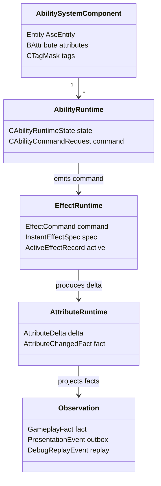

# GAS 概念模型 Spec

## 目的

定义 GAS 概念在 Unity ECS 版 EX-GAS 2.0 中的目标表达。

## 概念映射

| GAS 概念 | Unity ECS 目标表达 | 权威边界 |
|---|---|---|
| ASC | Entity + ASC components / buffers | Simulation |
| Ability | Ability entity + runtime state + command request | Simulation |
| GameplayEffect | Effect command / instant spec / active effect store | Simulation |
| Attribute | Attribute value buffer + delta stream | Simulation |
| GameplayTag | Dense tag mask / requirement query | Simulation / Definition |
| GameplayCue | Cue request + presentation marker | Observation / Presentation |
| EffectContext | Runtime context metadata | Simulation |
| Spec | Instant spec stream / active mutation stream | Simulation |
| Debug / Replay | Derived facts and diagnostics | Observation |

## UML 概念图

## 不变量

1. Ability 产生意图，不直接写 Attribute。
2. GameplayEffect 改变状态，但 instant effect 不应默认创建 runtime GE entity。
3. Attribute / Tag 是判定和聚合结果，不是 OOP callback 入口。
4. Cue / Presentation 观察事实，不决定 gameplay。
## 历史方案定位

1. Ability / Effect / Attribute / Tag 作为 ECS Core 的概念切分来自 `../历史方案参考/方案11.md:20-43`。
2. 用 unmanaged 数据和 Burst-friendly system 承载 Ability 语义的信号来自 `../历史方案参考/方案14.md:122-180`。
3. 外部业务只通过 facade / command 进入 GAS 的信号来自 `../历史方案参考/方案10.md:433-563`。
