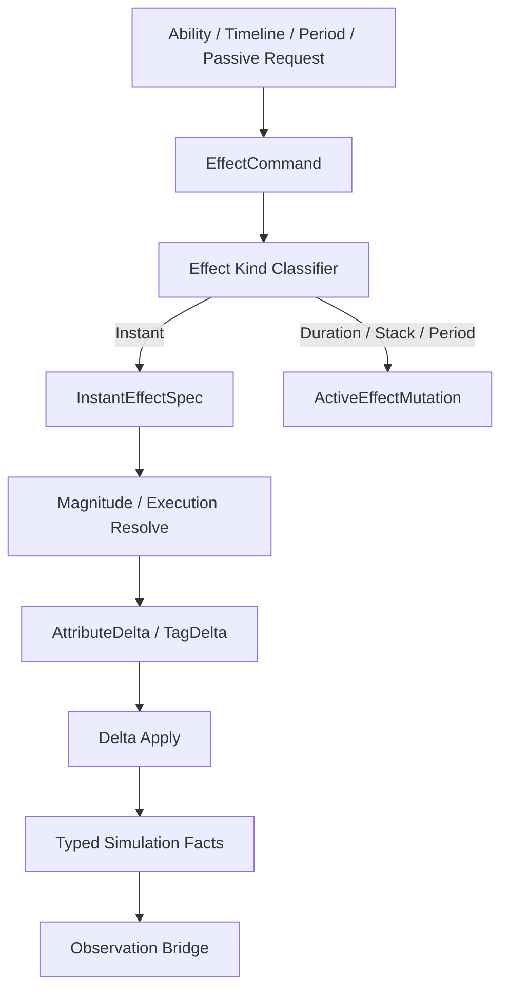

# EffectCommand / SpecStream / AttributeDelta Spec

## 目的

定义 AM-2 到 AM-4 的核心契约：Effect Command 是写入口，Instant Spec 是计算输入，Attribute Delta 是状态变更载体，Typed Facts 是业务 reaction 的主输入。

## 数据流图

## 核心契约

| 契约 | 职责 |
|---|---|
| `EffectCommand` | 表达施加意图，携带 source/target/context/effect code |
| `InstantEffectSpec` | 承载一次 instant GE 的只读计算输入 |
| `ActiveEffectMutation` | 承载 duration/stack/period/granted state 变更 |
| `AttributeDelta` | 承载 attribute 变更，不直接代表表现 |
| `TypedSimulationFact` | 供业务 reaction 消费的稳定事实 |

## Unity Entities 校准

`EffectCommand` 是 GAS 语义，不等同于 Unity entity。目标态按频率选择承载：

| 命令类型 | 默认承载 | 适用场景 |
|---|---|---|
| 低频边界意图 | request entity / command component | 玩家输入、AI 决策、测试 runner |
| 高频 instant GE | frame-local command DynamicBuffer / Native stream / chunk-local command | 普攻、伤害、治疗、period tick、passive trigger |
| 结构变化命令 | ECB + structural playback phase | spawn、destroy、grant ability、owner cleanup |

普通 instant GE 不能因为“写入口统一”而默认创建 request entity 或 runtime GE entity。高频路径必须能被 `ISystem` + job 批处理，并由 Debugger 输出 command/spec/delta/fact 计数。

## DOTS 深读后的承载分层

`EffectCommand` 目标态必须拆成四类承载，不允许用一个全局 stream owner 覆盖全部语义：

| 分层 | 职责 | 候选 API | 适用规则 | 禁止 |
|---|---|---|---|
| Boundary request | 玩家输入、AI 决策、测试 runner、网络等低频外部意图 | request entity、command component、Boundary buffer | `CASE-08` `SEL-01` | 按 hit / modifier 数量创建 request entity |
| Core frame command | 本帧 Core 内部要处理的 instant / period / passive command | owner buffer、frame-local DynamicBuffer、`NativeStream`、per-thread stream | `CASE-04` `CASE-12` `BUF-01` | 无容量预算的全局大 buffer |
| Parallel fan-in stream | 多 job producer 产生的 command / spec / delta / fact | `NativeStream`、per-thread list + merge、post-sort | `CASE-12` `NAT-02` `NAT-03` `PRF-13` | 无序 `ParallelWriter` 直接影响 battle hash |
| Structural mutation request | grant/remove/spawn/destroy/cleanup 等结构变化意图 | EntityQuery bulk、`ComponentTypeSet`、ECB ParallelWriter、`EntityQueryCaptureMode.AtPlayback` | `CASE-05` `CASE-33`~`CASE-35` `SC-03` `PRF-04` | job 内 `EntityManager` 或逐实体 ECB 表达大批量同类变化 |

执行含义：

1. AM3 的 singleton DynamicBuffer 只能是 direct proof 承载；x50 后若出现 global buffer pressure，必须切到 owner-local 或 `NativeStream` 复核。
2. `BEffectCommandSetByCallerValue` 这类变长附属数据必须有 internal capacity / range / spill 指标；不能无限追加到一个全局 buffer。
3. Attribute target 不能默认 `BufferLookup` 随机写；优先按 target grouped stream / per-target buffer / chunk apply 设计。
4. 若使用 `EntityIndexInQuery` 作为 deterministic sort key，必须报告 base entity index helper job 成本；更稳妥的是 chunk index + local order / command sequence。**前置条件**：`EntityIndexInQuery` 仅在禁止结构变化的 phase（SpecEval, DeltaApply, TypedFact）内可用作 sort key；在允许结构变化的 phase 中结构变化会使 entity index 失效，必须改用 `[EntityIndexInChunk]` + stable local order。
5. ExecutionCalculation 不使用托管 delegate；目标形态是 generated id + Burst job/static switch。FunctionPointer 只有在单次调用处理足够多 modifier 时才可作为候选。

## EffectCommand API 选型矩阵

`EffectCommand` 是语义契约，不是固定数据结构。AM3 迁移 simple instant evaluation 前必须完成下列选型复核：

| 候选承载 | 适用 | 风险 | 适用规则 | 验收指标 |
|---|---|---|---|---|
| ASC owner `DynamicBuffer<BEffectCommand>` | per-owner command 较少、consumer 明确、需要持久 owner 语义 | buffer spill、并行写复杂、结构变化后 handle 失效 | `CASE-04` `BUF-01` `BUF-03` | per-owner length / capacity / peak / spill |
| 全局 stream owner `DynamicBuffer<BEffectCommand>` | AM2 契约阶段、低规模验证、需要最小接入成本 | 全局 buffer pressure、scan 成本、百万实体下 fan-in 瓶颈 | `SEL-02`（proof-only，禁止固化为 scale-ready）`BUF-02` | global length / capacity / clear phase |
| `NativeStream` / per-thread stream | 多 job 并行 fan-in、压测、需要减少全局写竞争 | merge phase、allocator / dispose 责任、排序需求 | `CASE-12` `NAT-03` `NAT-02` `PRF-13` | stream for-each count、merge cost、deterministic order |
| request entity | 玩家输入、AI 决策、测试 runner 等低频边界意图 | 高频 create/destroy、archetype churn、sync point | `CASE-08` `PRF-11` `SEL-01` | request entity create/destroy 不随 hit 数线性增长 |
| ECB `AppendToBuffer` | 结构变化 phase 后追加到已存在 owner buffer | playback 可见性屏障、sort key 确定性 | `CASE-05` `CASE-47` `CASE-35` `ECB-02` | ECB playback count、sort key policy |
| EntityQuery bulk / `EntityQueryCaptureMode.AtPlayback` | 大批量 grant/remove/cleanup 派生 command | 不适合每条 command 携带复杂上下文 | `CASE-33` `CASE-34` `SC-03` | structural batch count、per-entity command count |
| target grouped stream / per-target buffer | delta apply 可按 target 顺序批处理 | 需要排序 / grouping phase，buffer 容量需预算 | `CASE-04` `CASE-23` `QRY-04` | random lookup count 下降、target group count |
| Burst static switch / generated function id | magnitude / execution calculation | 生成表升级成本、函数过多时分支或代码体积 | `CASE-11` `BUR-01` `PRF-15` | Burst target、branch distribution、vectorization |

默认策略：AM2 可以保留全局 stream owner 作为契约落点；AM3 不能直接继承为目标态性能方案，必须按 `SEL-01`/`SEL-02`/`SEL-04` 重新选型。

## AM-2 ECS 数据落点

当前代码契约把 GAS 语义映射到 Unity Entities 数据承载：

| GAS 契约 | ECS 类型 | 承载策略 |
|---|---|---|
| Stream owner | `CEffectCommandSpecStream` | singleton entity，只保存版本、sequence、context 游标 |
| Effect command | `BEffectCommand` | `IBufferElementData`，frame command data，不默认创建 request entity |
| SetByCaller | `BEffectCommandSetByCallerValue` | stream buffer range，属于 command/spec 侧数据 |
| Instant spec | `BInstantEffectSpec` | `IBufferElementData`，承载本次 instant GE 的只读计算输入，迁移期携带 `CueRequestOnApplyCode` |
| Attribute delta | `BAttributeDelta` | `IBufferElementData`，承载 attribute 写入意图和旧/新值 |
| Active mutation | `BActiveEffectMutation` | `IBufferElementData`，作为 AM5 Active Effect Store 的 mutation 占位 |
| Typed facts | `BTypedSimulationFact` | `IBufferElementData`，作为 reaction / observation 的稳定事实源 |

显式 phase skeleton 使用 `SEffectCommandIngest`、`SInstantEffectSpecBuild`、`SActiveEffectMutationApply`、`SAttributeDeltaApply`、`STypedSimulationFactProjection`，并进入 `GASSystemScheduleContract`。AM-3 增加 `STypedSimulationFactEventBridge` 作为迁移期 observation bridge：它消费 `BTypedSimulationFact` 并投影旧 `BAttributeChangeEvent`，用于 legacy event bus 兼容；AM-3 已让 `SPresentationOutboxProjection` / `SDebugReplayLogProjection` 直接消费 attribute typed fact、cue typed fact、generic typed gameplay fact 和 damage typed fact，并通过 `SourceFactSequence` 跳过同源 legacy duplicate；AM-3 还让 `SInstantEffectCueRequestProjection` 从 `BInstantEffectSpec.CueRequestOnApplyCode` 先写 `BTypedSimulationFact(CueRequested)`，再投影旧 `BCueRequest` / `BGameplayEvent(CueRequested)`。目标态业务 reaction 仍应直接消费 typed facts。AM-2 固定 phase 和查询布局；AM-3 已开始把 direct simple instant evaluation 迁入该主链。

## AM-3 Instant Evaluation 落点

当前代码主链已经覆盖 direct simple instant command 的最小可验收路径：

1. `BEffectCommand` 进入 `SInstantEffectSpecBuild`，对 simple instant GE definition 生成 `BInstantEffectSpec`。
2. `SAttributeDeltaApply` 解析 `GEModifierDefinition` 的 `Constant` / `SetByCaller` magnitude，直接更新目标 ASC 的 `BAttribute`，并写入 `BAttributeDelta`。
3. `STypedSimulationFactProjection` 将 `BAttributeDelta` 投影为 `BTypedSimulationFact`。
4. `BEffectCommandSetByCallerValue` 在 spec build 后回写 `SpecSequence`，保持 command/spec/delta/fact 的关联证据。
5. direct command 主链不创建 `CApplyGameplayEffectRequest`，也不创建 `CEffectSpecData` / `CEffectLifecycle` runtime GE entity。
6. `GameplayEffectRequestWriter.AppendSimpleInstantCommandOrCreateSingleTargetRequest` 作为迁移期 producer 入口，能把 simple single-target request 转成 `BEffectCommand`；未命中 AM3 条件时保留旧 request fallback。
7. `SAbilityCommit` 的 activation self / target effect producer、`AbilityRuntimeActions.RequestCostGameplayEffect` 的 self cost producer，以及 `TimelineApplyEffectsProducer` 的 single-target ApplyEffects producer 已接入该入口，因此这些 simple single-target instant GE 不再默认创建 request entity。
8. `STypedSimulationFactEventBridge` 当前只桥接 attribute base value changed fact 到旧 `BAttributeChangeEvent`，作为迁移期 legacy 出口；它不是目标态 reaction 主输入。
9. `SPresentationOutboxProjection` / `SDebugReplayLogProjection` 已直接消费 attribute typed fact 并输出 `BPresentationEvent(AttributeChange)` / `BDebugReplayEvent(AttributeChange)`；同源 legacy `BAttributeChangeEvent` 通过 `SourceFactSequence` 跳过，避免 Observation 重复投影。
10. `SInstantEffectCueRequestProjection` 已将 simple instant Cue-on-Apply 写成 `BTypedSimulationFact(CueRequested)`；`SPresentationOutboxProjection` / `SDebugReplayLogProjection` 已直接消费 cue typed fact 并输出 `BPresentationEvent(CueRequest)` / `BDebugReplayEvent(CueRequest)`；同源 legacy `BCueRequest` / `BGameplayEvent(CueRequested)` 通过 `SourceFactSequence` 跳过，避免 Observation 重复投影。
11. `SPresentationOutboxProjection` / `SDebugReplayLogProjection` 已对 attribute / cue 之外的 typed gameplay fact 提供 generic fallback，输出 `BPresentationEvent(GameplayEvent)` / `BDebugReplayEvent(GameplayEvent)`；同源 legacy `BGameplayEvent` 通过 `SourceFactSequence` 跳过，避免 Observation 重复投影。
12. `SPresentationOutboxProjection` / `SDebugReplayLogProjection` 已直接消费 damage typed fact 并输出 `BPresentationEvent(Damage)` / `BDebugReplayEvent(Damage)`；同源 legacy `BDamageEvent` 通过 `SourceFactSequence` 跳过，避免 Observation 重复投影。
13. `EffectCommandSpecStream.CommandWriter` 是迁移期 frame-local writer：批量 producer 可一次解析 stream entity / current frame / command buffer / SetByCaller buffer 后多次 append，并在 `Flush()` 时一次回写 stream counters。它只减少 proof-only singleton DynamicBuffer 路径的 per-command query 放大，不改变 `NativeStream` / per-owner buffer 的高规模目标态选型。

AM-3 仍是迁移期落点：当前已迁入 ability activation simple single-target producer、ability cost self producer、Timeline ApplyEffects single-target simple instant producer 与 Timeline ApplyEffects multi-target simple instant command fan-out，并补入 command writer frame query 收缩、attribute typed fact observation bridge、attribute typed fact native Presentation / Replay consumer、Cue-on-Apply projection、cue typed fact native Presentation / Replay consumer、generic typed gameplay fact native Presentation / Replay consumer 和 damage typed fact native Presentation / Replay consumer；AM-5 已让 period due / overflow simple instant child GE 复用该主链。剩余 producer 尚未全部迁入 command stream，业务 reaction typed fact consumer、全局临时 EntityQuery 清理和真实 parallel fan-in / deterministic merge 尚未闭合；Duration / Stack / Granted state、复杂 tag 语义和复杂 period / overflow child GE 仍归旧 request fallback 或后续 Active Effect Store / typed fact consumer 任务处理。

## AM-5 Period / Overflow Derived Command 落点

ActiveEffectStore 的 period / overflow 派生输出遵守同一 command/spec/delta/fact 主链：

1. `EEffectCommandSource.Period` 表示 active GE 的 period due 派生 simple instant child GE；`EEffectCommandSource.Overflow` 表示 stack overflow 派生 simple instant child GE。
2. 派生 child GE 若满足 AM3 simple instant 条件，必须优先写入 `BEffectCommand`，并复制派生 runtime GE 上的 `BSetByCallerValue` 到 `BEffectCommandSetByCallerValue` range。
3. 派生命令不得直接写 Attribute，也不得默认创建 `CApplyGameplayEffectRequest` / child runtime GE entity；复杂 child GE 才允许完整回退旧 request。
4. period cursor 是 active effect lifecycle 状态，`CPeriodRuntime.StartTime` 更新后必须同步 owner-local `BActiveEffectSlot.LastPeriodFrame`，避免 store 镜像和派生命令证据不同步。
5. 当前承载仍是 singleton DynamicBuffer proof-only；x50 / x1000 出现 global buffer pressure、buffer spill、merge cost 或 deterministic ordering 风险时，必须按 `NativeStream` / owner-local command buffer 重新选型。

## 不变量

1. ContextId 在 command/spec/delta/fact 中连续传递。
2. SetByCaller 属于 command/spec，不进入 definition。
3. AttributeDelta 应可批量 apply，不依赖 managed callback。
4. Observation event 从 typed facts 派生，不作为 reaction 主输入。
5. 高频 `EffectCommand` 承载不得引入 per-hit structural change。
6. `EffectCommand` 具体承载必须有 API 选型表，不能把 AM2 的全局 DynamicBuffer 当作最终答案。
7. `EffectCommand` 任务必须报告 allocator、buffer spill、query/filter、lookup、deterministic ordering 和 Burst calculation 证据。
8. period / overflow 派生命令必须保留 `Source`，并与 SetByCaller range、context、sequence 连续传递。

## 验收

1. 默认 AutoChess x1 全业务链路通过。
2. x50 输出 command/spec/delta/fact 计数。
3. simple instant GE runtime entity create/destroy 数量随迁移下降。
4. simple instant GE request entity create/destroy 数量也应随迁移下降；目标态高频路径只保留 command data。
## 历史方案定位

1. ApplyEffectRequest / GE 命令实体的早期设计信号来自 `../历史方案参考/方案14.md:317-335`。
2. AbilityCommand / unmanaged activation param 的设计信号来自 `../历史方案参考/方案15.md:199-212`。
3. 历史方案中的 Thin Adapter 将 OOP 命令转成 ECS 标记，本路线吸收为 Runtime Boundary Layer 的 CommandGateway 职责：`../历史方案参考/方案15.md:473-521`。
4. GEFactory / generated GE entity 示例来自 `../历史方案参考/方案14.md:580-624`，当前只吸收配置生成信号，不吸收“simple instant GE 默认实体化”方向。
