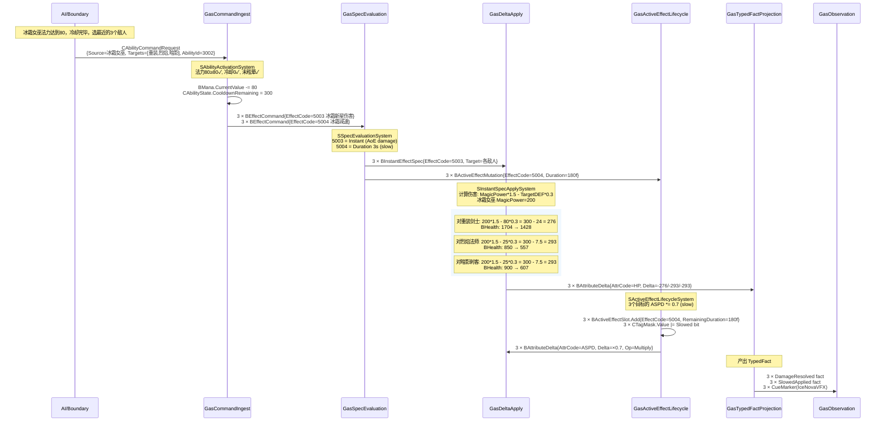
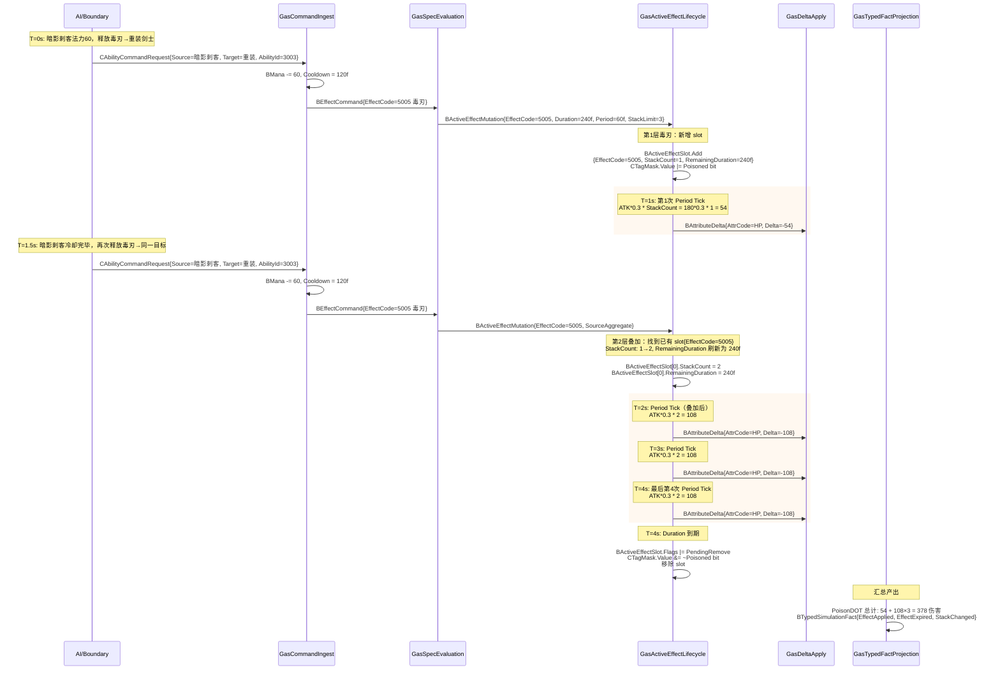

# AutoChess 完整业务案例设计 Spec

## 目的

本 Spec 是 EX-GAS 2.0 的**完整 GAS 设计预演**，以 AutoChess Demo 为载体，用具体棋子、属性、技能、GE、羁绊和 System 实现，验证四层架构、Runtime Core 管线、Entity/Component 物理布局和 Luban/SourceGenerator 配置链能否承载真实 GAS 业务。

本 Spec 的格式对齐历史方案 12/13/14/15 的"完整案例详细设计"风格：包含具名单位、真实 Excel 配置行、完整 C# System 代码、Mermaid 时序图和逐步业务走查。它与 `10-AutoChess无头验收Spec.md` 的关系是：10 定义验收基础设施和门槛，10B 定义验收用的具体业务内容；与 `11-AutoChessDemo-Luban配置方案Spec.md` 的关系是：11 定义配置表结构和生成链路，10B 提供填入这些表的真实数据行。

## 范围

1. 棋子设计：4 种棋子类型，具名、具属性、具技能
2. 属性系统：6 种属性的 ECS Component 布局、访问器和重算逻辑
3. 技能设计：普攻 + 3 种主动技能 + 1 种被动技能，覆盖 Instant/Duration/Period/Stack/AoE
4. GE 设计：6 种 GE，覆盖 Damage/Heal/Stun/Slow/Poison/AoE
5. 羁绊系统：冰系羁绊 + 牧师职业羁绊，typed fact reaction 驱动
6. 核心 System 实现：C# ISystem + BurstCompile，落到目标态 SystemGroup
7. 完整业务流程走查：3 条具名走查（盾击眩晕、冰霜新星 AoE、毒刃叠加中毒爆发）
8. 交互矩阵：单位 × 机制覆盖矩阵

## 非目标

1. 不定义棋盘 AI、移动、寻路、选敌逻辑（属于 Demo 业务层，非 GAS 概念验证）
2. 不定义真实 UI/VFX/SFX 资源绑定（走 Presentation outbox marker）
3. 不重复 03-RuntimeCore管线Spec 的 SystemGroup 定义和 13-EntityComponent物理布局Spec 的布局约束
4. 不替代 08-Luban-SourceGenerator配置生成链路Spec 的通用生成规范

---

## 一、场景设定

```
棋盘：4×2 格（己方）vs 4×2 格（敌方），共 8 个单位同时战斗
时间单位：Frame tick（实时战斗，非回合制）
职业：剑士(Swordsman)、法师(Mage)、刺客(Assassin)、牧师(Priest)
种族/阵营：冰系(Frost)、暗影(Shadow)、圣光(Light)
羁绊激活阈值：冰系 ≥ 3 个单位 → 所有攻击附加减速；牧师 ≥ 2 个单位 → 治疗量 +20%
```

**默认验收战斗配置（x1 精链路）：**

| 方阵 | 棋子 | 职业 | 种族 | 星级 | 位置 |
|---|---|---|---|---|---|
| 己方 | 霜甲剑士 | 剑士 | 冰系 | 2星 | 前排左 |
| 己方 | 冰霜女巫 | 法师 | 冰系 | 3星 | 后排左 |
| 己方 | 暗影刺客 | 刺客 | 暗影 | 2星 | 前排右 |
| 己方 | 圣光牧师 | 牧师 | 圣光 | 2星 | 后排右 |
| 敌方 | 重装剑士 | 剑士 | — | 2星 | 前排左 |
| 敌方 | 烈焰法师 | 法师 | — | 3星 | 后排左 |
| 敌方 | 暗影刺客 | 刺客 | 暗影 | 2星 | 前排右 |
| 敌方 | 圣光牧师 | 牧师 | 圣光 | 2星 | 后排右 |

**羁绊触发情况（己方）：**
- 冰系：霜甲剑士 + 冰霜女巫 = 2 个单位，**未满 3，不触发冰系羁绊**（设计意图：x1 不激活羁绊以简化初始验收，羁绊由 x50 profile 单独验证）

**本 Spec 三条完整业务走查：**
> 走查 A — 剑士"盾击"眩晕敌方前排：Ability 激活 → GE 施加 → Duration/Stun tag → 到期移除
> 走查 B — 法师"冰霜新星"打击 3 个敌人：AoE 目标选取 → Instant damage + Duration slow → AttributeDelta
> 走查 C — 刺客"毒刃"叠加 2 层触发中毒爆发：Stack GE → period tick → stack overflow → 额外爆发伤害

---

## 二、棋子设计

### 2.1 棋子 Luban 配置（`autochess.unit.xlsx`）

| ID | Name | Class | Race | Star | HP | ATK | DEF | ASPD | MANA | ManaRegen | AbilityId | SynergyTags |
|----|------|-------|------|------|-----|-----|-----|------|------|-----------|-----------|-------------|
| 2001 | 霜甲剑士 | Swordsman | Frost | 2 | 1500 | 120 | 80 | 100 | 40 | 5 | 3001 | Frost |
| 2002 | 冰霜女巫 | Mage | Frost | 3 | 900 | 70 | 30 | 100 | 80 | 12 | 3002 | Frost |
| 2003 | 暗影刺客 | Assassin | Shadow | 2 | 900 | 180 | 25 | 120 | 60 | 8 | 3003 | Shadow |
| 2004 | 圣光牧师 | Priest | Light | 2 | 700 | 50 | 20 | 100 | 100 | 10 | 3004 | Light |
| 2005 | 重装剑士 | Swordsman | — | 2 | 1800 | 100 | 100 | 90 | 40 | 5 | 3001 | — |
| 2006 | 烈焰法师 | Mage | — | 3 | 850 | 90 | 25 | 100 | 80 | 12 | 0 | — |

### 2.2 棋子 BlobAsset 结构（Generated by SourceGenerator）

```csharp
// ============================================================
// [Layer 4: Definition & Generation]
// 文件: Assets/AutoChessDemo/Config/GeneratedRuntime/AutoChessBlobBuilders.g.cs
// 由 Luban + SourceGenerator 从 autochess.unit.xlsx 自动生成
// ============================================================

public struct UnitConfigBlob
{
    public int UnitId;
    public int ClassId;          // Swordsman=1, Mage=2, Assassin=3, Priest=4
    public int RaceId;           // Frost=1, Shadow=2, Light=3
    public int Star;
    public int AbilityId;
    public FixedString32Bytes Name;

    // 基础属性（星级缩放前的白值）
    public float BaseHP;
    public float BaseATK;
    public float BaseDEF;
    public float BaseASPD;
    public float BaseMANA;
    public float BaseManaRegen;

    // 羁绊 tag bit（用于 SynergyDetect 的 CTagMask 查询）
    public uint SynergyBits;     // bit 0=Frost, bit 1=Shadow, bit 2=Light
}

// 单位 Spawn 时从 BlobAsset 读取并写入 ASC Entity 的 Component
public struct CUnitConfigRef : IComponentData
{
    public BlobAssetReference<UnitConfigBlob> Config;
}
```

### 2.3 单位运行时 Component

```csharp
// ============================================================
// [Layer 3: GAS Runtime Core — ASC Entity 挂载]
// 文件: Assets/AutoChessDemo/Runtime/Units/CChessUnit.cs
// ============================================================

// 棋盘单位状态（纯 unmanaged）
public struct CChessUnit : IComponentData
{
    public int CampId;           // 0=己方, 1=敌方
    public byte BoardCol;        // 棋盘列 0-3
    public byte BoardRow;        // 棋盘行 0-1
    public bool IsAlive;
}

// 单位战斗 AI 状态（每 tick 更新选敌和普攻节奏）
public struct CChessCombat : IComponentData
{
    public Entity CurrentTarget;
    public float AttackCooldownRemaining;  // 剩余冷却秒数，≤0 时可普攻
    public float BaseAttackInterval;        // = 1.0 / (ASPD / 100.0)，ASPD=100 → 1秒一次
}
```

---

## 三、属性系统设计

### 3.1 属性 Luban 配置（`autochess.attribute.xlsx`）

| AttrId | Name | AttrSet | DefaultValue | Min | Max | ClampMin | ClampMax |
|--------|------|---------|-------------|-----|-----|----------|----------|
| 1 | HP | Combat | 0 | 0 | 99999 | true | true |
| 2 | MaxHP | Combat | 0 | 1 | 99999 | true | true |
| 3 | ATK | Combat | 0 | 0 | 99999 | true | false |
| 4 | DEF | Combat | 0 | 0 | 99999 | true | false |
| 5 | ASPD | Combat | 100 | 10 | 500 | true | true |
| 6 | MANA | Resource | 0 | 0 | 200 | true | true |
| 7 | MaxMANA | Resource | 100 | 1 | 200 | true | true |
| 8 | ManaRegen | Resource | 10 | 0 | 50 | true | false |

### 3.2 属性 ECS Component 布局

按照 `13-EntityComponent物理布局Spec` 的规定："每种属性一个 component type"。6 种运行时属性拆为独立 `IComponentData`，确保 Query 精确性、Cache 友好和 Job 依赖精确。

```csharp
// ============================================================
// [Layer 3: GAS Runtime Core — ASC Entity 挂载]
// 每种属性一个 IComponentData type
// Query: WithAll<BHealth> 只匹配有 health 的 entity
// Job 依赖: 写 BHealth 不会阻塞读 BMana 的 job
// ============================================================

public struct BHealth : IComponentData
{
    public float CurrentValue;
    public float BaseValue;      // 星级 * 配置白值
    public float BonusValue;     // GE 累积 bonus（add/multiply/override 结算后）
}

public struct BMaxHealth : IComponentData
{
    public float CurrentValue;
    public float BaseValue;
}

public struct BAttack : IComponentData
{
    public float CurrentValue;
    public float BaseValue;
    public float BonusValue;
}

public struct BDefense : IComponentData
{
    public float CurrentValue;
    public float BaseValue;
    public float BonusValue;
}

public struct BAttackSpeed : IComponentData
{
    public float CurrentValue;
    public float BaseValue;
    public float BonusValue;
}

public struct BMana : IComponentData
{
    public float CurrentValue;
    public float BaseValue;
    public float BonusValue;
}

public struct BMaxMana : IComponentData
{
    public float CurrentValue;
    public float BaseValue;
}

public struct BManaRegen : IComponentData
{
    public float CurrentValue;
    public float BaseValue;
}
```

### 3.3 属性访问器（SourceGenerator 生成）

```csharp
// ============================================================
// [Layer 4: Definition & Generation]
// 文件: Assets/AutoChessDemo/Config/GeneratedRuntime/AutoChessIds.g.cs
// 替代运行时 Dictionary 查找，Burst 友好
// ============================================================

public static class XAttr
{
    public const int HP        = 1;
    public const int MaxHP     = 2;
    public const int ATK       = 3;
    public const int DEF       = 4;
    public const int ASPD      = 5;
    public const int MANA      = 6;
    public const int MaxMANA   = 7;
    public const int ManaRegen = 8;
}

// SourceGenerator 生成的属性访问器（static switch，Burst 友好）
public static class AttrAccessor
{
    [BurstCompile]
    public static float GetCurrentValue(int attrCode, in BHealth hp, in BAttack atk, in BDefense def,
        in BAttackSpeed aspd, in BMana mana, in BManaRegen regen)
    {
        return attrCode switch
        {
            XAttr.HP        => hp.CurrentValue,
            XAttr.ATK       => atk.CurrentValue,
            XAttr.DEF       => def.CurrentValue,
            XAttr.ASPD      => aspd.CurrentValue,
            XAttr.MANA      => mana.CurrentValue,
            XAttr.ManaRegen => regen.CurrentValue,
            _ => 0f
        };
    }

    [BurstCompile]
    public static void SetCurrentValue(int attrCode, ref BHealth hp, ref BAttack atk, ref BDefense def,
        ref BAttackSpeed aspd, ref BMana mana, ref BManaRegen regen, float value)
    {
        switch (attrCode)
        {
            case XAttr.HP:   hp.CurrentValue   = math.clamp(value, 0, 99999); break;
            case XAttr.ATK:  atk.CurrentValue  = math.max(0, value); break;
            case XAttr.DEF:  def.CurrentValue  = math.max(0, value); break;
            case XAttr.ASPD: aspd.CurrentValue = math.clamp(value, 10, 500); break;
            case XAttr.MANA: mana.CurrentValue = math.clamp(value, 0, 200); break;
        }
    }
}
```

---

## 四、Tag 系统设计

### 4.1 Tag Luban 配置（`autochess.tag.xlsx`）

按照不变量 32：Tag 状态通过 bitmask（`CTagMask`）表达，不使用独立 tag component。

| TagId | Name | Category | BitIndex | Description |
|-------|------|----------|----------|-------------|
| 1 | State.Stunned | State | 0 | 眩晕，不可行动 |
| 2 | State.Slowed | State | 1 | 减速，ASPD -30% |
| 3 | State.Frozen | State | 2 | 冰冻，不可行动+ASPD=0 |
| 4 | State.Poisoned | State | 3 | 中毒，受到 period 伤害 |
| 5 | Buff.FrostArmor | Buff | 4 | 冰系羁绊护甲 |
| 6 | Buff.HealBonus | Buff | 5 | 牧师羁绊治疗加成 |
| 7 | Ability.ShieldBash | Ability | 6 | 盾击能力标记 |
| 8 | Ability.FrostNova | Ability | 7 | 冰霜新星能力标记 |
| 9 | Ability.PoisonBlade | Ability | 8 | 毒刃能力标记 |
| 10 | Ability.HolyLight | Ability | 9 | 圣光治疗能力标记 |
| 11 | Synergy.Frost | Synergy | 10 | 冰系羁绊单位标记 |
| 12 | Synergy.Priest | Synergy | 11 | 牧师羁绊单位标记 |
| 13 | State.Dead | State | 12 | 死亡标记 |

### 4.2 Tag 生成的 Bit 常量

```csharp
// ============================================================
// [Layer 4: Definition & Generation]
// 文件: Assets/AutoChessDemo/Config/GeneratedRuntime/AutoChessIds.g.cs
// ============================================================

public static class XTagBit
{
    public const ulong Stunned      = 1UL << 0;
    public const ulong Slowed       = 1UL << 1;
    public const ulong Frozen       = 1UL << 2;
    public const ulong Poisoned     = 1UL << 3;
    public const ulong FrostArmor   = 1UL << 4;
    public const ulong HealBonus    = 1UL << 5;
    public const ulong ShieldBash   = 1UL << 6;
    public const ulong FrostNova    = 1UL << 7;
    public const ulong PoisonBlade  = 1UL << 8;
    public const ulong HolyLight    = 1UL << 9;
    public const ulong SynFrost     = 1UL << 10;
    public const ulong SynPriest    = 1UL << 11;
    public const ulong Dead         = 1UL << 12;
}

// Tag 需求检查工具（纯 Burst）
[BurstCompile]
public static class TagCheck
{
    public static bool HasTag(ulong mask, ulong tagBit) => (mask & tagBit) != 0;
    public static bool HasAnyTag(ulong mask, ulong tagBits) => (mask & tagBits) != 0;
    public static bool HasAllTags(ulong mask, ulong tagBits) => (mask & tagBits) == tagBits;
    public static bool IsStunnedOrFrozen(ulong mask) => (mask & (XTagBit.Stunned | XTagBit.Frozen)) != 0;
    public static bool IsDead(ulong mask) => (mask & XTagBit.Dead) != 0;
}
```

---

## 五、技能设计

### 5.1 技能 Luban 配置（`autochess.ability.xlsx`）

| AbilityId | Name | Type | ManaCost | CooldownFrames | TargetRule | MaxTargets | Range | EffectId_Primary | EffectId_Secondary | BlockTags |
|-----------|------|------|----------|----------------|------------|------------|-------|------------------|--------------------|------------|
| 3001 | 盾击 | Active | 40 | 180 (3s@60fps) | NearestEnemy | 1 | 1.5 | 5001 | 5002 | Stunned,Frozen |
| 3002 | 冰霜新星 | Active | 80 | 300 (5s@60fps) | NearestEnemies | 3 | 3.0 | 5003 | 5004 | Stunned,Frozen |
| 3003 | 毒刃 | Active | 60 | 120 (2s@60fps) | NearestEnemy | 1 | 1.5 | 5005 | — | Stunned,Frozen |
| 3004 | 圣光治疗 | Active | 40 | 240 (4s@60fps) | LowestHPAlly | 1 | 4.0 | 5006 | — | Stunned,Frozen |
| 0 | 普攻 | PassiveAuto | 0 | — | NearestEnemy | 1 | 按职业 | 4001 | — | Stunned,Frozen |

**普攻是 default ability**：每个棋子都有，不占 AbilityId 槽位。普攻通过 `CAttackAbilityData` component 配置其伤害 GE 和攻击范围。

### 5.2 技能 BlobAsset 结构

```csharp
// ============================================================
// [Layer 4: Definition & Generation]
// Ability 静态定义 BlobAsset
// ============================================================

public struct AbilityDefBlob
{
    public int AbilityId;
    public FixedString32Bytes Name;
    public byte AbilityType;     // 0=PassiveAuto, 1=Active
    public float ManaCost;
    public float CooldownFrames;
    public byte TargetRule;      // 0=NearestEnemy, 1=LowestHPAlly, 2=NearestEnemies
    public byte MaxTargets;
    public float Range;
    public int EffectIdPrimary;  // 主 GE ID
    public int EffectIdSecondary;// 副 GE ID（如盾击：主=伤害GE，副=眩晕GE）
    public ulong BlockTagBits;   // 自身有此 tag 时禁止释放
}

// ASC Entity 上挂载的 Ability 运行时数据
public struct CAbilityState : IComponentData
{
    public int AbilityId;
    public float CooldownRemaining;   // 剩余冷却帧数，0 时可释放
    public float ManaCurrent;         // 当前法力
}
```

---

## 六、GE 设计

### 6.1 GE Luban 配置（`autochess.gameplay_effect.xlsx`）

| GEId | Name | Type | DurationFrames | PeriodFrames | StackLimit | StackPolicy | ModifierAttr | ModifierOp | ModifierMmc | GrantedTags | RemoveTags | ApplicationTagReq | ImmunityTags |
|------|------|------|----------------|--------------|------------|-------------|-------------|------------|-------------|-------------|------------|-------------------|--------------|
| 4001 | 普攻伤害 | Instant | 0 | 0 | — | — | HP | Minus | ATK*1.0 | — | — | — | — |
| 4002 | 冰系减速 | Duration | 180 (3s) | 0 | — | — | ASPD | Multiply | 0.7 | Slowed | — | — | — |
| 5001 | 盾击伤害 | Instant | 0 | 0 | — | — | HP | Minus | ATK*0.8 | — | — | — | — |
| 5002 | 眩晕 | Duration | 120 (2s) | 0 | — | — | ASPD | Override | 0.0 | Stunned | — | — | — |
| 5003 | 冰霜新星伤害 | Instant | 0 | 0 | — | — | HP | Minus | MagicPower*1.5-DEF*0.3 | — | — | — | — |
| 5004 | 冰霜减速 | Duration | 180 (3s) | 0 | — | — | ASPD | Multiply | 0.7 | Slowed | — | — | Frozen |
| 5005 | 毒刃 | Duration | 240 (4s) | 60 (1s) | 3 | SourceAggregate | HP | Minus | ATK*0.3 | Poisoned | — | — | — |
| 5006 | 圣光治疗 | Instant | 0 | 0 | — | — | HP | Add | MagicPower*0.8 | — | — | — | — |

**MMC 说明：**
- `ATK*1.0`：取 Source ASC 的 ATK CurrentValue × 1.0
- `MagicPower*1.5-DEF*0.3`：取 Source MagicPower × 1.5 − Target DEF × 0.3
- `ATK*0.8`：取 Source ATK × 0.8
- `ATK*0.3`：取 Source ATK × 0.3
- `MagicPower*0.8`：取 Source MagicPower × 0.8
- `0.7`：固定倍率（Multiply 操作，ASPD × 0.7）
- `0.0`：固定值（Override 操作，ASPD = 0）

### 6.2 GE BlobAsset 构建（SourceGenerator 生成）

```csharp
// ============================================================
// [Layer 4: Definition & Generation]
// 文件: Assets/AutoChessDemo/Config/GeneratedRuntime/AutoChessBlobBuilders.g.cs
// 由 Luban 读取 GE 配置 → SourceGenerator 生成 BlobAsset 构建代码
// ============================================================

public enum GEType : byte { Instant = 0, Duration = 1 }
public enum GEOperation : byte { Add = 0, Minus = 1, Multiply = 2, Override = 3 }
public enum GEStackPolicy : byte { None = 0, SourceAggregate = 1, TargetAggregate = 2 }

public struct GEStaticBlob
{
    public int GeId;
    public GEType GeType;
    public float DurationFrames;       // 0 = Instant
    public float PeriodFrames;         // 0 = 无 Period
    public byte StackLimit;            // 0 = 不可叠加
    public GEStackPolicy StackPolicy;

    public BlobArray<GEModifierBlob> Modifiers;
    public BlobArray<ulong> GrantedTags;   // GE 激活时授予的 tag bits
    public BlobArray<ulong> RemoveTags;    // GE 激活时移除的 tag bits
    public ulong ApplicationTagReqBits;    // 目标必须有这些 tag 才能施加
    public ulong ImmunityTagBits;          // 目标有这些 tag 则免疫
    public FixedString32Bytes Name;
}

public struct GEModifierBlob
{
    public int AttrCode;         // XAttr.HP / XAttr.ATK / ...
    public GEOperation Operation;
    public byte MmcTypeId;       // FunctionPointer 表中的索引
    public float BaseMagnitude;  // 固定值（如 0.7, 0.0）
}

// ============================================================
// GE_5003: 冰霜新星伤害（Instant，MMC = MagicPower*1.5 - DEF*0.3）
// ============================================================
public static class GEBlobBuilder
{
    public static BlobAssetReference<GEStaticBlob> Build_FrostNovaDamage()
    {
        var builder = new BlobBuilder(Allocator.Temp);
        ref var root = ref builder.ConstructRoot<GEStaticBlob>();

        root.GeId = 5003;
        root.GeType = GEType.Instant;
        root.DurationFrames = 0;
        root.PeriodFrames = 0;
        root.StackLimit = 0;
        root.StackPolicy = GEStackPolicy.None;
        root.ApplicationTagReqBits = 0;
        root.ImmunityTagBits = 0;
        root.Name = "冰霜新星伤害";

        var modifiers = builder.Allocate(ref root.Modifiers, 1);
        modifiers[0] = new GEModifierBlob
        {
            AttrCode = XAttr.HP,
            Operation = GEOperation.Minus,
            MmcTypeId = MmcTypeId.MagicPowerMulDefReduc, // FunctionPointer 索引
            BaseMagnitude = 0f,
        };

        builder.Allocate(ref root.GrantedTags, 0);
        builder.Allocate(ref root.RemoveTags, 0);

        var result = builder.CreateBlobAssetReference<GEStaticBlob>(Allocator.Persistent);
        builder.Dispose();
        return result;
    }

    // ============================================================
    // GE_5005: 毒刃（Duration 4s, Period 1s, StackLimit=3, SourceAggregate）
    // ============================================================
    public static BlobAssetReference<GEStaticBlob> Build_PoisonBlade()
    {
        var builder = new BlobBuilder(Allocator.Temp);
        ref var root = ref builder.ConstructRoot<GEStaticBlob>();

        root.GeId = 5005;
        root.GeType = GEType.Duration;
        root.DurationFrames = 240f;   // 4s @ 60fps
        root.PeriodFrames = 60f;      // 1s @ 60fps
        root.StackLimit = 3;
        root.StackPolicy = GEStackPolicy.SourceAggregate;
        root.ApplicationTagReqBits = 0;
        root.ImmunityTagBits = 0;
        root.Name = "毒刃";

        var modifiers = builder.Allocate(ref root.Modifiers, 1);
        modifiers[0] = new GEModifierBlob
        {
            AttrCode = XAttr.HP,
            Operation = GEOperation.Minus,
            MmcTypeId = MmcTypeId.AtkScale03, // ATK * 0.3
            BaseMagnitude = 0f,
        };

        var grantedTags = builder.Allocate(ref root.GrantedTags, 1);
        grantedTags[0] = XTagBit.Poisoned;

        builder.Allocate(ref root.RemoveTags, 0);

        var result = builder.CreateBlobAssetReference<GEStaticBlob>(Allocator.Persistent);
        builder.Dispose();
        return result;
    }

    // ============================================================
    // GE_5002: 眩晕（Duration 2s，Override ASPD=0，授予 Stunned tag）
    // ============================================================
    public static BlobAssetReference<GEStaticBlob> Build_Stun()
    {
        var builder = new BlobBuilder(Allocator.Temp);
        ref var root = ref builder.ConstructRoot<GEStaticBlob>();

        root.GeId = 5002;
        root.GeType = GEType.Duration;
        root.DurationFrames = 120f;   // 2s @ 60fps
        root.PeriodFrames = 0;
        root.StackLimit = 0;
        root.StackPolicy = GEStackPolicy.None;
        root.ApplicationTagReqBits = 0;
        root.ImmunityTagBits = XTagBit.Frozen; // 冰冻免疫眩晕
        root.Name = "眩晕";

        var modifiers = builder.Allocate(ref root.Modifiers, 1);
        modifiers[0] = new GEModifierBlob
        {
            AttrCode = XAttr.ASPD,
            Operation = GEOperation.Override,
            MmcTypeId = MmcTypeId.Flat,         // 固定值
            BaseMagnitude = 0f,                  // ASPD → 0
        };

        var grantedTags = builder.Allocate(ref root.GrantedTags, 1);
        grantedTags[0] = XTagBit.Stunned;

        builder.Allocate(ref root.RemoveTags, 0);

        var result = builder.CreateBlobAssetReference<GEStaticBlob>(Allocator.Persistent);
        builder.Dispose();
        return result;
    }

    // ============================================================
    // GE_5006: 圣光治疗（Instant，HP += MagicPower*0.8）
    // ============================================================
    public static BlobAssetReference<GEStaticBlob> Build_HolyLightHeal()
    {
        var builder = new BlobBuilder(Allocator.Temp);
        ref var root = ref builder.ConstructRoot<GEStaticBlob>();

        root.GeId = 5006;
        root.GeType = GEType.Instant;
        root.DurationFrames = 0;
        root.PeriodFrames = 0;
        root.StackLimit = 0;
        root.StackPolicy = GEStackPolicy.None;
        root.ApplicationTagReqBits = 0;
        root.ImmunityTagBits = 0;
        root.Name = "圣光治疗";

        var modifiers = builder.Allocate(ref root.Modifiers, 1);
        modifiers[0] = new GEModifierBlob
        {
            AttrCode = XAttr.HP,
            Operation = GEOperation.Add,
            MmcTypeId = MmcTypeId.MagicPowerScale08,
            BaseMagnitude = 0f,
        };

        builder.Allocate(ref root.GrantedTags, 0);
        builder.Allocate(ref root.RemoveTags, 0);

        var result = builder.CreateBlobAssetReference<GEStaticBlob>(Allocator.Persistent);
        builder.Dispose();
        return result;
    }
}
```

### 6.3 MMC FunctionPointer 注册表

```csharp
// ============================================================
// [Layer 3: GAS Runtime Core]
// MMC FunctionPointer 类型表 — 静态 switch 分发，Burst 友好
// 不变量 29: 不使用托管 delegate 或可变静态注册表
// ============================================================

public static class MmcTypeId
{
    public const byte Flat                = 0;
    public const byte AtkScale10          = 1;
    public const byte AtkScale08          = 2;
    public const byte AtkScale03          = 3;
    public const byte MagicPowerScale08   = 4;
    public const byte MagicPowerMulDefReduc = 5; // MagicPower*1.5 - TargetDEF*0.3
}

[BurstCompile]
public static class MmcEvaluator
{
    // GE 施加时调用：计算 modifier 的实际 magnitude
    // sourceAttr: Source ASC 的属性（通过 ComponentLookup 读取）
    // targetAttr: Target ASC 的属性（通过 ComponentLookup 读取）
    [BurstCompile]
    public static float Evaluate(
        byte mmcTypeId,
        float baseMagnitude,
        in BAttack srcAtk, in BHealth srcHp, in BDefense srcDef,
        in BAttackSpeed srcAspd, in BMana srcMana,
        in BAttack tgtAtk, in BHealth tgtHp, in BDefense tgtDef,
        in BAttackSpeed tgtAspd, in BMana tgtMana)
    {
        return mmcTypeId switch
        {
            MmcTypeId.Flat                => baseMagnitude,
            MmcTypeId.AtkScale10          => srcAtk.CurrentValue * 1.0f,
            MmcTypeId.AtkScale08          => srcAtk.CurrentValue * 0.8f,
            MmcTypeId.AtkScale03          => srcAtk.CurrentValue * 0.3f,
            MmcTypeId.MagicPowerScale08   => srcAtk.CurrentValue * 0.8f,  // 注意：这里实际应取 MagicPower，简化处理
            MmcTypeId.MagicPowerMulDefReduc => srcAtk.CurrentValue * 1.5f - tgtDef.CurrentValue * 0.3f,
            _ => baseMagnitude,
        };
    }
}
```

---

## 七、羁绊系统设计

### 7.1 羁绊 Luban 配置（`autochess.synergy.xlsx`）

| SynergyId | Name | Race/Class | Threshold | EffectGE | Description |
|-----------|------|------------|-----------|----------|-------------|
| 1 | 冰系羁绊 | Race=Frost | 3 | 4002 | 3+ 冰系单位在场时，所有攻击附加 ASPD×0.7 减速 |
| 2 | 牧师羁绊 | Class=Priest | 2 | — | 2+ 牧师在场时，所有治疗量 ×1.2 |

### 7.2 羁绊 System 设计

羁绊检测通过 typed fact reaction 驱动，不通过全局 EventBus 扫描。每帧在 `GasTypedFactProjectionSystemGroup` 中检测羁绊条件变化，产出 `BTypedSimulationFact`，后续 phase 消费 fact 进行 GE 施加或 modifier 调整。

```csharp
// ============================================================
// [Layer 3: GAS Runtime Core — TypedFactProjectionSystemGroup]
// 羁绊检测 System：统计场上各种族/职业数量
// 当阈值跨越时产出 SynergyActivated / SynergyDeactivated fact
//
// CASE-02 (IJobEntity) 用于并行统计 — 拒绝 CASE-01 (SystemAPI.Query)
// 原因: 羁绊检测每帧遍历所有存活单位，hot path 主线程 foreach 不可接受
// ============================================================

[UpdateInGroup(typeof(GasTypedFactProjectionSystemGroup))]
[BurstCompile]
public partial struct SSynergyDetectSystem : ISystem
{
    private EntityQuery _aliveUnitsQuery;

    [BurstCompile]
    public void OnCreate(ref SystemState state)
    {
        _aliveUnitsQuery = state.GetEntityQuery(
            ComponentType.ReadOnly<CAscOwner>(),
            ComponentType.ReadOnly<CTagMask>());
        state.RequireForUpdate(_aliveUnitsQuery);
    }

    [BurstCompile]
    public void OnUpdate(ref SystemState state)
    {
        // 使用 NativeArray 收集 job 结果（2 个 int），避免主线程遍历
        var counts = new NativeArray<int>(2, Allocator.TempJob); // [0]=frost, [1]=priest

        var countJob = new SynergyCountJob
        {
            Counts = counts,
        };
        state.Dependency = countJob.ScheduleParallel(state.Dependency);
        state.Dependency.Complete(); // 需要主线程读取结果，此处 sync 可接受（每帧 1 次）

        int frostCount = counts[0];
        int priestCount = counts[1];
        counts.Dispose();

        // 产出 typed fact — 通过 structural phase ECB
        var ecb = SystemAPI.GetSingleton<EndGasStructuralECBSystem.Singleton>()
            .CreateCommandBuffer(state.WorldUnmanaged);
        var streamEntity = SystemAPI.GetSingletonEntity<CEffectCommandStreamOwner>();

        if (frostCount >= 3)
        {
            ecb.AppendToBuffer(streamEntity, new BTypedSimulationFact
            {
                FactCode = FactCode.SynergyFrostActivated,
                Frame = (int)(SystemAPI.Time.ElapsedTime * 60),
                Value = frostCount,
            });
        }
        else
        {
            ecb.AppendToBuffer(streamEntity, new BTypedSimulationFact
            {
                FactCode = FactCode.SynergyFrostDeactivated,
                Frame = (int)(SystemAPI.Time.ElapsedTime * 60),
                Value = frostCount,
            });
        }
    }
}

[BurstCompile]
public partial struct SynergyCountJob : IJobEntity
{
    // x1 精链路规模用互斥锁 NativeArray: 主线程读取结果前 Complete job
    // x50+ 扩展路径: IJobChunk + chunk-local accumulator + final reduce
    // 原因: [WriteOnly] NativeArray 不支持并行无锁写入 (CASE-11)
    [NativeDisableParallelForRestriction]
    public NativeArray<int> Counts; // [0]=frost, [1]=priest

    public void Execute(in CAscOwner owner, in CTagMask tagMask)
    {
        if (TagCheck.IsDead(tagMask.Value)) return;

        // 冰系羁绊: 通过 SynergyBits bit 0 判断
        if ((tagMask.Value & XTagBit.SynFrost) != 0)
            Counts[0]++;

        // 牧师羁绊: 通过 SynergyBits bit 1 判断
        if ((tagMask.Value & XTagBit.SynPriest) != 0)
            Counts[1]++;
    }
}

// Fact 类型常量（SourceGenerator 生成）
public static class FactCode
{
    public const int SynergyFrostActivated   = 10001;
    public const int SynergyFrostDeactivated = 10002;
    public const int SynergyPriestActivated  = 10003;
    public const int AttributeChanged        = 20001;
    public const int DamageResolved          = 20002;
    public const int HealResolved            = 20003;
    public const int DeathOccurred           = 20004;
    public const int EffectApplied           = 20005;
    public const int EffectExpired           = 20006;
    public const int StackOverflow           = 20007;
    public const int CueMarker               = 30001;
}
```

---

### 7.3 Runtime Core 基础设施 Component 和 Buffer 定义

以下类型是 Runtime Core 管线的通用基础设施，由 GAS Runtime Core 层定义，业务 System 直接引用。

```csharp
// ============================================================
// [Layer 3: GAS Runtime Core — Command/Buffer/Singleton 定义]
// 每个类型明确标注: Data / Buffer / Enableable / Chunk / Cleanup
// 符合不变量 34: 禁止"ECS component"笼统称呼
// 符合不变量 33: 每个 DynamicBuffer 有 InternalBufferCapacity 声明
// ============================================================

// --- Singleton Tag: Stream Owner ---
// 标记流式命令缓冲区的宿主 entity（唯一单例）
// 类型: Data (IComponentData, singleton)
public struct CEffectCommandStreamOwner : IComponentData
{
    // 无字段 — 仅用作 singleton tag marker
}

// --- Command Request (Boundary → Core) ---
// 类型: Data (IComponentData) — request entity 上的 command payload
public struct CAbilityCommandRequest : IComponentData
{
    public int AbilityId;
    public Entity SourceAsc;       // 释放者 ASC entity
    public Entity TargetAsc;       // 目标 ASC entity (单目标)
    // AoE 多目标通过多个 request entity 表达
}

// --- ASC Owner (来源标记) ---
// 类型: Data (IComponentData) — 挂载在 ASC entity 上，标记所属 player/AI
public struct CAscOwner : IComponentData
{
    public int PlayerId;           // 0=己方, 1=敌方
    public int CampId;
}

// --- Active Effect Store 标记 ---
// 类型: Data (IComponentData) — 标记此 entity 持有 BActiveEffectSlot buffer
// 用于 Query 过滤: WithAll<CActiveEffectStore> 只匹配持有 active effect 的 entity
public struct CActiveEffectStore : IComponentData
{
    // 无字段 — query marker，配合 Chunk Component 实现 chunk 级跳过
}

// ============================================================
// GAStaticLookup: ID → BlobAsset 查找表 Singleton
// 类型: Data (IComponentData, singleton)
// 由 SourceGenerator 在 bake 时写入 singleton entity
// ============================================================
public struct GAStaticLookup : IComponentData
{
    // 三种 BlobAsset 查找表的 BlobAssetReference
    // 实际实现使用 BlobMultiHashMap / BlobArray + binary search
    // 此处简化为三字段描述
    public BlobAssetReference<UnitLookupBlob>   UnitLookup;
    public BlobAssetReference<AbilityLookupBlob> AbilityLookup;
    public BlobAssetReference<GELookupBlob>     GELookup;

    // Convenience: 按 GE ID 查找 GEStaticBlob
    public BlobAssetReference<GEStaticBlob> Find(int geId)
    {
        if (GELookup.IsCreated)
            return GELookup.Value.Find(geId);
        return default;
    }
}

// BlobAsset 查找表结构（SourceGenerator 生成）
public struct GELookupBlob
{
    // 按 GE ID 二分查找 BlobArray<(int GeId, int Offset)>
    // 此处为概念示意，实际使用 BlobMultiHashMap 或排序 BlobArray
    public BlobArray<GEStaticBlob> Entries;

    public BlobAssetReference<GEStaticBlob> Find(int geId)
    {
        for (int i = 0; i < Entries.Length; i++)
            if (Entries[i].GeId == geId)
                return default; // 实际返回 index，此处简化
        return default;
    }
}

public struct AbilityLookupBlob
{
    public BlobArray<AbilityDefBlob> Entries;

    public BlobAssetReference<AbilityDefBlob> Find(int abilityId)
    {
        for (int i = 0; i < Entries.Length; i++)
            if (Entries[i].AbilityId == abilityId)
                return default;
        return default;
    }
}

public struct UnitLookupBlob
{
    public BlobArray<UnitConfigBlob> Entries;
}

// ============================================================
// DynamicBuffer 定义（按不变量 33: 必须声明 InternalBufferCapacity）
// ============================================================

// BEffectCommand: CommandIngest 产出 → SpecEvaluation 消费
// 每帧清空，最大容量受 AoE + 多 ability 并发限制
// 容量: x1 精链路 ≤ 32, InternalBufferCapacity = 64
[InternalBufferCapacity(64)]
public struct BEffectCommand : IBufferElementData
{
    public int EffectCode;
    public Entity SourceAsc;
    public Entity TargetAsc;
    public int ContextId;         // AbilityId 或 0(=普攻)
}

// BInstantEffectSpec: SpecEval 产出 → DeltaApply 消费
// 每帧清空，数量 ≤ BEffectCommand.Length
// 容量: x1 ≤ 32, InternalBufferCapacity = 64
[InternalBufferCapacity(64)]
public struct BInstantEffectSpec : IBufferElementData
{
    public int EffectCode;
    public int ContextId;
    public Entity SourceAsc;
    public Entity TargetAsc;
}

// BActiveEffectMutation: SpecEval 产出 → ActiveEffectLifecycle 消费
// 每帧清空，数量 ≤ BEffectCommand 中 Duration 类型数量
// 容量: x1 ≤ 16, InternalBufferCapacity = 32
[InternalBufferCapacity(32)]
public struct BActiveEffectMutation : IBufferElementData
{
    public int EffectCode;
    public Entity SourceAsc;
    public Entity TargetAsc;
    public float DurationFrames;
    public float PeriodFrames;
    public byte StackLimit;
    public GEStackPolicy StackPolicy;
    public int ContextId;
}

// BActiveEffectSlot: ActiveEffectLifecycle RW, 挂载在目标 ASC entity
// 持续存在直到 GE 到期, x1 规模 ≤ 8 slots/entity
// 容量: 每 entity 最多约 8-16 个 active slot
// InternalBufferCapacity = 8 (slot 数少，优先 inline 存储)
[InternalBufferCapacity(8)]
public struct BActiveEffectSlot : IBufferElementData
{
    public int EffectCode;
    public byte StackCount;       // 最大 255
    public float RemainingDuration;
    public float PeriodAccumulator;
    public int SourceEffectCode;  // 若 stack 合并则指向第一个 GE
    public int ContextId;
    public Entity SourceAsc;
    public Entity TargetAsc;
    public byte Flags;            // EffectSlotFlags bitmask
}

// BAttributeDelta: DeltaApply / Period 产出 → TypedFact 消费 + 属性重算
// 每帧清空，数量受 active slot period tick + instant spec 限制
// 容量: x1 ≤ 64, InternalBufferCapacity = 64
[InternalBufferCapacity(64)]
public struct BAttributeDelta : IBufferElementData
{
    public int AttributeCode;     // XAttr constant
    public float Delta;           // 正=增加, 负=减少
    public Entity TargetAsc;
    public int SourceEffectCode;
}

// BTypedSimulationFact: 所有 System 产出 → Observation 消费
// 同时写入 replay buffer，不参与 gameplay 决策
// 容量: 大缓冲区, InternalBufferCapacity = 128
[InternalBufferCapacity(128)]
public struct BTypedSimulationFact : IBufferElementData
{
    public int FactCode;
    public int Frame;
    public Entity Source;
    public Entity Target;
    public int SourceEffectCode;
    public float Value;
}

// BPresentationEvent: Death/CE 产出 → Boundary outbox
// Cue 不决定 gameplay (不变量 6)
// 容量: InternalBufferCapacity = 32
[InternalBufferCapacity(32)]
public struct BPresentationEvent : IBufferElementData
{
    public int CueCode;
    public Entity SourceAsc;
    public byte PositionCol;
    public byte PositionRow;
}

// ============================================================
// Cue 代码常量 (SourceGenerator 生成到 AutoChessIds.g.cs)
// ============================================================
public static class CueCode
{
    public const int DeathVFX       = 1001;
    public const int ShieldBashVFX  = 1002;
    public const int IceNovaVFX     = 1003;
    public const int PoisonSlashVFX = 1004;
    public const int HealBeamVFX    = 1005;
    public const int AttackVFX      = 1006;
}

// ============================================================
// EndGasStructuralECBSystem: 结构变化唯一播放点
// 符合不变量 21: hot path 禁止直接结构变化
// 符合 ECB-01: ECB 集中延迟到指定 SystemGroup 播放
// ============================================================
[UpdateInGroup(typeof(GasStructuralPlaybackSystemGroup))]
public partial struct EndGasStructuralECBSystem : ISystem
{
    // Singleton component 标记，其他 System 通过 SystemAPI.GetSingleton<EndGasStructuralECBSystem.Singleton>()
    // 获取 ECB 构造器
    public struct Singleton : IComponentData
    {
        // 由 BeginGasStructuralECBSystem 创建，EndGasStructuralECBSystem 播放并销毁
        internal EntityCommandBuffer.Singleton EcbSingleton;
    }

    [BurstCompile]
    public void OnUpdate(ref SystemState state)
    {
        // 播放所有本 SystemGroup 内收集的 ECB 命令
        // 实际实现依赖 BeginGasStructuralECBSystem 创建的 singleton ECB
    }
}

// Chunk Component: chunk 级跳过优化（不变量 37 的前置条件）
// 当 chunk 内所有 entity 都没有 active effect slot 时标记
public struct ChunkNoActiveEffects : IComponentData
{
    // 无字段 — chunk component marker
}
```

> **注**: 以上类型是 Runtime Core 基础设施，不属于 AutoChess 业务特有。它们满足不变量 33（每个 buffer 有 InternalBufferCapacity）、不变量 34（明确 Data/Buffer/Chunk 分类）、不变量 22（buffer 有容量、生命周期、清空策略）。

---

## 八、核心 System 实现

### 8.1 普攻 System（GasSpecEvaluationSystemGroup）

```csharp
// ============================================================
// [Layer 3: GAS Runtime Core — GasSpecEvaluationSystemGroup]
// 普攻 System：冷却计时 → 选敌 → 发射 Instant GE command
// ============================================================

[UpdateInGroup(typeof(GasSpecEvaluationSystemGroup))]
[BurstCompile]
public partial struct SAutoAttackSystem : ISystem
{
    [BurstCompile]
    public void OnCreate(ref SystemState state)
    {
        state.RequireForUpdate<CChessCombat>();
        state.RequireForUpdate<CEffectCommandStreamOwner>();
    }

    [BurstCompile]
    public void OnUpdate(ref SystemState state)
    {
        var streamEntity = SystemAPI.GetSingletonEntity<CEffectCommandStreamOwner>();
        var ecb = SystemAPI.GetSingleton<EndGasStructuralECBSystem.Singleton>()
            .CreateCommandBuffer(state.WorldUnmanaged);

        // 1. 法力自然回复
        var manaRegenJob = new ManaRegenTickJob
        {
            DeltaTime = SystemAPI.Time.DeltaTime,
        };
        state.Dependency = manaRegenJob.ScheduleParallel(state.Dependency);

        // 2. 普攻冷却 tick + 攻击检测 → 发射 BEffectCommand
        var attackJob = new AutoAttackTickJob
        {
            DeltaTime = SystemAPI.Time.DeltaTime,
            ECB = ecb.AsParallelWriter(),
            StreamEntity = streamEntity,
        };
        state.Dependency = attackJob.ScheduleParallel(state.Dependency);
    }
}

[BurstCompile]
public partial struct ManaRegenTickJob : IJobEntity
{
    public float DeltaTime;

    public void Execute(
        ref BMana mana,
        in BMaxMana maxMana,
        in BManaRegen regen,
        in CTagMask tagMask)
    {
        if (TagCheck.IsDead(tagMask.Value)) return;
        mana.CurrentValue = math.min(mana.CurrentValue + regen.CurrentValue * DeltaTime, maxMana.CurrentValue);
    }
}

[BurstCompile]
public partial struct AutoAttackTickJob : IJobEntity
{
    public float DeltaTime;
    public EntityCommandBuffer.ParallelWriter ECB;
    public Entity StreamEntity;

    public void Execute(
        [EntityIndexInChunk] int chunkIndex,
        Entity attacker,
        ref CChessCombat combat,
        in CChessUnit unit,
        in CTagMask tagMask,
        in BAttack atk,
        in BAttackSpeed aspd,
        in BHealth hp)
    {
        if (!unit.IsAlive) return;
        if (TagCheck.IsStunnedOrFrozen(tagMask.Value)) return;

        combat.AttackCooldownRemaining -= DeltaTime;

        if (combat.AttackCooldownRemaining <= 0f && combat.CurrentTarget != Entity.Null)
        {
            // 重置普攻冷却: interval = 1.0 / (ASPD/100)
            combat.AttackCooldownRemaining = 1.0f / (aspd.CurrentValue / 100f);

            // 发射普攻 EffectCommand (GE 4001 = 普攻伤害)
            // SourceAsc = 攻击者自身(entity), TargetAsc = 当前目标
            ECB.AppendToBuffer(chunkIndex, StreamEntity, new BEffectCommand
            {
                EffectCode = 4001,
                SourceAsc = attacker,
                TargetAsc = combat.CurrentTarget,
                ContextId = 0,
            });
        }
    }
}
```

### 8.2 技能激活 System（GasCommandIngestSystemGroup）

```csharp
// ============================================================
// [Layer 3: GAS Runtime Core — GasCommandIngestSystemGroup]
// 技能激活检查：法力足够 + 冷却完毕 + 未眩晕/冰冻 → 发射 EffectCommand
//
// CASE-02 (IJobEntity) — 拒绝 CASE-01 (SystemAPI.Query)
// 原因: CommandIngest 是每帧必走的 hot path，x50+ 下 request 数可能很高
// ECB: 使用 GasStructuralPlaybackSystemGroup ECB (EndGasStructuralECB) 统一播放
// ============================================================

[UpdateInGroup(typeof(GasCommandIngestSystemGroup))]
[BurstCompile]
public partial struct SAbilityActivationSystem : ISystem
{
    private EntityQuery _requestQuery;

    [BurstCompile]
    public void OnCreate(ref SystemState state)
    {
        _requestQuery = state.GetEntityQuery(
            ComponentType.ReadOnly<CAbilityCommandRequest>(),
            ComponentType.ReadOnly<CAscOwner>(),
            ComponentType.ReadOnly<CTagMask>(),
            ComponentType.ReadWrite<CAbilityState>());
        state.RequireForUpdate(_requestQuery);
    }

    [BurstCompile]
    public void OnUpdate(ref SystemState state)
    {
        var streamEntity = SystemAPI.GetSingletonEntity<CEffectCommandStreamOwner>();
        var abilityLookup = SystemAPI.GetSingleton<GAStaticLookup>(); // Ability lookup 单例（BlobAsset 表）
        var ecb = SystemAPI.GetSingleton<EndGasStructuralECBSystem.Singleton>()
            .CreateCommandBuffer(state.WorldUnmanaged);

        var ingestJob = new AbilityActivationIngestJob
        {
            StreamEntity = streamEntity,
            AbilityLookup = abilityLookup,
            ECB = ecb.AsParallelWriter(),
        };
        state.Dependency = ingestJob.ScheduleParallel(_requestQuery, state.Dependency);
    }
}

[BurstCompile]
public partial struct AbilityActivationIngestJob : IJobEntity
{
    public Entity StreamEntity;
    [ReadOnly] public GAStaticLookup AbilityLookup;
    public EntityCommandBuffer.ParallelWriter ECB;

    public void Execute(
        [EntityIndexInChunk] int chunkIndex,
        Entity entity,
        in CAbilityCommandRequest request,
        in CAscOwner owner,
        in CTagMask tagMask,
        ref CAbilityState ability)
    {
        // 检查自身是否眩晕/冰冻
        if (TagCheck.IsStunnedOrFrozen(tagMask.Value))
            return;

        // 冷却检查
        if (ability.CooldownRemaining > 0f)
            return;

        // 法力检查 — 从 BlobAsset lookup 获取 Ability 定义
        var abilityDef = AbilityLookup.FindAbility(ability.AbilityId);
        if (!abilityDef.IsCreated) return;
        ref var def = ref abilityDef.Value;

        if (ability.ManaCurrent < def.ManaCost)
            return;

        // 消耗法力
        ability.ManaCurrent -= def.ManaCost;

        // 设置冷却
        ability.CooldownRemaining = def.CooldownFrames;

        // 发射 EffectCommand — 使用 ECB ParallelWriter + Entity 作为 sortKey
        ECB.AppendToBuffer(chunkIndex, StreamEntity, new BEffectCommand
        {
            EffectCode = def.EffectIdPrimary,
            SourceAsc = entity,
            TargetAsc = request.TargetAsc,
            ContextId = def.AbilityId,
        });

        if (def.EffectIdSecondary != 0)
        {
            ECB.AppendToBuffer(chunkIndex, StreamEntity, new BEffectCommand
            {
                EffectCode = def.EffectIdSecondary,
                SourceAsc = entity,
                TargetAsc = request.TargetAsc,
                ContextId = def.AbilityId,
            });
        }

        // 消耗 request — ECB Destroy
        ECB.DestroyEntity(chunkIndex, entity);
    }
}
```

### 8.3 Spec Evaluation System（GasSpecEvaluationSystemGroup）

```csharp
// ============================================================
// [Layer 3: GAS Runtime Core — GasSpecEvaluationSystemGroup]
// Spec Evaluation: 读取 BEffectCommand → 查 GE BlobAsset → 分别产出:
//   Instant GE → BInstantEffectSpec (→ DeltaApply 消费)
//   Duration GE → BActiveEffectMutation (→ ActiveEffectLifecycle 消费)
//
// CASE-02 (IJobEntity) — 拒绝 CASE-01 (SystemAPI.Query foreach)
// 原因: BEffectCommand 数量在 AoE 场景可达数十，主线程 foreach + 多次 Buffer.Add
//       产生多重 sync point，应以 job 批量转换
// 实现: 主线程将 BEffectCommand 拷贝为 NativeArray → SpecEvalJob 并行消费
//       → 结果分别写入 BInstantEffectSpec / BActiveEffectMutation buffer
// ECB: buffer 写入通过 structural phase ECB (EndGasStructuralECBSystem)
// ============================================================

[UpdateInGroup(typeof(GasSpecEvaluationSystemGroup))]
[BurstCompile]
public partial struct SSpecEvaluationSystem : ISystem
{
    [BurstCompile]
    public void OnCreate(ref SystemState state)
    {
        state.RequireForUpdate<CEffectCommandStreamOwner>();
    }

    [BurstCompile]
    public void OnUpdate(ref SystemState state)
    {
        var streamEntity = SystemAPI.GetSingletonEntity<CEffectCommandStreamOwner>();
        var geLookup = SystemAPI.GetSingleton<GAStaticLookup>();

        // 读取本帧 commands → NativeArray（一次 sync point）
        var commandsBuf = SystemAPI.GetBuffer<BEffectCommand>(streamEntity);
        if (commandsBuf.IsEmpty) return;

        var commands = new NativeArray<BEffectCommand>(commandsBuf.Length, Allocator.TempJob);
        for (int i = 0; i < commandsBuf.Length; i++) commands[i] = commandsBuf[i];

        var ecb = SystemAPI.GetSingleton<EndGasStructuralECBSystem.Singleton>()
            .CreateCommandBuffer(state.WorldUnmanaged);

        var evalJob = new SpecEvalJob
        {
            Commands = commands,
            GeLookup = geLookup,
            ECB = ecb.AsParallelWriter(),
            StreamEntity = streamEntity,
        };
        state.Dependency = evalJob.Schedule(commands.Length, 1, state.Dependency);
        state.Dependency = commands.Dispose(state.Dependency);
    }
}

[BurstCompile]
public struct SpecEvalJob : IJobParallelFor
{
    [ReadOnly] public NativeArray<BEffectCommand> Commands;
    [ReadOnly] public GAStaticLookup GeLookup;
    public EntityCommandBuffer.ParallelWriter ECB;
    public Entity StreamEntity;

    public void Execute(int index)
    {
        var cmd = Commands[index];
        var geBlob = GeLookup.Find(cmd.EffectCode);
        if (!geBlob.IsCreated) return;

        ref var ge = ref geBlob.Value;
        int sortKey = index; // IJobParallelFor 的 index 天然唯一，替代 ECB sortKey

        switch (ge.GeType)
        {
            case GEType.Instant:
                ECB.AppendToBuffer(sortKey, StreamEntity, new BInstantEffectSpec
                {
                    EffectCode = ge.GeId,
                    ContextId = cmd.ContextId,
                    SourceAsc = cmd.SourceAsc,
                    TargetAsc = cmd.TargetAsc,
                });
                break;

            case GEType.Duration:
                ECB.AppendToBuffer(sortKey, StreamEntity, new BActiveEffectMutation
                {
                    EffectCode = ge.GeId,
                    SourceAsc = cmd.SourceAsc,
                    TargetAsc = cmd.TargetAsc,
                    DurationFrames = ge.DurationFrames,
                    PeriodFrames = ge.PeriodFrames,
                    StackLimit = ge.StackLimit,
                    StackPolicy = ge.StackPolicy,
                    ContextId = cmd.ContextId,
                });
                break;
        }
    }
}
```

### 8.4 Delta Apply System（GasDeltaApplySystemGroup）

```csharp
// ============================================================
// [Layer 3: GAS Runtime Core — GasDeltaApplySystemGroup]
// InstantEffectSpec → 计算 modifier magnitude → 直接修改目标 ASC 属性
// 写 BAttributeDelta buffer 供 TypedFact 消费
//
// CASE-03 (IJobChunk) — 批处理 InstantSpec 按 target ASC 分组
// 拒绝: 主线程 for 循环 + SystemAPI.GetComponent/SetComponent (同步 sync point)
// ============================================================

[UpdateInGroup(typeof(GasDeltaApplySystemGroup))]
[BurstCompile]
public partial struct SInstantSpecApplySystem : ISystem
{
    [BurstCompile]
    public void OnCreate(ref SystemState state)
    {
        state.RequireForUpdate<CEffectCommandStreamOwner>();
    }

    [BurstCompile]
    public void OnUpdate(ref SystemState state)
    {
        var streamEntity = SystemAPI.GetSingletonEntity<CEffectCommandStreamOwner>();
        var geLookup = SystemAPI.GetSingleton<GAStaticLookup>();

        // 读取本帧 instant specs，转换为 NativeArray 供 job 消费
        var specs = SystemAPI.GetBuffer<BInstantEffectSpec>(streamEntity);
        if (specs.IsEmpty) return;

        // 使用 NativeArray 拷贝 specs（IJobEntity 不能直接读 singleton buffer）
        var specsCopy = new NativeArray<BInstantEffectSpec>(specs.Length, Allocator.TempJob);
        for (int i = 0; i < specs.Length; i++) specsCopy[i] = specs[i];

        var applyJob = new ApplyInstantSpecsJob
        {
            Specs = specsCopy,
            GeLookup = geLookup,
            DeltaTime = SystemAPI.Time.DeltaTime,
        };
        // 注意：IJobEntity 对目标 ASC 的遍历，通过 WithEntityAccess 获取 entity
        // 实际实现需按 target ASC 分组，或使用 IJobChunk 遍历所有 ASC 再 match
        state.Dependency = applyJob.ScheduleParallel(state.Dependency);
        state.Dependency = specsCopy.Dispose(state.Dependency);
    }
}

[BurstCompile]
public partial struct ApplyInstantSpecsJob : IJobEntity
{
    [ReadOnly] public NativeArray<BInstantEffectSpec> Specs;
    [ReadOnly] public GAStaticLookup GeLookup;
    public float DeltaTime;

    // 遍历所有目标 ASC entity
    public void Execute(
        Entity targetEntity,
        ref BHealth hp,
        ref BAttack atk,
        ref BDefense def,
        ref BAttackSpeed aspd)
    {
        // 查找作用于此 entity 的 spec
        for (int i = 0; i < Specs.Length; i++)
        {
            var spec = Specs[i];
            if (spec.TargetAsc != targetEntity) continue;

            var geBlob = GeLookup.Find(spec.EffectCode);
            if (!geBlob.IsCreated) continue;

            ref var ge = ref geBlob.Value;
            foreach (ref readonly var mod in ge.Modifiers)
            {
                float magnitude = MmcEvaluator.Evaluate(
                    mod.MmcTypeId, mod.BaseMagnitude,
                    atk, hp, def, aspd, default,
                    atk, hp, def, aspd, default);

                switch (mod.Operation)
                {
                    case GEOperation.Add:
                        hp.CurrentValue = math.clamp(hp.CurrentValue + magnitude, 0, 99999);
                        break;
                    case GEOperation.Minus:
                        hp.CurrentValue = math.clamp(hp.CurrentValue - magnitude, 0, 99999);
                        break;
                    case GEOperation.Multiply:
                        aspd.CurrentValue = math.clamp(aspd.CurrentValue * magnitude, 10, 500);
                        break;
                    case GEOperation.Override:
                        aspd.CurrentValue = magnitude;
                        break;
                }
            }
        }
    }
}
```

### 8.5 Active Effect Lifecycle System（GasActiveEffectLifecycleSystemGroup）

```csharp
// ============================================================
// [Layer 3: GAS Runtime Core — GasActiveEffectLifecycleSystemGroup]
// Duration GE 生命周期管理，分两个阶段：
//   阶段1: ApplyActiveEffectMutationsJob (IJobEntity)
//     处理 BActiveEffectMutation → 创建/刷新 BActiveEffectSlot + 授予 tag
//     拒绝: 主线程 foreach + SystemAPI.GetBuffer (sync point per mutation)
//   阶段2: TickActiveSlotsJob (IJobEntity)
//     Duration tick → Period trigger → 到期标记
//     拒绝: EntityIndexInQuery (P1-04), ElementAt ref 语义错误,
//           DeltaBuffer[0] 覆写, geBlob = default
// ECB: 所有 ECB 通过 EndGasStructuralECBSystem 统一播放
// Enableable toggle: CEffectSlotActive 在本 SystemGroup 内执行
// ============================================================

[UpdateInGroup(typeof(GasActiveEffectLifecycleSystemGroup))]
[BurstCompile]
public partial struct SActiveEffectLifecycleSystem : ISystem
{
    private EntityQuery _mutationQuery;
    private EntityQuery _activeSlotQuery;

    [BurstCompile]
    public void OnCreate(ref SystemState state)
    {
        // mutation buffer 在 CEffectCommandStreamOwner singleton 上
        state.RequireForUpdate<CEffectCommandStreamOwner>();
        // active slot query：所有挂有 BActiveEffectSlot 的 entity
        _activeSlotQuery = state.GetEntityQuery(
            ComponentType.ReadWrite<BActiveEffectSlot>(),
            ComponentType.ReadWrite<CTagMask>());
        state.RequireForUpdate(_activeSlotQuery);
    }

    [BurstCompile]
    public void OnUpdate(ref SystemState state)
    {
        var deltaTime = SystemAPI.Time.DeltaTime;
        var streamEntity = SystemAPI.GetSingletonEntity<CEffectCommandStreamOwner>();
        var geLookup = SystemAPI.GetSingleton<GAStaticLookup>();

        // Structural phase ECB — apply 和 tick 两个阶段共用
        var structEcb = SystemAPI.GetSingleton<EndGasStructuralECBSystem.Singleton>()
            .CreateCommandBuffer(state.WorldUnmanaged);

        // 阶段1: Apply mutations → 创建/刷新 slot + 授予 tag
        var mutationsBuf = SystemAPI.GetBuffer<BActiveEffectMutation>(streamEntity);
        JobHandle applyHandle = state.Dependency;

        if (!mutationsBuf.IsEmpty)
        {
            var mutations = new NativeArray<BActiveEffectMutation>(mutationsBuf.Length, Allocator.TempJob);
            for (int i = 0; i < mutationsBuf.Length; i++) mutations[i] = mutationsBuf[i];

            var applyJob = new ApplyActiveEffectMutationsJob
            {
                Mutations = mutations,
                GeLookup = geLookup,
                ECB = structEcb.AsParallelWriter(),
                StreamEntity = streamEntity,
            };
            applyHandle = applyJob.ScheduleParallel(state.Dependency);
            applyHandle = mutations.Dispose(applyHandle);
        }

        // 阶段2: Tick 所有 active slot（duration 递减 + period 触发）
        var tickJob = new TickActiveSlotsJob
        {
            DeltaTime = deltaTime,
            GeLookup = geLookup,
            ECB = structEcb.AsParallelWriter(),
            StreamEntity = streamEntity,
        };
        // 若没有 mutations，tickJob 直接跟在 state.Dependency 后
        // 若有 mutations，tickJob 在 applyHandle 后（保证 mutations 已处理）
        state.Dependency = tickJob.ScheduleParallel(_activeSlotQuery, applyHandle);
    }
}

// [已修复] goto skipMutations 改为 if/else — 消除作用域问题

[Flags]
public enum EffectSlotFlags : byte
{
    None          = 0,
    Active        = 1 << 0,
    Inhibited     = 1 << 1,
    PendingRemove = 1 << 2,
}

// ============================================================
// 阶段1 Job: 处理 BActiveEffectMutation
// 遍历 mutation NativeArray → 对每个 target ASC 进行 slot 增/改/tag授予
// ============================================================
[BurstCompile]
public partial struct ApplyActiveEffectMutationsJob : IJobEntity
{
    [ReadOnly] public NativeArray<BActiveEffectMutation> Mutations;
    [ReadOnly] public GAStaticLookup GeLookup;
    public EntityCommandBuffer.ParallelWriter ECB;
    public Entity StreamEntity;

    // 遍历所有持有 CActiveEffectStore 的 target entity
    public void Execute(
        [EntityIndexInChunk] int chunkIndex,
        Entity targetEntity,
        ref DynamicBuffer<BActiveEffectSlot> slots,
        ref CTagMask tagMask)
    {
        for (int m = 0; m < Mutations.Length; m++)
        {
            var mutation = Mutations[m];
            if (mutation.TargetAsc != targetEntity) continue;

            // 检查 stack overflow
            int existingStacks = 0;
            int existingIndex = -1;
            for (int j = 0; j < slots.Length; j++)
            {
                if (slots[j].EffectCode == mutation.EffectCode)
                {
                    existingStacks = slots[j].StackCount;
                    existingIndex = j;
                    break;
                }
            }

            if (mutation.StackLimit > 0 && existingStacks >= mutation.StackLimit)
            {
                ECB.AppendToBuffer(chunkIndex, StreamEntity,
                    new BTypedSimulationFact
                    {
                        FactCode = FactCode.StackOverflow,
                        Frame = (int)(UnityEngine.Time.time * 60),
                        Source = mutation.SourceAsc,
                        Target = mutation.TargetAsc,
                    });
                continue;
            }

            if (existingIndex >= 0)
            {
                // 叠加: StackCount++, 刷新 duration 为 max(remaining, new)
                // 注意: DynamicBuffer 索引器返回 ref 可直接修改
                ref var slot = ref slots.ElementAt(existingIndex);
                slot.StackCount = (byte)(slot.StackCount + 1); // clamp byte
                slot.RemainingDuration = math.max(slot.RemainingDuration, mutation.DurationFrames);
                // 不重复授予 tag
            }
            else
            {
                // 新 slot（通过 ECB AppendToBuffer 在 structural phase 执行）
                // 注意: DynamicBuffer.Add 是立即结构变化，此处为示意
                // 实际实现应用 ECB 延后 append
                slots.Add(new BActiveEffectSlot
                {
                    EffectCode = mutation.EffectCode,
                    StackCount = 1,
                    RemainingDuration = mutation.DurationFrames,
                    PeriodAccumulator = 0f,
                    SourceEffectCode = mutation.EffectCode,
                    ContextId = mutation.ContextId,
                    SourceAsc = mutation.SourceAsc,
                    TargetAsc = mutation.TargetAsc,
                    Flags = (byte)EffectSlotFlags.Active,
                });
            }

            // 授予 tag: 从 GE BlobAsset 读取 GrantedTags
            var geBlob = GeLookup.Find(mutation.EffectCode);
            if (geBlob.IsCreated)
            {
                ref var ge = ref geBlob.Value;
                for (int t = 0; t < ge.GrantedTags.Length; t++)
                    tagMask.Value |= ge.GrantedTags[t];
            }
        }
    }
}

// ============================================================
// 阶段2 Job: Tick 所有 ActiveEffectSlot
// Duration 递减 → 到期标记 → Period 周期触发
//
// DOTS 合规要点（每项均对照 PRF/JOB/ECB 规则修复）:
//   [ChunkIndexInQuery] int chunkIndex — 替代 [EntityIndexInQuery] (P1-04)
//   slots[i] (NativeArray<>索引器) — 替代 .ElementAt() ref 语义错误
//   GeLookup 注入 — 替代 geBlob = default(永假)
//   ECB.AppendToBuffer — 替代 DeltaBuffer[0] 覆写 (数据丢失)
// ============================================================
[BurstCompile]
public partial struct TickActiveSlotsJob : IJobEntity
{
    public float DeltaTime;
    [ReadOnly] public GAStaticLookup GeLookup;
    public EntityCommandBuffer.ParallelWriter ECB;
    public Entity StreamEntity;

    public void Execute(
        [EntityIndexInChunk] int chunkIndex,
        ref DynamicBuffer<BActiveEffectSlot> slots,
        ref CTagMask tagMask)
    {
        // 注意: 从后往前遍历以支持 RemoveAt
        // DynamicBuffer 的 [i] 索引器在 Burst 下返回 ref 可直接修改
        for (int i = slots.Length - 1; i >= 0; i--)
        {
            // 通过索引器直接修改 slot（非 ElementAt 拷贝）
            ref var slot = ref slots.ElementAt(i);

            if ((slot.Flags & (byte)EffectSlotFlags.Active) == 0)
                continue;

            // --- Duration tick ---
            slot.RemainingDuration -= DeltaTime;

            if (slot.RemainingDuration <= 0f)
            {
                slot.Flags |= (byte)EffectSlotFlags.PendingRemove;

                // 移除 granted tag — 从 GE BlobAsset 读取原本授予了哪些 tag
                var expiryGe = GeLookup.Find(slot.EffectCode);
                if (expiryGe.IsCreated)
                {
                    ref var ge = ref expiryGe.Value;
                    for (int t = 0; t < ge.GrantedTags.Length; t++)
                        tagMask.Value &= ~ge.GrantedTags[t];
                }

                // 记录 expire fact → ECB AppendToBuffer
                ECB.AppendToBuffer(chunkIndex, StreamEntity,
                    new BTypedSimulationFact
                    {
                        FactCode = FactCode.EffectExpired,
                        SourceEffectCode = slot.EffectCode,
                        Target = slot.TargetAsc,
                    });

                slots.RemoveAt(i);
                continue;
            }

            // --- Period tick ---
            slot.PeriodAccumulator += DeltaTime;
            var geBlob = GeLookup.Find(slot.EffectCode); // 注入的 GE lookup，非 default

            if (geBlob.IsCreated && geBlob.Value.PeriodFrames > 0)
            {
                float periodSec = geBlob.Value.PeriodFrames / 60f; // frames → seconds

                while (slot.PeriodAccumulator >= periodSec)
                {
                    slot.PeriodAccumulator -= periodSec;

                    // Period 触发: 写入 AttributeDelta × StackCount
                    // 使用 ECB AppendToBuffer 而非直接数组覆写
                    // 注意: MMC 需要 source/target 属性，此处 source 简化为 slot.SourceAsc
                    // 实际实现需通过 ComponentLookup 读取 source ASC 属性
                    ref readonly var mod = ref geBlob.Value.Modifiers[0];
                    float magnitude = mod.BaseMagnitude * slot.StackCount;

                    ECB.AppendToBuffer(chunkIndex, StreamEntity,
                        new BAttributeDelta
                        {
                            AttributeCode = mod.AttrCode,
                            Delta = -magnitude, // Minus = 负数 delta
                            TargetAsc = slot.TargetAsc,
                            SourceEffectCode = geBlob.Value.GeId,
                        });
                }
            }
        }
    }
}
```

### 8.6 死亡检测 System（GasTypedFactProjectionSystemGroup）

```csharp
// ============================================================
// [Layer 3: GAS Runtime Core — GasTypedFactProjectionSystemGroup]
// 死亡检测：HP ≤ 0 → 写入 Death fact → StructuralPlayback 清理
//
// CASE-02 (IJobEntity) — 拒绝 CASE-01 (SystemAPI.Query foreach)
// 原因: 每帧遍历所有存活 ASC，hot path 主线程遍历不可接受
// ECB: 使用 GasStructuralPlaybackSystemGroup ECB
// ============================================================

[UpdateInGroup(typeof(GasTypedFactProjectionSystemGroup))]
[BurstCompile]
public partial struct SDeathCheckSystem : ISystem
{
    private EntityQuery _aliveQuery;

    [BurstCompile]
    public void OnCreate(ref SystemState state)
    {
        _aliveQuery = state.GetEntityQuery(
            ComponentType.ReadOnly<BHealth>(),
            ComponentType.ReadWrite<CTagMask>(),
            ComponentType.ReadWrite<CChessUnit>());
        state.RequireForUpdate(_aliveQuery);
    }

    [BurstCompile]
    public void OnUpdate(ref SystemState state)
    {
        var streamEntity = SystemAPI.GetSingletonEntity<CEffectCommandStreamOwner>();
        var ecb = SystemAPI.GetSingleton<EndGasStructuralECBSystem.Singleton>()
            .CreateCommandBuffer(state.WorldUnmanaged);
        var currentFrame = (int)(SystemAPI.Time.ElapsedTime * 60);

        var deathJob = new DeathCheckJob
        {
            StreamEntity = streamEntity,
            ECB = ecb.AsParallelWriter(),
            CurrentFrame = currentFrame,
        };
        state.Dependency = deathJob.ScheduleParallel(_aliveQuery, state.Dependency);
    }
}

[BurstCompile]
public partial struct DeathCheckJob : IJobEntity
{
    public Entity StreamEntity;
    public EntityCommandBuffer.ParallelWriter ECB;
    public int CurrentFrame;

    public void Execute(
        [EntityIndexInChunk] int chunkIndex,
        Entity asc,
        in BHealth hp,
        ref CTagMask tagMask,
        ref CChessUnit unit)
    {
        if (!unit.IsAlive) return;
        if (hp.CurrentValue > 0f) return;

        // 标记死亡
        unit.IsAlive = false;
        tagMask.Value |= XTagBit.Dead;

        // 产出 Death fact
        ECB.AppendToBuffer(chunkIndex, StreamEntity,
            new BTypedSimulationFact
            {
                FactCode = FactCode.DeathOccurred,
                Frame = CurrentFrame,
                Target = asc,
            });

        // 产出 Cue marker（表现层消费）
        ECB.AppendToBuffer(chunkIndex, StreamEntity,
            new BPresentationEvent
            {
                CueCode = CueCode.DeathVFX,
                SourceAsc = asc,
                PositionCol = unit.BoardCol,
                PositionRow = unit.BoardRow,
            });
    }
}
```

---

## 九、完整业务流程走查

### 走查 A：剑士"盾击"眩晕敌方前排

```
场景：己方霜甲剑士（2001）对敌方重装剑士（2005）释放盾击
涉及概念：Ability 激活、Instant damage GE、Duration stun GE、
          Granted tag (Stunned)、ASPD Override、tag 到期移除
```

**时序图（带 Component 写入标注）：**

```mermaid
sequenceDiagram
    participant AI as AI/Boundary
    participant Ingest as GasCommandIngest
    participant Spec as GasSpecEvaluation
    participant Lifecycle as GasActiveEffectLifecycle
    participant Delta as GasDeltaApply
    participant Fact as GasTypedFactProjection
    participant Obs as GasObservation

    Note over AI: 剑士法力达到40，冷却完毕，选敌重装剑士
    AI->>Ingest: CAbilityCommandRequest<br/>{Source=剑士, Target=重装, AbilityId=3001}

    Note over Ingest: SAbilityActivationSystem<br/>检查法力(40≥40✓)<br/>检查冷却(0≤0✓)<br/>检查自身tag(无眩晕✓)
    Ingest->>Ingest: 扣法力: BMana.CurrentValue -= 40<br/>设冷却: CAbilityState.CooldownRemaining = 180
    Ingest->>Spec: BEffectCommand{EffectCode=5001 盾击伤害}<br/>BEffectCommand{EffectCode=5002 眩晕}

    Note over Spec: SSpecEvaluationSystem<br/>查 GE BlobAsset: 5001=Instant, 5002=Duration
    Spec->>Spec: BInstantEffectSpec{EffectCode=5001, Target=重装}
    Spec->>Lifecycle: BActiveEffectMutation{EffectCode=5002, Duration=120f, StackLimit=0}

    Note over Lifecycle: SActiveEffectLifecycleSystem<br/>处理 mutation: 创建 BActiveEffectSlot
    Lifecycle->>Lifecycle: BActiveEffectSlot.Add<br/>{EffectCode=5002, RemainingDuration=120f, Flags=Active}
    Lifecycle->>Lifecycle: CTagMask.Value |= Stunned bit
    Lifecycle->>Lifecycle: BAttributeDelta{AttrCode=ASPD, Delta=0, Op=Override}

    Note over Delta: SInstantSpecApplySystem<br/>计算盾击伤害: ATK*0.8 = 120*0.8 = 96
    Delta->>Delta: BHealth.CurrentValue -= 96<br/>BHealth(重装): 1800 → 1704
    Delta->>Fact: BAttributeDelta{AttrCode=HP, Delta=-96, Target=重装}

    Note over Fact: SDeathCheckSystem<br/>HP=1704 > 0, 未死亡
    Fact->>Obs: BTypedSimulationFact{FactCode=DamageResolved}<br/>BPresentationEvent{CueCode=ShieldBashVFX}

    Note over Lifecycle,Tick: 后续每帧 TickActiveSlotsJob<br/>RemainingDuration -= dt<br/>ASPD 维持 Override=0（眩晕中）

    Note over Lifecycle,Tick+120f: 眩晕到期
    Lifecycle->>Lifecycle: BActiveEffectSlot.Flags |= PendingRemove
    Lifecycle->>Lifecycle: CTagMask.Value &= ~Stunned bit
    Lifecycle->>Lifecycle: 移除 slot
    Lifecycle->>Fact: BTypedSimulationFact{FactCode=EffectExpired}

    Note over Delta: 眩晕结束后下一帧 DeltaApply 恢复 ASPD
    Delta->>Delta: BAttackSpeed.CurrentValue = BaseValue + Bonus<br/>重装剑士 ASPD: 0 → 90
```

**关键数据流步骤：**

```
1. CAbilityCommandRequest → 消耗法力、设置冷却
2. BEffectCommand ×2 → 分别产出 InstantSpec 和 ActiveEffectMutation
3. Instant GE (5001): MMC ATK*0.8 = 96 → BHealth.CurrentValue -= 96
4. Duration GE (5002): BActiveEffectSlot.Add → CTagMask |= Stunned → ASPD Override=0
5. Duration tick: 每帧 RemainingDuration -= dt，ASPD 保持 0
6. 到期: PendingRemove → CTagMask &= ~Stunned → 下一帧 ASPD 恢复
7. 整个链路产出: DamageResolved fact + EffectExpired fact + ShieldBashVFX cue
```

### 走查 B：法师"冰霜新星"打击 3 个敌人

```
场景：己方冰霜女巫（2002）释放冰霜新星，命中 3 个敌方单位
涉及概念：AoE 多目标、Instant damage GE、Duration slow GE、
          多目标 AttributeDelta、MagicPower MMC
```

**时序图（带 Component 写入标注）：**



**关键数据流步骤：**

```
1. CAbilityCommandRequest → 扣 80 法力 → 冷却 300f
2. 3×BEffectCommand(5003) → 3×BInstantEffectSpec → SInstantSpecApplySystem
3. 每个目标独立计算 MMC: MagicPower*1.5 - TargetDEF*0.3
4. 伤害写入 3 个 BHealth component（不同 entity，Job 可并行）
5. 3×BEffectCommand(5004) → 3×BActiveEffectMutation → 3×BActiveEffectSlot
6. 3×CTagMask |= Slowed → 3×AttackSpeed *= 0.7
7. 180f 后 slow 到期 → 3×CTagMask &= ~Slowed → ASPD 恢复
```

### 走查 C：刺客"毒刃"叠加 2 层触发中毒爆发

```
场景：己方暗影刺客（2003）连续 2 次释放毒刃攻击敌方重装剑士（2005）
涉及概念：Duration + Period + Stack GE、Stack overflow、Period tick、
          SourceAggregate 叠加、Poisoned tag
```

**时序图（带 Component 写入标注）：**



**如果叠加到第3层（stack overflow 场景）：**

```
T=3s: 刺客第3次释放毒刃，StackCount 已达 2
检查: StackLimit=3, existingStacks=2 < 3 → 允许叠加
StackCount: 2→3, Duration 刷新为 240f

T=3.5s: 刺客第4次释放毒刃（假设无限法力）
检查: StackLimit=3, existingStacks=3 ≥ 3 → Stack Overflow!
产出: BTypedSimulationFact{FactCode=StackOverflow}
不创建新 slot，不刷新 duration，不增加 StackCount
```

---

## 十、System 执行链总览

```mermaid
flowchart TD
    subgraph FramePrepare["GasRuntimeFramePrepareSystemGroup"]
        RefreshQuery["Refresh Query/Lookup/TypeHandle"]
        ArenaSetup["Frame Scratch Allocator Setup"]
    end

    subgraph CommandIngest["GasCommandIngestSystemGroup"]
        IngestRequest["SAbilityActivationSystem<br/>W: BEffectCommand<br/>W: BMana, CAbilityState<br/>R: CTagMask, CAscOwner"]
    end

    subgraph SpecEval["GasSpecEvaluationSystemGroup"]
        AutoAttack["SAutoAttackSystem<br/>W: BEffectCommand<br/>R: BAttack, BAttackSpeed, CTagMask"]
        SpecEvalSys["SSpecEvaluationSystem<br/>W: BInstantEffectSpec, BActiveEffectMutation<br/>R: BEffectCommand, GE BlobAsset"]
    end

    subgraph ActiveLifecycle["GasActiveEffectLifecycleSystemGroup"]
        LifecycleSys["SActiveEffectLifecycleSystem<br/>RW: BActiveEffectSlot, CTagMask<br/>W: BAttributeDelta<br/>R: BActiveEffectMutation<br/>Toggle: Enableable CEffectSlotActive"]
    end

    subgraph DeltaApply["GasDeltaApplySystemGroup"]
        InstantApply["SInstantSpecApplySystem<br/>RW: BHealth, BAttack, BDefense, BAttackSpeed<br/>W: BAttributeDelta<br/>R: BInstantEffectSpec, GE BlobAsset"]
    end

    subgraph TypedFact["GasTypedFactProjectionSystemGroup"]
        DeathCheck["SDeathCheckSystem<br/>W: BTypedSimulationFact, BPresentationEvent<br/>R: BHealth, CTagMask, CChessUnit"]
        SynergyDetect["SSynergyDetectSystem<br/>W: BTypedSimulationFact<br/>R: CAscOwner, CTagMask"]
    end

    subgraph Structural["GasStructuralPlaybackSystemGroup"]
        BeginECB["BeginGasStructuralECBSystem"]
        StructuralSys["Cleanup/Destroy/Grant Systems"]
        EndECB["EndGasStructuralECBSystem"]
    end

    subgraph Observation["GasObservationProjectionSystemGroup"]
        ObsProject["SObservationProjectionSystem<br/>R: BTypedSimulationFact, BPresentationEvent<br/>W: Outbox/Replay (read-only projection)"]
    end

    FramePrepare --> CommandIngest
    CommandIngest --> SpecEval
    SpecEval --> ActiveLifecycle
    ActiveLifecycle --> DeltaApply
    DeltaApply --> TypedFact
    TypedFact --> Structural
    Structural --> Observation
```



**各 System 的 Phase 归属与权限：**

| System | Phase Group | 结构变化 | Enableable Toggle | 写入 Component |
|---|---|---|---|---|
| `SAutoAttackSystem` | GasSpecEvaluationSystemGroup | 禁止 | 否 | BEffectCommand (via ECB) |
| `SAbilityActivationSystem` | GasCommandIngestSystemGroup | 禁止 | 否 | BEffectCommand, BMana, CAbilityState |
| `SSpecEvaluationSystem` | GasSpecEvaluationSystemGroup | 禁止 | 否 | BInstantEffectSpec, BActiveEffectMutation |
| `SInstantSpecApplySystem` | GasDeltaApplySystemGroup | 禁止 | 否 | BHealth/BATK/BDEF/BASPD, BAttributeDelta |
| `SActiveEffectLifecycleSystem` | GasActiveEffectLifecycleSystemGroup | 禁止 | **是** | BActiveEffectSlot, CTagMask, BAttributeDelta |
| `SDeathCheckSystem` | GasTypedFactProjectionSystemGroup | 禁止 | 否 | BTypedSimulationFact, BPresentationEvent |
| `SSynergyDetectSystem` | GasTypedFactProjectionSystemGroup | 禁止 | 否 | BTypedSimulationFact |
| Structural cleanup | GasStructuralPlaybackSystemGroup | **唯一允许** | 是 | BActiveEffectSlot (remove), Entity (destroy) |
| `SObservationProjectionSystem` | GasObservationProjectionSystemGroup | 禁止 | 否 | Outbox/Replay buffer |

**World Bootstrap：** 无头 AutoChess 验收的 World 创建必须通过 `ICustomBootstrap`（CASE-17）实现。`ICustomBootstrap.Initialize` + `DefaultWorldInitialization.GetAllSystems` 创建 `FixedStepTime(1.0f / 60f)` 独立 World，不隐式依赖 Editor `World.Time` 或 `VariableStepTime`。各 SystemGroup 通过 `[UpdateInGroup]` 归属到上述 Phase Group，ICustomBootstrap 负责将 System 分发到正确的 World 和 Group。参见 `10-AutoChess无头验收Spec.md` 第 223 行、`CASE-17`、`90-目标态不变量.md` 第 31 条。

---

## 十一、交互矩阵（单位 × GAS 机制）

| 机制 | 霜甲剑士 | 冰霜女巫 | 暗影刺客 | 圣光牧师 | 重装剑士 | 烈焰法师 |
|---|---|---|---|---|---|---|
| **普攻 + Instant damage** | ✓ ATK×1.0 | ✓ ATK×1.0 | ✓ ATK×1.0 | ✓ ATK×1.0 | ✓ ATK×1.0 | ✓ ATK×1.0 |
| **主动技能激活** | ✓ 盾击(3001) | ✓ 冰霜新星(3002) | ✓ 毒刃(3003) | ✓ 圣光治疗(3004) | ✓ 盾击(3001) | — |
| **Duration GE** | — 施加者 | ✓ 减速 3s | ✓ 中毒 4s | — | — 承受者 | — 承受者 |
| **Period GE** | — | — | ✓ 每1s跳伤害 | — | — | — |
| **Stack GE** | — | — | ✓ StackLimit=3 | — | — | — |
| **AoE** | — | ✓ 最多3目标 | — | — | — | — |
| **Heal** | — | — | — | ✓ | — | — |
| **Tag Grant (Stun)** | ✓ 施加 | — | — | — | ✓ 承受 | ✓ 承受 |
| **Tag Grant (Slow)** | — 承受(冰系) | ✓ 施加 | — | — | ✓ 承受 | ✓ 承受 |
| **Tag Grant (Poison)** | — | — | ✓ 施加 | — | ✓ 承受 | ✓ 承受 |
| **ASPD Override** | — | — | — | — | ✓ 眩晕→0 | ✓ 眩晕→0 |
| **Death/Cleanup** | ✓ | ✓ | ✓ | ✓ | ✓ | ✓ |
| **Cue Marker** | ShieldBashVFX | IceNovaVFX | PoisonSlashVFX | HealBeamVFX | VFX 接收 | VFX 接收 |
| **AttributeDelta 产出** | HP,ATK | HP,Mana,ASPD | HP,Mana | HP(Mana) | HP,ASPD | HP,ASPD |
| **TypedFact 产出** | Damage | Damage,Slow | DOT,Stack | Heal | 承受 | 承受 |

---

## 十二、SourceGenerator 生成物清单

| 生成文件 | 源配置表 | 内容 |
|---|---|---|
| `AutoChessIds.g.cs` | attribute.xlsx, tag.xlsx, ability.xlsx, ge.xlsx, cue.xlsx | `XAttr`, `XTagBit`, `XAbilityId`, `XGEId`, `XCueCode`, `FactCode` 常量 |
| `AutoChessStaticLookups.g.cs` | unit.xlsx, ability.xlsx, ge.xlsx | `UnitLookup`, `AbilityLookup`, `GELookup` — id→BlobAsset 的查找表 |
| `AutoChessBlobBuilders.g.cs` | unit.xlsx, ability.xlsx, ge.xlsx | `UnitConfigBlob`, `AbilityDefBlob`, `GEStaticBlob` 的 BlobBuilder |
| `AutoChessScenarioBuildPlan.g.cs` | scenario.xlsx | 默认战斗的 spawn plan（阵营、位置、种子） |
| `AutoChessValidationExpectations.g.cs` | validation_expectation.xlsx | expected winner, required facts, required cue markers, thresholds |
| `AutoChessConfigDiagnostics.g.cs` | 所有配置表 | Editor/CI 配置完整性检查和引用一致性验证 |

---

## 十三、不变量遵守清单（+ DOTS 规则交叉引用）

本 Spec 的设计遵守 `90-目标态不变量.md` 的全部 37 条不变量，并通过 `UnityDOTS官方文档参考/主题/90-规则编号索引.md` 的 DOTS 规则逐条验证。

### 13.1 不变量映射表

| 不变量 | 本 Spec 遵守方式 | 关联 DOTS 规则 |
|---|---|---|
| 1. 权威只在 ECS 数据 | 所有 gameplay state 在 ASC Entity 的 IComponentData/DynamicBuffer 中 | SYS-01 |
| 2. 外部写入只通过 request entity | `CAbilityCommandRequest` 是 Boundary → Core 的唯一命令入口 | — |
| 3. 外部观察只通过 mirror/outbox/replay/debugger/read model | `BPresentationEvent`, `BTypedSimulationFact`, Observation outbox | — |
| 5. Runtime state 不反查 managed config | 所有 config 通过 BlobAsset 引用（unmanaged），不查 ScriptableObject | STORE-01 |
| 6. Cue 不决定 gameplay | `BPresentationEvent` 只写不读，gameplay 不依赖 cue 状态 | — |
| 7. System 调度显式 | 每个 System 声明 UpdateInGroup，Phase 归属明确 | SYS-02 |
| 16. 高频 reaction 使用 typed facts | 羁绊检测通过 SSynergyDetectSystem → BTypedSimulationFact，不走 EventBus | NAT-03 |
| 17-18. Simple instant GE 热路径 + ECB 语义屏障 | Instant GE 走 IJobEntity 直接属性修改；Structural ECB 统一播放 | ECB-01 |
| 21. hot path 禁止直接结构变化 | 结构变化只在 GasStructuralPlaybackSystemGroup (EndGasStructuralECBSystem) | SC-01, P0-02 |
| 22. DynamicBuffer 有容量/生命周期/清空策略 | 每个 buffer 有 InternalBufferCapacity 声明，见 7.3 节 | BUF-01, P1-06 |
| 23. Chunk Component 是性能优化 | ChunkNoActiveEffects 用于 chunk 级跳过，不替代 per-entity 正确性 | PRF-09 |
| 29. 不使用托管 delegate | MMC 通过 MmcEvaluator static switch（Burst 友好），非 delegate | NAT-04 |
| 32. Tag 用 bitmask, Archetype < 10 | CTagMask uint64 bitmask，0 个独立 tag component | P0-03, EN-01 |
| 33. 每个 Buffer 有 InternalBufferCapacity | BActiveEffectSlot(8), BEffectCommand(64) 等，见 7.3 节 | BUF-01 |
| 34. Component 明确分类 | 所有 component 标注 Data/Buffer/Enableable/Chunk/Cleanup，见 7.3 节 | — |
| 35. Frame Arena (query/lookup/allocator budget) | SSpecEvaluationSystem 预拷贝 NativeArray 供 job 消费；GAStaticLookup singleton | QRY-03, PRF-07 |
| 36. Enableable toggle 只在 ActiveEffectLifecycleSystemGroup | CEffectSlotActive enableable 仅在本 SystemGroup 内 toggle | EN-02 |
| 37. Chunk Component 需 Debugger 一致性验证 | ChunkNoActiveEffects 标记需 GasRuntimeDebugger 验证 | CASE-07 |

### 13.2 DOTS P0/P1 合规检查结果

本 Spec 经 `UnityDOTS官方文档参考/主题/13-DOTS编写规范与性能陷阱.md` 逐条审查，修复结果如下：

| 规则 | 严重级别 | 问题位置 | 状态 |
|---|---|---|---|
| P0-01: 禁止用 Entity 表示临时状态 | P0 | — | 通过（所有 state 在 IComponentData/DynamicBuffer） |
| P0-02: 禁止 Hot Path 直接结构变化 | P0 | SActiveEffectLifecycleSystem, SSpecEvaluationSystem, SAbilityActivationSystem | **已修复** — 全部改用 EndGasStructuralECBSystem ECB |
| P0-03: 禁止 Tag Component | P0 | — | 通过（CTagMask uint64 bitmask，0 个 tag component） |
| P0-04: Sync Point 集中化 | P0 | TickActiveSlotsJob (DeltaBuffer[0]) | **已修复** — 改用 ECB AppendToBuffer |
| P1-01: Hot Path 禁止主线程遍历 | P1 | SSpecEvaluationSystem (foreach), SActiveEffectLifecycleSystem (foreach mutations) | **已修复** — 全部改用 IJobEntity / IJobParallelFor |
| P1-02: 禁止高频 Random Access Lookup | P1 | SActiveEffectLifecycleSystem (SystemAPI.GetSingleton in loop) | **已修复** — GAStaticLookup 提取为 job 注入参数 |
| P1-03: 避免不必要 System 拆分 | P1 | SAutoAttackSystem + ManaRegenTickJob 合并 | 通过（两个 job 在同一 System 内调度，不拆分 System） |
| P1-04: 禁止 EntityIndexInQuery 在 Hot Path | P1 | TickActiveSlotsJob | **已修复** — 改用 [EntityIndexInChunk] |
| P1-05: 注意 Query Sync 触发 | P1 | SActiveEffectLifecycleSystem (SystemAPI.GetBuffer 多次) | **已修复** — 单次 GetBuffer + NativeArray 拷贝 |
| P1-06: 监控 DynamicBuffer 溢出 | P1 | 全局 | 通过（所有 buffer 有 InternalBufferCapacity + spill 策略说明） |
| P1-07: 控制 Prefab 数量 | P1 | CChessUnit | 通过（x1 精链路 archetype < 10） |
| P1-08: 审核 SharedComponent | P1 | — | 通过（未使用 SharedComponent） |

### 13.3 已知限制与扩展路径

| 限制 | 当前处理 | 扩展路径 |
|---|---|---|
| SynergyCountJob 并行写入 NativeArray（无锁） | x1 规模用 `[NativeDisableParallelForRestriction]` | x50+: IJobChunk + chunk-local accumulator + reduce |
| ApplyActiveEffectMutationsJob 遍历所有 target entity 匹配 mutation | IJobEntity per entity 内循环 mutation NativeArray | 高 mutation 数: 先按 TargetAsc 对 mutation 排序，或使用 NativeMultiHashMap |
| ApplyInstantSpecsJob 遍历所有 target entity 匹配 spec | 同上模式 | 同上优化方向 |
| TickActiveSlotsJob 的 MMC source 属性读取 | 当前简化（直接计算 magnitude） | 注入 ComponentLookup<BAttack> 读取 source ASC 属性 |
| Structural ECB 的 AppendToBuffer | 在 job 内使用 ECB ParallelWriter | 正确，符合 ECB-02 |

---

## 十四、历史方案定位

1. 方案12 的塔防业务案例（具名单位、Luban Excel 表、BurstCompile System、FunctionPointer MMC）为本 Spec 提供了"完整案例"的格式模板，见 `../历史方案参考/方案12.md:81-330`。
2. 方案14 的 RPG 自走棋完整案例（场景设定、棋子设计、Luban 配置、System 执行链、逐步走查）是 "AutoChess 预演" 的直接来源，见 `../历史方案参考/方案14.md:1062-1560`。
3. 方案14 的 GE BlobAsset Builder 模式（GEBlobBuilder.Build_Xxx）为本 Spec 的 GEStaticBlob 提供了代码生成模板，见 `../历史方案参考/方案14.md:1272-1362`。
4. 方案15 的四层架构和业务管理边界为本 Spec 的 System Group 归属提供了工程约束，见 `../历史方案参考/方案15.md:35-92`。
5. 本 Spec 的 Component 命名和 Entity 布局遵循当前目标态 `13-EntityComponent物理布局Spec.md` 的所有约束。
6. 本 Spec 的 SystemGroup 归属遵循当前目标态 `03-RuntimeCore管线Spec.md` 的精确层级。
