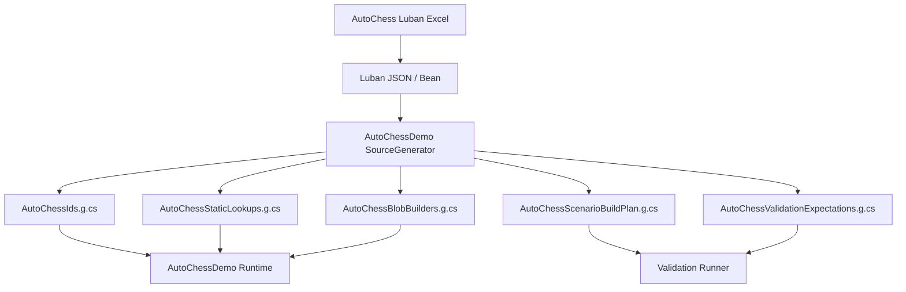
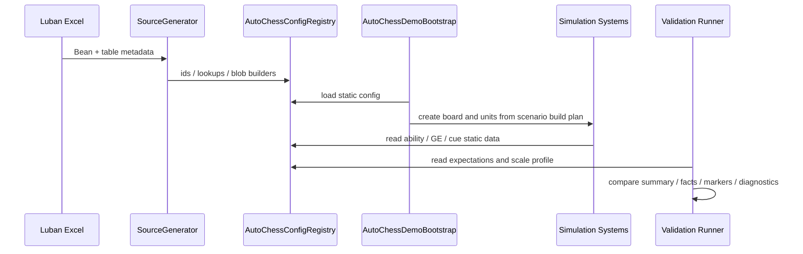

# AutoChessDemo Luban 配置方案 Spec

## 目的

本 Spec 定义 AutoChessDemo 的 Luban 配置链路。它是 `10-AutoChess无头验收Spec.md` 的配置方案切片，负责回答：AutoChessDemo 如何配置业务、如何生成运行时定义、如何支持自动验收、如何为十万 / 百万实体压力测试提供稳定数据输入。

本 Spec 只定义 Demo 配置方案，不替代通用 `08-Luban-SourceGenerator配置生成链路Spec.md`。通用 Spec 约束 Luban / SourceGenerator 的工程边界；本 Spec 约束 AutoChessDemo 具体表结构、生成物和验收使用方式。

本 Spec 同时必须对齐 `UnityDOTS官方文档参考/主题/12-官方案例模式.md` 的 `CASE-10/CASE-11/CASE-12`：配置链应生成 Blob / Baker / validation graph，资源引用只进入 Boundary / Presentation，ScaleProfile 必须承载 warmup / measurement / allocator cleanup 等官方 performance case 口径。

## 目标目录

```text
EX_GAS_Config/ProjectConfigTable/exgas_config
  Datas/
    AutoChessDemo/
      autochess.unit.xlsx
      autochess.attribute.xlsx
      autochess.ability.xlsx
      autochess.gameplay_effect.xlsx
      autochess.tag.xlsx
      autochess.cue.xlsx
      autochess.physics_profile.xlsx
      autochess.render_profile.xlsx
      autochess.scenario.xlsx
      autochess.scale_profile.xlsx
      autochess.validation_expectation.xlsx

Assets/AutoChessDemo/Config
  SchemaDocs/
    autochess.unit.xlsx
    autochess.attribute.xlsx
    autochess.ability.xlsx
    autochess.gameplay_effect.xlsx
    autochess.tag.xlsx
    autochess.cue.xlsx
    autochess.physics_profile.xlsx
    autochess.render_profile.xlsx
    autochess.scenario.xlsx
    autochess.scale_profile.xlsx
    autochess.validation_expectation.xlsx
  SourceGenerator/
    AutoChessDemoGenerator.asmdef
    AutoChessDemoGenerator.cs
  GeneratedRuntime/
    AutoChessIds.g.cs
    AutoChessStaticLookups.g.cs
    AutoChessBlobBuilders.g.cs
    AutoChessScenarioBuildPlan.g.cs
    AutoChessValidationExpectations.g.cs
  GeneratedEditor/
    AutoChessConfigDiagnostics.g.cs
    AutoChessConfigReport.g.cs
```

配置权威源表放在 `EX_GAS_Config/ProjectConfigTable/exgas_config/Datas/AutoChessDemo`。`Assets/AutoChessDemo/Config` 只保存 schema 文档、SourceGenerator 工程和可审查生成代码。生成缓存、临时 JSON、中间 manifest 和本地导出文件按 `.gitignore` 处理；进入版本控制的生成物必须是源码契约，而不是缓存。

## 配置表职责

| 表 | 职责 | 热路径约束 |
|---|---|---|
| `autochess.attribute.xlsx` | HP / ATK / DEF / ASPD / Mana 等属性定义、clamp、显示名、validation 采样口径 | 生成 attribute id、layout、访问器 |
| `autochess.tag.xlsx` | State / Ability / Faction / Class / Cue tags 和层级关系 | 生成 bit index、parent mask、requirement mask |
| `autochess.unit.xlsx` | 单位 archetype、阵营、职业、基础属性、能力列表、表现 id | 生成 unit blob、spawn archetype、static lookup |
| `autochess.ability.xlsx` | Ability id、类型、冷却、范围、目标规则、关联 GE / Cue | 生成 ability blob、command build data |
| `autochess.gameplay_effect.xlsx` | Instant / Duration / Period / Stack、modifier、granted tags、application / removal / immunity tags | 生成 GE blob builder、spec static data |
| `autochess.cue.xlsx` | UI / VFX / SFX / FloatingText / GameplayCue marker 映射 | 生成 cue id、log marker template、future resource binding key |
| `autochess.physics_profile.xlsx` | 可选 Unity Physics 目标获取 / 命中确认 / event profile，包含 collider category、CollisionFilter、query type、event opt-in、FixedStep policy | 生成 physics profile blob / constants；默认 headless 可 disabled，但必须输出原因 |
| `autochess.render_profile.xlsx` | 可选 Entities Graphics 表现 profile，包含 mesh/material binding、RenderMeshArray pack hint、MaterialMeshInfo default、material override schema、render evidence policy | 生成 render binding / marker mapping；只进入 Presentation / Boundary |
| `autochess.scenario.xlsx` | 默认战斗、回合数、棋盘、单位布阵、seed、胜负期望 | 生成 scenario build plan |
| `autochess.scale_profile.xlsx` | x1、x50、x100、x1000、x10w、x100w 的实体规模、采样率、关闭项、输出项 | 生成 scale profile constants |
| `autochess.validation_expectation.xlsx` | expected winner、tick range、facts hash、cue marker count、diagnostics thresholds | 生成 validation expectations |

## 精链路配置原则

AutoChessDemo 的配置必须服务“精链路”，不能靠堆机制证明完整性。

默认配置只保留：

1. 2-4 种单位 archetype。
2. 1 条普攻链。
3. 1 条主动技能链。
4. 1 条 Duration / Period / Stack 链。
5. 1 条 Passive / Synergy 链。
6. 1 条 Death / Cleanup 链。
7. 1 套 UI / VFX / SFX / FloatingText / Cue marker 映射。

新增机制必须说明它覆盖哪个 GAS 概念缺口；不能只是”让 Demo 更丰富”。

## 默认精链路配置数据示例

以下每个表的示例数据对应 `10B-AutoChess完整业务案例设计Spec.md` 中的默认验收战斗（x1 精链路：4v4，含剑士/法师/刺客/牧师 4 种职业）。这些是 Luban Excel 表中的实际数据行，由 SourceGenerator 读取后生成 BlobAsset 和 static lookup。完整业务逻辑解读见 10B。

### autochess.attribute.xlsx（属性定义）

| AttrId | Name | AttrSet | DefaultValue | Min | Max | ClampMin | ClampMax |
|--------|------|---------|-------------|-----|-----|----------|----------|
| 1 | HP | Combat | 0 | 0 | 99999 | true | true |
| 2 | MaxHP | Combat | 0 | 1 | 99999 | true | true |
| 3 | ATK | Combat | 0 | 0 | 99999 | true | false |
| 4 | DEF | Combat | 0 | 0 | 99999 | true | false |
| 5 | ASPD | Combat | 100 | 10 | 500 | true | true |
| 6 | MANA | Resource | 0 | 0 | 200 | true | true |
| 7 | MaxMANA | Resource | 100 | 1 | 200 | true | true |
| 8 | ManaRegen | Resource | 10 | 0 | 50 | true | false |

**生成物**：`XAttr.HP=1`, `XAttr.ATK=3`, ... 常量 + `AttrAccessor.GetCurrentValue()/SetCurrentValue()` static switch。

### autochess.tag.xlsx（Tag 定义与 BitIndex）

| TagId | Name | Category | BitIndex | Description |
|-------|------|----------|----------|-------------|
| 1 | State.Stunned | State | 0 | 眩晕，不可行动 |
| 2 | State.Slowed | State | 1 | 减速，ASPD -30% |
| 3 | State.Frozen | State | 2 | 冰冻，不可行动+ASPD=0 |
| 4 | State.Poisoned | State | 3 | 中毒，受到 period 伤害 |
| 5 | Buff.FrostArmor | Buff | 4 | 冰系羁绊护甲 |
| 6 | Buff.HealBonus | Buff | 5 | 牧师羁绊治疗加成 |
| 7 | Ability.ShieldBash | Ability | 6 | 盾击能力标记 |
| 8 | Ability.FrostNova | Ability | 7 | 冰霜新星能力标记 |
| 9 | Ability.PoisonBlade | Ability | 8 | 毒刃能力标记 |
| 10 | Ability.HolyLight | Ability | 9 | 圣光治疗能力标记 |
| 11 | Synergy.Frost | Synergy | 10 | 冰系羁绊单位标记 |
| 12 | Synergy.Priest | Synergy | 11 | 牧师羁绊单位标记 |
| 13 | State.Dead | State | 12 | 死亡标记 |

**生成物**：`XTagBit.Stunned = 1UL << 0`, `XTagBit.Slowed = 1UL << 1`, ... 常量 + `TagCheck.HasTag()/HasAnyTag()/IsStunnedOrFrozen()` static helpers。

**关键约束**：CTagMask 是 uint64，最多 64 个 tag。当前 13 个 tag 远未触及上限。每个 tag 不创建独立 IComponentData tag component（遵守不变量 32）。

### autochess.unit.xlsx（单位配置）

| ID | Name | Class | Race | Star | HP | ATK | DEF | ASPD | MANA | ManaRegen | AbilityId | SynergyTagBits |
|----|------|-------|------|------|-----|-----|-----|------|------|-----------|-----------|-----------------|
| 2001 | 霜甲剑士 | Swordsman | Frost | 2 | 1500 | 120 | 80 | 100 | 40 | 5 | 3001 | Frost |
| 2002 | 冰霜女巫 | Mage | Frost | 3 | 900 | 70 | 30 | 100 | 80 | 12 | 3002 | Frost |
| 2003 | 暗影刺客 | Assassin | Shadow | 2 | 900 | 180 | 25 | 120 | 60 | 8 | 3003 | Shadow |
| 2004 | 圣光牧师 | Priest | Light | 2 | 700 | 50 | 20 | 100 | 100 | 10 | 3004 | Light |
| 2005 | 重装剑士 | Swordsman | — | 2 | 1800 | 100 | 100 | 90 | 40 | 5 | 3001 | — |
| 2006 | 烈焰法师 | Mage | — | 3 | 850 | 90 | 25 | 100 | 80 | 12 | 0 | — |

**生成物**：`UnitConfigBlob` BlobAsset（含 `BlobAssetReference<UnitConfigBlob>` builder），`UnitLookup[id]` static lookup table。Spawn 时从 BlobAsset 读取白值，按 Star 缩放后写入 ASC Entity 的 `BHealth.BaseValue` 等。

**关键约束**：不使用 Prefab 承载 GE/Ability 定义（不变量 13.6）。Prefab 仅限 optional Entities Graphics profile 的 render proxy entity。

### autochess.ability.xlsx（技能配置）

| AbilityId | Name | Type | ManaCost | CooldownFrames | TargetRule | MaxTargets | Range | EffectId_Primary | EffectId_Secondary | BlockTagBits |
|-----------|------|------|----------|----------------|------------|------------|-------|------------------|--------------------|-------------|
| 3001 | 盾击 | Active | 40 | 180 | NearestEnemy | 1 | 1.5 | 5001 | 5002 | Stunned,Frozen |
| 3002 | 冰霜新星 | Active | 80 | 300 | NearestEnemies | 3 | 3.0 | 5003 | 5004 | Stunned,Frozen |
| 3003 | 毒刃 | Active | 60 | 120 | NearestEnemy | 1 | 1.5 | 5005 | — | Stunned,Frozen |
| 3004 | 圣光治疗 | Active | 40 | 240 | LowestHPAlly | 1 | 4.0 | 5006 | — | Stunned,Frozen |
| 0 | 普攻 | PassiveAuto | 0 | 0 | NearestEnemy | 1 | 按职业 | 4001 | — | Stunned,Frozen |

**TargetRule 枚举**：`0=NearestEnemy`, `1=LowestHPAlly`, `2=NearestEnemies`（AoE 多目标）
**BlockTagBits**：Source ASC 自身有这些 tag 之一时禁止释放（眩晕/冰冻时不可行动）

**生成物**：`AbilityDefBlob` BlobAsset，`AbilityLookup[id]` static lookup table。

### autochess.gameplay_effect.xlsx（GE 配置）

| GEId | Name | Type | DurationFrames | PeriodFrames | StackLimit | StackPolicy | ModifierAttr | ModifierOp | ModifierMmc | GrantedTags | RemoveTags | ApplicationTagReq | ImmunityTags |
|------|------|------|----------------|--------------|------------|-------------|-------------|------------|-------------|-------------|------------|-------------------|--------------|
| 4001 | 普攻伤害 | Instant | 0 | 0 | 0 | — | HP | Minus | ATK*1.0 | — | — | — | — |
| 4002 | 冰系减速 | Duration | 180 | 0 | 0 | — | ASPD | Multiply | 0.7 | Slowed | — | — | — |
| 5001 | 盾击伤害 | Instant | 0 | 0 | 0 | — | HP | Minus | ATK*0.8 | — | — | — | — |
| 5002 | 眩晕 | Duration | 120 | 0 | 0 | — | ASPD | Override | 0.0 | Stunned | — | — | Frozen |
| 5003 | 冰霜新星伤害 | Instant | 0 | 0 | 0 | — | HP | Minus | MagicPower*1.5-DEF*0.3 | — | — | — | — |
| 5004 | 冰霜减速 | Duration | 180 | 0 | 0 | — | ASPD | Multiply | 0.7 | Slowed | — | — | Frozen |
| 5005 | 毒刃 | Duration | 240 | 60 | 3 | SourceAggregate | HP | Minus | ATK*0.3 | Poisoned | — | — | — |
| 5006 | 圣光治疗 | Instant | 0 | 0 | 0 | — | HP | Add | MagicPower*0.8 | — | — | — | — |

**列名变更**：`MagnitudeExpr` → `ModifierMmc`，与 `10B-AutoChess完整业务案例设计Spec.md` 行392 对齐。新增 `RemoveTags` 和 `ApplicationTagReq` 列以保证表结构完整可扩展（当前示例数据无这两列的值，填 "—"）。

**GE 类型覆盖**：
- 4001/5001/5003/5006 = Instant（直接修改属性，不创建 slot）
- 5002 = Duration（创建 slot，授予 Stunned tag，到期移除）
- 5004 = Duration（创建 slot，授予 Slowed tag，到期移除）
- 5005 = Duration + Period + Stack（创建 slot，每 1s 跳伤害，最多 3 层 SourceAggregate）

**ModifierMmc 映射到 MmcTypeId**：由 SourceGenerator 解析表达式 → 生成 `MmcTypeId` 常量和 `MmcEvaluator.Evaluate()` 的 switch case。例如 `ATK*0.8` → `MmcTypeId.AtkScale08`，`MagicPower*1.5-DEF*0.3` → `MmcTypeId.MagicPowerMulDefReduc`。

**生成物**：`GEStaticBlob` BlobAsset（含 modifiers、grantedTags、immunityTags 的 BlobArray），`GELookup[id]` static lookup table。

### autochess.cue.xlsx（Cue Marker 映射）

| CueId | Name | Category | LogMarker | ResourceBindingKey |
|-------|------|----------|-----------|--------------------|
| 1001 | ShieldBashVFX | VFX | `[CUE:VFX:ShieldBash]` | `VFX_ShieldBash_Hit` |
| 1002 | IceNovaVFX | VFX | `[CUE:VFX:IceNova]` | `VFX_IceNova_AoE` |
| 1003 | PoisonSlashVFX | VFX | `[CUE:VFX:PoisonSlash]` | `VFX_PoisonSlash_Impact` |
| 1004 | HealBeamVFX | VFX | `[CUE:VFX:HealBeam]` | `VFX_HealBeam_Cast` |
| 1005 | DeathVFX | VFX | `[CUE:VFX:Death]` | `VFX_Death_Common` |
| 2001 | DamageText | FloatingText | `[CUE:FT:Damage]` | `UI_DamageText` |
| 2002 | HealText | FloatingText | `[CUE:FT:Heal]` | `UI_HealText` |
| 3001 | ShieldBashSFX | SFX | `[CUE:SFX:ShieldBash]` | `SFX_ShieldBash_Whoosh` |
| 3002 | IceNovaSFX | SFX | `[CUE:SFX:IceNova]` | `SFX_IceNova_Crack` |

**生成物**：`XCueCode` 常量，cue marker 的 `FixedString32Bytes` 模板。

### autochess.scenario.xlsx（默认战斗场景）

| ScenarioId | Name | BoardWidth | BoardHeight | Seed | MaxBattleFrames | ExpectedWinner | ProfileId |
|------------|------|------------|-------------|------|-----------------|----------------|-----------|
| 1 | 默认4v4精链路 | 4 | 2 | 12345 | 3600 (60s) | Team0 | x1 |

| ScenarioId | Team | UnitId | BoardCol | BoardRow |
|------------|------|--------|----------|----------|
| 1 | 0 | 2001 | 0 | 0 |
| 1 | 0 | 2002 | 0 | 1 |
| 1 | 0 | 2003 | 2 | 0 |
| 1 | 0 | 2004 | 2 | 1 |
| 1 | 1 | 2005 | 1 | 0 |
| 1 | 1 | 2006 | 1 | 1 |
| 1 | 1 | 2003 | 3 | 0 |
| 1 | 1 | 2004 | 3 | 1 |

**生成物**：`AutoChessScenarioBuildPlan.g.cs` — `BuildPlan` 包含 `FixedList512Bytes<SpawnEntry>`，由 Bootstrap 直接读取，无需运行时解析。

### autochess.scale_profile.xlsx（规模配置）

| ProfileId | BoardCount | UnitsPerBoard | PresentationSampleRate | DebuggerSampleRate | ExpectedEntityCount | ExpectedCommandRange | MaxCoreTickAvgMs | MaxCoreTickP95Ms |
|-----------|------------|---------------|------------------------|--------------------|--------------------|--------------------|--------------------|--------------------|
| x1 | 1 | 8 | 1.0 (100%) | 1.0 (100%) | 8-12 | 4-20 | 0.20 | 0.40 |
| x50 | 1 | 50 | 0.2 (20%) | 1.0 (100%) | 50-60 | 20-100 | 0.50 | 1.00 |
| x100 | 2 | 50 | 0.1 (10%) | 0.5 (50%) | 100-150 | 40-200 | 0.80 | 1.50 |
| x1000 | 20 | 50 | 0.05 (5%) | 0.1 (10%) | 1000-1500 | 400-2000 | 2.00 | 3.50 |
| x10w | 2000 | 50 | 0.01 (1%) | 0.01 (1%) | 100000-150000 | — | 3.00 | 5.00 |

**生成物**：`ScaleProfileConstants`，含 `PresentationSampleRate`, `DebuggerSampleRate`, `ExpectedEntityCount` 等，供 Validation 和 Runner 读取。

### autochess.validation_expectation.xlsx（验收期望）

| ExpectationId | ScenarioId | ProfileId | ExpectedWinner | MinBattleFrames | MaxBattleFrames | RequiredFactKinds | RequiredCueMarkers | DiagnosticsThresholdId |
|---------------|------------|-----------|----------------|-----------------|-----------------|--------------------|--------------------|------------------------|
| 1 | 1 | x1 | Team0 | 60 | 3600 | DamageResolved,DeathOccurred,EffectApplied,EffectExpired | ShieldBashVFX,IceNovaVFX,PoisonSlashVFX,HealBeamVFX,DeathVFX | x1_pass |

**RequiredFactKinds 语义**：战斗中必须至少出现这些 fact code 各一次。缺失任何一项 → 验收失败（即使数值结算正确，说明某条 GAS 链路未触发）。
**RequiredCueMarkers 语义**：无头模式下 log marker 必须出现；有画面模式下 presentation outbox 必须包含。

### 配置示例与 10B 的关系

以上示例数据与 `10B-AutoChess完整业务案例设计Spec.md` 基本对应：
- 10B 提供业务解读（为什么选这些棋子、为什么这个 GE 参数、走查中的数值如何计算）
- 本文件（11）提供 Luban 表结构定义和 SourceGenerator 生成链路
- 两文件合在一起 = 一份完整的 AutoChess Demo 配置方案（字段定义 + 具体数据 + 业务逻辑 + 生成链路）

> **已知差异**：(1) 10B 定义了独立的 `autochess.synergy.xlsx` 羁绊表（行651-656），11 通过 `autochess.tag.xlsx` 的 `Synergy.*` tag 隐式表达羁绊条件——两种方式功能等价，11 的方式更符合 bitmask 原则（不变量 32），但表结构设计不同；(2) 11 的 GeneratedEditor 下有 `AutoChessConfigReport.g.cs`，10B 的生成物清单中对应的是 `AutoChessConfigDiagnostics.g.cs`（行2114），若为同一物应在后续迭代统一文件名。




生成物职责：

| 生成物 | 职责 | 禁止事项 |
|---|---|---|
| `AutoChessIds.g.cs` | 属性、Tag、Ability、GE、Cue、Unit、Scenario、ScaleProfile 常量 | 不包含 gameplay 逻辑 |
| `AutoChessStaticLookups.g.cs` | id -> blob / static row / compact lookup | 不读取原始 JSON |
| `AutoChessBlobBuilders.g.cs` | Unit / Ability / GE / TagRequirement / Cue marker blob 构建 | 不生成 active lifecycle |
| `AutoChessScenarioBuildPlan.g.cs` | 根据 scenario 表生成 spawn plan、board plan、seed | 不直接操作 Runtime Core 私有结构 |
| `AutoChessValidationExpectations.g.cs` | expected summary、facts hash、thresholds | 不把测试结果写死为实现逻辑 |
| `AutoChessConfigDiagnostics.g.cs` | Editor / CI 配置诊断 | 不参与 runtime hot path |

## ScaleProfile 设计

`autochess.scale_profile.xlsx` 是高规模验收的关键配置表。

| 字段 | 含义 |
|---|---|
| `ProfileId` | x1 / x50 / x100 / x1000 / x10w / x100w |
| `BoardCount` | 棋盘副本数，用于横向扩展实体数量 |
| `UnitsPerBoard` | 每棋盘单位数 |
| `AbilitySet` | 使用默认能力集、精简能力集或 synthetic ability set |
| `PresentationSampleRate` | 表现 marker 采样率 |
| `DebuggerSampleRate` | Debugger facts 采样率 |
| `ExpectedEntityCount` | 期望实体数量 |
| `ExpectedCommandRange` | 每 tick command 数量范围 |
| `ExpectedFactRange` | 每 tick facts 数量范围 |
| `MaxCoreTickAvgMs` | 目标 core simulation tick 平均上限 |
| `MaxCoreTickP95Ms` | 目标 core simulation tick P95 上限 |
| `MaxRuntimeTickAvgMs` | `core + observation + presentation + debugger counters` 平均上限 |
| `MaxObservationTickAvgMs` | observation projection 平均上限 |
| `MaxPresentationTickAvgMs` | presentation marker 生成平均上限 |
| `MaxSingleSystemP95Ms` | 单个 Runtime Core system P95 热点阈值 |
| `MaxGcAllocBytesPerTick` | 每 tick GC 分配上限；优秀线必须为 0 |
| `MaxSyncPointCount` | 每 tick sync point 上限；优秀线必须为 0 |
| `MaxHotPathStructuralChangeCount` | 热路径结构变化上限；优秀线必须为 0 |
| `MaxGlobalBufferSpillCount` | 全局 command / fact / outbox buffer spill 上限 |
| `MaxDynamicBufferExternalizedCount` | DynamicBuffer 外置数量或近似 pressure 上限 |
| `MaxRandomLookupCountPerTick` | 每 tick 随机 lookup 上限 |
| `MaxEnableableWaitCount` | enableable 写 job 导致同步等待的上限 |
| `MinChunkUtilization` | chunk 利用率最低要求 |
| `MaxUnusedEntitiesPerArchetype` | archetype chunk 空洞上限 |
| `RequireQueryFilterReport` | 是否要求 filtered / unfiltered query count |
| `RequireAllocatorReport` | 是否要求 allocator owner / TempJob age / rewind count |
| `RequireBurstWarmupReport` | 是否要求丢弃 Burst warmup tick 并输出 Burst target |
| `MinChunkSkipRatio` | 对 idle/no-op 压测期望的 chunk skip 比例 |
| `MaxNativeStreamMergeMs` | NativeStream / sampled stream merge 成本上限 |
| `MaxPerEntityEcbCommandCount` | 大批量结构变化中逐实体 ECB command 上限 |
| `RequireDeterministicOutputOrder` | gameplay 相关并行输出是否必须声明确定性策略 |
| `PerformanceTier` | pass / excellent，用于自动验收和 Goal 停止判断 |
| `CasePatternReport` | 是否输出 `CASE-*` 官方案例对照 |
| `WarmupDroppedTicks` | 参考官方 PerformanceTests，性能统计前丢弃的 warmup tick 数 |
| `MeasurementTickCount` | 参考官方 PerformanceTests，正式测量 tick 数 |
| `AllocatorCleanupPolicy` | WorldUpdateAllocator / group allocator / TempJob / Persistent 的 cleanup 策略 |
| `PhysicsProfileId` | 可选 Unity Physics profile；默认 `disabled`，启用时必须输出 query/event counters |
| `RenderProfileId` | 可选 Entities Graphics profile；默认 `headless_log`，启用时必须输出 draw / BRG / render counters |

高规模 profile 允许 synthetic workload，但必须满足：

1. 使用同一套 Ability / GE / Attribute / Facts contract。
2. 不绕过 Runtime Core SystemGroup。
3. 不删除 presentation outbox，只能采样或批量汇总。
4. 输出 dropped / sampled / total counters。

推荐性能阈值必须与 `10-AutoChess无头验收Spec.md` 的 `实机性能指标参考` 对齐。配置表可以按机器或平台维护不同 threshold row，但修改目标阈值必须写入 Spec 或 ADR，不能只在 Excel 中静默放宽。

## DiagnosticsThreshold 设计

`autochess.diagnostics_threshold.xlsx` 维护自动验收阈值。ScaleProfile 通过 `DiagnosticsThresholdId` 引用它，避免业务规模配置和性能判定混在同一张表里。

最低字段：

| 字段 | 含义 |
|---|---|
| `ThresholdId` | 阈值 ID，例如 `x1_pass`、`x1_excellent`、`x50_excellent` |
| `ProfileId` | 对应 ScaleProfile |
| `Tier` | pass / excellent |
| `MaxCoreTickAvgMs` | core tick 平均上限 |
| `MaxCoreTickP95Ms` | core tick P95 上限 |
| `MaxRuntimeTickAvgMs` | runtime tick 平均上限 |
| `MaxSingleSystemP95Ms` | 单 system 热点上限 |
| `MaxGcAllocBytesPerTick` | GC 分配上限 |
| `MaxSyncPointCount` | sync point 上限 |
| `MaxHotPathStructuralChangeCount` | 热路径结构变化上限 |
| `MaxGlobalBufferSpillCount` | 全局 DynamicBuffer spill 上限 |
| `MaxDynamicBufferExternalizedCount` | DynamicBuffer 外置数量或近似 pressure 上限 |
| `MaxRandomLookupCountPerTick` | 随机 lookup 上限 |
| `MaxEnableableWaitCount` | enableable dependency wait 上限 |
| `MinChunkUtilization` | chunk 利用率最低要求 |
| `RequireQueryFilterReport` | 是否要求 filtered / unfiltered / change filter / enableable wait 报告 |
| `RequireAllocatorReport` | 是否要求 allocator owner / dispose / rewind 报告 |
| `RequireBurstWarmupReport` | 是否要求 Burst warmup / FunctionPointer batch size 报告 |
| `RequirePhysicsReport` | 是否要求 physics step / query / event / broadphase sync 报告 |
| `RequireRenderReport` | 是否要求 draw command / instances per draw / BRG / render cost 报告 |
| `MinChunkSkipRatio` | chunk skip 最小比例；不适用时设为 disabled |
| `MaxNativeStreamMergeMs` | NativeStream / sampled stream merge 上限 |
| `MaxPerEntityEcbCommandCount` | 逐实体 ECB 命令上限 |
| `RequireApiSelectionHealth` | 是否要求输出完整 API 健康指标 |
| `RequireZeroManagedCallback` | simulation tick 内是否要求 0 managed callback |
| `RequireDebuggerCounters` | 是否要求 Runtime Core Debugger counters 完整输出 |
| `GoalStopEligible` | 是否允许作为 Goal 自动停止依据 |

目标态推荐阈值：

| ThresholdId | Tier | GoalStopEligible | 核心指标 |
|---|---|---|---|
| `x1_pass` | pass | false | `coreAvg <= 0.20`, `coreP95 <= 0.40`, `runtimeAvg <= 0.50` |
| `x1_excellent` | excellent | true | `coreAvg <= 0.08`, `coreP95 <= 0.15`, `runtimeAvg <= 0.25` |
| `scene_x1_excellent` | excellent | true | `coreAvg <= 0.12`, `coreP95 <= 0.25`, `runtimeAvg <= 0.40` |
| `x50_excellent` | excellent | true | `coreAvg <= 0.30`, `coreP95 <= 0.60`, `runtimeAvg <= 0.80` |
| `x100_excellent` | excellent | true | `coreAvg <= 0.50`, `coreP95 <= 1.00`, `runtimeAvg <= 1.30` |
| `x1000_pass` | pass | true | `coreAvg <= 2.00`, `coreP95 <= 3.50`, `runtimeAvg <= 5.00` |
| `x10w_excellent` | excellent | pressure-only | `coreAvg <= 2.00`, `coreP95 <= 3.50`, `runtimeAvg <= 5.00` |
| `x100w_pass` | pass | pressure-only | `coreAvg <= 16.00`, `coreP95 <= 25.00`, `runtimeAvg <= 33.00` |

`GoalStopEligible = true` 不表示单个 profile 通过即可停止 Goal。默认性能优化 Goal 必须同时满足 `x1_excellent`、`scene_x1_excellent`、`x50_excellent`、`x100_excellent` 和 `x1000_pass`，并满足 `10-AutoChess无头验收Spec.md` 中的 Goal 自动停止条件。

## ValidationExpectation 设计

ValidationExpectation 用于自动验收，不用于驱动 gameplay。

最低字段：

| 字段 | 含义 |
|---|---|
| `ScenarioId` | 对应 scenario |
| `ScaleProfileId` | 对应 scale profile |
| `ExpectedWinner` | 期望胜方 |
| `MinBattleTicks` / `MaxBattleTicks` | 合法 tick 范围 |
| `RequiredFactKinds` | 必须出现的 facts |
| `RequiredCueMarkers` | 必须出现的 UI / VFX / SFX / FloatingText / Cue marker |
| `ForbiddenRuntimeWarnings` | 禁止出现的 runtime warning |
| `SummaryHashPolicy` | strict / sampled / disabled |
| `DiagnosticsThresholdId` | 关联诊断阈值 |
| `ExpectedPhysicsDisabledReason` | 默认无头 profile 下必须出现的 Physics disabled reason；启用 Physics 时设为 disabled |
| `ExpectedEntitiesGraphicsDisabledReason` | 默认无头 profile 下必须出现的 Entities Graphics disabled reason；启用 rendered profile 时设为 disabled |

## 配置到运行时链路



## 验收标准

1. AutoChessDemo 默认链路不再依赖手写巨量 definition rows。
2. 配置表能生成 Unit / Ability / GE / Cue / Scenario / ScaleProfile / ValidationExpectation 的 runtime lookup。
3. x1 默认场景和 x50 profile 能从配置生成，不在测试代码里硬编码业务数据。
4. x10w / x100w profile 具备配置入口，即使当前实现阶段暂不运行。
5. DiagnosticsThreshold 能生成 pass / excellent 性能阈值，并被 ValidationExpectation 引用。
6. 生成链不生成 gameplay lifecycle，只生成 Definition & Generation Layer 输入和 runtime static lookup。
7. PhysicsProfile / RenderProfile 能生成可选 profile，默认无头输出 disabled reason，启用时能把 Physics / Graphics 指标纳入 validation summary。

## 历史方案定位

1. 方案12 的 Luban + SourceGenerator 配置链、属性 / GE 示例、压力测试场景见 `../历史方案参考/方案12.md:81-148`、`../历史方案参考/方案12.md:621-646`、`../历史方案参考/方案12.md:996-1149`、`../历史方案参考/方案12.md:2289-2320`。
2. 方案13 的 Tag bit、Ability / Effect blob、真实 Demo 业务配置链见 `../历史方案参考/方案13.md:153-170`、`../历史方案参考/方案13.md:696-818`、`../历史方案参考/方案13.md:1164-1215`、`../历史方案参考/方案13.md:2053-2176`。
3. 方案14 的自走棋 Luban 配置表、GEBlobBuilder、ECS 数据和 UI 事件链见 `../历史方案参考/方案14.md:1138-1368`、`../历史方案参考/方案14.md:1446-1508`、`../历史方案参考/方案14.md:2178-2351`。
4. 方案15 的四层架构、SourceGenerator、完整自走棋配置、业务管理和 Debug workflow 见 `../历史方案参考/方案15.md:35-92`、`../历史方案参考/方案15.md:788-960`、`../历史方案参考/方案15.md:1437-1533`、`../历史方案参考/方案15.md:2228-2545`、`../历史方案参考/方案15.md:2661-2843`。

