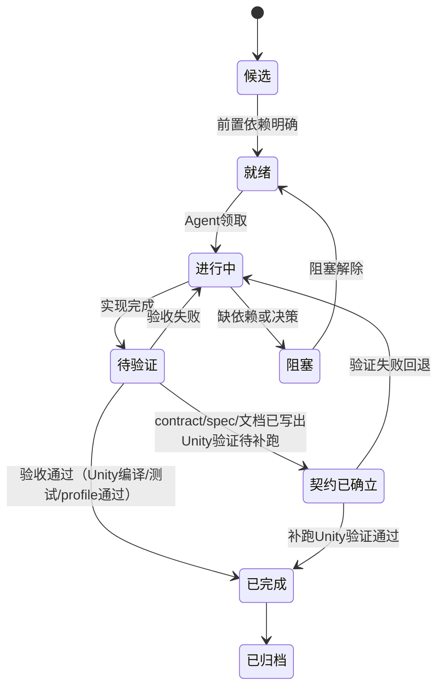

# 任务树规范 — 如何领取 Task 并执行

本文件定义**执行 Agent** 领取和交还叶子任务的全流程。执行 Agent 的上下文来源是**一个叶子 .md 文件**——关键约束已由规划 Agent 内联到文件中，不需要跨文件查找。

## 领取规则

1. 只能领取 `叶子节点`。分支节点（目录下的 `README.md`）不可直接领取。
2. 叶子节点必须处于 `就绪` 或 `进行中` 状态。`候选`、`阻塞`、`已完成`、`已归档` 不可领取。
3. **只读叶子文件本身**——关键约束已内联在 `目标态约束摘要`、`当前事实约束`、`适用规则摘要` 中。外部 Spec、ISSUE、DOTS 主题的链接仅作为"需要更详细背景时"的补充阅读，不是必读。
4. 领取时确认理解：本轮目标、执行范围、执行细则（DO/DON'T）、验收标准。
5. 验收方式缺失的节点不能进入 `进行中`。
6. 行动报告不等待批准，Agent 输出后直接执行。
7. **行动报告写入 `迭代记录/` 或 `迭代摘要`**，不写进任务节点文档正文。

### 领取前快速自检

执行 Agent 打开叶子文件后，快速判断文件是否可用：

| # | 检查项 | 不满足时 |
|---|---|---|
| 1 | `本轮目标` 是否明确写了我本轮要做什么？ | 退回给规划 Agent 补充 |
| 2 | `执行细则` 是否每条都是我能直接执行的 DO/DON'T？ | 退回给规划 Agent 改写 |
| 3 | `适用规则摘要` 是否有中文约束（不是裸编号）？ | 退回给规划 Agent 解码 |
| 4 | `当前进展` 是否让我知道上轮做到哪了？ | 退回给规划 Agent 补充 |
| 5 | `验收标准` 是否每条都能客观判断？ | 退回给规划 Agent 具体化 |

如果 5 项全部满足，文件可用，开始执行。

## 状态流



| 状态 | 含义 | 执行Agent操作 |
|---|---|---|
| 就绪 | 前置依赖已满足，等待领取 | 可直接领取，状态改为进行中 |
| 进行中 | 正在执行 | 正常推进 |
| 待验证 | 实现完成，等待验收 | 跑验收标准中的测试/检查 |
| 契约已确立 | 文档/Spec 可审查，Unity 验证未跑 | 本轮目标是补验证，不是新增功能 |
| 已完成 | 验收通过，有可追溯证据 | 不再领取，等待归档 |
| 阻塞 | 缺依赖或决策 | 不领取，等待阻塞解除 |

## 节点关系

同父下的兄弟节点在叶子文件的 `兄弟关系` 字段中声明：

| 关系 | 含义 | 执行约束 |
|---|---|---|
| `sequential` | 按声明顺序执行，后一个依赖前一个 | 同一时间只有一个进行中或推荐优先；前一节点未完成时后节点不得领取 |
| `parallel` | 无依赖，可并发 | 可同时进行中；任一节点发现架构冲突时暂停，先收口冲突 |

## 交还规则

交还回写收口为两处：

- **主回写**：根看板（`02-主线任务树/README.md`）的对应条目 + 当前叶子节点文档的 `当前进展`、`领取轮次`、`状态` 字段
- **派生回写**：`04-当前进度状态/当前窗口.md`，只更新推荐领取和注意事项

### 交还时更新叶子文件

执行 Agent 交还时必须更新叶子文件的以下字段：

1. `状态` — 是否变化（进行中→待验证 / 待验证→已完成 / 进行中→阻塞 等）
2. `当前进展` — ≤10 行摘要，替换旧内容（不是追加）
3. `领取轮次` — 递增轮次计数
4. `本轮目标` — 如果任务未闭合，更新为下一轮目标；如果闭合，移除或标记为"已完成，待归档"

### 交还内容格式

```markdown
1. 状态变化: [旧状态] → [新状态]，原因
2. 变更摘要: ≤5 行
3. 验收证据: [测试通过/编译通过/profile 数据/文档检查结果] 或 [Unity LicensingClient 阻塞，环境阻塞]
4. 下游影响: 哪些 sequential 兄弟因此解锁 / 不变
```

### 不需要在交还时做的事

- 不需要重复写 `迭代摘要`（由任务完成自动触发更新）
- 不需要在叶子文件中追加完整行动报告（写入 `迭代记录/`）
- 不需要更新 `00-当前架构事实` 中的 ISSUE（如果闭合了 ISSUE，通过迭代摘要的反哺路由处理）

## 归档规则

1. 已完成叶子节点在父节点看板只保留一行摘要。
2. 完整执行过程和行动报告进入 `迭代记录/`。
3. 已归档节点不得继续维护"下一步"或"本轮目标"。
4. 连续文档校准类任务全系列完成后在根看板压缩为一条归档摘要。

## 命名规则

节点名使用职责路径拼接：`主线名 - 支线名 - 职责名`。

短 ID（如 `T1-RuntimeCore-AM3`）仅作检索辅助，不得替代职责名。根看板和推荐领取入口必须使用完整职责名。

## 执行 Agent 常见问题

### Q: 叶子文件中的约束摘要和我的执行范围对不上怎么办？

说明叶子文件可能是从过大的父任务中拆出的，规划 Agent 没有重新提取约束。此时应：
1. 判断是否触发 S3（多关注点）——本任务是否应该进一步拆分
2. 如果不需要拆分，自己补充约束摘要并标注来源，在交还时提醒规划 Agent 更新

### Q: 执行过程中发现了叶子文件未覆盖的新约束怎么办？

1. 在执行细则中遵守新约束
2. 交还时在变更摘要中记录
3. 规划 Agent 下一轮更新叶子文件时内联

### Q: 叶子文件要求我读的外部 Spec 文件我该读吗？

`目标态参考` 中的链接是溯源指针——如果你对约束摘要中的某条约束有疑问、需要更详细的上下文，可以去读。但正常执行不需要。
