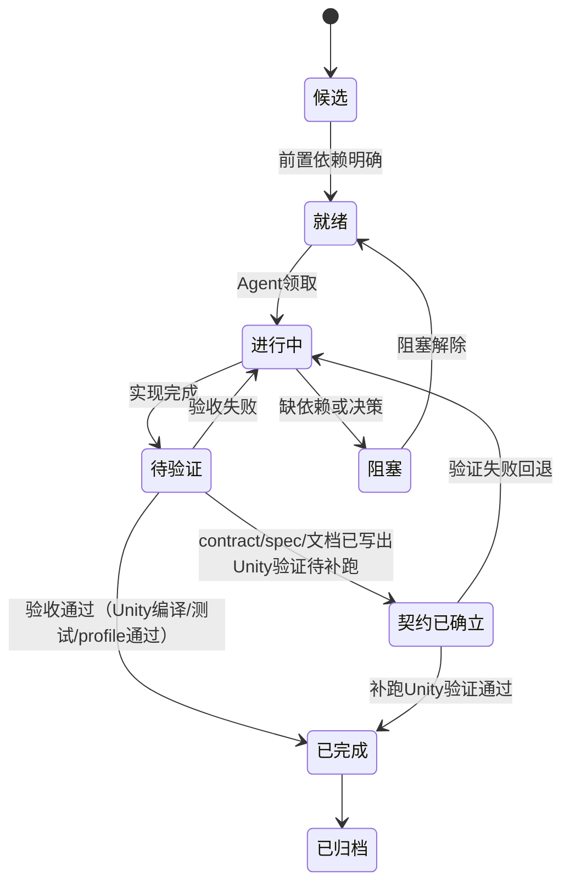

# 任务树规范

## 核心原则

任务树不是架构师预先画好的层级分类，而是执行过程的投影。节点不按 L1/L2/L3/L4 的固定层级划分——层级是拆分的结果，不是前置的命名框架。

```
执行产生拆分 → 拆分产生层级 → 层级组织成树
```

只有两种节点类型：
- **叶子节点**：无子节点，Agent 直接领取执行
- **分支节点**：有子节点，只提供上下文索引，不可直接领取

## 节点统一结构

所有节点共享同一结构，不因"是一级主线还是四级子任务"而不同：

| 字段 | 要求 |
|---|---|
| 节点名 | `父节点路径 - 本节点职责名` |
| 节点定位 | 本节点在树中的职责 |
| 当前问题 | 本节点直接解决的问题 |
| 目标态参考 | 相关 Spec 列表 |
| 子节点 | 子节点索引（叶子节点此节为空） |
| 兄弟关系 | 本节点与同父兄弟是 `sequential`（顺序依赖）还是 `parallel`（无依赖） |
| 目标 | 本轮要改变的架构事实 |
| 非目标 | 明确不做什么 |
| 执行范围 | 涉及目录、System、模块 |
| 执行细则 | 约束和禁止绕过项 |
| 验收标准 | 可判断完成的结果 |
| 测试链路 | 应运行的测试、profile、文档检查 |
| 交还内容 | 需回写的文档和证据 |
| 拆分历史 | 本节点由哪个父节点拆分而来、何时拆分、触发条件（用于追溯，不用于执行） |

叶子节点额外要求：

| 额外字段 | 要求 |
|---|---|
| 领取轮次 | 本轮是第几次领取、累计几轮未闭合 |
| 当前进展 | 最近一轮的执行摘要（≤10行） |

禁止字段膨胀：历史执行流水、完整行动报告、API选型表和官方文档覆盖检查属于 `迭代记录/` 或 `迭代摘要`，不堆在任务节点内。

## 树的自动生长

不预定义节点的深度层级。新节点始终是`候选`叶子，树通过以下规则自动生长。

### 拆分触发

一个叶子节点满足 **任一** 条件时，拆分为分支节点并创建子节点：

| # | 条件 | 阈值 | 拆分动作 |
|---|---|---|---|
| S1 | 轮次累计 | 同一节点累计 ≥5 轮未闭合 | 当前进行中的关注点独立为一个子节点，其余已完成的关注点各归档为一个子节点 |
| S2 | 行数膨胀 | 节点文档正文 >200 行 | 按 `## 子任务` 或行动报告轮次边界拆分子节点 |
| S3 | 多关注点 | 节点同时触及 ≥3 个独立模块/SystemGroup/数据契约 | 每个关注点独立为一个子节点 |
| S4 | 依赖链 | 节点内执行步骤 B 依赖 A 的输出、C 依赖 B 的输出 | 每个步骤独立为一个子节点，标记为 `sequential` |

触发拆分时不需要同时满足所有条件。触发后原节点自动变为分支节点，不得再直接领取。

### 合并触发

| # | 条件 | 合并动作 |
|---|---|---|
| M1 | 分支节点下所有子节点 `已完成` 或 `已归档` | 分支节点自动 `已完成` |
| M2 | 分支节点下只剩 1 个非归档子节点 | 子节点合并回父节点，父节点恢复为叶子 |
| M3 | 拆出的子节点 >4 轮无领取行为且无进行中子节点 | 清理：归档或合并回父节点 |

### 深度自调节

不设硬性深度上限。树通过以下机制自调节：

- 浅层常见任务（simple instant GE 迁移）最多拆到 2-3 层
- 深层只在真正复杂的长线任务中出现（如 Runtime Core 完整重建）
- M2（单子合并）防止意义不大的浅包层
- M3（无活动清理）防止僵尸节点层积

## 节点关系

同父下的兄弟节点必须声明关系类型：

| 关系 | 含义 | 约束 |
|---|---|---|
| `sequential` | 按声明顺序执行，后一个依赖前一个的交付物 | 同一时间只有一个 `进行中` 或 `推荐优先`；前一节点未完成时后节点不得领取 |
| `parallel` | 无依赖，可并发执行 | 每个并行节点可同时 `进行中`；任一节点发现架构冲突时所有并行节点暂停，先收口冲突 |

根看板中属于不同主线的任务是天然 `parallel`。未声明时默认 `sequential`。

连续任务链不再需要单独的拆分规则——它只是 `sequential` 兄弟节点链的自然结果。

## 状态流



| 状态 | 含义 |
|---|---|
| 契约已确立 | contract/spec/文档可审查，Unity 编译/测试/profile 验证未执行。仅文档治理、contract-first 架构设计类任务允许进入。**不允许作为最终交还状态**，必须在后续轮次补跑 Unity 验证后转 `已完成` |
| 已完成 | Unity 编译、测试、profile 或文档检查通过，有可追溯证据 |

## 领取规则

1. 只能领取 `叶子节点`，不能直接领取分支节点。
2. 叶子节点必须处于 `就绪` 或 `进行中`。
3. 领取前必须读取父节点链（根→父→本节点），理解完整上下文。
4. 领取时写清任务名、目标、非目标、交还条件。
5. 验收方式缺失的节点不能进入 `进行中`。
6. 行动报告不等待批准，Agent 输出后直接执行。
7. 行动报告属于 `迭代记录/` 或 `迭代摘要`，不写进任务节点文档正文。

## 交还规则

交还回写收口为两处：

- **主回写**：根看板（`README.md`）的对应条目 + 当前叶子节点文档的 `当前进展` 字段
- **派生回写**：`04-当前进度状态/当前窗口.md`，只更新推荐领取和注意事项

交还内容：
1. 状态变化（是否闭合、是否触发拆分）
2. 变更摘要（≤5行）
3. 验收证据或未验证说明
4. 下游影响（哪些 `sequential` 兄弟因此解锁或不变）

不需要在交还时重复写 `迭代摘要`；迭代摘要是独立的当前窗口视图，由任务完成自动触发更新。

## 归档规则

1. 已完成叶子节点在父节点看板只保留一行摘要。
2. 完整执行过程和行动报告进入 `迭代记录/`。
3. 连续文档校准/官方文档深挖类任务，全系列完成后在根看板压缩为一条归档摘要，完整历史迁入 `已完成文档校准日志.md`。
4. 根看板中同类文档校准条目超过 5 条时触发压缩归档。
5. 已归档节点不得继续维护"下一步"。

## 命名规则

节点名使用职责路径拼接：

```
主线名 - 支线名 - 职责名
```

短 ID 仅作检索辅助，不得替代职责名。根看板和推荐领取入口中，节点名必须使用完整职责名。

## 节点质量检查

领取前检查：

1. 本节点能否作为 Agent 可直接领取执行的完整上下文。
2. 是否明确当前问题，而不是"完善某模块"。
3. 是否链接目标态 Spec，而非让执行者自行搜索。
4. 是否给出可自动验收路径。
5. 是否写清不进入方向。
6. 叶子节点是否有"领取轮次"和"当前进展"字段。
7. 若在文档中发现完整行动报告或 >20行的执行记录，说明触发 S2（行数膨胀），应拆分或迁移到 `迭代记录/`。

