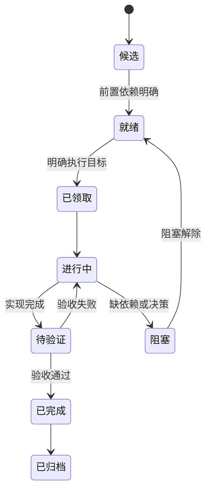

# 任务树规范

## 目标

`02-主线任务树/README.md` 同时作为主线任务看板、迭代路线总览和导航入口。具体任务线必须拆到 `02-主线任务树/` 下维护。

任务树所有节点的核心职责都是作为 Agent 可直接继续推进的任务提示词。一级主线节点、二级支线节点、三级任务节点都必须提供足够上下文，让执行者不需要重新翻完整历史就能理解：当前问题、目标态参考、历史方案来源、执行范围、验收标准和测试链路。

## 上游链路

```text
历史方案讨论 -> 目标态架构共识 -> 主线任务树 -> Goal 循环推进
```

1. `历史方案参考/` 只提供设计素材、图表表达、业务预演和来源证据。
2. `01-目标态架构共识/` 是主 Spec，是最终目标和实现约束的唯一设计 owner。
3. `02-主线任务树/` 不重新设计目标架构，只把主 Spec 按主线 / 支线 / 任务拆成颗粒度适中的 Agent 任务提示词。
4. Agent 进入 Goal 模式推进时，只领取任务树中已具备完整上下文、验收标准和测试链路的节点。
5. 如果任务树节点发现目标态 Spec 不完整，必须先回写 `01-目标态架构共识/`，再拆任务；禁止直接从历史方案跳到实现任务。

## 任务层级

| 层级 | 定义 | 文件形态 | 示例 |
|---|---|---|---|
| 一级节点 | 主任务线 | 子文件夹 + `README.md` | `T1-GAS_ECS_Runtime/README.md` |
| 二级节点 | 主线下的支线 | 独立 Markdown | `RuntimeCore重构.md` |
| 三级节点 | 支线上的具体任务 | 维护在二级文档内 | `EffectCommand与SpecStream契约` |

四级节点默认禁止。如果一个三级任务继续膨胀，应提升为二级支线文档。

## 连续任务链拆分规则

当一个任务同时覆盖 SystemGroup、数据契约、存储承载、Debugger、验证链路等多个可独立交还对象时，不得继续作为单个三级任务推进。应提升为二级支线，并拆成连续任务链。

连续任务链必须满足：

1. 每个任务只改变一个主要架构事实，避免“一轮同时改调度、数据、Debugger、Demo”。
2. 每个任务有明确上游输入和下游交付物，下一任务能直接消费上一任务的结果。
3. 每个任务都能独立交还证据；如果只能在整条链结束后验收，说明粒度仍过粗。
4. 每个任务都必须说明是否影响 `00-当前架构事实`、`01-目标态架构共识`、`04-当前进度状态`。
5. DOTS 相关连续任务链必须把官方参考主题拆进每个任务，而不是只在总任务写一次。

Runtime Core / DOTS 任务建议按下列顺序拆分：

| 顺序 | 切片 | 典型交付物 | 主要官方依据 |
|---|---|---|---|
| 1 | Schedule / Phase Contract | SystemGroup 顺序、phase owner、contract tests | `01`, `03`, `21` |
| 2 | Query / Lookup / Allocator Budget | query contract、lookup 更新口径、allocator owner | `02`, `10`, `20` |
| 3 | Stream / Store Ownership | frame owner、clear/write/read/merge phase、buffer pressure | `04`, `10`, `20` |
| 4 | Structural Playback Gate | 唯一 structural playback phase、ECB / bulk query policy | `03`, `06`, `20` |
| 5 | Debug Evidence Gate | counters、Profiler / Journaling 对照、禁用开关 | `06`, `21` |
| 6 | Downstream Rebind | 后续 AM3 / AM5 / Demo 任务引用新骨架 | `20`, `21` |

如果某个任务链仍然需要四级节点，优先拆成多个二级支线，而不是在三级任务下追加子任务。

连续任务链状态流转要求：

1. 同一条连续任务链同一时间只能有一个“当前推荐领取”节点。
2. 当前节点验收通过后，必须把当前节点状态改为 `已完成` 或在任务看板保留完成摘要，并把下一个节点提升为 `推荐优先`。
3. 当前节点验收失败时，下一个节点不能提前提升；当前节点保持 `进行中` 或 `待验证`，并在 `04-当前进度状态/迭代摘要.md` 写清失败证据。
4. 需要跳过某个节点时，必须在二级支线、主线看板和当前窗口同时写清跳过理由、风险和替代验收方式。
5. 连续任务链最后一个节点完成后，必须明确回到哪个父支线、下一个主线任务或验收 Demo；不能留下“继续推进”这种无 owner 的描述。
6. 状态流转至少回写 `02-主线任务树/README.md`、对应二级支线文档、`04-当前进度状态/当前窗口.md` 和 `04-当前进度状态/迭代摘要.md`；如果改变当前事实或问题严重度，还必须回写 `00-当前架构事实`。

## 节点职责

| 层级 | 核心职责 | 必须回答的问题 |
|---|---|---|
| 一级主线节点 | 定义一个长期工程方向的边界、当前问题、目标态引用、支线列表和主线验收门槛 | 这条主线为什么存在、服务哪个目标态切片、哪些方向不进入、怎样判断主线正在收敛 |
| 二级支线节点 | 定义一条可连续迭代的功能链路或模块链路，承接一级主线并拆出三级任务 | 当前支线要修哪条链路、参考哪些 Spec 和历史方案、下一批任务按什么顺序推进 |
| 三级任务节点 | 定义一次可领取的具体执行单元 | 本轮具体改哪里、怎么验收、交还什么证据 |

一级节点不是简单目录索引；二级节点不是任务列表容器。它们都必须承担 Prompt 上下文职责，否则三级任务会和目标态 Spec 断链。

任务树节点必须能反向追溯到目标态 Spec。历史方案只能通过对应目标态 Spec 的 `历史方案定位` 进入任务上下文，不能成为任务本身的第一性依据。

## 命名规则

任务显示名使用节点路径拼接：

```text
主任务线名 - 副任务线名 - 任务名
```

允许保留短 ID 作为检索辅助，但标题必须可读。

当前推荐领取、任务看板、当前窗口、行动报告和交还摘要中，任务显示名必须优先使用完整职责名。短 ID 只能写在 `任务ID` 字段或括号附注中，不能把 `AM2B-B`、`AM-2.5B`、`T6-REAL-B` 这类抽象代号当作任务名或领取入口。

示例：

```text
任务ID：T6-AutoChess-AM1
任务名：RuntimeValidationDemo - AutoChess无头验收 - RuntimeCoreDebugger基线
```

不推荐：

```text
T6-REAL-B-DemoMigration
```

## 状态流



## 领取规则

1. 只能领取 `就绪` 或 `进行中` 的任务。
2. 领取三级任务前，必须先读取对应一级主线 README 和二级支线文档。
3. 领取时必须写清任务名、目标、非目标、前置依赖、交还条件。
4. 若任务影响多个一级主线，先在 `01` 目标态 Spec 或 `02-主线任务树/README.md` 的路线看板收口设计，再领取实现。
5. 若任务缺少验收方式，不能进入 `进行中`。
6. Goal 循环推进只能以任务树节点为输入；不得以历史方案原文、零散讨论或迭代记录作为直接 Goal prompt。
7. Agent 领取任务并完成必要上下文搜寻后、正式执行前，必须输出行动报告；行动报告规范见 `07-Agent行动报告规范.md`。
8. 行动报告不需要用户批准，输出后继续执行；若用户提出修正，以最新输入为准调整。

## Agent 节点提示词最低要求

每个任务树节点都必须包含以下字段。层级不同，粒度不同，但字段不能缺席。

| 字段 | 一级主线节点 | 二级支线节点 | 三级任务节点 |
|---|---|---|---|
| 节点名 | 主线名 | `主线名 - 支线名` | `主线名 - 支线名 - 任务名` |
| 节点定位 | 主线边界和长期职责 | 支线链路和模块职责 | 本次执行单元职责 |
| 当前问题 | 当前架构事实中的主线级问题 | 当前链路问题 | 本任务直接解决的问题 |
| 目标态参考 | 相关 Spec 列表 | 相关 Spec 章节 / 契约 | 必须遵守的 Spec 和不变量 |
| 历史方案参考 | 可吸收的历史方案信号 | 可吸收片段和不可照搬内容 | 与本任务直接相关的片段或说明不需要 |
| 目标 / 目的 | 主线收敛目标 | 支线阶段目标 | 本轮要改变的架构事实 |
| 非目标 | 主线不进入方向 | 支线不处理范围 | 本任务不做什么 |
| 执行范围 | 主线涉及模块和目录族 | 支线涉及目录、SystemGroup、数据契约 | 具体文件、模块、测试入口 |
| 执行细则 | 主线级命名、边界和调度原则 | 支线级 contract、顺序、拆分规则 | 具体实现约束和禁止绕过项 |
| API 选型 | 主线级默认 DOTS API 选型原则，以及 Query / Filter / Allocator / Dependency / Chunk / Burst 的总约束 | 支线级 API 决策表、承载分层和重新选型触发条件 | 本任务候选 API、当前选择、拒绝理由、健康指标和外部证据对照 |
| 官方文档覆盖 | 主线级需读取的官方文档包和 `ODF-*` 规则 | 支线级相关官方主题和 PackageCache 证据 | 本任务涉及的官方主题、采用 / 拒绝 / 暂不相关理由和反哺 owner |
| 验收标准 | 主线级收敛门槛 | 支线完成门槛 | 可判断完成的结果 |
| 测试链路 | 主线 gate / demo / profile 口径 | 支线测试矩阵 | 应运行的测试、demo、profile、文档检查 |
| 交还内容 | 需回写的主线事实和路线 | 需回写的支线状态和证据 | 代码、测试、文档和验证摘要 |

缺少 `当前问题`、`目标态参考`、`验收标准`、`测试链路` 任一字段的一级、二级、三级节点，都不能被视为可执行上下文。三级任务还不能进入 `就绪`。

## 节点继承规则

1. 三级任务可以继承一级 / 二级节点的背景，但不能只写“同上”。
2. 二级支线必须显式链接对应一级主线 README。
3. 一级主线必须显式链接 `00-当前架构事实`、`01-目标态架构共识` 和相关历史方案索引。
4. 父节点更新了目标态参考、非目标或验收门槛时，必须检查子节点是否需要同步。

## 交还规则

交还任务必须包含：

1. 状态变化。
2. 变更摘要。
3. 验收证据或未验证说明。
4. 下游影响。
5. 是否需要更新 `00/01/02/04`。

## 归档规则

1. 已完成任务只在看板保留一行摘要。
2. 完整过程和命令进入 `迭代记录/`。
3. 已完成任务卡可迁入主线目录下的 `已完成任务归档.md`。
4. 已归档任务不得继续维护“下一步”。

## 任务质量检查

领取前检查：

1. 一级、二级、三级节点是否都能直接作为 Agent prompt 的上下文。
2. 是否明确当前代码问题，而不是只说“完善某模块”。
3. 是否链接目标态 Spec，而不是让执行者自行搜索。
4. 是否说明历史方案参考只是设计思路，不是当前事实。
5. 是否给出可自动验收路径。
6. 是否写清不进入方向。
7. 三级任务是否能从父节点读出为什么做、做到什么程度、如何交还。
8. Runtime Core / Debugger / Luban / Demo 任务是否包含 API 选型表，且能追溯到 `UnityDOTS官方文档参考/主题/20-GASRuntimeCore-API选型基线.md`。
9. Runtime Core / Debugger / Luban / Demo 任务是否说明 Query / Filter / Allocator / Dependency / Chunk layout / DynamicBuffer spill / Burst calculation 是否受影响。
10. AM3 / AM5 等 Runtime 任务是否说明自己的承载分层，例如 command 四分层或 ActiveEffectStore 四分层。
11. DOTS 相关任务是否包含官方文档覆盖检查，且能先追溯到 `UnityDOTS官方文档参考/README.md`，再追溯到 `UnityDOTS官方文档参考/主题/21-官方文档覆盖与流程闭环.md` 的覆盖主题和 `ODF-*` 规则。

