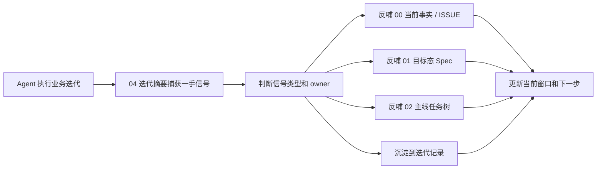

# 迭代摘要反哺流程规范

## 适用范围

本规范约束 `迭代摘要.md` 的更新方式，以及迭代摘要如何反哺到 `00-当前架构事实/`、`01-目标态架构共识/`、`02-主线任务树/` 和 `迭代记录/`。

`04-当前进度状态` 是跨轮接力快照，不是长期事实 owner。迭代摘要可以先记录一手信息，但不能让重要发现长期只停留在 `04`。

## 核心定位

| 文档 | 定位 | 生命周期 |
|---|---|---|
| `04-当前进度状态/迭代摘要.md` | 本轮 Agent 的一手交接摘要、发现、验证、反哺清单 | 每轮覆盖或短期滚动 |
| `04-当前进度状态/当前窗口.md` | 下一轮 Agent 的最新入口和当前推进方向 | 每轮覆盖 |
| `04-当前进度状态/最近验证摘要.md` | 最近一次关键验证口径和结论 | 验证后覆盖 |
| `00-当前架构事实/` | 当前代码和验证已经证明的事实与问题 | 长期维护，需证据 |
| `01-目标态架构共识/` | 目标架构和设计 Spec | 长期维护，指导实现 |
| `02-主线任务树/` | 可领取任务和 Goal prompt | 长期维护，驱动执行 |
| 治理规范（任务树规范、Spec规范、行动报告规范、渐进式披露规范等） | 文档流程和维护规则 | 长期维护 |
| `迭代记录/` | 长过程、验证流水、技术停顿原始记录 | 历史证据 |

## 两阶段模型

迭代摘要采用“先捕获，再晋升”的两阶段模型：



1. 捕获阶段：在迭代摘要中记录本轮范围、产出摘要（≤10行）、发现、验证结果。
2. 晋升阶段：把一手信息路由到真正的长期 owner（00/01/02）。
3. 滚动阶段：已完成轮次在迭代摘要中仅保留迁移索引，完整内容迁入 `迭代记录/迭代摘要归档-YYYYMMDD.md`。

迭代摘要不承载完整行动报告（API选型表、官方文档覆盖检查、详细执行步骤）。这些属于 `迭代记录/` 的一手执行证据。迭代摘要只保留压缩后的产出摘要（≤10行/轮）和发现列表。

## 更新时机

Agent 在以下时机必须更新迭代摘要：

1. 完成一个 Goal 任务或一个可交还工作块。
2. 发现新的严重问题、架构偏差、性能异常、结构变化异常或验证阻塞。
3. 修改目标态 Spec、任务树、当前事实、文档治理规范。
4. 运行关键验证：Unity 编译、EditMode / PlayMode、Scene runtime、Headless demo、profile、Luban 生成链。
5. 发现目标态 Spec 与真实业务预演冲突。
6. 发现任务树 prompt 缺少执行上下文、验收链路或 Spec 关联。
7. 中断、切换任务或准备交接给下一轮 Agent。

## 发现记录单元

迭代摘要中的每条发现必须按独立记录单元维护。推荐字段如下：

| 字段 | 要求 |
|---|---|
| Finding ID | 形如 `SUM-YYYYMMDD-NN`，本轮唯一 |
| 来源 | 代码实现、测试验证、profile、异常栈、方案讨论、用户反馈、文档审查 |
| 信号类型 | 当前事实、核心问题、目标态修正、任务重切、治理规则、验证记录、过程证据 |
| 证据 | 文件路径、行号、异常栈、验证输出、profile 指标或用户明确输入 |
| 影响范围 | Runtime Core、Generated、AutoChessDemo、Debugger、任务树、文档治理等 |
| 严重度 | P0 / P1 / P2 / P3 |
| Owner 判定 | 00 / 01 / 02 / 04 / 迭代记录 |
| 反哺动作 | 新增、更新、拆分、归档、拒绝进入长期文档 |
| 反哺状态 | Pending / Routed / FedBack / Deferred / Rejected |

## 反哺路由

迭代摘要中的每条发现必须判断归属：

| 发现类型 | 目标 owner | 必须动作 |
|---|---|---|
| 当前代码事实、性能数据、异常栈、实际链路 | `00-当前架构事实/` | 更新事实文档；若是系统性问题，更新或新增 ISSUE |
| 系统性架构问题、重复出现的性能阻塞、结构变化安全问题 | `00-当前架构事实/核心问题诊断/` | 一问题一文档；补证据、影响、目标态映射、退出标准 |
| 目标设计错误、目标态缺口、术语/命名不准 | `01-目标态架构共识/` | 更新对应 Spec；必要时补历史方案定位 |
| Unity 官方文档新结论或覆盖缺口 | `UnityDOTS官方文档参考` | 先确认主题归属，再更新对应单主题文档或覆盖矩阵，并反哺业务 Spec、任务树和验收指标 |
| 目标态 Spec 变更导致任务拆分变化 | `02-主线任务树/` | 更新主线 / 支线 / 任务节点的目标、执行范围、验收标准和测试链路 |
| 需要 Agent 领取的工作 | `02-主线任务树/` | 新增或更新可领取任务；保证可直接作为 Goal prompt |
| 文档流程问题、模板问题、归档规则问题 | 各主题文件夹内维护的对应规范（任务树规范、Spec规范、行动报告规范等） | 更新规范或模板 |
| 验证结果、运行口径、profile 摘要 | `04-当前进度状态/最近验证摘要.md` | 更新最近验证摘要；长期证据可进入迭代记录 |
| 长篇分析、技术停顿、验证流水 | `迭代记录/` | 追加独立记录，再把稳定结论晋升到 00 / 01 / 02 |

## 严重问题处理流程

如果迭代中发现严重问题，必须按以下顺序处理：

1. 先写入 `04-当前进度状态/迭代摘要.md` 的 `本轮发现`，保留原始上下文。
2. 判断是否满足核心问题诊断标准。
   - 满足：更新 `00-当前架构事实/核心问题诊断.md` 看板，并新增或更新 `核心问题诊断/ISSUE-xxx.md`。
   - 不满足：写入最近验证摘要、任务交还或迭代记录，不进入核心问题看板。
3. 判断是否暴露目标态设计错误。
   - 是：更新 `01-目标态架构共识/` 对应 Spec，并在迭代摘要中标记 `已反哺到 Spec`。
   - 否：只记录当前实现偏差，不改目标态。
4. 判断是否影响当前任务拆分。
   - 是：更新 `02-主线任务树/` 中相关主线 / 支线 / 任务的目标、非目标、验收标准或前置依赖。
5. 判断是否需要长篇分析。
   - 是：追加 `迭代记录/`，再把稳定结论提炼回 `00/01/02`。
6. 更新 `04-当前进度状态/当前窗口.md` 的下一步建议。
7. 在迭代摘要的 `反哺清单` 中标明每个 owner 的处理状态。

## 目标态 Spec 反向修订流程

当迭代摘要中的发现证明目标态 Spec 本身存在错误、缺口或命名不准时，不能只在 `04` 或任务树中备注，必须反向修订 `01-目标态架构共识`。

处理顺序：

1. 在迭代摘要记录原始信号，标记为 `目标态修正`。
2. 定位受影响的 Spec 文件、章节和术语。
3. 判断问题类型：
   - 概念错误：目标架构方向与 GAS ECS Runtime 目标冲突。
   - 契约缺口：缺少数据所有权、SystemGroup 顺序、禁止方向或验收方式。
   - 命名失真：类名、模块名或层名不能表达真实职责。
   - 验收缺口：Spec 没有说明自动验收、profile、Luban 或 Debugger 观测方式。
4. 修改对应 Spec，保留必要的历史方案行号索引或当前证据。
5. 检查任务树是否仍然匹配新 Spec。
6. 若任务树不匹配，更新相关主线、支线、任务节点。
7. 在迭代摘要 `反哺清单` 和 `Spec / 任务树影响` 中登记 `Spec -> 任务树 -> 当前窗口` 的处理结果。

## 官方文档缺口反哺流程

当 Agent 深读 Unity 官方文档、官方案例或 Unity 工具文档后发现覆盖缺口，必须按以下顺序处理：

1. 在 `04-当前进度状态/迭代摘要.md` 记录原始发现，信号类型标记为 `官方文档缺口` 或 `目标态修正`。
2. 先通过 `UnityDOTS官方文档参考/README.md` 判断该发现属于哪个官方文档主题、规则层和反哺 owner。
3. 判断该发现是“官方规则摘要”还是“覆盖矩阵 / 流程缺口”。
   - 官方规则摘要：更新 `UnityDOTS官方文档参考` 中对应单主题文档。
   - 覆盖矩阵 / 流程缺口：更新 `UnityDOTS官方文档参考/主题/21-官方文档覆盖与流程闭环.md`。
4. 判断是否改变 API 选型；若改变，更新 `UnityDOTS官方文档参考/主题/20-GASRuntimeCore-API选型基线.md` 和 `UnityDOTS官方文档参考/主题/90-规则编号索引.md` 的 `SEL-* / ODF-*` 规则。
5. 判断是否改变官方案例模式；若改变，更新 `UnityDOTS官方文档参考/主题/12-官方案例模式.md` 和 `CASE-*`。
6. 判断是否改变业务目标态；若改变，更新对应业务 Spec，例如 Runtime Core、Debugger、Luban、AutoChess。
7. 判断是否暴露当前代码问题；若是，更新 `00-当前架构事实` 或核心问题诊断 ISSUE。
8. 判断是否影响可领取任务；若是，更新 `02-主线任务树` 对应主线 / 支线 / 任务。
9. 更新 `04-当前进度状态/当前窗口.md` 的下一轮建议阅读和行动报告要求。
10. 如果发现涉及 PackageCache hash 路径、manifest / lock / actual 版本差异、Burst AOT / Player 口径、managed component 边界、Baking world、EntityPrefabReference、allocator aliasing、Unity Physics 或 Entities Graphics，必须同步检查 `UnityDOTS官方文档参考/主题/21-官方文档覆盖与流程闭环.md` 是否已有对应覆盖矩阵行和 `ODF-*` 规则；缺失时先补 `UnityDOTS官方文档参考/主题/21-官方文档覆盖与流程闭环.md`。

官方文档缺口不能直接在迭代摘要中标记 `FedBack`。只有完成上述 owner 写入，并能指向任务入口或验收指标，才允许标记为 `FedBack`。

## 任务树重切流程

当发现影响任务拆分时，必须把变化传导到 `02-主线任务树`：

1. 找到受影响的一级主线、二级支线和三级任务。
2. 对齐新的目标态 Spec 和当前事实 ISSUE。
3. 更新任务目标、非目标、执行范围、执行细则、验收标准和测试链路。
4. 如果原任务粒度过大，拆成新的三级任务。
5. 如果原任务已经不再服务目标态，移动到归档或标记废弃原因。
6. 更新 `04-当前进度状态/当前窗口.md` 的当前推荐领取。

## 反哺完成标准

一条发现只有满足以下条件，才可以标记为 `FedBack`：

1. 已写入对应长期 owner，不只是写入 `04`。
2. owner 文档中有可追溯证据或来源。
3. 如果影响目标态，相关 Spec 已修订。
4. 如果影响执行，任务树已有可领取入口。
5. 如果影响验证，最近验证摘要或迭代记录已有对应口径。
6. 当前窗口已经能指导下一轮 Agent 继续推进。

## 反哺状态

| 状态 | 含义 |
|---|---|
| Pending | 已记录到迭代摘要，尚未路由 |
| Routed | 已判断 owner，但尚未完成写入 |
| FedBack | 已写入对应长期 owner，并满足反哺完成标准 |
| Deferred | 已确认需要后续任务处理，并有任务树入口 |
| Rejected | 不属于核心事实或目标态，不进入长期文档 |

迭代结束时不允许存在未说明原因的 `Pending`。如果确实无法当轮处理，必须改为 `Deferred` 并指向任务入口。

## 每轮交还检查

交还前必须检查：

1. `04-当前进度状态/迭代摘要.md` 是否记录本轮范围、产出摘要（≤10行）、发现、验证结果、反哺清单。
2. 所有 P0 / P1 发现是否已经路由到长期 owner。
3. 新增核心问题是否进入 `00-当前架构事实/核心问题诊断.md` 和 `核心问题诊断/ISSUE-xxx.md`。
4. 目标态修正是否进入 `01-目标态架构共识/` 对应 Spec。
5. 任务变化是否进入 `02-主线任务树/`。
6. 验证口径是否进入 `04-当前进度状态/最近验证摘要.md` 或 `迭代记录/`。
7. `04-当前进度状态/当前窗口.md` 是否能让下一轮 Agent 直接接手。
8. 若本轮涉及 Unity 官方文档，是否已先更新或复核 `UnityDOTS官方文档参考` 对应主题，并将重要结论反哺到业务 Spec、任务树或当前事实。
9. 若本轮涉及 Unity 官方文档，是否已经验证官方文档结论进入行动报告字段、任务验收字段和当前窗口，而不是只进入目标态摘要。
10. `迭代摘要.md` 超过 **500行** 时，必须将最早的完整轮次（按 `## 本轮范围` 标题切分）迁移到 `迭代记录/迭代摘要归档-YYYYMMDD.md`。在原位置保留 `< 10行` 的迁移索引，格式见下方"滚动清理迁移索引模板"。

## 迭代摘要模板

```md
# 迭代摘要

## 本轮范围

## 本轮产出

## 本轮发现

| Finding ID | 发现 | 来源 | 证据 | 信号类型 | 严重度 | Owner 判定 | 反哺状态 |
|---|---|---|---|---|---|---|---|

## 验证摘要

## 反哺清单

| Finding ID | Owner | 文件 | 反哺动作 | 状态 |
|---|---|---|---|---|

## Spec / 任务树影响

| Finding ID | 影响类型 | 需要更新的 Spec / 任务 | 处理结果 |
|---|---|---|---|

## 未反哺 / 后续处理

| Finding ID | 事项 | 原因 | 后续入口 |
|---|---|---|---|

## 下一轮建议阅读
```

## 滚动清理迁移索引模板

当 `迭代摘要.md` 触发 500 行滚动清理时，在原文件头部保留以下迁移索引：

```text
## 已迁移轮次

| 日期范围 | 迁移文件 |
|---|---|
| 2026-05-20 ~ 2026-05-23 | 迭代记录/迭代摘要归档-20260523.md |
| 2026-05-15 ~ 2026-05-19 | 迭代记录/迭代摘要归档-20260519.md |
```

迁移后的归档文件按 `迭代摘要归档-YYYYMMDD.md` 命名，直接放入 `../../迭代记录/`。

## 禁止事项

1. 禁止只更新迭代摘要而不更新对应长期 owner。
2. 禁止把目标态设计全文写进 `04`，目标态必须进入 `01`。
3. 禁止把当前事实长期留在 `04`，当前事实必须进入 `00`。
4. 禁止把任务状态长期留在 `04`，任务状态必须进入 `02`。
5. 禁止让 `04` 变成长历史流水；长历史进入 `迭代记录/`。
6. 禁止把 `FedBack` 用作”已经想过了”的标记；必须有实际 owner 文档变更。
7. 禁止把目标态 Spec 错误伪装成实现偏差；一旦证据指向 Spec 错误，必须修订 Spec。
8. 禁止让 `迭代摘要.md` 连续 3 轮不滚动清理而超过 500 行。第 3 轮交还时仍未清理视为 **P1 文档治理缺陷**，必须在迭代摘要中记录 Finding ID 并指向清理任务入口。


