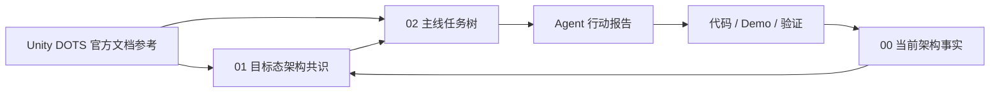

# Unity DOTS 官方文档参考

## 定位

本目录是 EX-GAS 2.0 当前路线的 **Unity DOTS 官方依据库**。它不属于目标态 Spec，也不属于任务树。

### 这个目录解决什么问题

当你在 EX-GAS 开发中遇到以下问题时，本目录提供有据可查的答案：

- "这个 DOTS API 到底应该怎么用？选 IJobEntity 还是 IJobChunk？"
- "为什么不能在 hot path 直接做结构变化？官方是怎么说的？"
- "ECB 和 Enableable 各适合什么场景？EX-GAS 项目里应该用哪个？"
- "官方文档说 DynamicBuffer 默认 128 字节容量，溢出了会怎样？"
- "NativeStream 做并行 fan-in 时，怎么保证输出是确定性的？"
- "Entity Graphics 的无头 Demo 等价性怎么保证？"

### 使用方式

1. **先读本 README**，定位你关心的问题属于哪个主题
2. **打开对应的单主题文档**，读"核心概念详解"章节获取 API 机制
3. **读"EX-GAS 项目解读"章节**，获取该机制在本项目中的具体应用约束
4. **行动报告中引用具体规则编号**，如 `SC-01`、`BUF-02`、`CASE-03`

### 与本项目其他目录的关系

目标态架构共识回答"EX-GAS 应该怎么设计"；本目录回答"Unity DOTS/ECS 官方机制允许和推荐怎么做"。Runtime Core、Debugger、Luban、AutoChessDemo 相关任务在执行前必须先从本目录读取相关主题。

## 第一性依据

当前项目以**本地 PackageCache 中实际安装包的 `Documentation~` 为第一性技术依据**。在线文档只能作为升级风险、版本差异或补充阅读入口。

| 包 | 实际版本 | 本地路径（包含 hash） | 官方在线入口 |
|---|---:|---|---|
| Entities | `1.4.6` | `Library/PackageCache/com.unity.entities@e90944159b94/Documentation~` | https://docs.unity3d.com/Packages/com.unity.entities@1.4/manual/ |
| Unity Physics | `1.4.6` | `Library/PackageCache/com.unity.physics@22d10f355559/Documentation~` | https://docs.unity3d.com/Packages/com.unity.physics@1.4/manual/ |
| Entities Graphics | `1.4.19` | `Library/PackageCache/com.unity.entities.graphics@1e91bb5cdef3/Documentation~` | https://docs.unity3d.com/Packages/com.unity.entities.graphics@1.4/manual/ |
| Burst | `1.8.29` | `Library/PackageCache/com.unity.burst@6bb9aca3ef38/Documentation~` | https://docs.unity3d.com/Packages/com.unity.burst@1.8/manual/ |
| Collections | `2.6.6` | `Library/PackageCache/com.unity.collections@9796e5ee0d9e/Documentation~` | https://docs.unity3d.com/Packages/com.unity.collections@2.6/manual/ |
| Mathematics | `1.3.3` | `Library/PackageCache/com.unity.mathematics@19a9377c4ffa/Documentation~` | https://docs.unity3d.com/Packages/com.unity.mathematics@1.3/manual/ |

**禁止修改 `Library/PackageCache` 中的任何文件。** 该目录变更会被 Unity 自动还原。

## 主题速查

### 按技术领域

| 你想知道... | 读这个主题 |
|---|---|
| System/World/SystemGroup 怎么组织，phase 怎么设计 | [01-Entities系统与World](主题/01-Entities系统与World.md) |
| IJobEntity vs IJobChunk vs SystemAPI.Query 该用哪个 | [02-查询遍历与Job](主题/02-查询遍历与Job.md) |
| ECB 怎么用，结构变化怎么避免，Enableable 怎么替代 | [03-结构变化-ECB-Enableable](主题/03-结构变化-ECB-Enableable.md) |
| DynamicBuffer 容量策略，store 怎么选型 | [04-数据承载-Buffer-Chunk-Store](主题/04-数据承载-Buffer-Chunk-Store.md) |
| Baking/Blob/Prefab 机制，config 怎么 immutable 化 | [05-Baking-Blob-Prefab-Content](主题/05-Baking-Blob-Prefab-Content.md) |
| Profiler/Journaling/Debugger 诊断体系怎么搭 | [06-Diagnostics-Profiler-Journaling](主题/06-Diagnostics-Profiler-Journaling.md) |
| Physics 范围检测、碰撞事件怎么接入 GAS | [07-UnityPhysics-管线-查询-事件](主题/07-UnityPhysics-管线-查询-事件.md) |
| Entities Graphics 渲染桥接、无头/有头等价性 | [08-EntitiesGraphics-表现桥接](主题/08-EntitiesGraphics-表现桥接.md) |
| Burst 编译条件、FunctionPointer、AOT 注意事项 | [09-Burst-编译-向量化-AOT](主题/09-Burst-编译-向量化-AOT.md) |
| NativeStream/Allocator/ParallelWriter 怎么选 | [10-Collections-Allocator-NativeStream](主题/10-Collections-Allocator-NativeStream.md) |
| Mathematics 确定性随机、battle hash | [11-Mathematics-确定性计算](主题/11-Mathematics-确定性计算.md) |
| 官方代码示例怎么借鉴、怎么拒绝 | [12-官方案例模式](主题/12-官方案例模式.md) |
| 执行任务前 API 选型 checkpoint | [20-GASRuntimeCore-API选型基线](主题/20-GASRuntimeCore-API选型基线.md) |
| 官方文档发现怎么反哺到项目文档 | [21-官方文档覆盖与流程闭环](主题/21-官方文档覆盖与流程闭环.md) |
| DOTS 系统性编写规范、性能陷阱与检查清单（P0/P1） | [13-DOTS编写规范与性能陷阱](主题/13-DOTS编写规范与性能陷阱.md) |
| ECS 状态机三种策略、GAS 选型映射 | [14-状态机与数据分支策略](主题/14-状态机与数据分支策略.md) |
| 数据流确定性、Allocator 归属、System 生命周期规范（P2） | [15-数据流-系统生命周期规范](主题/15-数据流-系统生命周期规范.md) |
| 高级/专项官方模式（CASE-21~47：ECB高级、Chunk优化、Baking高级、Streaming） | [16-官方案例模式-高级](主题/16-官方案例模式-高级.md) |
| 行动报告里引用哪个规则编号 | [90-规则编号索引](主题/90-规则编号索引.md) |
| Agent 执行 DOTS 任务的报告模板 | [91-Agent行动报告模板](主题/91-Agent行动报告模板.md) |
| 当前 PackageCache 版本和 hash 证据 | [00-版本与PackageCache证据](主题/00-版本与PackageCache证据.md) |

### 按任务类型

| 任务类型 | 必读主题 | 最小行动报告内容 |
|---|---|---|
| **Runtime Core** | `01` `02` `03` `04` `09` `10` `13` `14` `15` `16` `20` | API 选型表、query/buffer/job/structural metrics、状态机选型、规范检查清单 |
| **Debugger** | `02` `03` `04` `06` `09` `10` `13` `15` | 分组归因、Profiler/Journaling 对照 |
| **Luban/SourceGenerator** | `00` `05` `09` `13` `16` `20` | generated lookup、managed boundary 证据 |
| **AutoChessDemo** | `02` `03` `04` `07` `08` `10` `11` `13` `14` `15` `16` `20` | battle hash、core/physics/render profile、状态机选型 |
| **Presentation/Cue** | `05` `08` `10` `13` `15` `20` | outbox、resource binding 等价性 |
| **Physics 目标获取** | `07` `10` `11` `13` `15` `20` | broadphase policy、query count |

## 渐进式阅读规则

1. **不全文重读**。先读本 README 定位任务相关主题，再只读那几篇。
2. **先读核心概念详解**章节（每篇的第一大节），理解 API 机制。
3. **再读 EX-GAS 项目解读**章节，理解本项目具体的约束和选择。
4. 行动报告中必须引用具体规则编号（如 `SC-01`、`BUF-02`），不能只写"读过官方文档"。

## 维护规则

1. 新增官方依据先进入本目录对应主题，不直接塞进目标态 Spec。
2. 单一主题文档维护一个官方机制；如果开始同时承担两类职责，必须拆分。
3. 每个主题文档包含：**核心概念详解**（最关键的章节）、官方证据、规则、EX-GAS 项目解读、常见陷阱、验收指标。
4. PackageCache hash 变化时先更新 `00`，再更新受影响主题。
5. **不修改** `Library/PackageCache` 中的任何文件。
6. 官方依据改变目标设计 → 反哺 `01-目标态架构共识`。
7. 官方依据改变任务拆分或验收 → 反哺 `02-主线任务树`。
8. 官方依据暴露当前实现问题 → 反哺 `00-当前架构事实`。

## 验收标准

1. 任务执行者能从本目录找到所需 DOTS 机制的详细解释，不需要再去翻原始官方文档
2. 行动报告中的 API 选型和规则引用都定位到本目录的具体主题文档
3. 不再出现"看过官方文档但不知道怎么用"的反馈
4. PackageCache 版本更新时，00 主题首先反映，再推送至各关联主题
