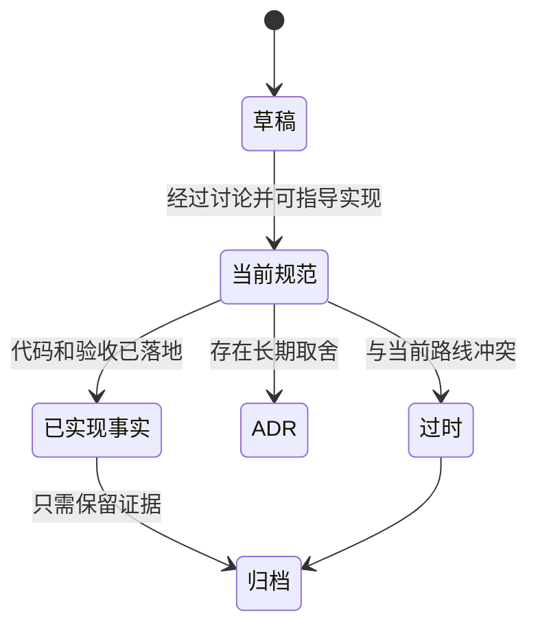

# 文档生命周期

## 生命周期

## 归属

| 内容 | 当前 owner |
|---|---|
| 当前代码事实 | `00-当前架构事实/` |
| 当前路线 | `02-主线任务树/README.md` |
| 文档规范 | 各主题文件夹内维护的对应规范 |
| 历史方案定位 | `01-目标态架构共识/` 对应 Spec 的 `历史方案定位` |
| 目标态 Spec | `01-目标态架构共识/` |
| 任务状态 | `02-主线任务树/` |
| 接力快照 | `04-当前进度状态/当前窗口.md` |
| 迭代一手摘要 | `04-当前进度状态/迭代摘要.md`，但必须按 `04-当前进度状态/迭代摘要反哺流程规范.md` 路由到长期 owner |
| 执行前行动报告 | 用户可见的即时报告；规范 owner 是 `Agent行动报告规范.md`，重要流程缺口进入迭代摘要 |
| 最近验证口径 | `04-当前进度状态/最近验证摘要.md` |
| 过程证据 | `迭代记录/` |

## 晋升规则

1. 迭代记录中的稳定结论只能晋升为 `00` 事实或 `01` Spec。
2. 历史方案只能先写入 `01-目标态架构共识/` 对应 Spec 的 `历史方案定位` 并被 Spec 吸收，不能直接晋升为任务或当前事实。
3. 任务完成后，任务卡降级为归档摘要；代码事实另行晋升。
4. 当前进度状态每轮覆盖，不晋升为长期事实。
5. 迭代摘要是反哺起点，不是终点；其中的当前事实、目标态修正、任务变化和治理规则必须分别晋升到 `00/01/02/03`。
6. 如果迭代摘要证明目标态 Spec 存在错误，必须先修订 `01-目标态架构共识/`，再检查 `02-主线任务树/` 是否需要重切，不能只在当前进度中备注。
7. P0 / P1 发现交还前必须至少完成 owner 路由；无法完成写入时必须以 `Deferred` 指向具体任务入口。
8. 行动报告是执行前透明化流程，不晋升为长期事实；只有报告暴露出的规范缺口、任务上下文缺口或 Spec 缺口才进入迭代摘要并反哺。
