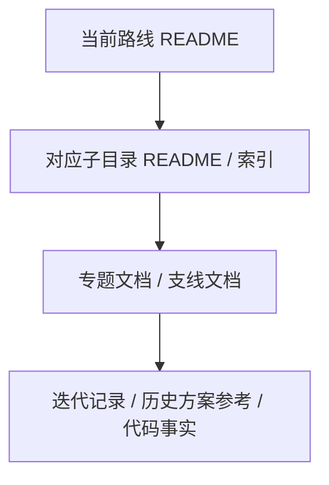

# 渐进式披露规范

## 原则

当前路线文档必须按“入口摘要 -> 分类索引 -> 专题 Spec / 任务线 -> 迭代证据”下钻，避免把结论、任务、历史和证据堆在同一个文件里。

## 层级定义

| 层级 | 内容 | 目标长度 |
|---|---|---:|
| 入口层 | 根索引、职责、当前最小摘要、维护规则 | 40-120 行 |
| 索引层 | 子文档列表、阅读路径、归属说明 | 80-200 行 |
| 专题层 | 单一主题的 Spec、任务线、事实集 | 300-600 行 |
| 证据层 | 实现流水、验证命令、历史方案原文 | 不限，但必须有状态说明 |

## 拆分触发

满足任一条件必须拆分：

1. 单文档超过 600 行。
2. 同时包含当前结论、任务状态、历史过程和验证流水。
3. 出现两个以上不同维护频率的内容，例如“每日状态”和“长期不变量”。
4. 一个章节需要独立图表、任务或验收规则。
5. 同一段“下一步”同时出现在两个入口文件。

## 回写规则

1. 已实现且仍成立的代码事实回写到 `00-当前架构事实/`。
2. 当前路线、优先级和阶段看板回写到 `02-主线任务树/README.md` 和对应主线 / 支线节点。
3. 文档治理规则回写到 各主题文件夹内维护的对应规范。
4. 历史方案行号定位回写到 `01-目标态架构共识/` 对应 Spec 的 `历史方案定位`。
5. 目标态设计回写到 `01-目标态架构共识/`。
6. 任务状态回写到 `02-主线任务树/`。
7. 跨轮接力快照回写到 `04-当前进度状态/`。
8. 过程、失败原因和完整命令进入 `迭代记录/`。

## 禁止事项

1. 禁止入口文档承载完整任务卡。
2. 禁止目标态 Spec 记录每日实现流水。
3. 禁止任务树长期保留已完成任务全文。
4. 禁止重新建立独立来源索引目录或把行号定位写成新方案正文。
5. 禁止把历史方案或外部资料当第一性实现约束。
